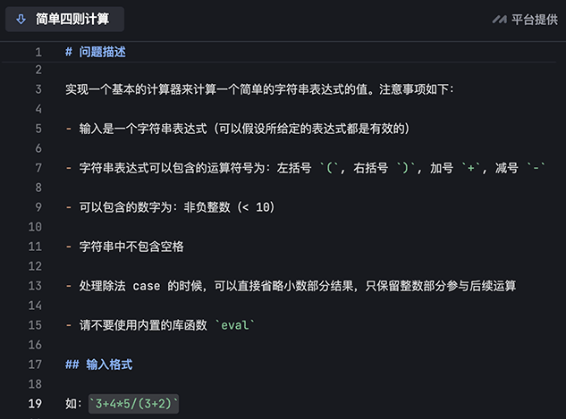
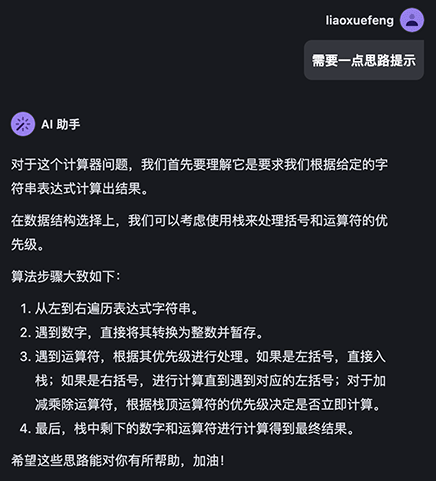
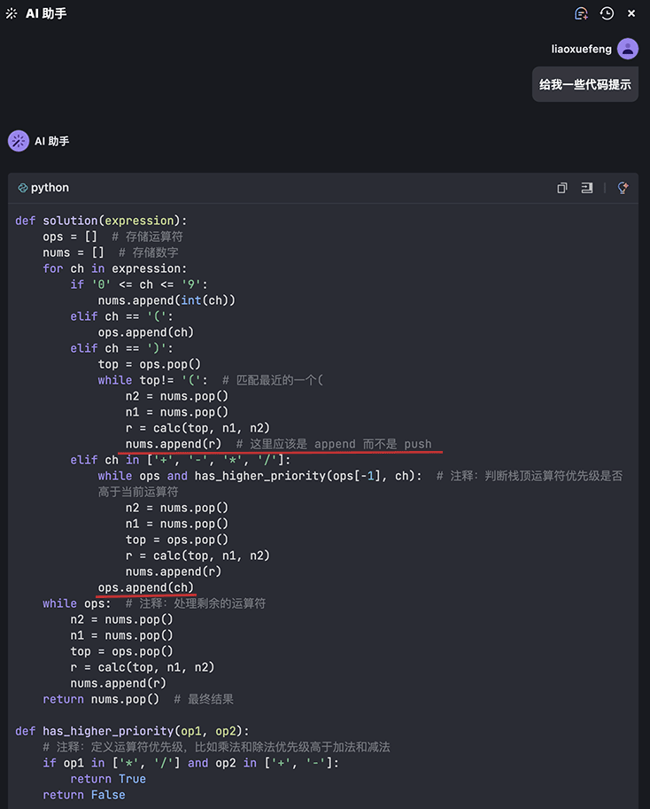
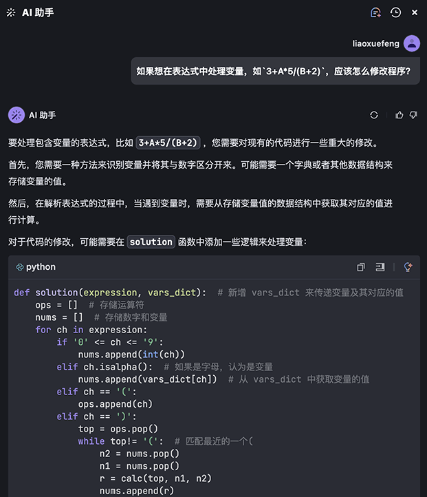
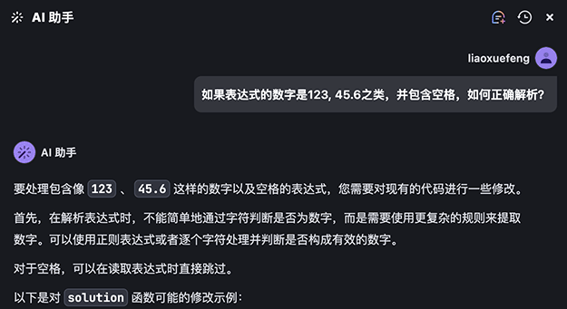

# 用MarsCode AI高效刷题

对许多软件开发的初学者来说，为了提高自己的编程能力，也为了应对面试，大多数人都会选择LeetCode这个神奇的刷题平台，它提供了海量的算法题目，涵盖了各种编程语言和难度级别，让我们可以在这个平台上练习和学习。

不过，在LeetCode上刷题，我们往往会遇到一些问题，比如题目太难，没有思路，即使直接参考别人给出的最终代码，也无法完全理解。

这时，我们可以用豆包MarsCode AI的[刷题助手](https://juejin.cn/problemset?utm_source=practice&utm_medium=liaoxuefeng&utm_campaign=competition)来帮助我们，在刷题过程中，遇到代码问题，先让AI给出思路，不行再给出参考代码，这样一步一步地完成，可以帮助我们更好地理解和掌握算法。

在MarsCode上刷题不需要安装任何软件，直接[在线打开](https://juejin.cn/problemset?utm_source=practice&utm_medium=liaoxuefeng&utm_campaign=competition)：


左侧选择题目，右侧与AI交互，中间部分写代码运行，当然也可以自己输入题目。

我们选择一个难度中等的经典题目：计算类似`3+4*5/(3+2)`这样的简单四则运算：



切换到Python语言，然后开始编写代码。如果完全没有思路，可以先让AI给出提示：



根据提示，我们可以尝试写出代码如下：

```python
def solution(expression):
    ops = [] # 存储运算符
    nums = [] # 存储数字
    for ch in expression:
        if '0' <= ch <= '9':
            nums.append(int(ch))
        elif ch =='(':
            ops.append(ch)
        elif ch == ')':
            top = ops.pop()
            while top !='(': # 匹配最近的一个(
                n2 = nums.pop()
                n1 = nums.pop()
                r = calc(top, n1, n2)
                nums.push(r)

def calc(op, n1, n2):
    match op:
        case '+': return n1 + n2
        case '-': return n1 - n2
        case '*': return n1 * n2
        case '/': return n1 // n2
    raise ValueError(f'invalid op: {op}')
```

写着写着没有思路了怎么办？可以让AI给出代码提示：



注意到AI给出的提示代码不是样板代码，而是根据我们自己编写的代码来改进的，它提示了一个编码错误（应该是`append()`而不是`push()`），补充了一行漏掉的关键代码（`ops.append(ch)`），将`solution()`函数写完了，并定义了一个`has_higher_priority()`函数来比较运算符优先级。

不过这个`has_higher_priority()`函数扩展性不是很好，我们把它改进一下：

```python
OP_PRIORITY = { '*': 2, '/': 2, '+': 1, '-': 1, '(': 0 }

def has_higher_priority(op1, op2):
    return OP_PRIORITY[op1] >= OP_PRIORITY[op2]
```

这样我们就借助AI完成了所有代码的编写。在线运行一下，可以得到正确的结果，如果结果有误，还可以在线调试，找到错误并修正。

虽然这道编程的题目已经得到解决，但如果我们想要进一步扩展一下，比如计算带有变量的表达式如`3+A*5/(B+2)`，怎么破？

如果没有思路，可以继续让AI给出提示：



AI给出的方案是给`solution()`函数增加一个`dict`参数，用于存储变量的值，然后对数字压栈时判断，如果是变量，则取出变量的值再压栈。

根据提示，我们写出最终能处理变量的代码如下：

```python
def solution(expression, vars_dict):
    ops = [] # 存储运算符
    nums = [] # 存储数字
    for ch in expression:
        if '0' <= ch <= '9':
            nums.append(int(ch))
        # 处理变量:
        elif ch.isalpha():
            nums.append(vars_dict[ch])
        ...剩余代码略...

if __name__ == "__main__":
    # 定义变量dict:
    vars_dict = dict(A=4, B=3)
    print(solution("3+A*5/(B+2)", vars_dict) == 7)
    print(solution("A+2*5-2/1", vars_dict) == 12)
    print(solution("(1+(A+5+2)-B)+(6+8)", vars_dict) == 23)
```

如果还想要进一步扩展，比如计算的表达式不是简单数字，而是`123`，`45.6`之类，如何解析？可以继续让AI给出提示：



可见，借助MarsCode AI刷题，不但有助于理清思路，还可以针对题目进行扩展，让我们的编程能力得到进一步提升。

当然，AI的能力也是有局限的，它并不能完全替代我们的思考和编程能力，它给出的代码也不一定是100%正确的或者是最优的，我们还需要自己进行调试和优化。

但是，把AI当作一个时刻在线的编程助手，用好AI，可以更快更好地理解和掌握算法，提高自己的编程能力和编程效率。

如果你想现在就体验MarsCode AI高效刷题，可以点这里开始，目前完全免费：

[https://www.marscode.cn](https://juejin.cn/problemset?utm_source=practice&utm_medium=liaoxuefeng&utm_campaign=competition)
