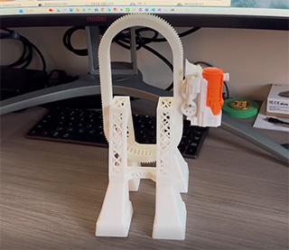
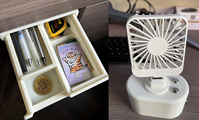
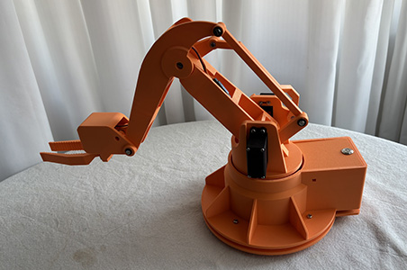
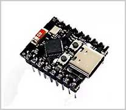
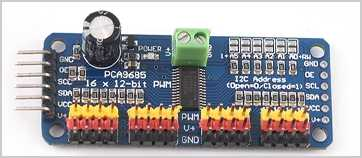
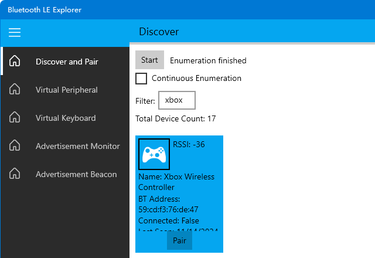

# 自制遥控机械臂

今年双十一入手了一台3D打印机，我从网上下载了好几个模型，打印效果非常不错：



然而，总是下载别人设计好的模型直接打印，感觉没有发挥出我自身的设计能力。因此我决定自己动手，设计3D模型。

在网上看了一圈科普，发现3D模型设计大概分两类：
  
1. 使用ZBrush、Blender这样的建模软件创作艺术类模型，主要用于电影、游戏、手办等；
2. 使用SolidWorks、Fusion360这样的工业建模软件创建精确的工业产品模型，可以设计家具、生活用品、机器人等。

考虑到我自己的艺术天赋有限，自然是选择更加困难的工业设计。因此，为了能设计3D模型并用3D打印机打印出来，我决定先掌握SolidWorks这个工业设计软件。

在B站上搜了一下SolidWorks教程，发现阿奇老师的[SolidWorks教程](https://www.bilibili.com/video/BV1iw411Z7HZ/)很受欢迎，我花了一周的时间快速学习了一下，顺利设计出小抽屉、摇头小风扇：



总结一下SolidWorks建模的核心，就是掌握草图绘制，制作零件，最后用装配体完成装配并模拟机械运动，检查确保没有干涉后，完成最终3D模型。

SolidWorks，轻松拿下！

接下来要挑战高难度的机器人设计，虽然我的最终目标是人形机器人，但还是要遵循循序渐进的原则，先从入门级的机械臂开始，正好阿奇老师还有一门收费的[机械臂](https://www.bilibili.com/cheese/play/ss865)课程，再花一周时间快速学习，顺利完成机械臂模型：



和课程原版机械臂相比，主要改动如下：

1. 去掉同步带轮，改成齿轮驱动；
2. 简化了一下夹爪，用3个齿轮驱动。

遗憾的是，这个教程虽然能实现最终的机械臂设计，但并没有完成MCU控制与软件操控的功能。不过，这就到咱的专业领域了。

B站上有很多操控机械臂的例子，最常见的是通过电脑连USB线，或者手机来操作。然而，用鼠标或者触控屏幕来控制舵机，只能在开发阶段用，作为产品，是完全不合格的。要轻松地操控机械臂，必须使用无线手柄遥控。因此，我梳理了一下机械臂的产品需求如下：

1. 使用无线手柄遥控机械臂，无需借助电脑或手机作为主机中转；
2. 必须内置MCU主控芯片，并且需要支持无线连接；
3. 如果使用WiFi连接，则需要接入一个现有的无线网并配置IP，不如蓝牙方便易用。

所以，最终方案确定使用蓝牙手柄，通过蓝牙连接到MCU主控，实现操控机械臂。

现在问题来了，MCU芯片哪家强？

首先排除掉上古时代的51，剩下的选手包括：

- STM32：使用ARM Cortex-M 32位CPU；
- Arduino：使用AVR单片机，也有用ARM的产品；
- Pico：树莓派出的自研MCU；
- ESP32：国产MCU，使用LX7或RISC-V的32位CPU。

比较上述产品，我决定最终选择ESP32，因为它不仅是国产精品，而且在一个芯片里集成了WiFi和蓝牙，以及各种外设通信协议，性价比极高！这意味着不需要任何额外的模块，就可以直接实现蓝牙连接！

在淘宝上找到最便宜的ESP32C3 Mini开发板，价格仅10~20元左右，可以说完全吊打STM32、Arduino和Pico：



因此，MCU主控就选择ESP32C3，外加一个舵机驱动板PCA9685，一个蓝牙手柄（型号待定）。



这里说明一下，为什么我们需要一个单独的舵机驱动板。因为我们这个机械臂使用的是非常便宜的模拟舵机，通过PWM信号控制。虽然ESP32本身可以输出PWM信号，但是，它内部的PWM引脚是有限的，而PCA9685可以同时输出16路PWM信号，也就是可以同时驱动16个舵机！如果需要驱动更多的舵机，还可以级联扩展。此外，驱动多个舵机需要给舵机稳定地供电，不能从ESP32的板子上引出电源，而PCA9685驱动板自带供电输入，免去了我们再单独找一个电源板的麻烦。

ESP32+PCA9685控制舵机的原理如下：

ESP32通过I2C接口向PCA9685发送控制命令，PCA9685会根据控制命令生成PWM信号来控制舵机，这样，我们在编写程序时，只需发送控制命令，无需使用定时器来生成PWM信号，能大大简化控制程序的开发。

接下来要选择蓝牙手柄。在仔细阅读了ESP32C3的相关文档后，我发现蓝牙协议还挺复杂的，最早的蓝牙1.0诞生于1999年，而现在广泛使用的蓝牙4.x和5.x分别诞生于2010年和2016年，它们与之前版本的重要区别在于引入了低功耗（Low Energy）蓝牙，简称BLE（Bluetooth Low Energy），而传统蓝牙被称为经典蓝牙（Classic BR/EDR），这两种协议采用的协议栈几乎不重叠，可以把它俩看作是两种不同的协议。

因此，在涉及到支持蓝牙的具体硬件时，它可以支持以下任意一种或多种协议：

- BR/EDR 4.x；
- BR/EDR 5.x；
- BLE 4.x；
- BLE 5.x。

手机和电脑通常会同时支持BR/EDR和BLE（即双模蓝牙），但蓝牙外设如鼠标、耳机、闹钟等，一般仅支持某一种协议。根据ESP32的官方选型手册，ESP32C3仅支持BLE 5.0，因此，我们必须选择支持BLE 5.0的蓝牙手柄。目前，市面上大多数的游戏手柄仅支持经典蓝牙，我在淘宝上问了一圈客服，得到肯定答复的只有这一家名叫盖世小鸡的手柄，因此，最终选择他家的启明星无线手柄，不到100元拿下：


### 软件开发环境

针对ESP32，可以选择的开发环境如下：

- 使用官方的ESP-IDF配合Eclipse或VSCode，编译器采用GCC；
- 使用Arduino IDE，使用简化的C++；
- 使用MicroPython。

如果使用MicroPython，那么通常我们是在应用层开发，这要求固件包含基本的系统和MicroPython运行环境。使用MicroPython最大的问题是，如果要使用的硬件没有现成的驱动，那么我们仍然要用C为MicroPython编写调用接口。此外，MicroPython的运行效率比C要差很多。

使用Arduino IDE开发时，最大的优势是可以使用Arduino丰富的第三方库，缺点是Arduino本身太简单了，简单到连操作系统都没有，入门容易，但并不便于开发复杂的程序。而ESP32官方提供的ESP-IDF开发环境，用CMake和GCC编译，运行在FreeRTOS系统上，可以说开发难度最高，但也最灵活，因为我们可以完全控制底层。

综上分析，我们选择难度拉满，使用ESP-IDF和VSCode开发环境，直接写C代码。这里不需要用到C++是因为C++的虚函数和模板这些高级功能在控制硬件时几乎用不上。

### 连接蓝牙手柄

在蓝牙协议中，互相连接的两个设备被称为Client和Server，但是与互联网的Client/Server相反，蓝牙的Client是PC或手机，Server是耳机等配件。另一种更好的说法是主机（Central）和外设（Peripheral），主机就是PC或手机，外设就是键盘、鼠标、手柄、传感器等。一个主机可以同时和多个外设实现蓝牙连接，但一个外设在某个时间段内只能连接到一个主机。

蓝牙建立连接的过程如下：

1. 外设首先要主动向外广播；
2. 主机要主动发起扫描，发现正在广播的外设后发起连接请求；
3. 外设接受请求后，通过配对建立连接，开始通信；
4. 连接从建立到断开期间，外设不再广播。

蓝牙BLE协议实际上比经典蓝牙BR/EDR要简单很多，BLE协议定义了外设能提供的服务（Service），每一个服务都可以通过枚举列出特征（Characteristic），特征分为可读、可写、可订阅等类别，一个温度传感器的某个特征如温度就是可读的，一个闹钟的某个特征如当前时间就是可读可写的，一个手柄的控制按钮就是可订阅的，即用户按下某个键后主机会收到订阅的消息。这些服务和特征用UUID标识，蓝牙标准组织定义了很多通用的ID来标识键盘、鼠标、手柄、温度、湿度、心率等各类传感器，要控制手柄，我们假设厂商预设的ID是符合标准的，所以只需要根据手柄的标准ID就可以读取手柄的输入。

微软官方提供了一个`Bluetooth LE Explorer`，可以直接从Windows应用商店安装，这样我们可以方便地查看蓝牙BLE手柄的信息：



ESP32C3芯片的角色就是主机，所以我们需要以Host模式启动ESP32C3的蓝牙功能。也可以以外设模式启动ESP32的蓝牙，用外设模式时，我们实际上可以基于ESP32自己开发一个蓝牙手柄或者任何蓝牙外设。

在网上能找到的ESP32连接蓝牙手柄的资料非常少，但好消息是ESP-IDF自带了一个使用Host模式连接HID外设的例子`esp-hid-host`，HID就是人体工学输入设备（Human Interface Device），手柄、鼠标、键盘都属于HID，直接新建一个ESP-IDF工程并选择使用该模板，我们就得到了一个自动连接手柄的程序。

根据ESP32的官方文档，ESP32支持两种软件协议栈：

- Bluedroid：这是Android系统开源的一个蓝牙协议栈，支持BR/EDR和BLE；
- Nimble：这是Apache开源的一个蓝牙协议栈，它仅支持BLE。

该示例默认使用Bluedroid，也可以改为Nimble，但这里既然跑通了Bluedroid，我就懒得测试Nimble了。

打开手柄并开启配对模式（主动广播），再运行代码，可以自动扫描到名字为`Xbox Wireless Controller`的手柄，然后自动配对连接，接下来就会不停地打印出手柄的输入：

```plain
00 80 ff 7f 00 80 ff 7f 00 00 00 00 00 00 00 00
```

每次接收的输入数据是16字节，猜测这16字节包含了手柄所有键的状态。我们简单按下手柄不同的按钮和摇杆，就能观察到16字节输入的变化，可以确定各个字节的数据表示如下：

- 第0~3字节：左摇杆的X、Y轴数据；
- 第4~7字节：右摇杆的X、Y轴数据；
- 第8~9字节：左上L2按钮的力度；
- 第10~11字节：右上R2按钮的力度；
- 第13字节：A、B、X、Y、L1、R1按钮；
- 第14字节：View和Menu按钮；
- 其他字节：暂不关心。

摇杆的X、Y轴数据分别用两个小端序的`uint16`表示，范围是`0`~`0xffff`：

```ascii
(0x0, 0x0)           (0xffff, 0x0)
    ┌───────────────────────┐
    │                       │
    │                       │
    │                       │
    │                       │
    │                       │
    │           x           │
    │    (0x8000, 0x7fff)   │
    │                       │
    │                       │
    │                       │
    │                       │
    └───────────────────────┘
(0x0, 0xffff)        (0xffff, 0xffff)
```

当摇杆位于中心时，X的坐标是`0x8000`，Y的坐标是`0x7fff`，这一点比较奇怪，虽然只差`1`。

L2按钮的力度用两个`uint8`表示，第一个`uint8`范围是`0`~`0xff`，表示精确的力度，第二个`uint8`的范围是`0`~`3`，表示较粗的力度。R2同理。

A、B、X、Y、L1和R1编码如下：

- A = 0x01
- B = 0x02
- X = 0x08
- Y = 0x10
- L1 = 0x40
- R1 = 0x80

View和Menu按钮编码如下：

- View = 0x04
- Menu = 0x08

因此，我们可以直接解析这16字节如下：

```c
typedef struct __attribute__((packed)) { // __attribute__((packed))是gcc扩展，表示紧凑字段，不做内存对齐
    uint16_t left_stick_x; // 左摇杆
    uint16_t left_stick_y;
    uint16_t right_stick_x; // 右摇杆
    uint16_t right_stick_y;
    uint8_t left_trigger; // 左上L2按钮
    uint8_t left_trigger_level;
    uint8_t right_trigger; // 右上R2按钮
    uint8_t right_trigger_level;
    uint8_t any_1;
    uint8_t buttons; // A,B,X,Y,L1,R1按钮
    uint8_t ex_buttons; // VIEW, MENU按钮
    uint8_t any_2;
} ctrl_input_data_t;
```

接下来在示例代码的基础上做如下修改。

默认的示例代码会自动连接扫描到的最后一个HID输入设备，我们改为按名字过滤，仅连接到名字为`Xbox Wireless Controller`的设备。注意这个名字是通过Bluetooth LE Explorer看到的，如果你的手柄不是这个名字，就改成实际的手柄名字。

然后定义连接状态：

```c
enum CTRL_STATE
{
    SCANNING, // 正在扫描
    OPENING, // 正在打开
    INPUT // 正常输入
};
```

当未扫描到手柄时，默认的示例代码会自动停止运行，我们改为暂停5秒后继续扫描，死循环不退出：

```c
void hid_scan_task(void *pvParameters)
{
    for (;;) {
        vTaskDelay(5000 / portTICK_PERIOD_MS);
        if (ctrl_state == SCANNING) {
            hid_scan();
        }
    }
}
```

当连接到手柄后，我们看到接收手柄数据的频率非常快，需要对输入数据按200ms的间隔采样，即每秒钟只接受5次输入：

```c
case ESP_HIDH_INPUT_EVENT: {
    // 处理手柄输入:
    const uint8_t *bda = esp_hidh_dev_bda_get(param->input.dev);
    if (param->input.length == CTRL_INPUT_DATA_LENGTH) {
        // 每200ms采样输入:
        int64_t now = esp_timer_get_time();
        if (now - ctrl_input_time > 200000) {
            // 复制输入数据并发送消息到队列:
            memcpy(&ctrl_input_data, (char *) param->input.data, CTRL_INPUT_DATA_LENGTH);
            xQueueSend(ctrl_input_queue, &ctrl_input_data, 0); // 如果上一次的输入数据还未处理，则不等待直接丢弃
            ctrl_input_time = now;
        }
    }
    break;
}
```

这样我们就可以在另一个任务中从队列取出手柄输入并处理：

```c
void control_task(void *pvParameters)
{
    // 从队列取出手柄信号并控制舵机:
    ctrl_input_data_t input;
    for (;;) {
        if (pdTRUE == xQueueReceive(ctrl_input_queue, &input, 0)) {
            // TODO: 处理输入
        }
        // 每读取一次输入后，等待100ms，即每秒仅允许10次输入
        vTaskDelay(100 / portTICK_PERIOD_MS);
    }
}
```

现在，蓝牙手柄的连接和输入问题基本解决，下一步是准备通过I2C接口驱动PCA9685并控制舵机。

在网上找了一圈，发现一个[用PCA9685控制LED灯的驱动](https://github.com/brainelectronics/esp32-pca9685/blob/master/components/pca9685/pca9685.c)，稍做改造，变成一个控制舵机的驱动，核心函数如下：

```c
// 设置PCA9685的频率:
void pca9685_set_freq(uint16_t freq)
{
    // Set prescaler
    // calculation on page 25 of datasheet
    uint8_t prescale_val = CLOCK_FREQ / (4096 * freq) - 1;    
    // The PRE_SCALE register can only be set when the SLEEP bit of MODE1 register is set to logic 1.
    uint8_t mode1Reg;
    uint8_t any;
    ESP_ERROR_CHECK(generic_read_two_i2c_register(PCA9685_MODE1_REG, &mode1Reg, &any));
    mode1Reg = (mode1Reg & ~PCA9685_MODE1_RESTART) | PCA9685_MODE1_SLEEP;
    generic_write_i2c_register(PCA9685_MODE1_REG, mode1Reg);
    ESP_ERROR_CHECK(generic_write_i2c_register(PCA9685_PRESCALE_REG, prescale_val));
    // It takes 500us max for the oscillator to be up and running once SLEEP bit has been set to logic 0.
    mode1Reg = (mode1Reg & ~PCA9685_MODE1_SLEEP) | PCA9685_MODE1_RESTART;
    ESP_ERROR_CHECK(generic_write_i2c_register(PCA9685_MODE1_REG, mode1Reg));
    vTaskDelay(5 / portTICK_PERIOD_MS);
}

// 设置指定端口的PWM:
void pca9685_set_channel_pwm(uint8_t channel, uint16_t pwm)
{
    uint8_t pinAddress = PCA9685_LED0_REG + (channel << 2);
    ESP_LOGI(TAG, "set channel %d (addr = %d) pwm: %d", channel, pinAddress, pwm);
    ESP_ERROR_CHECK(generic_write_i2c_register_two_words(pinAddress, 0, pwm));
}
```

使用PWM信号控制舵机的原理非常简单，PWM是一种占空比信号，以常用的180°舵机为例，它要求PWM信号周期为20ms，即50Hz的频率，根据高电平持续时间决定舵机的偏转角度：

- 高电平持续0.5ms，低电平持续20-0.5=19.5ms，舵机旋转角度为0°；
- 高电平持续1.5ms，低电平持续20-1.5=18.5ms，舵机旋转角度为90°；
- 高电平持续2.5ms，低电平持续20-2.5=17.5ms，舵机旋转角度为180°。

控制高电平持续时间的范围0.5~2.5ms，我们就可以在0~180°范围内控制舵机。

PCA9685输出PWM的原理是针对每个舵机通道，内部有两个寄存器，分别存储`open`（开启高电平）和`close`（开启低电平）的计数器周期。计数器从0~4095反复计数，假设`open=0`，`close=2047`，则每个计数周期我们会得到如下的信号：

```ascii
   ┌─────────────┐             ┌─────────────┐             ┌───
   │             │             │             │             │
───┘             └─────────────┘             └─────────────┘
   0         2047 2048     4095 0        2047 2048     4095 0
```

可见上述信号占空比恰好为50%。

如果`open=0`，`close=1023`，则我们可以得到占空比为25%的PWM信号：

```ascii
   ┌──────┐                    ┌──────┐                    ┌───
   │      │                    │      │                    │
───┘      └────────────────────┘      └────────────────────┘
   0  1023 1024            4095 0 1023 1024            4095 0
```

如果`open=100`，`close=1123`，输出的PWM信号占空比仍为25%，但相位变了：

```ascii
     ┌──────┐                    ┌──────┐                    ┌───
     │      │                    │      │                    │
─────┘      └────────────────────┘      └────────────────────┘
 0 100  1123 1124       4095 0 100  1123 1124       4095 0 100
```

有些需要用到相位的控制就可以设定`open`，这里控制舵机我们不需要相位偏移，因此`open`始终设置为`0`，根据`close`就可方便地计算占空比：

- 要控制舵机到0°，占空比为`0.5/20`，计算`close=0.5*4096/20-1=101`；
- 要控制舵机到90°，占空比为`1.5/20`，计算`close=1.5*4096/20-1=306`；
- 要控制舵机到180°，占空比为`2.5/20`，计算`close=2.5*4096/20-1=511`；
- 要控制舵机到x°，占空比为`(2.5-0.5)*x/180+0.5`，计算`close=((2.5-0.5)*x/180+0.5)*4096/20-1`。

因此，我们输入`open=0`，`close`为根据目标角度计算的整数值，就可以控制舵机角度（注意：存在一点误差）。

下一个问题是，舵机要求的PWM信号周期是50Hz，而PCA9685自带的时钟频率高达25MHz，因此，输出的PWM信号周期是`25M/4096=6.1KHz`，显然不满足50Hz的要求。

解决这个问题是使用分频器，2分频可以把25MHz降为12.5MHz，4分频可以把25MHz降为6.25MHz，而我们需要的频率是`50*4096=204.8KHz`，分频器计算为`25M/204.8K≈122`。

因此，当我们调用`pca9685_set_freq(50)`设置50Hz的频率时，我们并不是把`50`写入PCA9685，而是先计算分频器的数值，再把这个数值写入PCA9685的寄存器。当我们写入`122`时，PCA9685内部时钟频率仍为25MHz，但每122个时钟周期才会驱动一次计数，完成从`0`到`4095`的完整计数需要`122*4096=499712≈500K`个时钟周期，正好对应`25M/500K=50Hz`。

数字芯片内部的寄存器都是整数，我们并不能精确地把频率控制到50Hz。PCA9685官方手册给出的分频器计算公式为：

```math
prescale=\frac{clock}{4096\times freq}-1
```

最后是根据输入的舵机角度计算PWM的`close`并设置PCA9685的对应寄存器：

```c
// 输入舵机的角度0~180:
void set_servo_pwm(uint8_t channel, int16_t angle)
{
    // 计算占空比:
    uint32_t pwm = RA_SERVO_PWM_RANGE * (uint32_t)angle / RA_SERVO_ANGLE_RANGE + RA_SERVO_PWM_MIN;
    // 设置占空比:
    pca9685_set_channel_pwm(channel, (uint16_t) pwm);
}
```

联调后刷入到ESP32C3，上电测试，如果一切正常，就可以将舵机和板子安装到机械臂中。

现在，用蓝牙手柄遥控机械臂，看看最终效果：

```video ratio=16:9
https://www.bilibili.com/video/BV1EWz1YaE7P/
```

### 源码

本项目的SolidWorks设计模型和控制代码完全开源，需要的同学自取：

[https://github.com/michaelliao/robotic-arm](https://github.com/michaelliao/robotic-arm)

