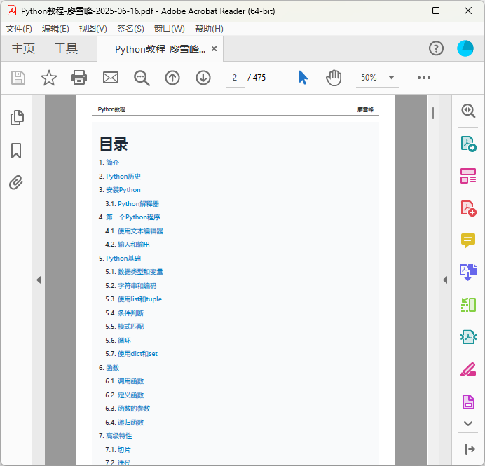
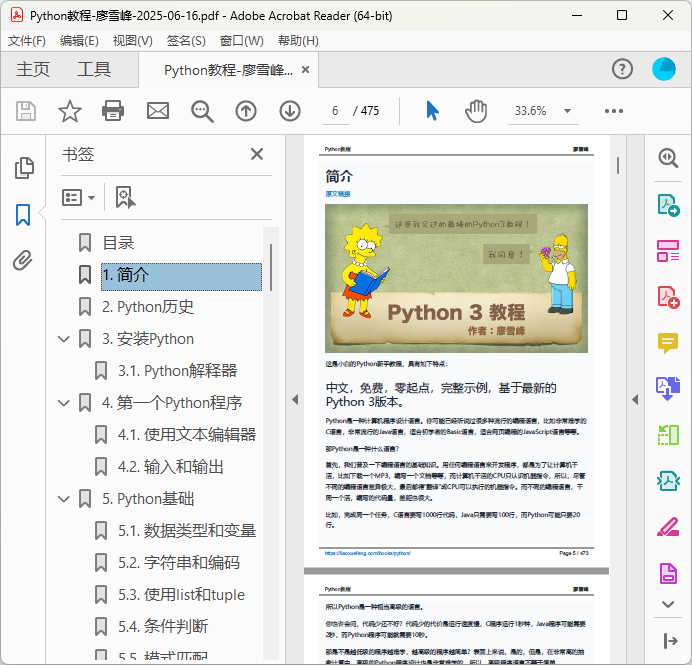

# 网页转PDF技术指南

有很多同学经常问，网站在线教程有没有PDF版本能离线学习？

虽然我个人推荐在线阅读，因为离线下载的PDF往往会在硬盘里吃灰。但是考虑到许多同学的强烈需求，所有教程已经全部提供PDF版本[免费下载](https://dl.lxf.sh/pdf/)！

本文从技术角度详细介绍如何创建PDF。

先说原理：网站所有教程均以Markdown格式存储，并通过[GitSite](https://gitsite.org)工具生成HTML静态页面。现在，要把一个页面转成一个PDF文件，最简单的方法是用浏览器的打印功能，可以直接将页面输出为PDF。

但是，直接打印HTML页面为PDF是不行的，主要问题是：

- PDF不需要网站的页头、页脚；
- 一个页面对应一个PDF，但一个教程有几十个页面，一个一个输出PDF再合非常麻烦。

所有，必须把所有页面先拼接成一个非常长的页面，再输出成一个PDF。

由于网站教程原始文件是Markdown，所以拼接出一个大页面再输出一个PDF没有难度。后续主要是如何自动化完成，以及各种细节的处理。

要自动化完成生成一个大页面再输出PDF，可以用[Puppeteer](https://pptr.dev/)，它封装了Chromium浏览器，相当于在本地以API的方式启动浏览器、加载页面、输出PDF，并且不需要窗口模式（Headless模式），命令行就能跑。

输出PDF的核心代码：

```javascript
const browser = await puppeteer.launch({ headless: true });
const page = await browser.newPage();
await page.goto('http://localhost:3000/books/python/pdf.html', { waitUntil: 'networkidle0' });
await page.pdf({
    path: '/path/to/python.pdf',
    margin: { top: 80, left: 50, right: 50, bottom: 80 }
});
await browser.close();
```

### 添加目录

为了便于阅读，可以在生成大页面时，在最顶端添加一个目录，每一个章节用`<a href="#chapter-n">`指向特定ID的`<h1 id="chapter-n">`标签，在HTML页面中可以实现内部跳转，生成的PDF文件也能实现内部跳转：



### 添加页眉页脚

生成PDF时，可以通过以下参数给每一页添加页眉和页脚：

```javascript
await page.pdf({
    path: '/path/to/python.pdf',
    margin: { top: 80, left: 50, right: 50, bottom: 80 },
    displayHeaderFooter: true,
    headerTemplate: '<div>Header</div>',
    footerTemplate: '<div><span class="pageNumber"></span> / <span class="totalPages"></span></div>'
});
```

设置页眉和页脚时，必须传入HTML片段，不能从外部引入图片和CSS。有几个特殊的class会被自动加上当前页码、总页数。

### 生成书签

在PDF文件中，可以创建书签。书签和目录类似，但它会自动加载到PDF阅读器的左侧，实际上是一组到指定页面的链接。

Puppeteer不支持生成书签，要创建书签，就必须解析生成的PDF，然后提取每个`<h1 id="chapter-n">`所在页的页码。用[pdf-lib](https://pdf-lib.js.org/)这个JS库可以实现：

```javascript
// 读取PDF:
const pdfMainDoc = await PDFDocument.load(await fs.read(...));
// 获取每一页的Object Number:
const pdfPages = pdfMainDoc.getPages();
const pdfPageObjNums = [];
for (let i=0; i<pdfPages.length; i++) {
    const page = pdfPages[i];
    pdfPageObjNums.push(page.ref.objectNumber); 
}
// 获取ID到Page Object Number的映射:
const nameToPageObjNumber = {};
const pdfIndObjs = pdfMainDoc.context.indirectObjects;
for (let [pdfKey, pdfValue] of pdfIndObjs.entries()) {
    if (pdfKey instanceof PDFRef) {
        let pdfValueDict = pdfValue.dict;
        if (pdfValueDict) {
            for (let [pk, pv] of pdfValueDict.entries()) {
                if (pk instanceof PDFName && pv instanceof PDFArray) {
                    let name = pk.decodeText();
                    if (name && name.startsWith('chapter-')) {
                        nameToPageObjNumber[name] = pv.array[0].objectNumber;
                    }
                }
            }
        }
    }
}
// 针对每个ID生成书签描述文件:
let bookmark = `
BookmarkBegin
BookmarkTitle: Chapter 1
BookmarkLevel: 1
BookmarkPageNumber: 2
...
`;
await fs.write(...);
```

实际上，`pdf-lib`只能提取出生成书签的信息，并不能生成书签。这里我们生成了一个书签描述文件，然后用[pdftk](https://www.pdflabs.com/tools/pdftk-the-pdf-toolkit/)更新PDF就可以把书签加进去：

```javascript
child_process.execSync('pdftk input.pdf update_info_utf8 bookmark.txt output output.pdf');
```

在PDF Reader中的效果如下：



### 添加封面和封底

封面和封底实际上就是两个小的HTML页面，各自生成单页PDF文件，然后，我们用`pdf-lib`把3个PDF文件合并成一个，就完成了最终的PDF：

```javascript
// 读取3个PDF文件:
const pdfMainDoc = await PDFDocument.load(await fs.read(...));
const pdfFrontDoc = await PDFDocument.load(await fs.read(...));
const pdfBackDoc = await PDFDocument.load(await fs.read(...));
// 复制页面到主文件:
const [frontPage] = await pdfMainDoc.copyPages(pdfFrontDoc, [0]);
const [backPage] = await pdfMainDoc.copyPages(pdfBackDoc, [0]);
pdfMainDoc.insertPage(0, frontPage);
pdfMainDoc.addPage(backPage);
// 保存:
const mergedPdfBuffer = await pdfMainDoc.save();
fs.writeFileSync('output.pdf', mergedPdfBuffer);
```

以上就是通过一系列页面生成PDF的详细步骤。需要下载PDF的同学可以移步[下载链接](https://dl.lxf.sh/pdf/)。
