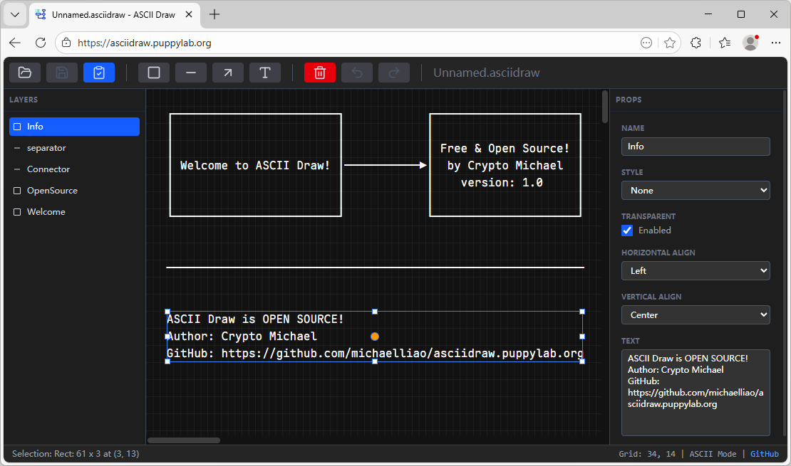

# AI Coding从零到一实现ASCII Draw

有很多同学问，这种“文字版”图表是怎么做出来的？

```ascii
┌───────────┐    ┌───────────┐    ┌───────────┐
│  Sender   │───▶│    MQ     │───▶│ Receiver  │
└───────────┘    └───────────┘    └───────────┘
      │                                 │
      │                                 │
      │                                 │
      │                                 │
      │          ┌───────────┐          │
      └─────────▶│ Database  │◀─────────┘
                 └───────────┘
```

上图这种用ASCII制表符画的图表实际上是用[Monodraw](https://monodraw.helftone.com/)这个软件创建的。

Monodraw是收费软件，而且只能在Mac上运行。现在我把开发平台切换到Windows+Linux虚拟机后，Monodraw用不了了，切到Mac很麻烦，怎么办？

既然现在AI Coding这么热门，干脆让AI写一个Web版的Monodraw，直接在浏览器里画图，Windows/Mac/Linux都能用！名字就叫**ASCII Draw**！

别看现在AI Coding很热，网上到处是各种评分、使用感受、贩卖焦虑，但是真正用AI从零到一写出完整软件的，我确实没见着几个。

本文主要记录用AI Coding从零到一写完ASCII Draw的全流程，并总结AI Coding的各种注意事项。

本次开发一共5天，但不是每天8小时干满。我估计一共十来个小时吧，说明AI编程效率确实高，同样的工作量手写保守估计3个月，主要是查文档、反复调试会花费大量时间。最终完成的网页效果如下：



[https://asciidraw.puppylab.org](https://asciidraw.puppylab.org)

### 准备开发环境

开发环境仍然是万年不变的VS Code，AI选的Google Gemini，本次采用古法AI编程，也就是让AI在浏览器写代码再粘贴到VS Code，因为Gemini上下文极大，因此所有代码在单个会话中就搞完了，最终花费$0。

### 使用AI编程

使用AI编程时，首先要给AI一个总体规划和遵循的开发原则。ASCII Draw的核心功能均来自Monodraw，要求生成HTML页面，给AI指令如下：

1. 使用Flex布局，高宽均为100%，覆盖浏览器窗口，无滚动条；
2. 第一行是工具栏，高度由按钮决定，宽度100%，超出部分直接截断不显示；
3. 第二行是编辑区，宽度100%，高度自适应；
4. 第三行是底部状态栏，高度由一行文本（不换行）高度决定，宽度100%，超出部分直接截断不显示。

并且要引入Tailwind CSS，要求直接使用CDN，不要用任何预编译工具。

这里顺便说一句，我觉得现在的前端开发已经走上了歪路邪路，一大堆复杂的构建工具，还没开始写一行代码，已经在硬盘上下载了几百兆的npm包，这一切都是从Facebook当年开创的jsx开始的。ASCII Draw的开发采用了截然不同的路子：100%纯静态页面，完全使用JavaScript，没有任何预编译工具，只有`<script src="...">`引入纯静态文件，这使得开发极为简单：更新代码，保存，刷新浏览器。

使用AI编程时，要遵循小步改进原则，每次跑通一个小功能就提交到Git，如果AI写得有问题，就在这个版本的基础上反复地让它改，改到通过为止。

因此，首先让AI出页面框架，看效果，再看布局是否符合要求，顺便让它把PowerShell脚本也写了，可以一键启动本地服务器，再自动打开浏览器预览页面。

搞完HTML结构，接下来要实现渲染，准备用Vue 3实现MVVM模式更新一个200x200的字符数组，AI给出的方案不建议用Vue的`v-for`循环渲染4万个单元格，因此这会造成严重的性能瓶颈。最佳实践方案是渲染出一个大字符串，直接更新单个`<pre>`标签。

继续让AI写一个能渲染的Demo，这一步会引入Vue 3，搭好JavaScript的核心代码框架，接着让AI设计出可扩展的Model结构：

1. 以`Shape`为基类，实现`Rect`和`Line`两个子类型；
2. 每个类型实现各自的渲染逻辑；
3. 多个类型的实例依次渲染，组合得到最终的ASCII字符。

其中第三步实现是比较复杂的，AI准确理解了层叠的需求，即画横线时，底部恰好有竖线，那么就要变成`┼`以实现交叉的效果，这实际上是ASCII绘图引擎中的“上下文感知渲染”（Context-aware Rendering）。

接下来是让AI实现多种线条类型：

1. 单线：──
2. 粗线：━━
3. 双线：══

在底部有粗线的情况下，画单线时，要渲染出粗细混合的效果`╂`，AI给的方案是权重查找表，非常简洁高效。

接着把添加文本、调整大小、自动吸附的功能加上后，让AI写最硬核的绘制连接两个Rect的Line，即自动寻径功能，它说要使用曼哈顿几何（Manhattan Geometry）的分段逻辑，生成两段到5段的折线。这是最难实现的逻辑，AI写了很多次都有问题，让它一遍一遍地重写，最后我发现有个高效的迭代方法，就是把日志加上：

```plain
_calculatePath: (11,2, right) to (20,8, left)
_calculatePath result: [{"x":11,"y":2},{"x":20,"y":2},{"x":20,"y":8}]
```

告诉它计算路径的输入和输出，AI能立刻明白自己哪算得不对。

最后把页面的文件保存等相关功能加上，一个完善的ASCII Draw网页版就出炉了：

[https://asciidraw.puppylab.org](https://asciidraw.puppylab.org)

初略估计大约95%的代码是AI写的。

### 常见问题

Q：为什么没有用命令行实现AI Coding？

A：因为我的付费API还没搞好，等搞好了下一次就直接用Open Code写了。

Q：AI Coding的效率优势？

A：把错误扔给AI，比如`Uncaught TypeError: Receiver must be an instance of class Line`，它立刻告诉我这个报错的原因是Vue的响应式系统与JavaScript类的私有属性/方法（`#`）之间的冲突。因为AI阅读了几乎所有的文档，以及海量开发人员的反馈信息，所以它能极快地准确定位错误原因。虽然我对Vue 3不太熟悉，但整个开发过程中没有去Vue官网查过文档，这也是为什么Tailwind作者说因为AI编程导致Tailwind网站流量大降继而导致收入大降。

Q：AI Coding的代码正确性？

A：对于流程类代码，基本上粘贴就能用，越通用的功能越准确，这也是和训练素材的数量正相关。小众的功能需要反复重写，而每次截图非常不方便，所以日志非常重要，把出错的相关日志让AI看，它就能自我反思，下次写的正确率会高一些。

Q：完全不懂编程能使用AI Coding吗？

A：以后不好说，现阶段洗洗睡吧。

最后放出ASCII Draw开发的完整会话，供参考：

[https://gemini.google.com/share/cbc2af3e7fc3](https://gemini.google.com/share/cbc2af3e7fc3)

如果有同学希望继续改进ASCII Draw，可以从GitHub克隆代码，然后在此会话的基础上继续让Gemini改代码。
