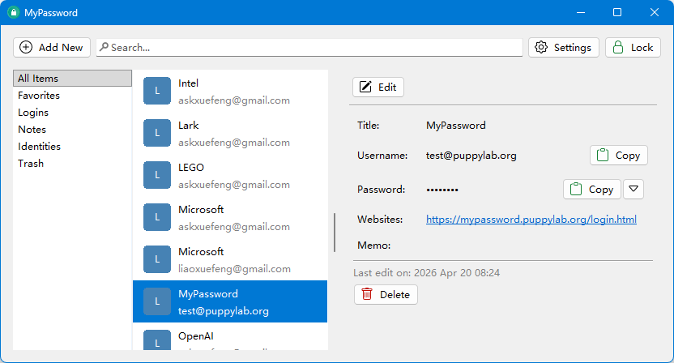
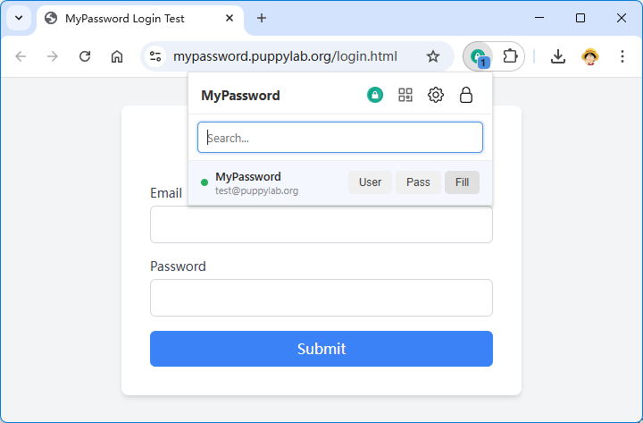
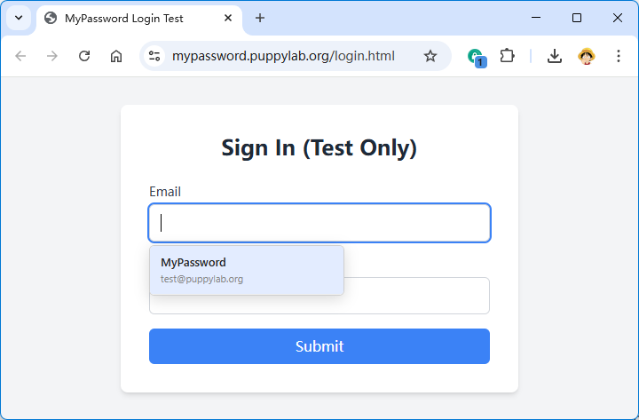

# Vibe Coding从零到一实现密码管理器MyPassword

[1Password](https://1password.com/)是一个管理所有网站密码的密码管理软件，虽然很好用，但它是商业软件，每年要付订阅费，并且不开源。

随着Vibe Coding的流行，用AI复刻的成本已经降得极低。对于密码管理这类敏感软件，实现自主可控非常重要，因此，我决定用Vibe Coding实现自己的密码管理器，暂命名为[MyPassword](https://mypassword.puppylab.org/)。Vibe Coding使用Claude Code，一周搞完。

项目地址：[https://github.com/michaelliao/mypassword](https://github.com/michaelliao/mypassword)

下载地址：[https://github.com/michaelliao/mypassword/releases/latest](https://github.com/michaelliao/mypassword/releases/latest)

### Step 1

Vibe Coding第一步，确认产品功能：

1. MyPassword是一个跨平台桌面软件，支持Windows、Mac和Linux；
2. 用户使用主密码解锁，然后统一管理所有网站的不同密码；
3. 提供浏览器插件，能通过插件自动填充网站密码；
4. 除了管理登录密码外，还可以管理身份（Identity：用于快速复制地址、护照号等信息）和便签（Note：存储任意文本信息）。

这是主窗口的布局：



这是浏览器插件弹出的面板：



也可以直接在登录输入框选择用户登录信息：



以上就是MyPassword的主要功能。

### Step 2

Vibe Coding第二步，确认软件架构。

软件架构有多个维度。对于MyPassword这种要存储口令的极度敏感数据，安全加密必不可少。

MyPassword的加密原理如下：

```ascii
┌─────────────────┐
│ Master Password │
└─────────────────┘
         │PBKDF2
         ▼
      ┌─────┐           ┌───────┐ Encrypt  ┌───────┐
      │ KEK │────┐ ┌────│  DEK  │─────────▶│ Vault │
      └─────┘    │ │    └───────┘          └───────┘
                 │ │
                 ▼ ▼
            ┌───────────┐
            │ Encrypted │
            │    DEK    │
            └───────────┘
```

- Vault：存储加密的用户数据的保险库，使用Sqlite数据库；
- DEK（Data Encryption Key）：加密所有敏感数据的AES密钥；
- Master Password：用户主口令，用于解锁加密库；
- KEK（Key Encryption Key）：根据用户主口令使用PBKDF2算法计算出来的AES密钥，用于加密DEK；
- Encrypted DEK：用KEK加密DEK的数据。

重点说明：

- DEK是软件随机生成的AES密钥，用户不可见；
- KEK是根据用户主口令计算出来的确定的AES密钥。

软件不存储KEK和DEK，只存储加密后的DEK，因此，只有输入了正确的主密码，才能解密出正确的DEK，DEK只存在内存中，永远不会存储到磁盘。

接着设计软件架构：

```ascii
┌───────────┐ http://127.0.0.1/  ┌───────────┐
│ Extension │───────────────────▶│    App    │
└───────────┘                    │  Window   │
                                 └───────────┘
                                       │
                                       ▼
                                 ┌───────────┐
                                 │ Sqlite DB │
                                 └───────────┘
```

- App：桌面客户端，读写Sqlite数据库，并提供本地http服务，以便浏览器插件能够调用；
- Extension：浏览器插件，通过`http://127.0.0.1`访问桌面客户端。

接着确定开发语言和框架。

一开始想用C#，但Mac和Linux的UI不好搞。Electron体积太大不考虑，最后决定用Java，使用SWT这个跨平台UI框架。

SWT的优点是完全封装系统原生控件，缺点是界面定制性不高，外观比较复古。

Java的优点是生态丰富，连http服务器都内置了，缺点是启动慢，但好在新版JDK支持裁剪，打包分发的时候，用不到的统统都可以删掉。最后打包大小在50~60M左右。

浏览器插件暂时仅支持Chrome，使用JavaScript开发，这个没得选。

接着设计数据库结构：核心是如何存储登录（Login）条目，表结构如下：

| 列名 | 类型 | 说明 |
|-----------------------|---------|------|
| id                    | INTEGER | 主键 |
| favorite              | INTEGER | 收藏标记, 1=收藏 |
| deleted               | INTEGER | 删除标记, 1=删除 |
| item_type             | INTEGER | 类型: 1=Login, 2=Note, 3=Identity |
| b64_encrypted_data    | TEXT    | Base64存储的加密数据 |
| b64_encrypted_data_iv | TEXT    | Base64存储的IV |
| updated_at            | INTEGER | 最后更新时间 |

具体的数据使用JSON存储，例如，一个Login的数据：

```json
{
    "title": "Google",
    "username": "example@gmail.com",
    "password": "hello12345",
    "websites": ["google.com", "gmail.com"],
    "memo": "Any text..."
}
```

JSON数据结构与数据库存储无关，可实现任意结构的存储，因为最后存储的是加密的序列化后的JSON字符串。因此，后续添加Passkey登录、TOTP 2FA验证码都非常简单。

### Step 3: Vibe Coding

接下来让AI写代码，先搭框架：Maven结构、MainWindow入口，跑通一个简单Hello World窗口。

然后让AI实现加解密工具、数据库读写、JSON序列化、窗口布局与用户操作，完成基本的密码管理功能；

继续让AI实现本地HTTP服务，暴露RPC接口，为开发插件做好准备；

最后让AI写浏览器插件，本地测试，随时反馈错误和需要调整的细节，整个软件的基本功能就开发完毕。

代码统计：大约7300行Java，1800行JavaScript。

### 安全加固

AI虽然写代码快，但如果目标只是快速完成功能，那写出来的软件必然是各种漏洞。AI不会主动思考有没有安全漏洞，所以还得提出安全问题，给它方案或者让它给方案，然后让它加固代码。

一个明显的安全漏洞是本地RPC。虽然App仅监听127.0.0.1的本地端口，任何外部都无法通过网络连接调用，但本地任何进程都可以调用RPC。如果App处于解锁状态，那随便一个恶意程序都可以获取到用户的所有口令。不暴露HTTP服务，浏览器插件又无法正常工作。

解决方案是RPC调用必须用Hmac签名，Extension和App持有相同的随机数作为key，确保其他进程不能非法访问。因此，Extension工作前多了一个“配对”步骤：Extension发出配对请求，App弹出窗口让用户确认，完成配对后，RPC才能正常访问。还需要在设置中列出已配对的扩展，用户能随时删除。

### 最佳实践

Vibe Coding能大幅提升开发效率，但不是给AI一句笼统的“完成浏览器插件”的指令，而是一步一步堆功能，每实现一个小功能就用git打快照，接着写下一个；

Claude Code在命令行工作，能够随时访问整个代码库，调用各种工具，比聊天模式效率高得多，生成的代码也准确得多，所以掌握命令行才能真正掌握Vibe Coding。

### 源码下载

[https://github.com/michaelliao/mypassword](https://github.com/michaelliao/mypassword)
