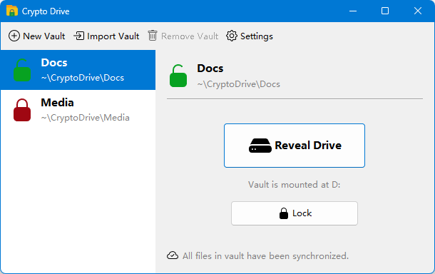

# Vibe Coding从零到一实现加密虚拟盘CryptoDrive

继[MyPassword](https://mypassword.puppylab.org/)之后，我用Vibe Coding复刻的[CryptoDrive](https://cryptodrive.puppylab.org/)也上线了。

CryptoDrive是以[Cryptomator](https://cryptomator.org/)为原型复刻，虽然Cryptomator是开源软件，但它少了一个重要的云同步功能，所以我决定复刻一个CryptoDrive，再加上云同步。

项目地址：[https://github.com/michaelliao/cryptodrive](https://github.com/michaelliao/cryptodrive)

下载地址：[https://github.com/michaelliao/cryptodrive/releases/latest](https://github.com/michaelliao/cryptodrive/releases/latest)

对Cryptomator的主要改进是虚拟文件夹的结构。Cryptomator以本地文件结构为基础，把它映射成加密文件和文件夹。这会导致一个问题，即移动虚拟文件夹里的文件，或者对文件和文件夹改名，都会造成物理文件位置的移动，对同步造成不利影响。

因此，CryptoDrive设计了一个虚拟文件系统，整个驱动器的目录结构就存储在一个JSON文件（`files.json`）中，它存储了一个树型结构的加密的文件名和目录名，文件拥有唯一的inode（`1`~`0xffffff`），目录的inode在挂载时自动分配（`0x1000000`~Max），因此，物理文件根据inode可始终保持唯一位置：

- inode 101 = 0x000065，映射至`/00/00/65.c9e`；
- inode 102 = 0x000066，映射至`/00/00/66.c9e`；
- inode 9001 = 0x002329，映射至`/00/23/29.c9e`；
- inode 1009002 = 0x0f656a，映射至`/0f/65/6a.c9e`；
- ……

移动文件、改名、改目录名均不影响文件位置和内容，无需同步文件，只需同步`files.json`。

### 云同步

为了实现云同步，CryptoDrive实现了一个简单的本地到远程的单向同步机制，主要通过锁定文件、复制上传来避免同步时长时间占用文件导致用户无法对虚拟盘的文件进行写入。目前支持所有兼容AWS S3的云存储，并支持将一个虚拟存储器同步至S3存储桶的某个子目录，这样就可以实现多个虚拟存储器同步到一个S3存储桶的不同目录下。

同步所需的配置信息以加密形式存储在`sync.json`文件中。

以上Vibe Coding大约3天左右。
