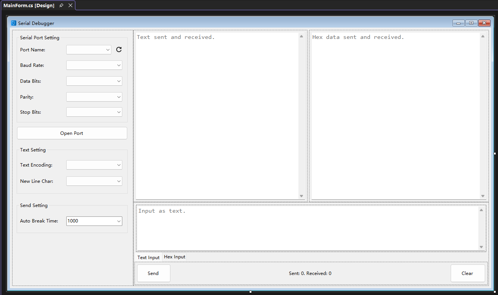
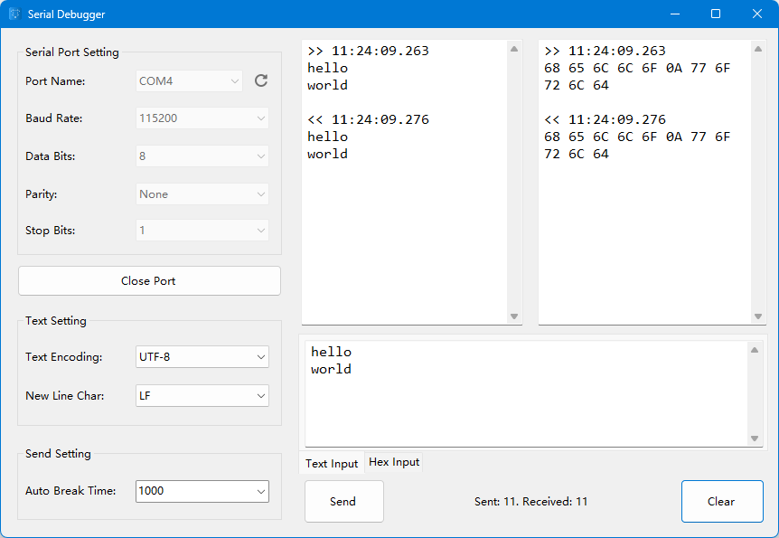

# Spec Coding从零到一实现串口调试器

最近调试串口，用了好几个串口调试器，感觉功能够，但显示不直观，不能以文本和十六进制对比显示，所以决定用AI手搓一个串口调试器。

项目地址：[https://github.com/michaelliao/serial-debugger](https://github.com/michaelliao/serial-debugger)

下载地址：[https://github.com/michaelliao/serial-debugger/releases/latest](https://github.com/michaelliao/serial-debugger/releases/latest)

这次不用Vibe Coding了，直接用Spec Coding，即把产品需求写清楚，让AI按需求生成代码。

开发环境使用Visual Studio + .Net 10 + C#，界面还是我自己花一个小时先画出来：



重点：一定要把每个控件的名字改成有意义的变量名，例如，不用用默认的`button1`，而是要改成`buttonSend`，便于AI识别意图。

接下来写[SPEC.md](https://github.com/michaelliao/serial-debugger/blob/main/SPEC.md)，花了一个小时：

```markdown
# SerialDebugger

SerialDebugger is a windows WinForm App for debugging serial communication. 
It provides a user-friendly interface for sending and receiving data over serial ports, 
making it easier for developers to test and debug their serial communication applications.

## Specification

### Initialize combo box's dropdown list

When the App starts, it initialize combo box's dropdown list.

For baud rate, it will list common baud rates defined as constant: 

...
```

写完`SPEC.md`，就让AI干活，直接发出最终指示：“完成所有代码”。

原本以为要几个小时，实际用了5分钟搞完了。

我还有点不太信，直接点Visual Studio的启动按钮，结果真跑起来了：



到此已经完成了90%，如果对细节没有要求，已经可以发布收工了。

但是谁让我对细节比较在意呢，于是看了一下代码，先把硬编码部分要求AI改成更容易维护的数组，再把文本和十六进制互换的几个小问题改掉（主要是换行符），再让它在关键点加Debug日志，最后让AI写个Github Action发布exe。

去Github下载，一看大小111M，凭经验就知道打包的时候把.Net Runtime完整地打进去了，没做裁剪。让AI改进一下打包配置，加上裁剪，发布包大小为56M。

但是这个裁剪的版本跑不起来，肯定是裁过头了，再让AI加上崩溃日志，把日志扔给它，让它把不该裁剪的加回去，最终实现完全裁剪，发布包34M。

### 总结

SPEC不但要描述功能，也要描述架构，比如指定收发数据一定要使用异步线程，不能阻塞UI线程；

重要功能不但要描述，还要写示例，根据示例AI可以更好地理解意图；

用Visual Studio写SPEC，它也内置AI，不停地按tab键就可以完成非常专业的文档。
