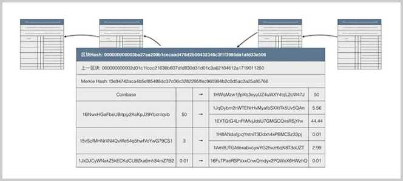
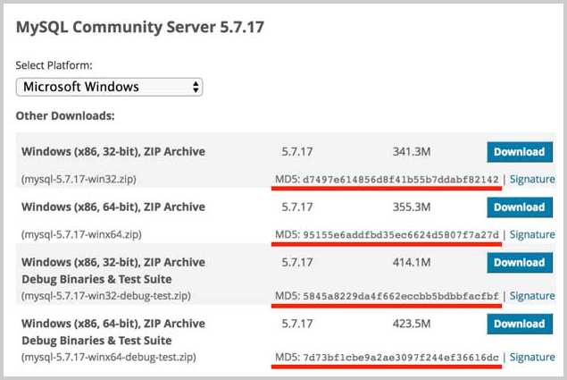
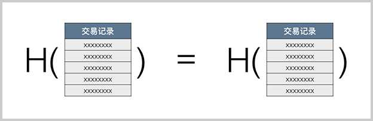
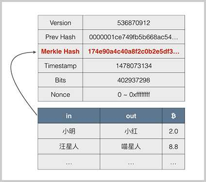
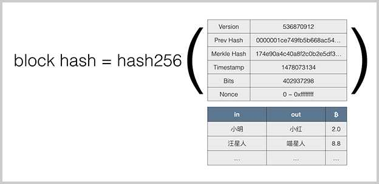

# 区块链原理

区块链就是一个不断增长的全网总账本，每个完全节点都拥有完整的区块链，并且，节点总是信任最长的区块链，伪造区块链需要拥有超过51%的全网算力。

区块链的一个重要特性就是不可篡改。为什么区块链不可篡改？我们先来看区块链的结构。

区块链是由一个一个区块构成的有序链表，每一个区块都记录了一系列交易，并且，每个区块都指向前一个区块，从而形成一个链条：


如果我们观察某一个区块，就可以看到，每个区块都有一个唯一的哈希标识，被称为区块哈希，同时，区块通过记录上一个区块的哈希来指向上一个区块：



每一个区块还有一个Merkle哈希用来确保该区块的所有交易记录无法被篡改。

区块链中的主要数据就是一系列交易，第一条交易通常是Coinbase交易，也就是矿工的挖矿奖励，后续交易都是用户的交易。

区块链的不可篡改特性是由哈希算法保证的。

### 哈希算法

我们来简单介绍一下什么是哈希算法。

哈希算法，又称散列算法，它是一个单向函数，可以把任意长度的输入数据转化为固定长度的输出：

```math
h=H(x)
```

例如，对`morning`和`bitcoin`两个输入进行某种哈希运算，得到的结果是固定长度的数字：

```plain
H("morning") = c7c3169c21f1d92e9577871831d067c8
H("bitcoin") = cd5b1e4947e304476c788cd474fb579a
```

我们通常用十六进制表示哈希输出。

因为哈希算法是一个单向函数，要设计一个安全的哈希算法，就必须满足：通过输入可以很容易地计算输出，但是，反过来，通过输出无法反推输入，只能暴力穷举。

```plain
H("???????") = c7c3169c21f1d92e9577871831d067c8
H("???????") = cd5b1e4947e304476c788cd474fb579a
```

想要根据上述结果反推输入，只能由计算机暴力穷举。

### 哈希碰撞

一个安全的哈希算法还需要满足另一个条件：碰撞率低。

碰撞是指，如果两个输入数据不同，却恰好计算出了相同的哈希值，那么我们说发生了碰撞：

```plain
H("data-123456") = a76b1fb579a02a476c789d9115d4b201
H("data-ABCDEF") = a76b1fb579a02a476c789d9115d4b201
```

因为输入数据长度是不固定的，所以输入数据是一个无限大的集合，而输出数据长度是固定的，所以，输出数据是一个有限的集合。把一个无限的集合中的每个元素映射到一个有限的集合，就必然存在某些不同的输入得到了相同的输出。

哈希碰撞的本质是把无限的集合映射到有限的集合时必然会产生碰撞。我们需要计算的是碰撞的概率。很显然，碰撞的概率和输出的集合大小相关。输出位数越多，输出集合就越大，碰撞率就越低。

安全哈希算法还需要满足一个条件，就是输出无规律。输入数据任意一个bit（某个字节的某一个二进制位）的改动，会导致输出完全不同，从而让攻击者无法逐步猜测输入，只能依赖暴力穷举来破解：

```plain
H("hello-1") = 970db54ab8a93b7173cb48f55e67fd2c
H("hello-2") = 8284353b768977f05ac600baad8d3d17
```

哈希算法有什么作用？假设我们相信一个安全的哈希算法，那么我们认为，如果两个输入的哈希相同，我们认为两个输入是相同的。

如果输入的内容就是文件内容，而两个文件的哈希相同，说明文件没有被修改过。当我们从网站上下载一个非常大的文件时，我们如何确定下载到本地的文件和官方网站发布的原始文件是完全相同，没有经过修改的呢？哈希算法就体现出了作用：我们只需要计算下载到本地的文件哈希，再和官方网站给出的哈希对比，如果一致，说明下载文件是正确的，没有经过篡改，如果不一致，则说明下载的文件肯定被篡改过。

大多数软件的官方下载页面会同时给出该文件的哈希值，以便让用户下载后验证文件是否被篡改：



和文件类似，如果两份数据的哈希相同，则几乎可以100%肯定，两份数据是相同的。比特币使用哈希算法来保证所有交易不可修改，就是计算并记录交易的哈希，如果交易被篡改，那么哈希验证将无法通过，说明这个区块是无效的。



### 常用哈希算法

常用的哈希算法以及它们的输出长度如下：

| 哈希算法 | 输出长度(bit) | 输出长度(字节) |
|-----------|----------|----------|
| MD5       | 128 bit  | 16 bytes |
| RipeMD160 | 160 bits | 20 bytes |
| SHA-1     | 160 bits | 20 bytes |
| SHA-256   | 256 bits | 32 bytes |
| SHA-512   | 512 bits | 64 bytes |

比特币使用的哈希算法有两种：SHA-256和RipeMD160

SHA-256的理论碰撞概率是：尝试2的130次方的随机输入，有99.8%的概率碰撞。注意2<sup>130</sup>是一个非常大的数字，大约是1361万亿亿亿亿。以现有的计算机的计算能力，是不可能在短期内破解的。

比特币使用两种哈希算法，一种是对数据进行两次SHA-256计算，这种算法在比特币协议中通常被称为hash256或者dhash。

另一种算法是先计算SHA-256，再计算RipeMD160，这种算法在比特币协议中通常被称为hash160。

```x-javascript
const
    bitcoin = require('bitcoinjs-lib'),
    createHash = require('create-hash');
----
function standardHash(name, data) {
    let h = createHash(name);
    return h.update(data).digest();
}

function hash160(data) {
    let h1 = standardHash('sha256', data);
    let h2 = standardHash('ripemd160', h1);
    return h2;
}

function hash256(data) {
    let h1 = standardHash('sha256', data);
    let h2 = standardHash('sha256', h1);
    return h2;
}

let s = 'bitcoin is awesome';
console.log('ripemd160 = ' + standardHash('ripemd160', s).toString('hex'));
console.log('  hash160 = ' + hash160(s).toString('hex'));
console.log('   sha256 = ' + standardHash('sha256', s).toString('hex'));
console.log('  hash256 = ' + hash256(s).toString('hex'));
```

运行上述代码，观察对一个字符串进行SHA-256、RipeMD160、hash256和hash160的结果。

### 区块链不可篡改特性

有了哈希算法的预备知识，我们来看比特币的区块链如何使用哈希算法来防止交易记录被篡改。

区块本身记录的主要数据就是一系列交易，所以，区块链首先要保证任何交易数据都不可修改。

### Merkle Hash

在区块的头部，有一个Merkle Hash字段，它记录了本区块所有交易的Merkle Hash：



Merkle Hash是把一系列数据的哈希根据一个简单算法变成一个汇总的哈希。

假设一个区块有4个交易，我们对每个交易数据做dhash，得到4个哈希值`a1`，`a2`，`a3`和`a4`：

```
a1 = dhash(tx1)
a2 = dhash(tx2)
a3 = dhash(tx3)
a4 = dhash(tx4)
```

注意到哈希值也可以看做数据，所以可以把`a1`和`a2`拼起来，`a3`和`a4`拼起来，再计算出两个哈希值`b1`和`b2`：

```ascii
       ┌───────────────┐               ┌───────────────┐
       │b1=dhash(a1+a2)│               │b2=dhash(a3+a4)│
       └───────────────┘               └───────────────┘
               ▲                               ▲
       ┌───────┴───────┐               ┌───────┴───────┐
       │               │               │               │
┌─────────────┐ ┌─────────────┐ ┌─────────────┐ ┌─────────────┐
│a1=dhash(tx1)│ │a2=dhash(tx2)│ │a3=dhash(tx3)│ │a4=dhash(tx4)│
└─────────────┘ └─────────────┘ └─────────────┘ └─────────────┘
```

最后，把`b1`和`b2`这两个哈希值拼起来，计算出最终的哈希值，这个哈希就是Merkle Hash：

```ascii
                     ┌───────────────────┐
                     │merkle=dhash(b1+b2)│
                     └───────────────────┘
                               ▲
               ┌───────────────┴───────────────┐
               │                               │
       ┌───────────────┐               ┌───────────────┐
       │b1=dhash(a1+a2)│               │b2=dhash(a3+a4)│
       └───────────────┘               └───────────────┘
               ▲                               ▲
       ┌───────┴───────┐               ┌───────┴───────┐
       │               │               │               │
┌─────────────┐ ┌─────────────┐ ┌─────────────┐ ┌─────────────┐
│a1=dhash(tx1)│ │a2=dhash(tx2)│ │a3=dhash(tx3)│ │a4=dhash(tx4)│
└─────────────┘ └─────────────┘ └─────────────┘ └─────────────┘
```

如果交易的数量不恰好是4个怎么办？例如，只有3个交易时，第一个和第二个交易的哈希`a1`和`a2`可以拼起来算出`b1`，第三个交易只能算出一个哈希`a3`，这个时候，就把a3直接复制一份，算出`b2`，这样，我们也能最终计算出Merkle Hash：

```ascii
                     ┌───────────────────┐
                     │merkle=dhash(b1+b2)│
                     └───────────────────┘
                               ▲
               ┌───────────────┴───────────────┐
               │                               │
       ┌───────────────┐               ┌───────────────┐
       │b1=dhash(a1+a2)│               │b2=dhash(a3+a3)│
       └───────────────┘               └───────────────┘
               ▲                               ▲
       ┌───────┴───────┐               ┌───────┴───────┐
       │               │               │               │
┌─────────────┐ ┌─────────────┐ ┌─────────────┐ ┌ ─ ─ ─ ─ ─ ─ ┐
│a1=dhash(tx1)│ │a2=dhash(tx2)│ │a3=dhash(tx3)│
└─────────────┘ └─────────────┘ └─────────────┘ └ ─ ─ ─ ─ ─ ─ ┘
```

如果有5个交易，我们可以看到，`a5`被复制了一份，以便计算出`b3`，随后`b3`也被复制了一份，以便计算出`c2`。总之，在每一层计算中，如果有单数，就把最后一份数据复制，最后一定能计算出Merkle Hash：

```ascii
                  ┌─────────┐
                  │ merkle  │
                  └─────────┘
                       ▲
           ┌───────────┴───────────┐
           │                       │
         ┌───┐                   ┌───┐
         │c1 │                   │c2 │
         └───┘                   └───┘
           ▲                       ▲
     ┌─────┴─────┐           ┌─────┴─────┐
     │           │           │           │
   ┌───┐       ┌───┐       ┌───┐       ┌ ─ ┐
   │b1 │       │b2 │       │b3 │        b3
   └───┘       └───┘       └───┘       └ ─ ┘
     ▲           ▲           ▲
  ┌──┴──┐     ┌──┴──┐     ┌──┴──┐
  │     │     │     │     │     │
┌───┐ ┌───┐ ┌───┐ ┌───┐ ┌───┐ ┌ ─ ┐
│a1 │ │a2 │ │a3 │ │a4 │ │a5 │  a5
└───┘ └───┘ └───┘ └───┘ └───┘ └ ─ ┘
```

从Merkle Hash的计算方法可以得出结论：修改任意一个交易哪怕一个字节，或者交换两个交易的顺序，都会导致Merkle Hash验证失败，也就会导致这个区块本身是无效的，所以，Merkle Hash记录在区块头部，它的作用就是保证交易记录永远无法修改。

### Block Hash

区块本身用Block Hash——也就是区块哈希来标识。但是，一个区块自己的区块哈希并没有记录在区块头部，而是通过计算区块头部的哈希得到的：



区块头部的Prev Hash记录了上一个区块的Block Hash，这样，可以通过Prev Hash追踪到上一个区块。

由于下一个区块的Prev Hash又会指向当前区块，这样，每个区块的Prev Hash都指向自己的上一个区块，这些区块串起来就形成了区块链。

区块链的第一个区块（又称创世区块）并没有上一个区块，因此，它的Prev Hash被设置为`00000000...000`。

如果一个恶意的攻击者修改了一个区块中的某个交易，那么Merkle Hash验证就不会通过。所以，他只能重新计算Merkle Hash，然后把区块头的Merkle Hash也修改了。这时，我们就会发现，这个区块本身的Block Hash就变了，所以，下一个区块指向它的链接就断掉了。


由于比特币区块的哈希必须满足一个难度值，因此，攻击者必须先重新计算这个区块的Block Hash，然后，再把后续所有区块全部重新计算并且伪造出来，才能够修改整个区块链。

在后面的挖矿中，我们会看到，修改一个区块的成本就已经非常非常高了，要修改后续所有区块，这个攻击者必须掌握全网51%以上的算力才行，所以，修改区块链的难度是非常非常大的，并且，由于正常的区块链在不断增长，同样一个区块，修改它的难度会随着时间的推移而不断增加。

### 小结

区块链依靠安全的哈希算法保证所有区块数据不可更改；

交易数据依靠Merkle Hash确保无法修改，整个区块依靠Block Hash确保区块无法修改；

工作量证明机制（挖矿）保证修改区块链的难度非常巨大从而无法实现。
