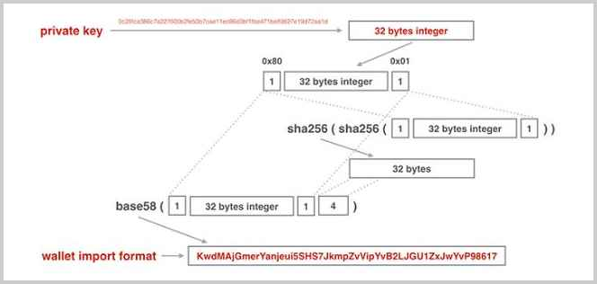

# 私钥

在比特币中，私钥本质上就是一个256位的随机整数。我们以JavaScript为例，演示如何创建比特币私钥。

在JavaScript中，内置的Number类型使用56位表示整数和浮点数，最大可表示的整数最大只有`9007199254740991`。其他语言如Java一般也仅提供64位的整数类型。要表示一个256位的整数，可以用数组来模拟。[bitcoinjs](https://github.com/bitcoinjs)使用[bigi](https://github.com/cryptocoinjs/bigi)这个库来表示任意大小的整数。

下面的代码演示了通过`ECPair`创建一个新的私钥后，表示私钥的整数就是字段`d`，我们把它打印出来：

```x-javascript
const bitcoin = require('bitcoinjs-lib');

let keyPair = bitcoin.ECPair.makeRandom();
// 打印私钥:
console.log('private key = ' + keyPair.d);
// 以十六进制打印:
console.log('hex = ' + keyPair.d.toHex());
// 补齐32位:
console.log('hex = ' + keyPair.d.toHex(32));
```

注意：每次运行上述程序，都会生成一个随机的`ECPair`，即每次生成的私钥都是不同的。

256位的整数通常以十六进制表示，使用`toHex(32)`我们可以获得一个固定64字符的十六进制字符串。注意每两个十六进制字符表示一个字节，因此，64字符的十六进制字符串表示的是32字节=256位整数。

想要记住一个256位的整数是非常困难的，并且，如果记错了其中某些位，这个记错的整数仍然是一个*有效的私钥*，因此，比特币有一种对私钥进行编码的方式，这种编码方式就是带校验的[Base58编码](https://zh.wikipedia.org/wiki/Base58)。

对私钥进行Base58编码有两种方式，一种是非压缩的私钥格式，一种是压缩的私钥格式，它们分别对应非压缩的公钥格式和压缩的公钥格式。

具体地来说，非压缩的私钥格式是指在32字节的私钥前添加一个`0x80`字节前缀，得到33字节的数据，对其计算4字节的校验码，附加到最后，一共得到37字节的数据：

```ascii
0x80           256bit             check
┌─┬──────────────────────────────┬─────┐
│1│              32              │  4  │
└─┴──────────────────────────────┴─────┘
```

计算校验码非常简单，对其进行两次SHA256，取开头4字节作为校验码。

对这37字节的数据进行Base58编码，得到总是以`5`开头的字符串编码，这个字符串就是我们需要非常小心地保存的私钥地址，又称为钱包导入格式：WIF（Wallet Import Format），整个过程如下图所示：


可以使用[wif](https://github.com/bitcoinjs/wif)这个库实现WIF编码：

```x-javascript
const wif = require('wif');

// 十六进制表示的私钥:
let privateKey = '0c28fca386c7a227600b2fe50b7cae11ec86d3bf1fbe471be89827e19d72aa1d';
// 对私钥编码:
let encoded = wif.encode(
        0x80, // 0x80前缀
        Buffer.from(privateKey, 'hex'), // 转换为字节
        false // 非压缩格式
);
console.log(encoded);
```

另一种压缩格式的私钥编码方式，与非压缩格式不同的是，压缩的私钥格式会在32字节的私钥前后各添加一个`0x80`字节前缀和`0x01`字节后缀，共34字节的数据，对其计算4字节的校验码，附加到最后，一共得到38字节的数据：

```ascii
0x80           256bit           0x01 check
┌─┬──────────────────────────────┬─┬─────┐
│1│              32              │1│  4  │
└─┴──────────────────────────────┴─┴─────┘
```

对这38字节的数据进行Base58编码，得到总是以`K`或`L`开头的字符串编码，整个过程如下图所示：



通过代码实现压缩格式的WIF编码如下：

```x-javascript
const wif = require('wif');

// 十六进制表示的私钥:
let privateKey = '0c28fca386c7a227600b2fe50b7cae11ec86d3bf1fbe471be89827e19d72aa1d';
// 对私钥编码:
let encoded = wif.encode(
        0x80, // 0x80前缀
        Buffer.from(privateKey, 'hex'), // 转换为字节
        true // 压缩格式
);
console.log(encoded);
```

目前，非压缩的格式几乎已经不使用了。bitcoinjs提供的`ECPair`总是使用压缩格式的私钥表示：

```x-javascript
const
    bitcoin = require('bitcoinjs-lib'),
    BigInteger = require('bigi');

let
    priv = '0c28fca386c7a227600b2fe50b7cae11ec86d3bf1fbe471be89827e19d72aa1d',
    d = BigInteger.fromBuffer(Buffer.from(priv, 'hex')),
    keyPair = new bitcoin.ECPair(d);
// 打印WIF格式的私钥:
console.log(keyPair.toWIF());
```

### 小结

比特币的私钥本质上就是一个256位整数，对私钥进行WIF格式编码可以得到一个带校验的字符串。

使用非压缩格式的WIF是以`5`开头的字符串。

使用压缩格式的WIF是以`K`或`L`开头的字符串。
