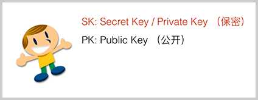
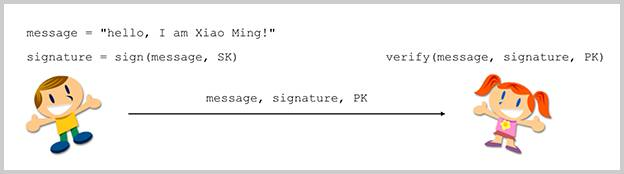
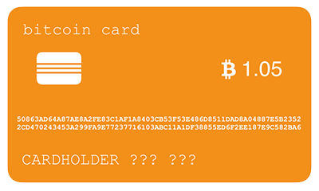
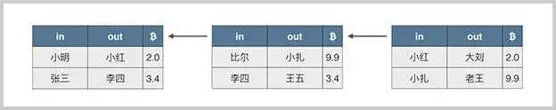
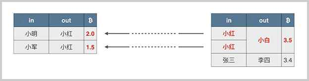
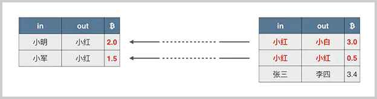
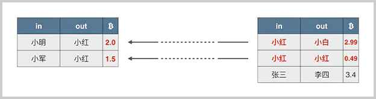
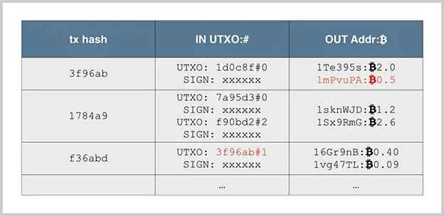

# P2P交易原理

比特币的交易是一种无需信任中介参与的P2P（Peer-to-peer）交易。

传统的电子交易，交易双方必须通过银行这样的信任机构作为中介，这样可以保证交易的安全性，因为银行记录了交易双方的账户资金，能保证在一笔交易中，要么保证成功，要么交易无效，不存在一方到账而另一方没有付款的情况：


但是在比特币这种去中心化的P2P网络中，并没有一个类似银行这样的信任机构存在，要想在两个节点之间达成交易，就必须实现一种在零信任的情况下安全交易的机制。

创建交易有两种方法：我们假设小明和小红希望达成一笔交易，一种创建交易的方法是小红声称小明给了他1万块钱，显然这是不可信的：


还有一种创建交易的方法是：小明声称他给了小红一万块钱，只要能验证这个声明确实是小明作出的，并且小明真的有1万块钱，那么这笔交易就被认为是有效的：


### 数字签名

如何验证这个声明确实是小明作出的呢？数字签名就可以验证这个声明是否是小明做的，并且，一旦验证通过，小明是无法抵赖的。

在比特币交易中，付款方就是通过数字签名来证明自己拥有某一笔比特币，并且，要把这笔比特币转移给指定的收款方。

使用签名是为了验证某个声明确实是由某个人做出的。例如，在付款合同中签名，可以通过验证笔迹的方式核对身份：


而在计算机中，用密码学理论设计的数字签名算法比验证笔迹更加可信。使用数字签名时，每个人都可以自己生成一个秘钥对，这个秘钥对包含一个私钥和一个公钥：私钥被称为Secret Key或者Private Key，私钥必须严格保密，不能泄漏给其他人；公钥被称为Public Key，可以公开给任何人：



当私钥持有人，例如，小明希望对某个消息签名的时候，他可以用自己的私钥对消息进行签名，然后，把消息、签名和自己的公钥发送出去：



其他任何人都可以通过小明的公钥对这个签名进行验证，如果验证通过，可以肯定，该消息是小明发出的。

数字签名算法在电子商务、在线支付这些领域有非常重要的作用：

首先，签名不可伪造，因为私钥只有签名人自己知道，所以其他人无法伪造签名。

其次，消息不可篡改，如果原始消息被人篡改了，那么对签名进行验证将失败。

最后，签名不可抵赖。如果对签名进行验证通过了，那么，该消息肯定是由签名人自己发出的，他不能抵赖自己曾经发过这一条消息。

```alert type=tip title=提示
数字签名的三个作用：防伪造，防篡改，防抵赖。
```

### 数字签名算法

常用的数字签名算法有：RSA算法，DSA算法和ECDSA算法。比特币采用的签名算法是椭圆曲线签名算法：ECDSA，使用的椭圆曲线是一个已经定义好的标准曲线secp256k1：

```math
y^2=x^3+7
```

这条曲线的图像长这样：


比特币采用的ECDSA签名算法需要一个私钥和公钥组成的秘钥对：私钥本质上就是一个1～2<sup>256</sup>的随机数，公钥是由私钥根据ECDSA算法推算出来的，通过私钥可以很容易推算出公钥，所以不必保存公钥，但是，通过公钥无法反推私钥，只能暴力破解。

比特币的私钥是一个随机的非常大的256位整数。它的上限，确切地说，比2<sup>256</sup>要稍微小一点：

```plain
0xFFFF FFFF FFFF FFFF FFFF FFFF FFFF FFFE BAAE DCE6 AF48 A03B BFD2 5E8C D036 4140
```

而比特币的公钥是根据私钥推算出的两个256位整数。

如果用银行卡作比较的话，比特币的公钥相当于银行卡卡号，它是两个256位整数：



比特币的私钥相当于银行卡密码，它是一个256位整数：

```plain
18E14A7B6A307F426A94F8114701E7C8E774E7F9A47E2C2035DB29A206321725
```

银行卡的卡号由银行指定，银行卡的密码可以由用户随时修改。而比特币“卡”和银行卡的不同点在于：密码（实际上是私钥）由用户先确定下来，然后计算出“卡号”（实际上是公钥），即卡号是由密码通过ECDSA算法推导出来的，不能更换密码，因为更换密码实际上相当于创建了一张新卡片。

由于比特币账本是全网公开的，所以，任何人都可以根据公钥查询余额，但是，不知道持卡人是谁。这就是比特币的匿名特性。

```alert type=caution title=警告
如果丢失了私钥，就永远无法花费对应公钥的比特币！
```

丢失了私钥和忘记银行卡密码不一样，忘记银行卡密码可以拿身份证到银行重新设置一个密码，因为密码是存储在银行的计算机中的，而比特币的P2P网络不存在中央节点，私钥只有持有人自己知道，因此，丢失了私钥，对应的比特币就永远无法花费。如果私钥被盗，黑客就可以花费对应公钥的比特币，并且这是无法追回的。

比特币私钥的安全性在于如何生成一个安全的256位的随机数。*不要试图自己想一个随机数*，而是应当使用编程语言提供的*安全随机数*算法，但绝对不能使用*伪随机数*。

```alert type=caution title=警告
绝不能自己想一个私钥或者使用伪随机数创建私钥！
```

那有没有可能猜到别人的私钥呢？这是不可能的。2<sup>256</sup>是一个非常大的数，它已经远远超过了整个银河系的原子总数。绝大多数人对数字大小的直觉是线性增长的，所以256这个数看起来不大，但是指数增长的2<sup>256</sup>是一个非常巨大的天文数字。

### 比特币钱包

比特币钱包实际上就是帮助用户管理私钥的软件。因为比特币的钱包是给普通用户使用的，它有几种分类：

- 本地钱包：是把私钥保存在本地计算机硬盘上的钱包软件，如[Electrum](https://electrum.org/)；
- 手机钱包：和本地钱包类似，但可以直接在手机上运行，如[Bitpay](https://bitpay.com/)；
- 在线钱包：是把私钥委托给第三方在线服务商保存；
- 纸钱包：是指把私钥打印出来保存在纸上；
- 脑钱包：是指把私钥记在自己脑袋里。

对大多数普通用户来说，想要记住私钥非常困难，所以*强烈不建议使用脑钱包*。

和银行账户不同，比特币网络没有账户的概念，任何人都可以从区块链查询到任意公钥对应的比特币余额，但是，并不知道这些公钥是由谁持有的，也就无法根据用户查询比特币余额。

作为用户，可以生成任意数量的私钥-公钥对，公钥是接收别人转账的地址，而私钥是花费比特币的唯一手段，钱包程序可以帮助用户管理私钥-公钥对。

### 交易

我们再来看记录在区块链上的交易。每个区块都记录了至少一笔交易，一笔交易就是把一定金额的比特币从一个输入转移到一个输出：



例如，小明把两个比特币转移给小红，这笔交易的输入是小明，输出就是小红。实际记录的是双方的公钥地址。

如果小明有`50`个比特币，他要转给小红两个比特币，那么剩下的`48`个比特币应该记录在哪？比特币协议规定一个输出必须一次性花完，所以，小明给小红的两个比特币的交易必须表示成：


小明给小红`2`个比特币，同时小明又给自己`48`个比特币，这`48`个比特币就是找零。所以，一个交易中，一个输入可以对应多个输出。

当小红有两笔收入时，一笔`2.0`，一笔`1.5`，她想给小白转`3.5`比特币时，就不能单用一笔输出，她必须把两笔钱合起来再花掉，这种情况就是一个交易对应多个输入和1个输出：



如果存在找零，这笔交易就既包含多个输入也包含多个输出：



在实际的交易中，输入比输出要稍微大一点点，这个差额就是隐含的交易费用，交易费用会算入当前区块的矿工收入中作为矿工奖励的一部分：



计算出的交易费用：

```plain
交易费用 = 输入 - 输出 = (2.0 + 1.5) - (2.99 + 0.49) = 3.5 - 3.48 = 0.02
```

比特币实际的交易记录是由一系列交易构成，每一个交易都包含一个或多个输入，以及一个或多个输出。未花费的输出被称为UTXO：Unspent Transaction Output。

当我们要简单验证某个交易的时候，例如，对于交易`f36abd`，它记录的输入是`3f96ab`，索引号是`1`（索引号从`0`开始，`0`表示第一个输出，`1`表示第二个输出，以此类推），我们就根据`3f96ab`找到前面已发生的交易，再根据索引号找到对应的输出是`0.5`个比特币，所以，这笔交易的输入总计是`0.5`个比特币，输出分别是`0.4`个比特币和`0.09`个比特币，隐含的交易费用是`0.01`个比特币：



### 小结

比特币使用数字签名保证零信任的可靠P2P交易：

- 私钥是花费比特币的唯一手段；
- 钱包软件是用来帮助用户管理私钥；
- 所有交易被记录在区块链中，可以通过公钥查询所有交易信息。
