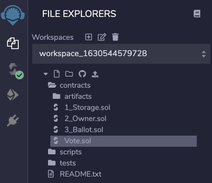
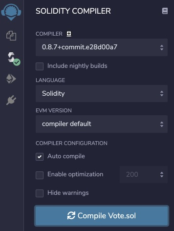

# 部署合约

当我们编写完Vote合约后，如何把它部署到以太坊的链上？

实际上，部署合约也是一个交易，需要一个外部账户，花费一定的Gas，就可以把合约部署到链上。

因此，我们首先需要一个便于开发和测试的钱包，才能创建一个外部账户，并且账户上要有一定的Ether。

### MetaMask

我们强烈推荐使用[MetaMask](https://metamask.io/)钱包，这是一个基于浏览器插件的钱包，支持Chrome、FireFox等浏览器。使用的时候，通过Dapp网站的JavaScript可以发起交易，用户通过MetaMask确认后即可将交易发送至链上。

安装MetaMask非常简单，请参考官方文档。安装完成后，第一次启动MetaMask需要创建或导入一个钱包，设置一个解锁口令，MetaMask允许创建多个账号，可随时切换账号，还可切换不同的链，例如，以太坊主网、Ropsten测试网、Rinkeby测试网等。

在开发阶段，直接使用主网太费钱，可以使用测试网，并从[faucet.egorfine.com](https://faucet.egorfine.com/)或[faucet.dimensions.network](https://faucet.dimensions.network)获取一些测试网的Ether。

```alert type=warning title=注意
以太坊有多个测试网，开发前请在Etherscan确认使用哪个活动的测试网。
```


### 部署合约

以太坊官方提供了一个[Remix](http://remix.ethereum.org/)的在线IDE，用于编写、编译和部署以太坊合约。这是从零开始部署一个合约的最简单的方式。

我们访问[Remix](http://remix.ethereum.org/)（注意：要部署合约，只能通过http访问，不能使用https），在左侧选择“File explorers”，在默认的Workspace的`contracts`目录下新建文件`Vote.sol`，然后贴入上一节我们编写的代码：



接下来是编译该合约。选择左侧的“Solidity compiler”，点击“Compile Vote.sol”开始编译：


如果没有编译错误，可以看到编译成功的标志。接下来选择“Deploy & run transactions”：



在“ENVIRONMENT”中，选择“Injected Web3”，表示我们要使用MetaMask注入的Web3环境，如果已正确连接MetaMask，可以看到“Ropsten (3) network”，表示已连接到Ropsten测试网。

在“CONTRACT”中，选择“Vote - contracts/Vote.sol”，这是我们将要部署的合约。

在“Deploy”按钮左侧，填入构造函数的参数，例如`1735719000`，然后点击“Deploy”按钮开始部署，此时会弹出MetaMask的交易签名确认，确认后部署合约的交易即被发送至测试链。在MetaMask的账户 - 活动中可以看到正在发送的交易，查看详情可以在Etherscan查看[该交易的详细信息](https://ropsten.etherscan.io/tx/0xcc2b6bf94b95c1a3d26066310ffa28f28910c6997154f73c5385c7ac1b551233)。当交易被打包确认后，即可获得部署后合约的地址[0x5b2a...5a46](https://ropsten.etherscan.io/address/0x5b2a057e1db47463695b4629114cbdae99235a46)。

至此，我们就成功地部署了一个以太坊合约。

对于熟练的Solidity开发者，可以使用[Truffle](https://www.trufflesuite.com/)这个JavaScript工具通过JavaScript脚本全自动部署合约，减少手动操作导致的出错的可能。

### 小结

编写Solidity合约后，可以通过Remix在线编译、部署；

可以使用Truffle完成合约的自动化编译、测试、部署。
