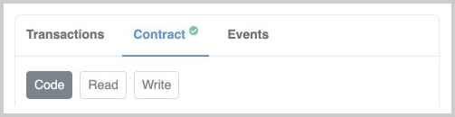
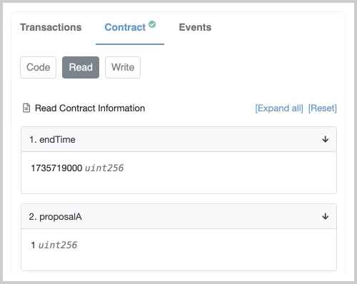
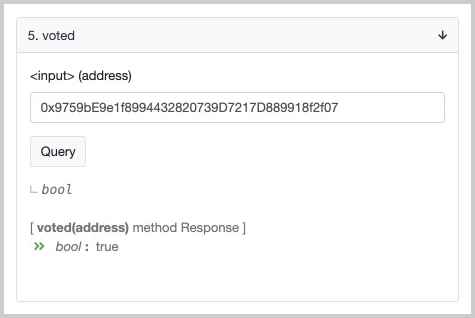
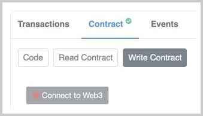
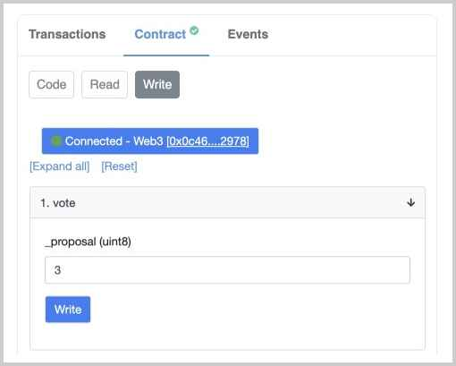

# 调用合约

当我们已经成功地将一个合约部署到以太坊链上时，如何调用该合约？

首先，我们通过Etherscan这个网站可以查看已部署合约的详细信息，例如[0x5b2a...5a46](https://ropsten.etherscan.io/address/0x5b2a057e1db47463695b4629114cbdae99235a46)。在调用合约前，我们可以通过“Verify and Publish”这个链接将源码上传到Etherscan并验证。首先选择正确的Solidity编译器版本，贴入源码，Etherscan自动编译后，如果二进制的字节码完全匹配已部署的合约，则验证通过，该合约有一个绿色小勾的标志：



### 读取合约

访问合约的只读函数时，无需消耗Gas，也无需连接钱包，直接切换到“Read”面板，即可看到只读函数的返回值：



从结果可知，`endTime()`返回`1735719000`，`proposalA()`返回`1`。

有的童鞋会问，我们在Vote合约只有`endTime`字段并没有`endTime()`函数，为什么可以访问`endTime()`？原因是public字段会自动对应一个同名的只读函数，即：

```solidity
contract Vote {
    uint256 public endTime;
}
```

完全等价于：

```solidity
contract Vote {
    uint256 private _endTime;

    function endTime() public view returns (uint256) {
        return _endTime;
    }
}
```

对于需要填入参数的只读函数，可以直接在对应的输入框填入参数，然后点击“Query”调用并获取结果：



### 写入合约

当我们要写入合约时，就必须提交一个签名的交易，并消耗一定的Gas。我们在Etherscan的合约页选择“Write”，会出现一个“Connect to Web3”的链接：



点击并连接MetaMask后，我们就可以选择一个写入函数，填入参数，然后点击“Write”：



在MetaMask中确认该交易后，交易被发送至链上。等待打包成功后，我们就可以读取到合约内部更新后的状态。

### 小结

调用合约的只读函数无需签名，也无需Gas，任何时候均可调用；

调用合约的写入函数需要签名发送交易，并消耗一定的Gas。只有等交易成功落块后，写入才算成功。
