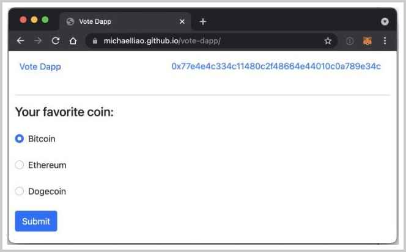
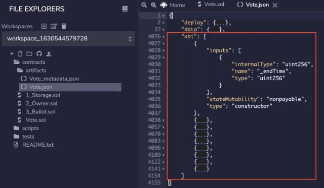

# 编写Dapp

上一节我们讲了如何调用已部署在以太坊链上的合约。


通过Etherscan这个网站不仅可以查看合约代码，还可以调用合约的读取和写入方法。可见，调用一个合约是非常简单的。


但是对于普通用户来说，这种调用方式就有点耍流氓了。大家平时上网发个微博，也没说要调用一个JSON REST API。如果发微博必须调用API，那微博用户肯定个个都是开发高手，根本没空撕来撕去。

所以，要求普通用户自己去Etherscan调用合约不现实。本节我们就来介绍如何开发一个Dapp，让用户通过页面，点击按钮来调用合约。

### Dapp架构

一个Dapp的架构实际上包含以下部分：

```ascii
 ┌───────┐     ┌─────────┐
 │Wallet │◀────│Web Page │
 └───────┘     └─────────┘
     │
 read│write
     │
┌ ─ ─│─ ─ ─ ─ ─ ─ ─ ─ ─ ─ ─ ─ ─ ─ ─ ─ ─ ┐
     ▼                              
│ ┌─────┐        ┌─────┐        ┌─────┐ │
  │Node │────────│Node │────────│Node │
│ └─────┘        └─────┘        └─────┘ │
     │              │              │
│    │    ┌─────┐   │   ┌─────┐    │    │
     └────│Node │───┴───│Node │────┘
│         └─────┘       └─────┘         │
           Ethereum Blockchain
└ ─ ─ ─ ─ ─ ─ ─ ─ ─ ─ ─ ─ ─ ─ ─ ─ ─ ─ ─ ┘
```

以太坊的区块链网络实际上是一个由若干节点构成的P2P网络，所谓读写合约，实际上是向网络中的某个节点发送JSON-RPC请求。当我们想要做一个基于Vote合约的Dapp时，我们需要开发一个页面，并连接到浏览器的MetaMask钱包，这样，页面的JavaScript就可以通过MetaMask读写Vote合约，页面效果如下：



可以访问[https://michaelliao.github.io/vote-dapp/](https://michaelliao.github.io/vote-dapp/)查看页面并与合约交互。

编写Dapp的页面可以按以下步骤进行：

第一步，引入相关库，这里我们引入[ethers.js](https://docs.ethers.io/)这个库，它封装了读写合约的逻辑。在页面中用&lt;script&gt;引入如下：

<pre><code>&lt;script src="https://cdn.jsdelivr.net/npm/ethers@5.0.32/dist/ethers.umd.min.js">&lt;/script></code></pre>

第二步，我们需要获取MetaMask注入的Web3，可以通过一个简单的函数实现：

```javascript
function getWeb3Provider() {
    if (!window.web3Provider) {
        if (!window.ethereum) {
            console.error("there is no web3 provider.");
            return null;
        }
        window.web3Provider = new ethers.providers.Web3Provider(window.ethereum, "any");
    }
    return window.web3Provider;
}
```

第三步，在用户点击页面“Connect Wallet”按钮时，尝试连接MetaMask：

```javascript
async function () {
    if (window.getWeb3Provider() === null) {
        console.error('there is no web3 provider.');
        return false;
    }
    try {
        // 获取当前连接的账户地址:
        let account = await window.ethereum.request({
            method: 'eth_requestAccounts',
        });
        // 获取当前连接的链ID:
        let chainId = await window.ethereum.request({
            method: 'eth_chainId'
        });
        console.log('wallet connected.');
        return true;
    } catch (e) {
        console.error('could not get a wallet connection.', e);
        return false;
    }
}
```

最后一步，当我们已经连接到MetaMask钱包后，即可写入合约。写入合约需要合约的ABI（Application Binary Interface）信息，即合约函数调用的接口信息，这些信息在Remix部署时产生。我们需要回到Remix，在`contracts`-`artifacts`目录下找到`Vote.json`文件，它是一个JSON，右侧找到`"abi": [...]`，把`abi`对应的部分复制出来：



以常量的形式引入Vote合约的地址和ABI：

```javascript
const VOTE_ADDR = '0x5b2a057e1db47463695b4629114cbdae99235a46';
const VOTE_ABI = [{ "inputs": [{ "internalType": "uint256", "name": "_endTime", "type": "uint256" }], ...
```

现在，我们就可以在页面调用`vote()`写入函数了：

```javascript
async function vote(proposal) {
    // TODO: 检查MetaMask连接信息
    // 根据地址和ABI创建一个Contract对象:
    let contract = new ethers.Contract(VOTE_ADDR, VOTE_ABI, window.getWeb3Provider().getSigner());
    // 调用vote()函数，并返回一个tx对象:
    let tx = await contract.vote(proposal);
    // 等待tx落块，并至少1个区块确认:
    await tx.wait(1);
}
```

以上就是调用合约的全部流程。

我们需要明确几个要点：

1. 页面的JavaScript代码无法直接访问以太坊网络的P2P节点，只能间接通过MetaMask钱包访问；
2. 钱包之所以能访问以太坊网络的节点，是因为它们内置了某些公共节点的域名信息；
3. 如果用户的浏览器没有安装MetaMask钱包，则页面无法通过钱包读取合约或写入合约。

因此引出了第二个问题：一个Dapp到底需不需要服务器端？

对于大多数的Dapp来说，是需要服务器端的，这是因为，当用户浏览器没有安装钱包，或者钱包并没有连接到Dapp期待的网络时，页面将无法获得合约的任何数据。例如，上述Dapp就无法读取到三种投票的数量，因此无法在页面上绘制对比图。

如果部署一个服务器端，由服务器连接P2P网络的节点并读取合约，然后以JSON API的形式给前端提供相关数据，则可以实现一个更完善的Dapp。因此，完整的Dapp架构如下：

```ascii
 ┌───────┐     ┌─────────┐     ┌───────┐
 │Wallet │◀────│Web Page │────▶│Server │
 └───────┘     └─────────┘     └───────┘
     │                             │
 read│write                        │read
     │                             │
┌ ─ ─│─ ─ ─ ─ ─ ─ ─ ─ ─ ─ ─ ─ ─ ─ ─│─ ─ ┐
     ▼                             ▼
│ ┌─────┐        ┌─────┐        ┌─────┐ │
  │Node │────────│Node │────────│Node │
│ └─────┘        └─────┘        └─────┘ │
     │              │              │
│    │    ┌─────┐   │   ┌─────┐    │    │
     └────│Node │───┴───│Node │────┘
│         └─────┘       └─────┘         │
           Ethereum Blockchain
└ ─ ─ ─ ─ ─ ─ ─ ─ ─ ─ ─ ─ ─ ─ ─ ─ ─ ─ ─ ┘
```

为Dapp搭建后端服务器时要严格遵循以下规范：

1. 后端服务器只读取合约，不存储任何私钥，因此无法写入合约，保证了安全性；
2. 后端服务器要读取合约，就必须连接到P2P节点，要么选择公共的节点服务（例如[Infura](https://infura.io)），要么自己搭建一个以太坊节点（维护的工作量较大）；
3. 后端服务器应该通过合约产生的日志（即合约运行时触发的event）监听合约的状态变化，而不是定期扫描。监听日志需要通过P2P节点创建Filter并获取Filter返回的日志；
4. 后端服务器应该将从日志获取的数据做聚合、缓存，以便前端页面能快速展示相关数据。

因此，设计Dapp时，既要考虑将关键业务逻辑写入合约，又要考虑日志输出有足够的信息让后端服务器能聚合历史数据。前端、后端和合约三方开发必须紧密配合。

不同的编程语言实现后端服务时，可以选择封装好的第三方库，例如Java可以使用[Web3j](https://github.com/web3j/web3j)，Python可以使用[Web3.py](https://web3py.readthedocs.io/)，详细的说明可以参考[官方文档](https://ethereum.org/en/developers/docs/programming-languages/)。

### Graph

还有一种托管的后端服务：[The Graph](https://thegraph.com)。它本身也可看作是一个基础设置。The Graph可以让我们部署一个Graph查询服务，如何定义表结构以及如何更新则由我们提供一个预编译的WASM。整个配置、WASM代码以及查询服务都托管在The Graph中，无需自己搭建服务器，非常方便。

因此，使用Graph的一个完整的DApp架构如下：

```ascii
                ┌───────┐
    ┌───────────│ DApp  │───────────┐
    │           └───────┘           │
    │ read/write              query │
    │ contract                 data │
    ▼                               ▼
┌───────┐                       ┌───────┐
│Wallet │                       │ Graph │
└───────┘                       └───────┘
    │                               ▲
    │ sign                    index │
    │ broadcast                data │
    │                               │
    │  ┌ ─ ─ ─ ─ ─ ─ ─ ─ ─ ─ ─ ─ ─  │
    │    ┌────┐ ┌────┐     ┌────┐ │ │
    └──┼▶│Node│ │Node│ ... │Node│───┘
         └────┘ └────┘     └────┘ │
       │         Ethereum
        ─ ─ ─ ─ ─ ─ ─ ─ ─ ─ ─ ─ ─ ┘
```

我们在Vote这个Dapp中并未提供后端服务，请自行实现。

### 小结

一个Dapp应用通常由前端、后端和部署的合约三部分构成。

不懂前端的后端不是一个合格的合约开发者。
