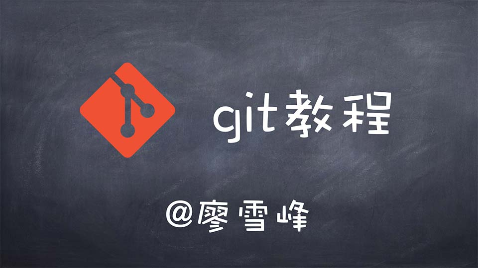

# 简介

史上最浅显易懂的Git教程！

为什么要编写这个教程？因为我在学习Git的过程中，买过书，也在网上Google了一堆Git相关的文章和教程，但令人失望的是，这些教程不是难得令人发指，就是简单得一笔带过，或者，只支离破碎地介绍Git的某几个命令，还有直接从Git手册粘贴帮助文档的，总之，初学者很难找到一个由浅入深，学完后能立刻上手的Git教程。

既然号称史上最浅显易懂的Git教程，那这个教程有什么让你怦然心动的特点呢？

首先，本教程绝对面向初学者，没有接触过版本控制概念的读者也可以轻松入门，不必担心起步难度；

其次，本教程实用性超强，边学边练，一点也不觉得枯燥。而且，你所学的Git命令是“充分且必要”的，掌握了这些东西，你就可以通过Git轻松地完成你的工作。

### 文字+图片还看不明白？有视频！！！

本教程只会让你成为Git用户，不会让你成为Git专家。很多Git命令只有那些专家才明白（事实上我也不明白，因为我不是Git专家），但我保证这些命令可能你一辈子都不会用到。既然Git是一个工具，就没必要把时间浪费在那些“高级”但几乎永远不会用到的命令上。一旦你真的非用不可了，到时候再自行Google或者请教专家也未迟。

如果你是一个开发人员，想用上这个世界上目前最先进的分布式版本控制系统，那么，赶快开始学习吧！
