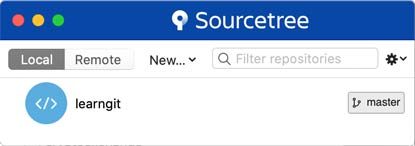
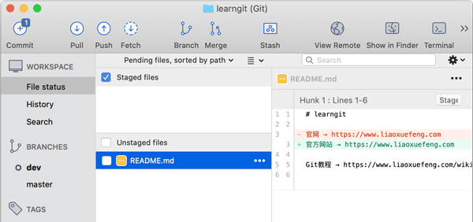
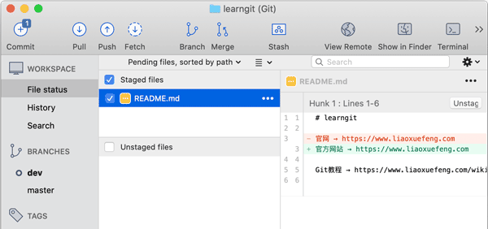
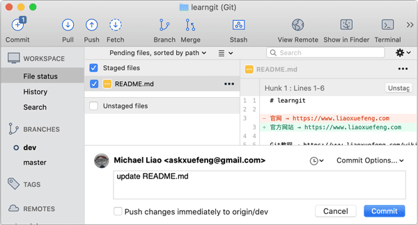
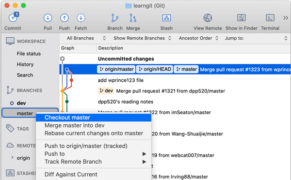
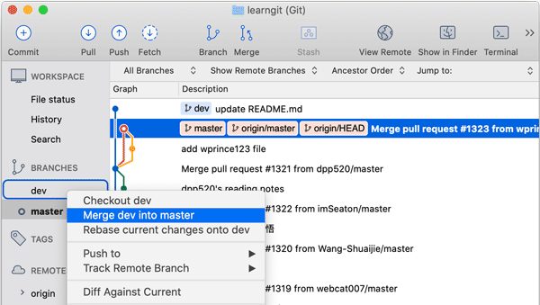
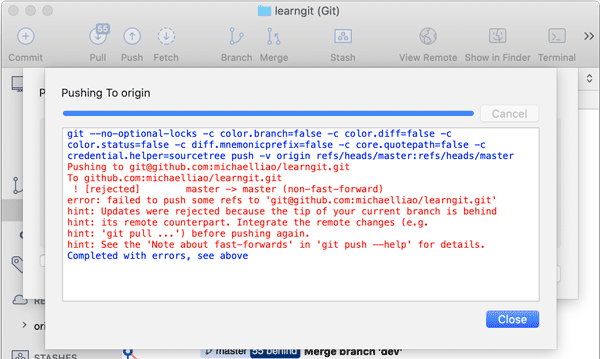

# 使用SourceTree

当我们对Git的提交、分支已经非常熟悉，可以熟练使用命令操作Git后，再使用GUI工具，就可以更高效。

Git有很多图形界面工具，这里我们推荐[SourceTree](https://www.sourcetreeapp.com/)，它是由[Atlassian](https://www.atlassian.com/)开发的免费Git图形界面工具，可以操作任何Git库。

首先从[官网](https://www.sourcetreeapp.com/)下载SourceTree并安装，然后直接运行SourceTree。

第一次运行SourceTree时，SourceTree并不知道我们的Git库在哪。如果本地已经有了Git库，直接从资源管理器把文件夹拖拽到SourceTree上，就添加了一个本地Git库：

也可以选择“New”-“Clone from URL”直接从远程克隆到本地。

### 提交

我们双击`learngit`这个本地库，SourceTree会打开另一个窗口，展示这个Git库的当前所有分支以及文件状态。选择左侧面板的“WORKSPACE”-“File status”，右侧会列出当前已修改的文件（Unstaged files）：

选中某个文件，该文件就自动添加到“Staged files”，实际上是执行了`git add README.md`命令：

然后，我们在下方输入Commit描述，点击“Commit”，就完成了一个本地提交：

实际上是执行了`git commit -m "update README.md"`命令。

使用SourceTree进行提交就是这么简单，它的优势在于可以可视化地观察文件的修改，并以红色和绿色高亮显示。

### 分支

在左侧面板的“BRANCHES”下，列出了当前本地库的所有分支。当前分支会加粗并用○标记。要切换分支，我们只需要选择该分支，例如`master`，然后点击右键，在弹出菜单中选择“Checkout master”，实际上是执行命令`git checkout master`：

要合并分支，同样选择待合并分支，例如`dev`，然后点击右键，在弹出菜单中选择“Merge dev into master”，实际上是执行命令`git merge dev`：

### 推送

在SourceTree的工具栏上，分别有`Pull`和`Push`，分别对应命令`git pull`和`git push`，只需注意本地和远程分支的名称要对应起来，使用时十分简单。

注意到使用SourceTree时，我们只是省下了敲命令的麻烦，SourceTree本身还是通过Git命令来执行任何操作。如果操作失败，SourceTree会自动显示执行的Git命令以及错误信息，我们可以通过Git返回的错误信息知道出错的原因：

### 小结

使用SourceTree可以以图形界面操作Git，省去了敲命令的过程，对于常用的提交、分支、推送等操作来说非常方便。

SourceTree使用Git命令执行操作，出错时，仍然需要阅读Git命令返回的错误信息。
