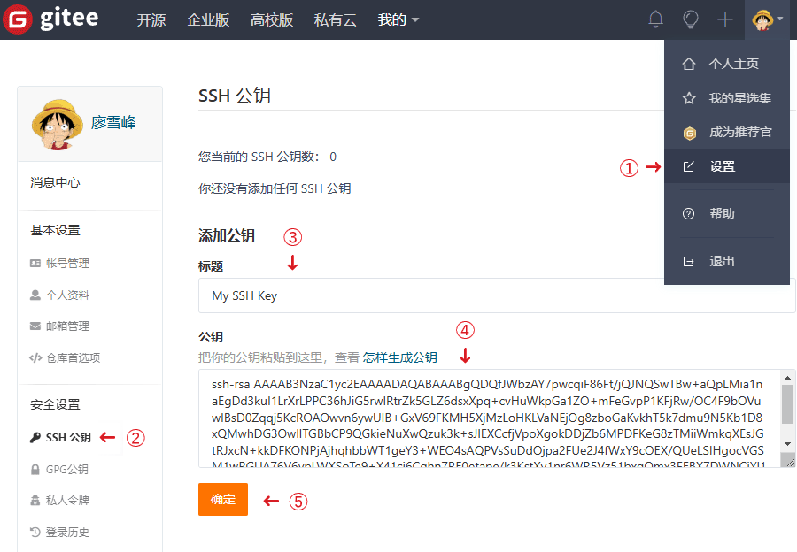
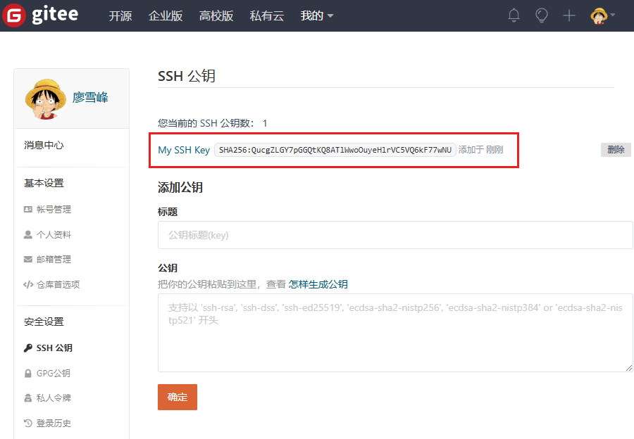
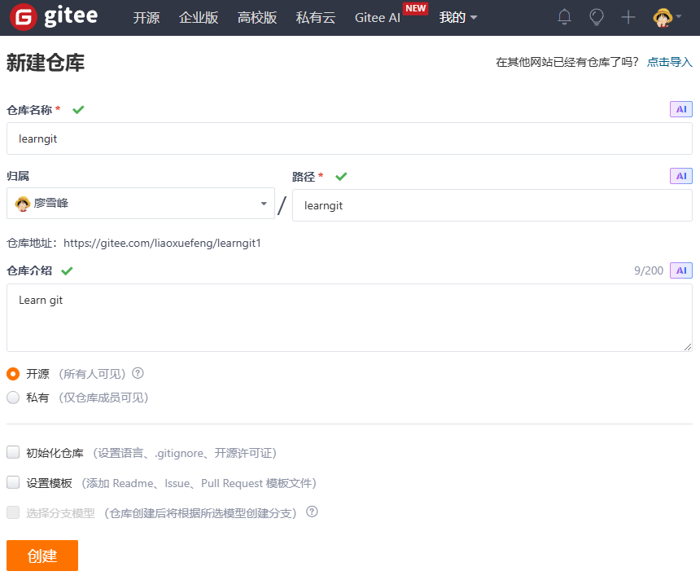

# 使用Gitee

使用GitHub时，国内的用户经常遇到的问题是访问速度太慢，有时候还会出现无法连接的情况（原因你懂的）。

如果我们希望体验Git飞一般的速度，可以使用国内的Git托管服务——[Gitee](https://gitee.com?utm_source=blog_lxf)（[gitee.com](https://gitee.com?utm_source=blog_lxf)）。

和GitHub相比，Gitee也提供免费的Git仓库。此外，还集成了代码质量检测、项目演示等功能。对于团队协作开发，Gitee还提供了项目管理、代码托管、文档管理的服务，5人以下小团队免费。

```alert type=notice title=注意
Gitee的免费版本也提供私有库功能，只是有5人的成员上限。
```

Gitee企业版正在优惠中：

- 买1年送1个月：优惠码`lhkYPzFJ`
- 买2年送3个月：优惠码`tHyhJjeE`
- 买3年送6个月：优惠码`N6KOc5BG`

&gt;&gt; [Gitee企业版专属购买通道](https://gitee.com/enterprises?invite_code=Z2l0ZWUtMzgzMTE1) <<

小提示：记得先复制优惠码信息，在购买页面输入优惠码即可。

使用Gitee和使用GitHub类似，我们在Gitee上注册账号并登录后，需要先上传自己的SSH公钥。选择右上角用户头像 -> 菜单“设置”，然后在左侧菜单选择“SSH公钥”，填写一个便于识别的标题，然后把用户主目录下的`.ssh/id_rsa.pub`文件的内容粘贴进去：



点击“确定”即可完成并看到刚才添加的Key：



如果我们已经有了一个本地的git仓库（例如，一个名为learngit的本地库），如何把它关联到Gitee的远程库上呢？

首先，我们在Gitee上创建一个新的项目，选择右上角用户头像旁的加号，然后点击“新建仓库”：



项目名称最好与本地库保持一致。

然后，我们在本地库上使用命令`git remote add`把它和Gitee的远程库关联：

```plain
$ git remote add origin git@gitee.com:liaoxuefeng/learngit.git
```

之后，就可以正常地用`git push`和`git pull`推送了！

如果在使用命令`git remote add`时报错：

```plain
git remote add origin git@gitee.com:liaoxuefeng/learngit.git
fatal: remote origin already exists.
```

这说明本地库已经关联了一个名叫`origin`的远程库，此时，可以先用`git remote -v`查看远程库信息：

```plain
git remote -v
origin	git@github.com:michaelliao/learngit.git (fetch)
origin	git@github.com:michaelliao/learngit.git (push)
```

可以看到，本地库已经关联了`origin`的远程库，并且，该远程库指向GitHub。

我们可以删除已有的GitHub远程库：

```plain
git remote rm origin
```

再关联Gitee的远程库（注意路径中需要填写正确的用户名）：

```plain
git remote add origin git@gitee.com:liaoxuefeng/learngit.git
```

此时，我们再查看远程库信息：

```plain
git remote -v
origin	git@gitee.com:liaoxuefeng/learngit.git (fetch)
origin	git@gitee.com:liaoxuefeng/learngit.git (push)
```

现在可以看到，origin已经被关联到Gitee的远程库了。通过`git push`命令就可以把本地库推送到Gitee上。

有的小伙伴又要问了，一个本地库能不能既关联GitHub，又关联Gitee呢？

答案是肯定的，因为git本身是分布式版本控制系统，可以同步到另外一个远程库，当然也可以同步到另外两个远程库。

使用多个远程库时，我们要注意，git给远程库起的默认名称是`origin`，如果有多个远程库，我们需要用不同的名称来标识不同的远程库。

仍然以`learngit`本地库为例，我们先删除已关联的名为`origin`的远程库：

```plain
git remote rm origin
```

然后，先关联GitHub的远程库：

```plain
git remote add github git@github.com:michaelliao/learngit.git
```

注意，远程库的名称叫`github`，不叫`origin`了。

接着，再关联Gitee的远程库：

```plain
git remote add gitee git@gitee.com:liaoxuefeng/learngit.git
```

同样注意，远程库的名称叫`gitee`，不叫`origin`。

现在，我们用`git remote -v`查看远程库信息，可以看到两个远程库：

```plain
git remote -v
gitee	git@gitee.com:liaoxuefeng/learngit.git (fetch)
gitee	git@gitee.com:liaoxuefeng/learngit.git (push)
github	git@github.com:michaelliao/learngit.git (fetch)
github	git@github.com:michaelliao/learngit.git (push)
```

如果要推送到GitHub，使用命令：

```plain
git push github master
```

如果要推送到Gitee，使用命令：

```plain
git push gitee master
```

这样一来，我们的本地库就可以同时与多个远程库互相同步：

```ascii
┌─────────┐ ┌─────────┐
│ GitHub  │ │  Gitee  │
└─────────┘ └─────────┘
     ▲           ▲
     │           │
     └─────┬─────┘
           │
    ┌─────────────┐
    │ Local Repo  │
    └─────────────┘
```

Gitee也同样提供了Pull request功能，可以让其他小伙伴参与到开源项目中来。你可以通过Fork我的仓库：[https://gitee.com/liaoxuefeng/learngit](https://gitee.com/liaoxuefeng/learngit?utm_source=blog_lxf)，创建一个`your-gitee-id.txt`的文本文件，写点自己学习Git的心得，然后推送一个pull request给我，这个仓库会在Gitee和GitHub做双向同步。
