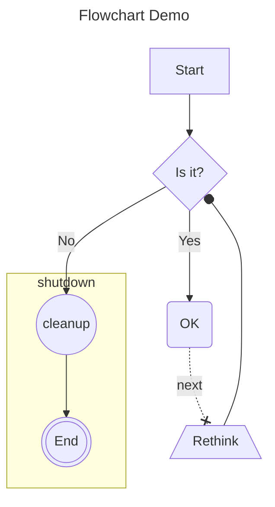
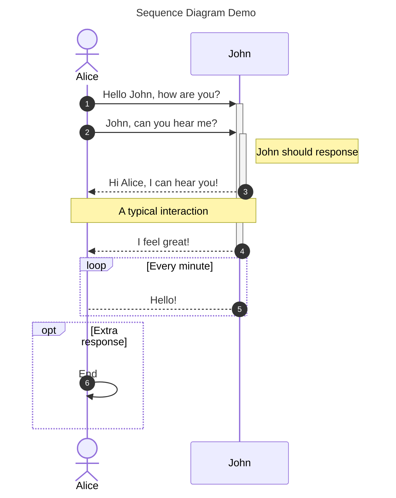
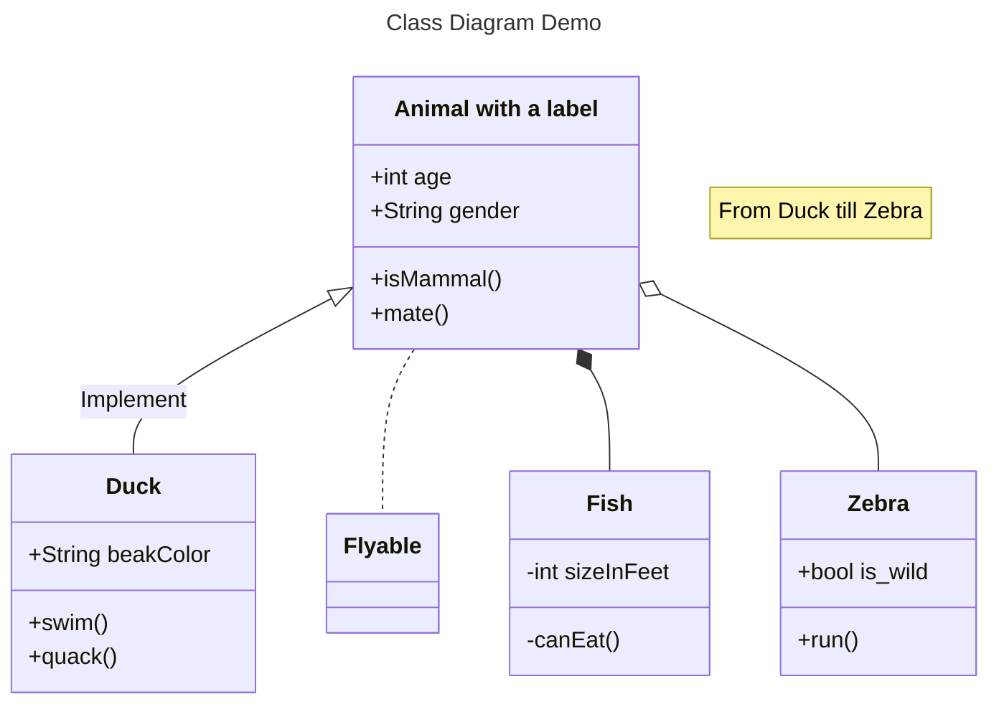
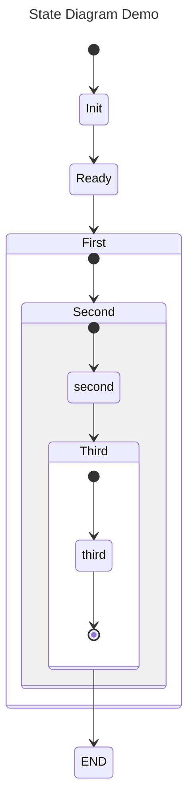
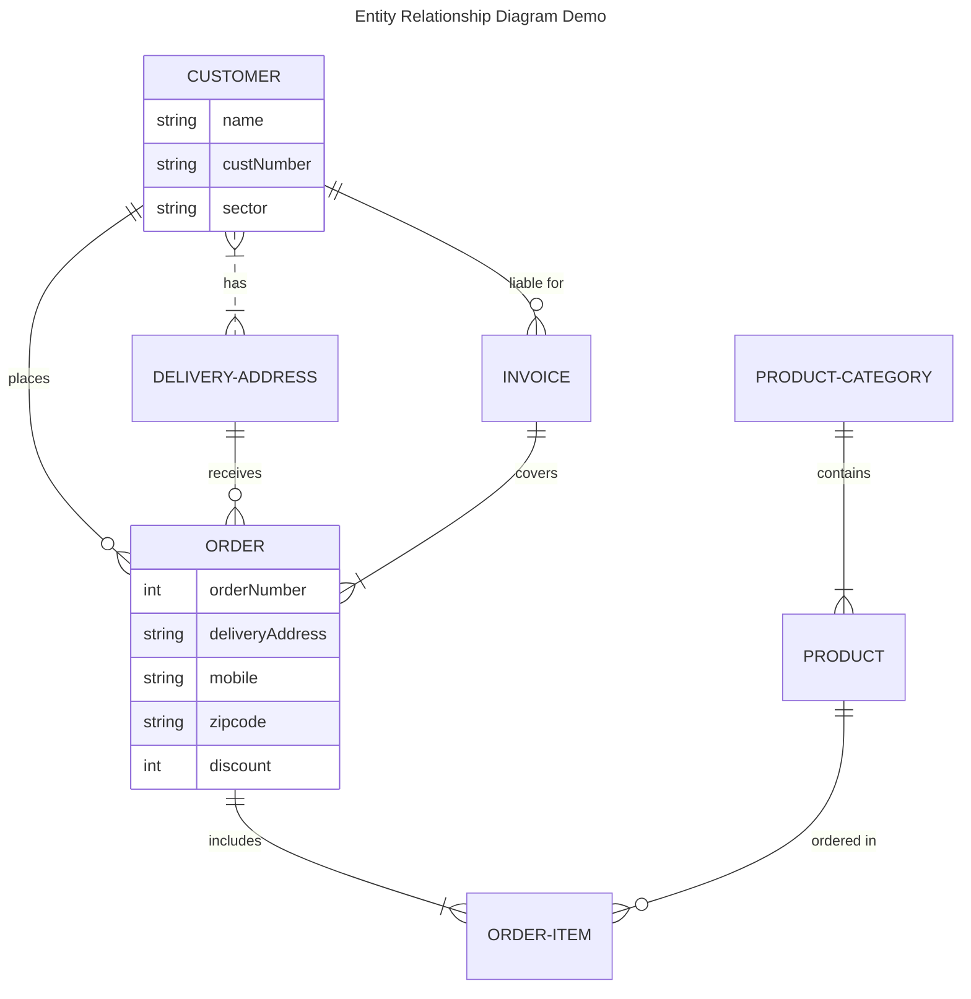
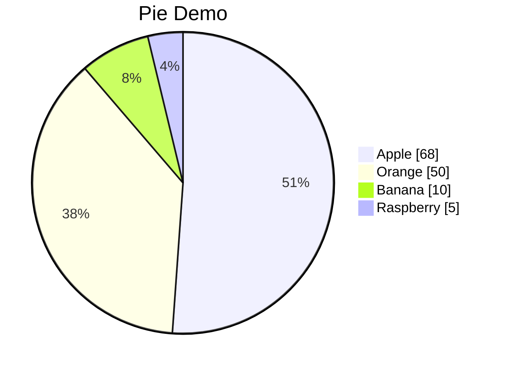
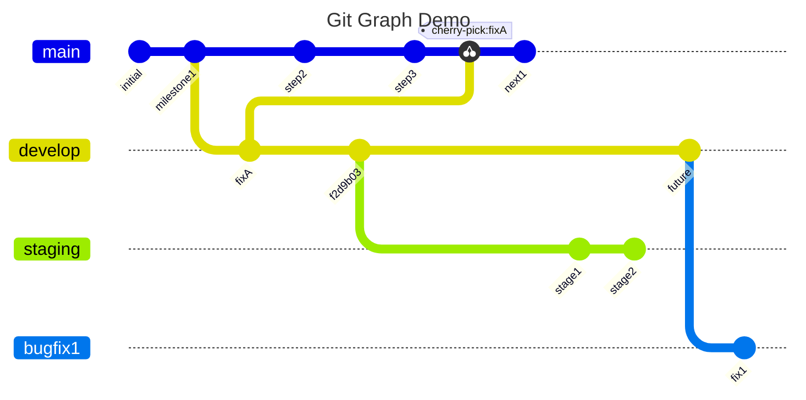
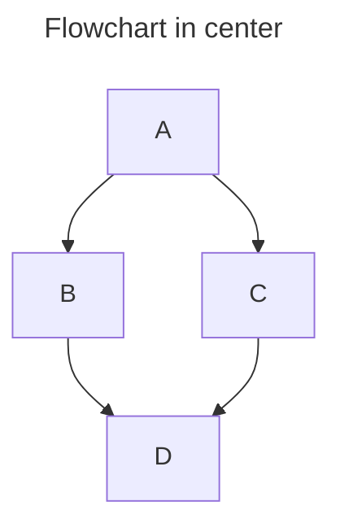

# Diagrams

You can create diagrams to convey information through charts and graphs.

## Creating Mermaid diagrams

Mermaid is a Markdown-inspired tool that renders text into diagrams. For example, Mermaid can render flow charts, sequence diagrams, pie charts and more. For more information, see the [Mermaid documentation](https://mermaid.js.org).

GitSite don't require Mermaid JavaScript on page because it pre-compile Mermaid diagrams to SVGs which are embeded into HTML.

To create a Mermaid diagram, add Mermaid syntax inside a fenced code block with the `mermaid` identifier.

```alert type=tip
It is a good practice that use [Mermaid live editor](https://mermaid.live/) to make sure your markdown text can be compiled to Mermaid diagrams successfully.
```

## Creating flow chart

You can create a flow chart by specifying values and arrows.

    ```mermaid
    ---
    title: Flowchart Demo
    ---
    flowchart TD
        A[Start] --> B{Is it?}
        B -->|Yes| C(OK)
        C -. next .-x D[/Rethink\]
        D --o B
        B -->|No| E((cleanup))
        subgraph shutdown
            E --> F(((End)))
        end
    ```



## Creating sequence diagram

A sequence diagram is an interaction diagram that shows how processes operate with one another and in what order.

    ```mermaid
    ---
    title: Sequence Diagram Demo
    ---
    sequenceDiagram
        actor Alice
        autonumber
        Alice->>+John: Hello John, how are you?
        Alice->>+John: John, can you hear me?
        Note right of John: John should response
        John-->>-Alice: Hi Alice, I can hear you!
        Note over Alice,John: A typical interaction
        John-->>-Alice: I feel great!
        loop Every minute
            John-->Alice: Hello!
        end
        opt Extra response
            Alice->>Alice: End
        end
    ```



## Creating class diagram

The class diagram is the main building block of object-oriented modeling.

    ```mermaid
    ---
    title: Class Diagram Demo
    ---
    classDiagram
        class Animal["Animal with a label"]
        note "From Duck till Zebra"
        Animal <|-- Duck : Implement
        Animal .. Flyable
        Animal *-- Fish
        Animal o-- Zebra
        Animal : +int age
        Animal : +String gender
        Animal: +isMammal()
        Animal: +mate()
        class Duck{
        +String beakColor
        +swim()
        +quack()
        }
        class Fish{
        -int sizeInFeet
        -canEat()
        }
        class Zebra{
        +bool is_wild
        +run()
        }
    ```



## Creating state diagram

A state diagram is a type of diagram used in computer science and related fields to describe the behavior of systems.

    ```mermaid
    ---
    title: State Diagram Demo
    ---
    stateDiagram-v2
        [*] --> Init
        Init --> Ready
        Ready --> First
        state First {
            [*] --> Second

            state Second {
                [*] --> second
                second --> Third

                state Third {
                    [*] --> third
                    third --> [*]
                }
            }
        }
        Third --> END
    ```



## Creating entity relationship diagram

An entity relationship model (or ER model) describes interrelated things of interest in a specific domain of knowledge.

    ```mermaid
    ---
    title: Entity Relationship Diagram Demo
    ---
    erDiagram
        CUSTOMER {
            string name
            string custNumber
            string sector
        }
        ORDER {
            int orderNumber
            string deliveryAddress
            string mobile
            string zipcode
            int discount
        }
        CUSTOMER }|..|{ DELIVERY-ADDRESS : has
        CUSTOMER ||--o{ ORDER : places
        CUSTOMER ||--o{ INVOICE : "liable for"
        DELIVERY-ADDRESS ||--o{ ORDER : receives
        INVOICE ||--|{ ORDER : covers
        ORDER ||--|{ ORDER-ITEM : includes
        PRODUCT-CATEGORY ||--|{ PRODUCT : contains
        PRODUCT ||--o{ ORDER-ITEM : "ordered in"
    ```



## Creating pie chart

A pie chart is a circular statistical graphic, which is divided into slices to illustrate numerical proportion.

    ```mermaid
    pie showData
        title Pie Demo
        "Apple" : 68
        "Orange" : 50
        "Banana" : 10
        "Raspberry" : 5
    ```



## Creating git graph

A Git Graph is a pictorial representation of git commits and git actions on various branches.

    ```mermaid
    ---
    title: Git Graph Demo
    ---
    gitGraph
        commit id: "initial"
        commit id: "milestone1"
        branch develop
        commit id:"fixA"
        checkout main
        commit id:"step2"
        checkout develop
        commit id:"f2d9b03"
        checkout main
        commit id:"step3"
        cherry-pick id:"fixA"
        commit id:"next1"
        checkout develop
        branch staging
        commit id:"stage1"
        commit id:"stage2"
        checkout develop
        commit id:"future"
        branch bugfix1
        commit id:"fix1"
    ```



## Alignment

To align a Mermaid diagram, add `align=left`, `align=center` or `align=right` after the `mermaid` identifier:

    ```mermaid align=center
    ---
    title: Flowchart in center
    ---
    graph TD;
        A-->B;
        A-->C;
        B-->D;
        C-->D;
    ```


