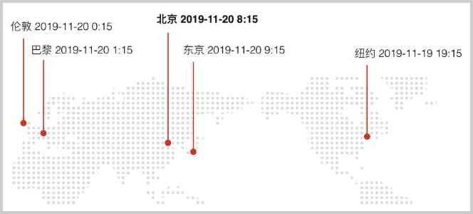
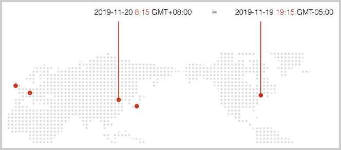
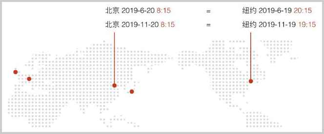

# 基本概念

在计算机中，我们经常需要处理日期和时间。

这是日期：

- 2019-11-20
- 2020-1-1

这是时间：

- 12:30:59
- 2020-1-1 20:21:59

日期是指某一天，它不是连续变化的，而是应该被看成离散的。

而时间有两种概念，一种是不带日期的时间，例如，12:30:59。另一种是带日期的时间，例如，2020-1-1 20:21:59，只有这种带日期的时间能唯一确定某个时刻，不带日期的时间是无法确定一个唯一时刻的。

### 本地时间

当我们说当前时刻是2019年11月20日早上8:15的时候，我们说的实际上是本地时间。在国内就是北京时间。在这个时刻，如果地球上不同地方的人们同时看一眼手表，他们各自的本地时间是不同的：



所以，不同的时区，在同一时刻，本地时间是不同的。全球一共分为24个时区，伦敦所在的时区称为标准时区，其他时区按东／西偏移的小时区分，北京所在的时区是东八区。

### 时区

因为光靠本地时间还无法唯一确定一个准确的时刻，所以我们还需要给本地时间加上一个时区。时区有好几种表示方式。

一种是以`GMT`或者`UTC`加时区偏移表示，例如：`GMT+08:00`或者`UTC+08:00`表示东八区。

`GMT`和`UTC`可以认为基本是等价的，只是`UTC`使用更精确的原子钟计时，每隔几年会有一个闰秒，我们在开发程序的时候可以忽略两者的误差，因为计算机的时钟在联网的时候会自动与时间服务器同步时间。

另一种是缩写，例如，`CST`表示`China Standard Time`，也就是中国标准时间。但是`CST`也可以表示美国中部时间`Central Standard Time USA`，因此，缩写容易产生混淆，我们尽量不要使用缩写。

最后一种是以洲／城市表示，例如，`Asia/Shanghai`，表示上海所在地的时区。特别注意城市名称不是任意的城市，而是由国际标准组织规定的城市。

因为时区的存在，东八区的2019年11月20日早上8:15，和西五区的2019年11月19日晚上19:15，他们的时刻是相同的：



时刻相同的意思就是，分别在两个时区的两个人，如果在这一刻通电话，他们各自报出自己手表上的时间，虽然本地时间是不同的，但是这两个时间表示的时刻是相同的。

### 夏令时

时区还不是最复杂的，更复杂的是夏令时。所谓夏令时，就是夏天开始的时候，把时间往后拨1小时，夏天结束的时候，再把时间往前拨1小时。我们国家实行过一段时间夏令时，1992年就废除了，但是矫情的美国人到现在还在使用，所以时间换算更加复杂。



因为涉及到夏令时，相同的时区，如果表示的方式不同，转换出的时间是不同的。我们举个栗子：

对于2019-11-20和2019-6-20两个日期来说，假设北京人在纽约：

- 如果以`GMT`或者`UTC`作为时区，无论日期是多少，时间都是`19:00`；
- 如果以国家／城市表示，例如`America／NewYork`，虽然纽约也在西五区，但是，因为夏令时的存在，在不同的日期，`GMT`时间和纽约时间可能是不一样的：

| 时区  | 2019-11-20 | 2019-6-20 |
|------|--------------|-------------|
| GMT-05:00 | 19:00 | 19:00 |
| UTC-05:00 | 19:00 | 19:00 |
| America/New_York | 19:00 | 20:00 |

实行夏令时的不同地区，进入和退出夏令时的时间很可能是不同的。同一个地区，根据历史上是否实行过夏令时，标准时间在不同年份换算成当地时间也是不同的。因此，计算夏令时，没有统一的公式，必须按照一组给定的规则来算，并且，该规则要定期更新。

```alert type=warning title=注意
计算夏令时请使用标准库提供的相关类，不要试图自己计算夏令时。
```

### 本地化

在计算机中，通常使用`Locale`表示一个国家或地区的日期、时间、数字、货币等格式。`Locale`由`语言_国家`的字母缩写构成，例如，`zh_CN`表示中文+中国，`en_US`表示英文+美国。语言使用小写，国家使用大写。

对于日期来说，不同的Locale，例如，中国和美国的表示方式如下：

- zh_CN：2016-11-30
- en_US：11/30/2016

计算机用`Locale`在日期、时间、货币和字符串之间进行转换。一个电商网站会根据用户所在的`Locale`对用户显示如下：

|             | 中国用户 | 美国用户 |
|------------|-----------|---------|
| 购买价格  | 12000.00     | 12,000.00 |
| 购买日期  | 2016-11-30 | 11/30/2016 |

### 小结

在编写日期和时间的程序前，我们要准确理解日期、时间和时刻的概念；

由于存在本地时间，我们需要理解时区的概念，并且必须牢记由于夏令时的存在，同一地区用`GMT/UTC`和城市表示的时区可能导致时间不同；

计算机通过`Locale`来针对当地用户习惯格式化日期、时间、数字、货币等。
