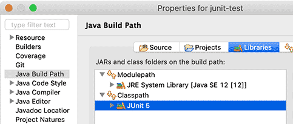
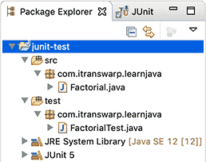
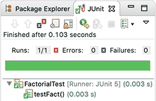
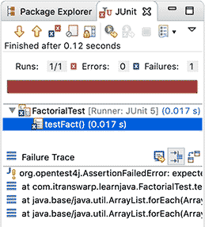

# 编写JUnit测试

什么是单元测试呢？单元测试就是针对最小的功能单元编写测试代码。Java程序最小的功能单元是方法，因此，对Java程序进行单元测试就是针对单个Java方法的测试。

单元测试有什么好处呢？在学习单元测试前，我们可以先了解一下测试驱动开发。

所谓测试驱动开发，是指先编写接口，紧接着编写测试。编写完测试后，我们才开始真正编写实现代码。在编写实现代码的过程中，一边写，一边测，什么时候测试全部通过了，那就表示编写的实现完成了：

```ascii
    编写接口
     │
     ▼
    编写测试
     │
     ▼
┌─▶ 编写实现
│    │
│ N  ▼
└── 运行测试
     │ Y
     ▼
    任务完成
```

这就是传说中的……


当然，这是一种理想情况。大部分情况是我们已经编写了实现代码，需要对已有的代码进行测试。

我们先通过一个示例来看如何编写测试。假定我们编写了一个计算阶乘的类，它只有一个静态方法来计算阶乘：

```math
n!=1\times2\times3\times...\times n
```

代码如下：

```java
public class Factorial {
    public static long fact(long n) {
        long r = 1;
        for (long i = 1; i <= n; i++) {
            r = r * i;
        }
        return r;
    }
}
```

要测试这个方法，一个很自然的想法是编写一个`main()`方法，然后运行一些测试代码：

```java
public class Test {
    public static void main(String[] args) {
        if (fact(10) == 3628800) {
            System.out.println("pass");
        } else {
            System.out.println("fail");
        }
    }
}
```

这样我们就可以通过运行`main()`方法来运行测试代码。

不过，使用`main()`方法测试有很多缺点：

一是只能有一个`main()`方法，不能把测试代码分离，二是没有打印出测试结果和期望结果，例如，`expected: 3628800, but actual: 123456`，三是很难编写一组通用的测试代码。

因此，我们需要一种测试框架，帮助我们编写测试。

### JUnit

JUnit是一个开源的Java语言的单元测试框架，专门针对Java设计，使用最广泛。JUnit是事实上的单元测试的标准框架，任何Java开发者都应当学习并使用JUnit编写单元测试。

使用JUnit编写单元测试的好处在于，我们可以非常简单地组织测试代码，并随时运行它们，JUnit就会给出成功的测试和失败的测试，还可以生成测试报告，不仅包含测试的成功率，还可以统计测试的代码覆盖率，即被测试的代码本身有多少经过了测试。对于高质量的代码来说，测试覆盖率应该在80%以上。

此外，几乎所有的IDE工具都集成了JUnit，这样我们就可以直接在IDE中编写并运行JUnit测试。JUnit目前最新版本是5。

以Eclipse为例，当我们已经编写了一个`Factorial.java`文件后，我们想对其进行测试，需要编写一个对应的`FactorialTest.java`文件，以`Test`为后缀是一个惯例，并分别将其放入`src`和`test`目录中。最后，在`Project` - `Properties` - `Java Build Path` - `Libraries`中添加`JUnit 5`的库：



整个项目结构如下：



我们来看一下`FactorialTest.java`的内容：

```java
package com.itranswarp.learnjava;

import static org.junit.jupiter.api.Assertions.*;
import org.junit.jupiter.api.Test;

public class FactorialTest {

    @Test
    void testFact() {
        assertEquals(1, Factorial.fact(1));
        assertEquals(2, Factorial.fact(2));
        assertEquals(6, Factorial.fact(3));
        assertEquals(3628800, Factorial.fact(10));
        assertEquals(2432902008176640000L, Factorial.fact(20));
    }
}
```

核心测试方法`testFact()`加上了`@Test`注解，这是JUnit要求的，它会把带有`@Test`的方法识别为测试方法。在测试方法内部，我们用`assertEquals(1, Factorial.fact(1))`表示，期望`Factorial.fact(1)`返回`1`。`assertEquals(expected, actual)`是最常用的测试方法，它在`Assertion`类中定义。`Assertion`还定义了其他断言方法，例如：

- `assertTrue()`: 期待结果为`true`
- `assertFalse()`: 期待结果为`false`
- `assertNotNull()`: 期待结果为非`null`
- `assertArrayEquals()`: 期待结果为数组并与期望数组每个元素的值均相等
- ...

运行单元测试非常简单。选中`FactorialTest.java`文件，点击`Run` - `Run As` - `JUnit Test`，Eclipse会自动运行这个JUnit测试，并显示结果：



如果测试结果与预期不符，`assertEquals()`会抛出异常，我们就会得到一个测试失败的结果：



在Failure Trace中，JUnit会告诉我们详细的错误结果：

```plain
org.opentest4j.AssertionFailedError: expected: <3628800> but was: <362880>
	at org.junit.jupiter.api.AssertionUtils.fail(AssertionUtils.java:55)
	at org.junit.jupiter.api.AssertEquals.failNotEqual(AssertEquals.java:195)
	at org.junit.jupiter.api.AssertEquals.assertEquals(AssertEquals.java:168)
	at org.junit.jupiter.api.AssertEquals.assertEquals(AssertEquals.java:163)
	at org.junit.jupiter.api.Assertions.assertEquals(Assertions.java:611)
	at com.itranswarp.learnjava.FactorialTest.testFact(FactorialTest.java:14)
	at java.base/jdk.internal.reflect.NativeMethodAccessorImpl.invoke0(Native Method)
	at ...
```

第一行的失败信息的意思是期待结果`3628800`但是实际返回是`362880`，此时，我们要么修正实现代码，要么修正测试代码，直到测试通过为止。

使用浮点数时，由于浮点数无法精确地进行比较，因此，我们需要调用`assertEquals(double expected, double actual, double delta)`这个重载方法，指定一个误差值：

```java
assertEquals(0.1, Math.abs(1 - 9 / 10.0), 0.0000001);
```

### 单元测试的好处

单元测试可以确保单个方法按照正确预期运行，如果修改了某个方法的代码，只需确保其对应的单元测试通过，即可认为改动正确。此外，测试代码本身就可以作为示例代码，用来演示如何调用该方法。

使用JUnit进行单元测试，我们可以使用断言（`Assertion`）来测试期望结果，可以方便地组织和运行测试，并方便地查看测试结果。此外，JUnit既可以直接在IDE中运行，也可以方便地集成到Maven这些自动化工具中运行。

在编写单元测试的时候，我们要遵循一定的规范：

一是单元测试代码本身必须非常简单，能一下看明白，决不能再为测试代码编写测试；

二是每个单元测试应当互相独立，不依赖运行的顺序；

三是测试时不但要覆盖常用测试用例，还要特别注意测试边界条件，例如输入为`0`，`null`，空字符串`""`等情况。

### 练习

使用JUnit编写测试代码。

[下载练习](junit-test.zip)

### 小结

JUnit是一个单元测试框架，专门用于运行我们编写的单元测试：

一个JUnit测试包含若干`@Test`方法，并使用`Assertions`进行断言，注意浮点数`assertEquals()`要指定`delta`。
