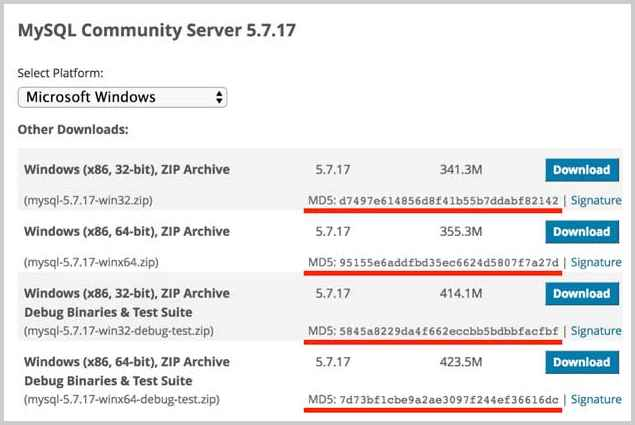

# 哈希算法

哈希算法（Hash）又称摘要算法（Digest），它的作用是：对任意一组输入数据进行计算，得到一个固定长度的输出摘要。

哈希算法最重要的特点就是：

- 相同的输入一定得到相同的输出；
- 不同的输入大概率得到不同的输出。

哈希算法的目的就是为了验证原始数据是否被篡改。

Java字符串的`hashCode()`就是一个哈希算法，它的输入是任意字符串，输出是固定的4字节`int`整数：

```java
"hello".hashCode(); // 0x5e918d2
"hello, java".hashCode(); // 0x7a9d88e8
"hello, bob".hashCode(); // 0xa0dbae2f
```

两个相同的字符串永远会计算出相同的`hashCode`，否则基于`hashCode`定位的`HashMap`就无法正常工作。这也是为什么当我们自定义一个class时，覆写`equals()`方法时我们必须正确覆写`hashCode()`方法。

### 哈希碰撞

哈希碰撞是指，两个不同的输入得到了相同的输出：

```java
"AaAaAa".hashCode(); // 0x7460e8c0
"BBAaBB".hashCode(); // 0x7460e8c0
```

有童鞋会问：碰撞能不能避免？答案是不能。碰撞是一定会出现的，因为输出的字节长度是固定的，`String`的`hashCode()`输出是4字节整数，最多只有4294967296种输出，但输入的数据长度是不固定的，有无数种输入。所以，哈希算法是把一个无限的输入集合映射到一个有限的输出集合，必然会产生碰撞。

碰撞不可怕，我们担心的不是碰撞，而是碰撞的概率，因为碰撞概率的高低关系到哈希算法的安全性。一个安全的哈希算法必须满足：

- 碰撞概率低；
- 不能猜测输出。

不能猜测输出是指，输入的任意一个bit的变化会造成输出完全不同，这样就很难从输出反推输入（只能依靠暴力穷举）。假设一种哈希算法有如下规律：

```plain
hashA("java001") = "123456"
hashA("java002") = "123457"
hashA("java003") = "123458"
```

那么很容易从输出`123459`反推输入，这种哈希算法就不安全。安全的哈希算法从输出是看不出任何规律的：

```plain
hashB("java001") = "123456"
hashB("java002") = "580271"
hashB("java003") = ???
```

常用的哈希算法有：

| 算法 | 输出长度（位） | 输出长度（字节） |
|------------|----------|----------|
| MD5        | 128 bits | 16 bytes |
| SHA-1      | 160 bits | 20 bytes |
| RipeMD-160 | 160 bits | 20 bytes |
| SHA-256    | 256 bits | 32 bytes |
| SHA-512    | 512 bits | 64 bytes |

根据碰撞概率，哈希算法的输出长度越长，就越难产生碰撞，也就越安全。

Java标准库提供了常用的哈希算法，并且有一套统一的接口。我们以MD5算法为例，看看如何对输入计算哈希：

```java
import java.security.MessageDigest;
import java.util.HexFormat;

public class Main {
    public static void main(String[] args) throws Exception {
        // 创建一个MessageDigest实例:
        MessageDigest md = MessageDigest.getInstance("MD5");
        // 反复调用update输入数据:
        md.update("Hello".getBytes("UTF-8"));
        md.update("World".getBytes("UTF-8"));
        byte[] result = md.digest(); // 16 bytes: 68e109f0f40ca72a15e05cc22786f8e6
        System.out.println(HexFormat.of().formatHex(result));
    }
}
```

使用`MessageDigest`时，我们首先根据哈希算法获取一个`MessageDigest`实例，然后，反复调用`update(byte[])`输入数据。当输入结束后，调用`digest()`方法获得byte[]数组表示的摘要，最后，把它转换为十六进制的字符串。

运行上述代码，可以得到输入`HelloWorld`的MD5是`68e109f0f40ca72a15e05cc22786f8e6`。

### 哈希算法的用途

因为相同的输入永远会得到相同的输出，因此，如果输入被修改了，得到的输出就会不同。

我们在网站上下载软件的时候，经常看到下载页显示的哈希：



如何判断下载到本地的软件是原始的、未经篡改的文件？我们只需要自己计算一下本地文件的哈希值，再与官网公开的哈希值对比，如果相同，说明文件下载正确，否则，说明文件已被篡改。

哈希算法的另一个重要用途是存储用户口令。如果直接将用户的原始口令存放到数据库中，会产生极大的安全风险：

- 数据库管理员能够看到用户明文口令；
- 数据库数据一旦泄漏，黑客即可获取用户明文口令。

不存储用户的原始口令，那么如何对用户进行认证？

方法是存储用户口令的哈希，例如，MD5。

在用户输入原始口令后，系统计算用户输入的原始口令的MD5并与数据库存储的MD5对比，如果一致，说明口令正确，否则，口令错误。

因此，数据库存储用户名和口令的表内容应该像下面这样：

| username | password                         |
|----------|----------------------------------|
| bob      | f30aa7a662c728b7407c54ae6bfd27d1 |
| alice    | 25d55ad283aa400af464c76d713c07ad |
| tim      | bed128365216c019988915ed3add75fb |

这样一来，数据库管理员看不到用户的原始口令。即使数据库泄漏，黑客也无法拿到用户的原始口令。想要拿到用户的原始口令，必须用暴力穷举的方法，一个口令一个口令地试，直到某个口令计算的MD5恰好等于指定值。

使用哈希口令时，还要注意防止彩虹表攻击。

什么是彩虹表？难道是这个：


上面讲到了，如果只拿到MD5，从MD5反推明文口令，只能使用暴力穷举的方法。

然而黑客并不笨，暴力穷举会消耗大量的算力和时间。但是，如果有一个预先计算好的常用口令和它们的MD5的对照表：

| 常用口令  | MD5                              |
|----------|----------------------------------|
| hello123 | f30aa7a662c728b7407c54ae6bfd27d1 |
| 12345678 | 25d55ad283aa400af464c76d713c07ad |
| passw0rd | bed128365216c019988915ed3add75fb |
| 19700101 | 570da6d5277a646f6552b8832012f5dc |
| …        | …                                |
| 20201231 | 6879c0ae9117b50074ce0a0d4c843060 |

这个表就是彩虹表。如果用户使用了常用口令，黑客从MD5一下就能反查到原始口令：

bob的MD5：`f30aa7a662c728b7407c54ae6bfd27d1`，原始口令：`hello123`；

alice的MD5：`25d55ad283aa400af464c76d713c07ad`，原始口令：`12345678`；

tim的MD5：`bed128365216c019988915ed3add75fb`，原始口令：`passw0rd`。

这就是为什么不要使用常用密码，以及不要使用生日作为密码的原因。

即使用户使用了常用口令，我们也可以采取措施来抵御彩虹表攻击，方法是对每个口令额外添加随机数，这个方法称之为加盐（salt）：

```plain
digest = md5(salt+inputPassword)
```

经过加盐处理的数据库表，内容如下：

| username | salt  | password                         |
|----------|-------|----------------------------------|
| bob      | H1r0a | a5022319ff4c56955e22a74abcc2c210 |
| alice    | 7$p2w | e5de688c99e961ed6e560b972dab8b6a |
| tim      | z5Sk9 | 1eee304b92dc0d105904e7ab58fd2f64 |

加盐的目的在于使黑客的彩虹表失效，即使用户使用常用口令，也无法从MD5反推原始口令。

### SHA-1

SHA-1也是一种哈希算法，它的输出是160 bits，即20字节。SHA-1是由美国国家安全局开发的，SHA算法实际上是一个系列，包括SHA-0（已废弃）、SHA-1、SHA-256、SHA-512等。

在Java中使用SHA-1，和MD5完全一样，只需要把算法名称改为`"SHA-1"`：

```java
import java.security.MessageDigest;
import java.util.HexFormat;

public class Main {
    public static void main(String[] args) throws Exception {
        // 创建一个MessageDigest实例:
        MessageDigest md = MessageDigest.getInstance("SHA-1");
        // 反复调用update输入数据:
        md.update("Hello".getBytes("UTF-8"));
        md.update("World".getBytes("UTF-8"));
        byte[] result = md.digest(); // 20 bytes: db8ac1c259eb89d4a131b253bacfca5f319d54f2
        System.out.println(HexFormat.of().formatHex(result));
    }
}
```

类似的，计算SHA-256，我们需要传入名称`"SHA-256"`，计算SHA-512，我们需要传入名称`"SHA-512"`。Java标准库支持的所有哈希算法可以在[这里](https://docs.oracle.com/en/java/javase/21/docs/specs/security/standard-names.html#messagedigest-algorithms)查到。

```alert type=warning title=注意
MD5因为输出长度较短，短时间内破解是可能的，目前已经不推荐使用。
```

### 小结

哈希算法可用于验证数据完整性，具有防篡改检测的功能；

常用的哈希算法有MD5、SHA-1等；

用哈希存储口令时要考虑彩虹表攻击。
