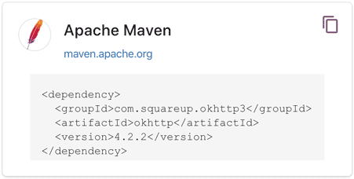
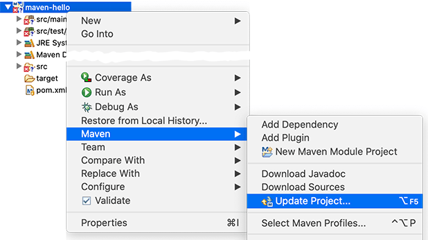

# 依赖管理

如果我们的项目依赖第三方的jar包，例如commons logging，那么问题来了：commons logging发布的jar包在哪下载？

如果我们还希望依赖log4j，那么使用log4j需要哪些jar包？

类似的依赖还包括：JUnit，JavaMail，MySQL驱动等等，一个可行的方法是通过搜索引擎搜索到项目的官网，然后手动下载zip包，解压，放入classpath。但是，这个过程非常繁琐。

Maven解决了依赖管理问题。例如，我们的项目依赖`abc`这个jar包，而`abc`又依赖`xyz`这个jar包：

```ascii
┌──────────────┐
│Sample Project│
└──────────────┘
        │
        ▼
┌──────────────┐
│     abc      │
└──────────────┘
        │
        ▼
┌──────────────┐
│     xyz      │
└──────────────┘
```

当我们声明了`abc`的依赖时，Maven自动把`abc`和`xyz`都加入了我们的项目依赖，不需要我们自己去研究`abc`是否需要依赖`xyz`。

因此，Maven的第一个作用就是解决依赖管理。我们声明了自己的项目需要`abc`，Maven会自动导入`abc`的jar包，再判断出`abc`需要`xyz`，又会自动导入`xyz`的jar包，这样，最终我们的项目会依赖`abc`和`xyz`两个jar包。

我们来看一个复杂依赖示例：

```xml
<dependency>
    <groupId>org.springframework.boot</groupId>
    <artifactId>spring-boot-starter-web</artifactId>
    <version>1.4.2.RELEASE</version>
</dependency>
```

当我们声明一个`spring-boot-starter-web`依赖时，Maven会自动解析并判断最终需要大概二三十个其他依赖：

```ascii
spring-boot-starter-web
  spring-boot-starter
    spring-boot
    sprint-boot-autoconfigure
    spring-boot-starter-logging
      logback-classic
        logback-core
        slf4j-api
      jcl-over-slf4j
        slf4j-api
      jul-to-slf4j
        slf4j-api
      log4j-over-slf4j
        slf4j-api
    spring-core
    snakeyaml
  spring-boot-starter-tomcat
    tomcat-embed-core
    tomcat-embed-el
    tomcat-embed-websocket
      tomcat-embed-core
  jackson-databind
  ...
```

如果我们自己去手动管理这些依赖是非常费时费力的，而且出错的概率很大。

### 依赖关系

Maven定义了几种依赖关系，分别是`compile`、`test`、`runtime`和`provided`：

| scope    | 说明 | 示例 |
|----------|---------------------------------------|-----------------|
| compile  | 编译时需要用到该jar包（默认）              | commons-logging |
| test     | 编译Test时需要用到该jar包                 | junit |
| runtime  | 编译时不需要，但运行时需要用到              | mysql |
| provided | 编译时需要用到，但运行时由JDK或某个服务器提供 | servlet-api |

其中，默认的`compile`是最常用的，Maven会把这种类型的依赖直接放入classpath。

`test`依赖表示仅在测试时使用，正常运行时并不需要。最常用的`test`依赖就是JUnit：

```xml
<dependency>
    <groupId>org.junit.jupiter</groupId>
    <artifactId>junit-jupiter-api</artifactId>
    <version>5.3.2</version>
    <scope>test</scope>
</dependency>
```

`runtime`依赖表示编译时不需要，但运行时需要。最典型的`runtime`依赖是JDBC驱动，例如MySQL驱动：

```xml
<dependency>
    <groupId>mysql</groupId>
    <artifactId>mysql-connector-java</artifactId>
    <version>5.1.48</version>
    <scope>runtime</scope>
</dependency>
```

`provided`依赖表示编译时需要，但运行时不需要。最典型的`provided`依赖是Servlet API，编译的时候需要，但是运行时，Servlet服务器内置了相关的jar，所以运行期不需要：

```xml
<dependency>
    <groupId>jakarta.servlet</groupId>
    <artifactId>jakarta.servlet-api</artifactId>
    <version>4.0.0</version>
    <scope>provided</scope>
</dependency>
```

最后一个问题是，Maven如何知道从何处下载所需的依赖？也就是相关的jar包？答案是Maven维护了一个中央仓库（[repo1.maven.org](https://repo1.maven.org/)），所有第三方库将自身的jar以及相关信息上传至中央仓库，Maven就可以从中央仓库把所需依赖下载到本地。

Maven并不会每次都从中央仓库下载jar包。一个jar包一旦被下载过，就会被Maven自动缓存在本地目录（用户主目录的`.m2`目录），所以，除了第一次编译时因为下载需要时间会比较慢，后续过程因为有本地缓存，并不会重复下载相同的jar包。

### 唯一ID

对于某个依赖，Maven只需要3个变量即可唯一确定某个jar包：

- groupId：属于组织的名称，类似Java的包名；
- artifactId：该jar包自身的名称，类似Java的类名；
- version：该jar包的版本。

通过上述3个变量，即可唯一确定某个jar包。Maven通过对jar包进行PGP签名确保任何一个jar包一经发布就无法修改。修改已发布jar包的唯一方法是发布一个新版本。

因此，某个jar包一旦被Maven下载过，即可永久地安全缓存在本地。

注：只有以`-SNAPSHOT`结尾的版本号会被Maven视为开发版本，开发版本每次都会重复下载，这种SNAPSHOT版本只能用于内部私有的Maven repo，公开发布的版本不允许出现SNAPSHOT。

```alert type=tip title=提示
后续我们在表示Maven依赖时，使用简写形式groupId:artifactId:version，例如：org.slf4j:slf4j-api:2.0.4。
```

### Maven镜像

除了可以从Maven的中央仓库下载外，还可以从Maven的镜像仓库下载。如果访问Maven的中央仓库非常慢，我们可以选择一个速度较快的Maven的镜像仓库。Maven镜像仓库定期从中央仓库同步：

```ascii
           slow    ┌───────────────────┐
    ┌─────────────▶│Maven Central Repo.│
    │              └───────────────────┘
    │                        │
    │                        │sync
    │                        ▼
┌───────┐  fast    ┌───────────────────┐
│ User  │─────────▶│Maven Mirror Repo. │
└───────┘          └───────────────────┘
```

中国区用户可以使用阿里云提供的Maven镜像仓库。使用Maven镜像仓库需要一个配置，在用户主目录下进入`.m2`目录，创建一个`settings.xml`配置文件，内容如下：

```xml
<settings>
    <mirrors>
        <mirror>
            <id>aliyun</id>
            <name>aliyun</name>
            <mirrorOf>central</mirrorOf>
            <!-- 国内推荐阿里云的Maven镜像 -->
            <url>https://maven.aliyun.com/repository/central</url>
        </mirror>
    </mirrors>
</settings>
```

配置镜像仓库后，Maven的下载速度就会非常快。

### 搜索第三方组件

最后一个问题：如果我们要引用一个第三方组件，比如`okhttp`，如何确切地获得它的`groupId`、`artifactId`和`version`？方法是通过[search.maven.org](https://search.maven.org/)搜索关键字，找到对应的组件后，直接复制：



### 命令行编译

在命令中，进入到`pom.xml`所在目录，输入以下命令：

```plain
$ mvn clean package
```

如果一切顺利，即可在`target`目录下获得编译后自动打包的jar。

### 在IDE中使用Maven

几乎所有的IDE都内置了对Maven的支持。在Eclipse中，可以直接创建或导入Maven项目。如果导入后的Maven项目有错误，可以尝试选择项目后点击右键，选择Maven - Update Project...更新：



### 练习

使用Maven编译hello项目。

[下载练习](maven-hello.zip)

### 小结

Maven通过解析依赖关系确定项目所需的jar包，常用的4种`scope`有：`compile`（默认），`test`，`runtime`和`provided`；

Maven从中央仓库下载所需的jar包并缓存在本地；

可以通过镜像仓库加速下载。
