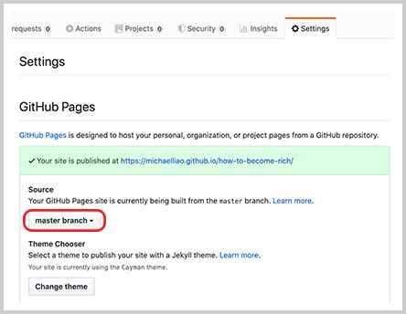
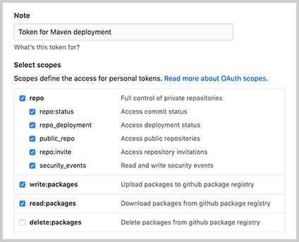
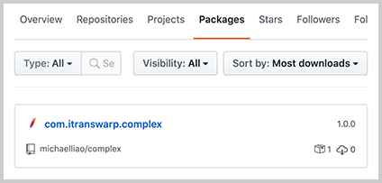

# 发布Artifact

当我们使用`commons-logging`这些第三方开源库的时候，我们实际上是通过Maven自动下载它的jar包，并根据其`pom.xml`解析依赖，自动把相关依赖包都下载后加入到classpath。

那么问题来了：当我们自己写了一个牛逼的开源库时，非常希望别人也能使用，总不能直接放个jar包的链接让别人下载吧？

如果我们把自己的开源库放到Maven的repo中，那么，别人只需按标准引用`groupId:artifactId:version`，即可自动下载jar包以及相关依赖。因此，本节我们介绍如何发布一个库到Maven的repo中。

把自己的库发布到Maven的repo中有好几种方法，我们介绍3种最常用的方法。

### 以静态文件发布

如果我们观察一个中央仓库的Artifact结构，例如[Commons Math](https://commons.apache.org/proper/commons-math/)，它的groupId是`org.apache.commons`，artifactId是`commons-math3`，以版本`3.6.1`为例，发布在中央仓库的文件夹路径就是[https://repo1.maven.org/maven2/org/apache/commons/commons-math3/3.6.1/](https://repo1.maven.org/maven2/org/apache/commons/commons-math3/3.6.1/)，在此文件夹下，`commons-math3-3.6.1.jar`就是发布的jar包，`commons-math3-3.6.1.pom`就是它的`pom.xml`描述文件，`commons-math3-3.6.1-sources.jar`是源代码，`commons-math3-3.6.1-javadoc.jar`是文档。其它以`.asc`、`.md5`、`.sha1`结尾的文件分别是GPG签名、MD5摘要和SHA-1摘要。

我们只要按照这种目录结构组织文件，它就是一个有效的Maven仓库。

我们以广受好评的开源项目[how-to-become-rich](https://github.com/michaelliao/how-to-become-rich)为例，先创建Maven工程目录结构如下：

```ascii
how-to-become-rich
├── maven-repo        <-- Maven本地文件仓库
├── pom.xml           <-- 项目文件
├── src
│   ├── main
│   │   ├── java      <-- 源码目录
│   │   └── resources <-- 资源目录
│   └── test
│       ├── java      <-- 测试源码目录
│       └── resources <-- 测试资源目录
└── target            <-- 编译输出目录
```

在`pom.xml`中添加如下内容：

```xml
<project ...>
    ...
    <distributionManagement>
        <repository>
            <id>local-repo-release</id>
            <name>GitHub Release</name>
            <url>file://${project.basedir}/maven-repo</url>
        </repository>
    </distributionManagement>

    <build>
        <plugins>
            <plugin>
                <artifactId>maven-source-plugin</artifactId>
                <executions>
                    <execution>
                        <id>attach-sources</id>
                        <phase>package</phase>
                        <goals>
                            <goal>jar-no-fork</goal>
                        </goals>
                    </execution>
                </executions>
            </plugin>
            <plugin>
                <artifactId>maven-javadoc-plugin</artifactId>
                <executions>
                    <execution>
                        <id>attach-javadocs</id>
                        <phase>package</phase>
                        <goals>
                            <goal>jar</goal>
                        </goals>
                    </execution>
                </executions>
            </plugin>
        </plugins>
    </build>
</project>
```

注意到`<distributionManagement>`，它指示了发布的软件包的位置，这里的`<url>`是项目根目录下的`maven-repo`目录，在`<build>`中定义的两个插件`maven-source-plugin`和`maven-javadoc-plugin`分别用来创建源码和javadoc，如果不想发布源码，可以把对应的插件去掉。

我们直接在项目根目录下运行Maven命令`mvn clean package deploy`，如果一切顺利，我们就可以在`maven-repo`目录下找到部署后的所有文件如下：

<a class="git-explorer" href="https://github.com/michaelliao/how-to-become-rich/tree/master/maven-repo">how-to-become-rich-repo</a>

最后一步，是把这个工程推到GitHub上，并选择`Settings`-`GitHub Pages`，选择`master branch`启用Pages服务：



这样，把全部内容推送至GitHub后，即可作为静态网站访问Maven的repo，它的地址是[https://michaelliao.github.io/how-to-become-rich/maven-repo/](https://michaelliao.github.io/how-to-become-rich/maven-repo/)。版本`1.0.0`对应的jar包地址是：

```
https://michaelliao.github.io/how-to-become-rich/maven-repo/com/itranswarp/rich/how-to-become-rich/1.0.0/how-to-become-rich-1.0.0.jar
```

现在，如果其他人希望引用这个Maven包，我们可以告知如下依赖即可：

```xml
<dependency>
    <groupId>com.itranswarp.rich</groupId>
    <artifactId>how-to-become-rich</artifactId>
    <version>1.0.0</version>
</dependency>
```

但是，除了正常导入依赖外，对方还需要再添加一个`<repository>`的声明，即使用方完整的`pom.xml`如下：

```xml
<project xmlns="http://maven.apache.org/POM/4.0.0"
    xmlns:xsi="http://www.w3.org/2001/XMLSchema-instance"
    xsi:schemaLocation="http://maven.apache.org/POM/4.0.0 http://maven.apache.org/xsd/maven-4.0.0.xsd">
    <modelVersion>4.0.0</modelVersion>

    <groupId>example</groupId>
    <artifactId>how-to-become-rich-usage</artifactId>
    <version>1.0-SNAPSHOT</version>
    <packaging>jar</packaging>

    <properties>
        <maven.compiler.source>11</maven.compiler.source>
        <maven.compiler.target>11</maven.compiler.target>
        <java.version>11</java.version>
    </properties>

    <repositories>
        <repository>
            <id>github-rich-repo</id>
            <name>The Maven Repository on Github</name>
            <url>https://michaelliao.github.io/how-to-become-rich/maven-repo/</url>
        </repository>
    </repositories>

    <dependencies>
        <dependency>
            <groupId>com.itranswarp.rich</groupId>
            <artifactId>how-to-become-rich</artifactId>
            <version>1.0.0</version>
        </dependency>
    </dependencies>
</project>
```

在`<repository>`中，我们必须声明发布的Maven的repo地址，其中`<id>`和`<name>`可以任意填写，`<url>`填入GitHub Pages提供的地址+`/maven-repo/`后缀。现在，即可正常引用这个库并编写代码如下：

```java
Millionaire millionaire = new Millionaire();
System.out.println(millionaire.howToBecomeRich());
```

有的童鞋会问，为什么使用`commons-logging`等第三方库时，并不需要声明repo地址？这是因为这些库都是发布到Maven中央仓库的，发布到中央仓库后，不需要告诉Maven仓库地址，因为它知道中央仓库的地址默认是[https://repo1.maven.org/maven2/](https://repo1.maven.org/maven2/)，也可以通过`~/.m2/settings.xml`指定一个代理仓库地址以替代中央仓库来提高速度（参考[依赖管理](../20-dependency/index.html)的Maven镜像）。

因为GitHub Pages并不会把我们发布的Maven包同步到中央仓库，所以使用方必须手动添加一个我们提供的仓库地址。

此外，通过GitHub Pages发布Maven repo时需要注意一点，即不要改动已发布的版本。因为Maven的仓库是不允许修改任何版本的，对一个库进行修改的唯一方法是发布一个新版本。但是通过静态文件的方式发布repo，实际上我们是可以修改jar文件的，但最好遵守规范，不要修改已发布版本。

### 通过Nexus发布到中央仓库

有的童鞋会问，能不能把自己的开源库发布到Maven的中央仓库，这样用户就不需要声明repo地址，可以直接引用，显得更专业。

当然可以，但我们不能直接发布到Maven中央仓库，而是通过曲线救国的方式，发布到[central.sonatype.org](https://central.sonatype.org/)，它会定期自动同步到Maven的中央仓库。[Nexus](https://www.sonatype.com/nexus-repository-oss)是一个支持Maven仓库的软件，由Sonatype开发，有免费版和专业版两个版本，很多大公司内部都使用Nexus作为自己的私有Maven仓库，而这个[central.sonatype.org](https://central.sonatype.org/)相当于面向开源的一个Nexus公共服务。

所以，第一步是在[central.sonatype.org](https://central.sonatype.org/)上注册一个账号，如果注册顺利并审核通过，会得到一个登录账号，然后，通过[这个页面](https://central.sonatype.org/pages/apache-maven.html)一步一步操作就可以成功地将自己的Artifact发布到Nexus上，再耐心等待几个小时后，你的Artifact就会出现在Maven的中央仓库中。

这里简单提一下发布重点与难点：

- 必须正确创建GPG签名，Linux和Mac下推荐使用gnupg2；
- 必须在`~/.m2/settings.xml`中配置好登录用户名和口令，以及GPG口令：

```xml
<settings ...>
    ...
    <servers>
        <server>
            <id>ossrh</id>
            <username>OSSRH-USERNAME</username>
            <password>OSSRH-PASSWORD</password>
        </server>
    </servers>
    <profiles>
        <profile>
            <id>ossrh</id>
            <activation>
                <activeByDefault>true</activeByDefault>
            </activation>
            <properties>
                <gpg.executable>gpg2</gpg.executable>
                <gpg.passphrase>GPG-PASSWORD</gpg.passphrase>
            </properties>
        </profile>
    </profiles>
</settings>
```

在待发布的Artifact的`pom.xml`中添加OSS的Maven repo地址，以及`maven-jar-plugin`、`maven-source-plugin`、`maven-javadoc-plugin`、`maven-gpg-plugin`、`nexus-staging-maven-plugin`：

```xml
<project ...>
    ...
    <distributionManagement>
        <snapshotRepository>
            <id>ossrh</id>
            <url>https://oss.sonatype.org/content/repositories/snapshots</url>
        </snapshotRepository>

        <repository>
            <id>ossrh</id>
            <name>Nexus Release Repository</name>
            <url>http://oss.sonatype.org/service/local/staging/deploy/maven2/</url>
        </repository>
    </distributionManagement>

    <build>
        <plugins>
            <plugin>
                <groupId>org.apache.maven.plugins</groupId>
                <artifactId>maven-jar-plugin</artifactId>
                <executions>
                    <execution>
                        <goals>
                            <goal>jar</goal>
                            <goal>test-jar</goal>
                        </goals>
                    </execution>
                </executions>
            </plugin>
            <plugin>
                <groupId>org.apache.maven.plugins</groupId>
                <artifactId>maven-source-plugin</artifactId>
                <executions>
                    <execution>
                        <id>attach-sources</id>
                        <goals>
                            <goal>jar-no-fork</goal>
                        </goals>
                    </execution>
                </executions>
            </plugin>
            <plugin>
                <groupId>org.apache.maven.plugins</groupId>
                <artifactId>maven-javadoc-plugin</artifactId>
                <executions>
                    <execution>
                        <id>attach-javadocs</id>
                        <goals>
                            <goal>jar</goal>
                        </goals>
                        <configuration>
                            <additionalOption>
                                <additionalOption>-Xdoclint:none</additionalOption>
                            </additionalOption>
                        </configuration>
                    </execution>
                </executions>
            </plugin>
            <plugin>
                <groupId>org.apache.maven.plugins</groupId>
                <artifactId>maven-gpg-plugin</artifactId>
                <executions>
                    <execution>
                        <id>sign-artifacts</id>
                        <phase>verify</phase>
                        <goals>
                            <goal>sign</goal>
                        </goals>
                    </execution>
                </executions>
            </plugin>
            <plugin>
                <groupId>org.sonatype.plugins</groupId>
                <artifactId>nexus-staging-maven-plugin</artifactId>
                <version>1.6.3</version>
                <extensions>true</extensions>
                <configuration>
                    <serverId>ossrh</serverId>
                    <nexusUrl>https://oss.sonatype.org/</nexusUrl>
                    <autoReleaseAfterClose>true</autoReleaseAfterClose>
                </configuration>
            </plugin>
        </plugins>
    </build>
</project>
```

最后执行命令`mvn clean package deploy`即可发布至[central.sonatype.org](https://central.sonatype.org/)。

此方法前期需要复杂的申请账号和项目的流程，后期需要安装调试GPG，但只要跑通流程，后续发布都只需要一行命令。

### 发布到私有仓库

通过`nexus-staging-maven-plugin`除了可以发布到[central.sonatype.org](https://central.sonatype.org/)外，也可以发布到私有仓库，例如，公司内部自己搭建的Nexus服务器。

如果没有私有Nexus服务器，还可以发布到[GitHub Packages](https://github.com/features/packages)。GitHub Packages是GitHub提供的仓库服务，支持Maven、NPM、Docker等。使用GitHub Packages时，无论是发布Artifact，还是引用已发布的Artifact，都需要明确的授权Token，因此，GitHub Packages只能作为私有仓库使用。

在发布前，我们必须首先登录后在用户的`Settings`-`Developer settings`-`Personal access tokens`中创建两个Token，一个用于发布，一个用于使用。发布Artifact的Token必须有`repo`、`write:packages`和`read:packages`权限：



使用Artifact的Token只需要`read:packages`权限。

在发布端，把GitHub的用户名和发布Token写入`~/.m2/settings.xml`配置中：

```xml
<settings ...>
    ...
    <servers>
        <server>
            <id>github-release</id>
            <username>GITHUB-USERNAME</username>
            <password>f052...c21f</password>
        </server>
    </servers>
</settings>
```

然后，在需要发布的Artifact的`pom.xml`中，添加一个`<repository>`声明：

```xml
<project ...>
    ...
    <distributionManagement>
        <repository>
            <id>github-release</id>
            <name>GitHub Release</name>
            <url>https://maven.pkg.github.com/michaelliao/complex</url>
        </repository>
    </distributionManagement>
</project>
```

注意到`<id>`和`~/.m2/settings.xml`配置中的`<id>`要保持一致，因为发布时Maven根据id找到用于登录的用户名和Token，才能成功上传文件到GitHub。我们直接通过命令`mvn clean package deploy`部署，成功后，在GitHub用户页面可以看到该Artifact：



完整的配置请参考[complex](https://github.com/michaelliao/complex/)项目，这是一个非常简单的支持复数运算的库。

使用该Artifact时，因为GitHub的Package只能作为私有仓库使用，所以除了在使用方的`pom.xml`中声明`<repository>`外：

```xml
<project ...>
    ...
    <repositories>
        <repository>
            <id>github-release</id>
            <name>GitHub Release</name>
            <url>https://maven.pkg.github.com/michaelliao/complex</url>
        </repository>
    </repositories>

    <dependencies>
        <dependency>
            <groupId>com.itranswarp</groupId>
            <artifactId>complex</artifactId>
            <version>1.0.0</version>
        </dependency>
    </dependencies>
    ...
</project>
```

还需要把有读权限的Token配置到`~/.m2/settings.xml`文件中。

### 练习

使用maven-deploy-plugin把Artifact发布到本地。

### 小结

使用Maven发布一个Artifact时：

- 可以发布到本地，然后推送到远程Git库，由静态服务器提供基于网页的repo服务，使用方必须声明repo地址；
- 可以发布到[central.sonatype.org](https://central.sonatype.org/)，并自动同步到Maven中央仓库，需要前期申请账号以及本地配置；
- 可以发布到GitHub Packages作为私有仓库使用，必须提供Token以及正确的权限才能发布和使用。
