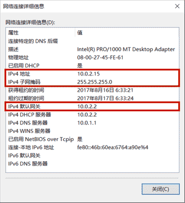

# 网络编程基础

在学习Java网络编程之前，我们先来了解什么是计算机网络。

计算机网络是指两台或更多的计算机组成的网络，在同一个网络中，任意两台计算机都可以直接通信，因为所有计算机都需要遵循同一种网络协议。

那什么是互联网呢？互联网是网络的网络（Internet），即把很多计算机网络连接起来，形成一个全球统一的互联网。

对某个特定的计算机网络来说，它可能使用网络协议ABC，而另一个计算机网络可能使用网络协议XYZ。如果计算机网络各自的通讯协议不统一，就没法把不同的网络连接起来形成互联网。因此，为了把计算机网络接入互联网，就必须使用TCP/IP协议。

TCP/IP协议泛指互联网协议，其中最重要的两个协议是TCP协议和IP协议。只有使用TCP/IP协议的计算机才能够联入互联网，使用其他网络协议（例如NetBIOS、AppleTalk协议等）是无法联入互联网的。

### IP地址

在互联网中，一个IP地址用于唯一标识一个网络接口（Network Interface）。一台联入互联网的计算机肯定有一个IP地址，但也可能有多个IP地址。

IP地址分为IPv4和IPv6两种。IPv4采用32位地址，类似`101.202.99.12`，而IPv6采用128位地址，类似`2001:0DA8:100A:0000:0000:1020:F2F3:1428`。IPv4地址总共有2<sup>32</sup>个（大约42亿），而IPv6地址则总共有2<sup>128</sup>个（大约340万亿亿亿亿），IPv4的地址目前已耗尽，而IPv6的地址是根本用不完的。

IP地址又分为公网IP地址和内网IP地址。公网IP地址可以直接被访问，内网IP地址只能在内网访问。内网IP地址类似于：

- 192.168.x.x
- 10.x.x.x

有一个特殊的IP地址，称之为本机地址，它总是`127.0.0.1`。

IPv4地址实际上是一个32位整数。例如：

```ascii
1707762444 = 0x65ca630c
           = 65  ca  63 0c
           = 101.202.99.12
```

如果一台计算机只有一个网卡，并且接入了网络，那么，它有一个本机地址`127.0.0.1`，还有一个IP地址，例如`101.202.99.12`，可以通过这个IP地址接入网络。

如果一台计算机有两块网卡，那么除了本机地址，它可以有两个IP地址，可以分别接入两个网络。通常连接两个网络的设备是路由器或者交换机，它至少有两个IP地址，分别接入不同的网络，让网络之间连接起来。

如果两台计算机位于同一个网络，那么他们之间可以直接通信，因为他们的IP地址前段是相同的，也就是网络号是相同的。网络号是IP地址通过子网掩码过滤后得到的。例如：

某台计算机的IP是`101.202.99.2`，子网掩码是`255.255.255.0`，那么计算该计算机的网络号是：

```plain
IP = 101.202.99.2
Mask = 255.255.255.0
Network = IP & Mask = 101.202.99.0
```

每台计算机都需要正确配置IP地址和子网掩码，根据这两个就可以计算网络号，如果两台计算机计算出的网络号相同，说明两台计算机在同一个网络，可以直接通信。如果两台计算机计算出的网络号不同，那么两台计算机不在同一个网络，不能直接通信，它们之间必须通过路由器或者交换机这样的网络设备间接通信，我们把这种设备称为网关。

网关的作用就是连接多个网络，负责把来自一个网络的数据包发到另一个网络，这个过程叫路由。

所以，一台计算机的一个网卡会有3个关键配置：



- IP地址，例如：`10.0.2.15`
- 子网掩码，例如：`255.255.255.0`
- 网关的IP地址，例如：`10.0.2.2`

### 域名

因为直接记忆IP地址非常困难，所以我们通常使用域名访问某个特定的服务。域名解析服务器DNS负责把域名翻译成对应的IP，客户端再根据IP地址访问服务器。

用`nslookup`可以查看域名对应的IP地址：

```plain
$ nslookup liaoxuefeng.com
Server:  xxx.xxx.xxx.xxx
Address: xxx.xxx.xxx.xxx#53

Non-authoritative answer:
Name:    liaoxuefeng.com
Address: xxx.xxx.xxx.xxx
```

有一个特殊的本机域名`localhost`，它对应的IP地址总是本机地址`127.0.0.1`。

### 网络模型

由于计算机网络从底层的传输到高层的软件设计十分复杂，要合理地设计计算机网络模型，必须采用分层模型，每一层负责处理自己的操作。OSI（Open System Interconnect）网络模型是ISO组织定义的一个计算机互联的标准模型，注意它只是一个定义，目的是为了简化网络各层的操作，提供标准接口便于实现和维护。这个模型从上到下依次是：

- 应用层，提供应用程序之间的通信；
- 表示层：处理数据格式，加解密等等；
- 会话层：负责建立和维护会话；
- 传输层：负责提供端到端的可靠传输；
- 网络层：负责根据目标地址选择路由来传输数据；
- 链路层和物理层负责把数据进行分片并且真正通过物理网络传输，例如，无线网、光纤等。

互联网实际使用的TCP/IP模型并不是对应到OSI的7层模型，而是大致对应OSI的5层模型：

<table>
<thead>
  <tr>
    <th>OSI</th>
    <th>TCP/IP</th>
  </tr></thead>
  <tbody>
  <tr>
    <td>应用层</td>
    <td rowspan="3">应用层</td>
  </tr>
  <tr>
    <td>表示层</td>
  </tr>
  <tr>
    <td>会话层</td>
  </tr>
  <tr>
    <td>传输层</td>
    <td>传输层</td>
  </tr>
  <tr>
    <td>网络层</td>
    <td>IP层</td>
  </tr>
  <tr>
    <td>链路层</td>
    <td rowspan="2">网络接口层</td>
  </tr>
  <tr>
    <td>物理层</td>
  </tr></tbody>
</table>

### 常用协议

IP协议是一个分组交换，它不保证可靠传输。而TCP协议是传输控制协议，它是面向连接的协议，支持可靠传输和双向通信。TCP协议是建立在IP协议之上的，简单地说，IP协议只负责发数据包，不保证顺序和正确性，而TCP协议负责控制数据包传输，它在传输数据之前需要先建立连接，建立连接后才能传输数据，传输完后还需要断开连接。TCP协议之所以能保证数据的可靠传输，是通过接收确认、超时重传这些机制实现的。并且，TCP协议允许双向通信，即通信双方可以同时发送和接收数据。

TCP协议也是应用最广泛的协议，许多高级协议都是建立在TCP协议之上的，例如HTTP、SMTP等。

UDP协议（User Datagram Protocol）是一种数据报文协议，它是无连接协议，不保证可靠传输。因为UDP协议在通信前不需要建立连接，因此它的传输效率比TCP高，而且UDP协议比TCP协议要简单得多。

选择UDP协议时，传输的数据通常是能容忍丢失的，例如，一些语音视频通信的应用会选择UDP协议。

### 小结

计算机网络的基本概念主要有：

- 计算机网络：由两台或更多计算机组成的网络；
- 互联网：连接网络的网络；
- IP地址：计算机的网络接口（通常是网卡）在网络中的唯一标识；
- 网关：负责连接多个网络，并在多个网络之间转发数据的计算机，通常是路由器或交换机；
- 网络协议：互联网使用TCP/IP协议，它泛指互联网协议簇；
- IP协议：一种分组交换传输协议；
- TCP协议：一种面向连接，可靠传输的协议；
- UDP协议：一种无连接，不可靠传输的协议。
