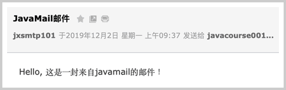
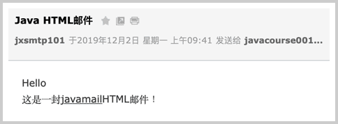
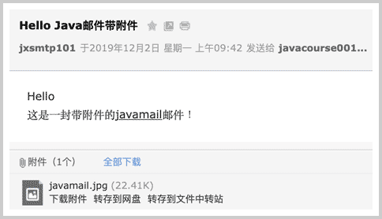
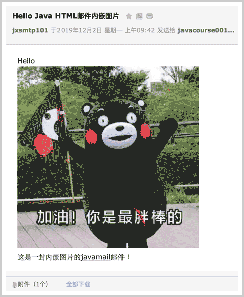

# 发送Email

Email就是电子邮件。电子邮件的应用已经有几十年的历史了，我们熟悉的邮箱地址比如`abc@example.com`，邮件软件比如Outlook都是用来收发邮件的。

使用Java程序也可以收发电子邮件。我们先来看一下传统的邮件是如何发送的。

传统的邮件是通过邮局投递，然后从一个邮局到另一个邮局，最终到达用户的邮箱：

```ascii
           ┌──────────┐    ┌──────────┐
           │PostOffice│    │PostOffice│     .───.
┌─────┐    ├──────────┤    ├──────────┤    (   ( )
│═══ ░│───▶│ ┌─┐ ┌┐┌┐ │───▶│ ┌─┐ ┌┐┌┐ │───▶ `─┬─'
└─────┘    │ │░│ └┘└┘ │    │ │░│ └┘└┘ │       │
           └─┴─┴──────┘    └─┴─┴──────┘       │
```

电子邮件的发送过程也是类似的，只不过是电子邮件是从用户电脑的邮件软件，例如Outlook，发送到邮件服务器上，可能经过若干个邮件服务器的中转，最终到达对方邮件服务器上，收件方就可以用软件接收邮件：

```ascii
             ┌─────────┐    ┌─────────┐    ┌─────────┐
             │░░░░░░░░░│    │░░░░░░░░░│    │░░░░░░░░░│
┌───────┐    ├─────────┤    ├─────────┤    ├─────────┤    ┌───────┐
│░░░░░░░│    │░░░░░░░░░│    │░░░░░░░░░│    │░░░░░░░░░│    │░░░░░░░│
├───────┤    ├─────────┤    ├─────────┤    ├─────────┤    ├───────┤
│       │───▶│O ░░░░░░░│───▶│O ░░░░░░░│───▶│O ░░░░░░░│◀───│       │
└───────┘    └─────────┘    └─────────┘    └─────────┘    └───────┘
   MUA           MTA            MTA            MDA           MUA
```

我们把类似Outlook这样的邮件软件称为MUA：Mail User Agent，意思是给用户服务的邮件代理；邮件服务器则称为MTA：Mail Transfer Agent，意思是邮件中转的代理；最终到达的邮件服务器称为MDA：Mail Delivery Agent，意思是邮件到达的代理。电子邮件一旦到达MDA，就不再动了。实际上，电子邮件通常就存储在MDA服务器的硬盘上，然后等收件人通过软件或者登陆浏览器查看邮件。

MTA和MDA这样的服务器软件通常是现成的，我们不关心这些服务器内部是如何运行的。要发送邮件，我们关心的是如何编写一个MUA的软件，把邮件发送到MTA上。

MUA到MTA发送邮件的协议就是SMTP协议，它是Simple Mail Transport Protocol的缩写，使用标准端口`25`，也可以使用加密端口`465`或`587`。

SMTP协议是一个建立在TCP之上的协议，任何程序发送邮件都必须遵守SMTP协议。使用Java程序发送邮件时，我们无需关心SMTP协议的底层原理，只需要使用JavaMail这个标准API就可以直接发送邮件。

### 准备SMTP登录信息

假设我们准备使用自己的邮件地址`me@example.com`给小明发送邮件，已知小明的邮件地址是`xiaoming@somewhere.com`，发送邮件前，我们首先要确定作为MTA的邮件服务器地址和端口号。邮件服务器地址通常是`smtp.example.com`，端口号由邮件服务商确定使用25、465还是587。以下是一些常用邮件服务商的SMTP信息：

- QQ邮箱：SMTP服务器是`smtp.qq.com`，端口是465/587；
- 163邮箱：SMTP服务器是`smtp.163.com`，端口是465；
- Gmail邮箱：SMTP服务器是`smtp.gmail.com`，端口是465/587。

有了SMTP服务器的域名和端口号，我们还需要SMTP服务器的登录信息，通常是使用自己的邮件地址作为用户名，登录口令是用户口令或者一个独立设置的SMTP口令。

我们来看看如何使用JavaMail发送邮件。

首先，我们需要创建一个Maven工程，并把JavaMail相关的两个依赖加入进来：

- jakarta.mail:javax.mail-api:2.0.1
- com.sun.mail:jakarta.mail:2.0.1

这两个包一个是接口定义，一个是具体实现。如果使用早期的1.x版本，则需注意引入的包名有所不同：

- javax.mail:javax.mail-api:1.6.2
- com.sun.mail:javax.mail:1.6.2

并且代码引用的`jakarta.mail`需替换为`javax.mail`。

然后，我们通过JavaMail API连接到SMTP服务器上：

```java
// 服务器地址:
String smtp = "smtp.office365.com";
// 登录用户名:
String username = "jxsmtp101@outlook.com";
// 登录口令:
String password = "********";
// 连接到SMTP服务器587端口:
Properties props = new Properties();
props.put("mail.smtp.host", smtp); // SMTP主机名
props.put("mail.smtp.port", "587"); // 主机端口号
props.put("mail.smtp.auth", "true"); // 是否需要用户认证
props.put("mail.smtp.starttls.enable", "true"); // 启用TLS加密
// 获取Session实例:
Session session = Session.getInstance(props, new Authenticator() {
    protected PasswordAuthentication getPasswordAuthentication() {
        return new PasswordAuthentication(username, password);
    }
});
// 设置debug模式便于调试:
session.setDebug(true);
```

以587端口为例，连接SMTP服务器时，需要准备一个`Properties`对象，填入相关信息。最后获取`Session`实例时，如果服务器需要认证，还需要传入一个`Authenticator`对象，并返回指定的用户名和口令。

当我们获取到`Session`实例后，打开调试模式可以看到SMTP通信的详细内容，便于调试。

### 发送邮件

发送邮件时，我们需要构造一个`Message`对象，然后调用`Transport.send(Message)`即可完成发送：

```java
MimeMessage message = new MimeMessage(session);
// 设置发送方地址:
message.setFrom(new InternetAddress("me@example.com"));
// 设置接收方地址:
message.setRecipient(Message.RecipientType.TO, new InternetAddress("xiaoming@somewhere.com"));
// 设置邮件主题:
message.setSubject("Hello", "UTF-8");
// 设置邮件正文:
message.setText("Hi Xiaoming...", "UTF-8");
// 发送:
Transport.send(message);
```

绝大多数邮件服务器要求发送方地址和登录用户名必须一致，否则发送将失败。

填入真实的地址，运行上述代码，我们可以在控制台看到JavaMail打印的调试信息：

<pre><code class="language-plain"><span style="color:red">这是JavaMail打印的调试信息:</span>
DEBUG: setDebug: JavaMail version 1.6.2
DEBUG: getProvider() returning javax.mail.Provider[TRANSPORT,smtp,com.sun.mail.smtp.SMTPTransport,Oracle]
DEBUG SMTP: need username and password for authentication
DEBUG SMTP: protocolConnect returning false, host=smtp.office365.com, ...
DEBUG SMTP: useEhlo true, useAuth true
<span style="color:red">开始尝试连接smtp.office365.com:</span>
DEBUG SMTP: trying to connect to host "smtp.office365.com", port 587, ...
DEBUG SMTP: connected to host "smtp.office365.com", port: 587
<span style="color:red">发送命令EHLO:</span>
EHLO localhost
<span style="color:red">SMTP服务器响应250:</span>
250-SG3P274CA0024.outlook.office365.com Hello
250-SIZE 157286400
...
DEBUG SMTP: Found extension "SIZE", arg "157286400"
<span style="color:red">发送命令STARTTLS:</span>
STARTTLS
<span style="color:red">SMTP服务器响应220:</span>
220 2.0.0 SMTP server ready
EHLO localhost
250-SG3P274CA0024.outlook.office365.com Hello [111.196.164.63]
250-SIZE 157286400
250-PIPELINING
250-...
DEBUG SMTP: Found extension "SIZE", arg "157286400"
...
<span style="color:red">尝试登录:</span>
DEBUG SMTP: protocolConnect login, host=smtp.office365.com, user=********, password=********
DEBUG SMTP: Attempt to authenticate using mechanisms: LOGIN PLAIN DIGEST-MD5 NTLM XOAUTH2 
DEBUG SMTP: Using mechanism LOGIN
DEBUG SMTP: AUTH LOGIN command trace suppressed
<span style="color:red">登录成功:</span>
DEBUG SMTP: AUTH LOGIN succeeded
DEBUG SMTP: use8bit false
<span style="color:red">开发发送邮件，设置FROM:</span>
MAIL FROM:&lt;********@outlook.com&gt;
250 2.1.0 Sender OK
<span style="color:red">设置TO:</span>
RCPT TO:&lt;********@sina.com&gt;
250 2.1.5 Recipient OK
<span style="color:red">发送邮件数据:</span>
DATA
<span style="color:red">服务器响应354:</span>
354 Start mail input; end with &lt;CRLF&gt;.&lt;CRLF&gt;
<span style="color:red">真正的邮件数据:</span>
Date: Mon, 2 Dec 2019 09:37:52 +0800 (CST)
From: ********@outlook.com
To: ********001@sina.com
Message-ID: &lt;1617791695.0.1575250672483@localhost&gt;
<span style="color:red">邮件主题是编码后的文本:</span>
Subject: =?UTF-8?Q?JavaMail=E9=82=AE=E4=BB=B6?=
MIME-Version: 1.0
Content-Type: text/plain; charset=UTF-8
Content-Transfer-Encoding: base64

<span style="color:red">邮件正文是Base64编码的文本:</span>
SGVsbG8sIOi/meaYr+S4gOWwgeadpeiHqmphdmFtYWls55qE6YKu5Lu277yB
.
<span style="color:red">邮件数据发送完成后，以\r\n.\r\n结束，服务器响应250表示发送成功:</span>
250 2.0.0 OK &lt;HK0PR03MB4961.apcprd03.prod.outlook.com&gt; [Hostname=HK0PR03MB4961.apcprd03.prod.outlook.com]
DEBUG SMTP: message successfully delivered to mail server
<span style="color:red">发送QUIT命令:</span>
QUIT
<span style="color:red">服务器响应221结束TCP连接:</span>
221 2.0.0 Service closing transmission channel
</code></pre>

从上面的调试信息可以看出，SMTP协议是一个请求-响应协议，客户端总是发送命令，然后等待服务器响应。服务器响应总是以数字开头，后面的信息才是用于调试的文本。这些响应码已经被定义在[SMTP协议](https://www.iana.org/assignments/smtp-enhanced-status-codes/smtp-enhanced-status-codes.txt)中了，查看具体的响应码就可以知道出错原因。

如果一切顺利，对方将收到一封文本格式的电子邮件：



### 发送HTML邮件

发送HTML邮件和文本邮件是类似的，只需要把：

```java
message.setText(body, "UTF-8");
```

改为：

```java
message.setText(body, "UTF-8", "html");
```

传入的`body`是类似`<h1>Hello</h1><p>Hi, xxx</p>`这样的HTML字符串即可。

HTML邮件可以在邮件客户端直接显示为网页格式：



### 发送附件

要在电子邮件中携带附件，我们就不能直接调用`message.setText()`方法，而是要构造一个`Multipart`对象：

```java
Multipart multipart = new MimeMultipart();
// 添加text:
BodyPart textpart = new MimeBodyPart();
textpart.setContent(body, "text/html;charset=utf-8");
multipart.addBodyPart(textpart);
// 添加image:
BodyPart imagepart = new MimeBodyPart();
imagepart.setFileName(fileName);
imagepart.setDataHandler(new DataHandler(new ByteArrayDataSource(input, "application/octet-stream")));
multipart.addBodyPart(imagepart);
// 设置邮件内容为multipart:
message.setContent(multipart);
```

一个`Multipart`对象可以添加若干个`BodyPart`，其中第一个`BodyPart`是文本，即邮件正文，后面的BodyPart是附件。`BodyPart`依靠`setContent()`决定添加的内容，如果添加文本，用`setContent("...", "text/plain;charset=utf-8")`添加纯文本，或者用`setContent("...", "text/html;charset=utf-8")`添加HTML文本。如果添加附件，需要设置文件名（不一定和真实文件名一致），并且添加一个`DataHandler()`，传入文件的MIME类型。二进制文件可以用`application/octet-stream`，Word文档则是`application/msword`。

最后，通过`setContent()`把`Multipart`添加到`Message`中，即可发送。

带附件的邮件在客户端会被提示下载：



### 发送内嵌图片的HTML邮件

有些童鞋可能注意到，HTML邮件中可以内嵌图片，这是怎么做到的？

如果给一个``，这样的外部图片链接通常会被邮件客户端过滤，并提示用户显示图片并不安全。只有内嵌的图片才能正常在邮件中显示。

内嵌图片实际上也是一个附件，即邮件本身也是`Multipart`，但需要做一点额外的处理：

```java
Multipart multipart = new MimeMultipart();
// 添加text:
BodyPart textpart = new MimeBodyPart();
textpart.setContent("<h1>Hello</h1><p></p>", "text/html;charset=utf-8");
multipart.addBodyPart(textpart);
// 添加image:
BodyPart imagepart = new MimeBodyPart();
imagepart.setFileName(fileName);
imagepart.setDataHandler(new DataHandler(new ByteArrayDataSource(input, "image/jpeg")));
// 与HTML的关联:
imagepart.setHeader("Content-ID", "<img01>");
multipart.addBodyPart(imagepart);
```

在HTML邮件中引用图片时，需要设定一个ID，用类似``引用，然后，在添加图片作为BodyPart时，除了要正确设置MIME类型（根据图片类型使用`image/jpeg`或`image/png`），还需要设置一个Header：

```java
imagepart.setHeader("Content-ID", "<img01>");
```

这个ID和HTML中引用的ID对应起来，邮件客户端就可以正常显示内嵌图片：



### 常见问题

如果用户名或口令错误，会导致`535`登录失败：

```plain
DEBUG SMTP: AUTH LOGIN failed
Exception in thread "main" javax.mail.AuthenticationFailedException: 535 5.7.3 Authentication unsuccessful [HK0PR03CA0105.apcprd03.prod.outlook.com]
```

如果登录用户和发件人不一致，会导致`554`拒绝发送错误：

```plain
DEBUG SMTP: MessagingException while sending, THROW: 
com.sun.mail.smtp.SMTPSendFailedException: 554 5.2.0 STOREDRV.Submission.Exception:SendAsDeniedException.MapiExceptionSendAsDenied;
```

有些时候，如果邮件主题和正文过于简单，会导致`554`被识别为垃圾邮件的错误：

```plain
DEBUG SMTP: MessagingException while sending, THROW: 
com.sun.mail.smtp.SMTPSendFailedException: 554 DT:SPM
```

总之，出错时，需要查看DEBUG信息，找到服务器返回的错误码和描述信息来定位错误原因。

### 练习

使用SMTP发送邮件。

[下载练习](network-smtp.zip)

### 小结

使用JavaMail API发送邮件本质上是一个MUA软件通过SMTP协议发送邮件至MTA服务器；

打开调试模式可以看到详细的SMTP交互信息；

某些邮件服务商需要开启SMTP，并需要独立的SMTP登录密码。
