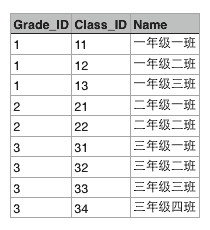

# JDBC简介

在介绍JDBC之前，我们先简单介绍一下关系数据库。

程序运行的时候，数据都是在内存中的。当程序终止的时候，通常都需要将数据保存到磁盘上，无论是保存到本地磁盘，还是通过网络保存到服务器上，最终都会将数据写入磁盘文件。

而如何定义数据的存储格式就是一个大问题。如果我们自己来定义存储格式，比如保存一个班级所有学生的成绩单：

| 名字    | 成绩 |
|---------|----|
| Michael | 99 |
| Bob     | 85 |
| Bart    | 59 |
| Lisa    | 87 |

你可以用一个文本文件保存，一行保存一个学生，用`,`隔开：

```csv
Michael,99
Bob,85
Bart,59
Lisa,87
```

你还可以用JSON格式保存，也是文本文件：

```json
[
    {"name":"Michael","score":99},
    {"name":"Bob","score":85},
    {"name":"Bart","score":59},
    {"name":"Lisa","score":87}
]
```

你还可以定义各种保存格式，但是问题来了：

存储和读取需要自己实现，JSON还是标准，自己定义的格式就各式各样了；

不能做快速查询，只有把数据全部读到内存中才能自己遍历，但有时候数据的大小远远超过了内存（比如蓝光电影，40GB的数据），根本无法全部读入内存。

为了便于程序保存和读取数据，而且，能直接通过条件快速查询到指定的数据，就出现了数据库（Database）这种专门用于集中存储和查询的软件。

数据库软件诞生的历史非常久远，早在1950年数据库就诞生了。经历了网状数据库，层次数据库，我们现在广泛使用的关系数据库是20世纪70年代基于关系模型的基础上诞生的。

关系模型有一套复杂的数学理论，但是从概念上是十分容易理解的。举个学校的例子：

假设某个XX省YY市ZZ县第一实验小学有3个年级，要表示出这3个年级，可以在Excel中用一个表格画出来：


每个年级又有若干个班级，要把所有班级表示出来，可以在Excel中再画一个表格：



这两个表格有个映射关系，就是根据Grade_ID可以在班级表中查找到对应的所有班级：


也就是Grade表的每一行对应Class表的多行，在关系数据库中，这种基于表（Table）的一对多的关系就是关系数据库的基础。

根据某个年级的ID就可以查找所有班级的行，这种查询语句在关系数据库中称为SQL语句，可以写成：

```sql
SELECT * FROM classes WHERE grade_id = '1';
```

结果也是一个表：

| grade_id | class_id | name     |
|----------|----------|----------|
| 1        | 11       | 一年级一班 |
| 1        | 12       | 一年级二班 |
| 1        | 13       | 一年级三班 |

类似的，Class表的一行记录又可以关联到Student表的多行记录：


由于本教程不涉及到关系数据库的详细内容，如果你想从零学习关系数据库和基本的SQL语句，请参考[SQL课程](../../../sql/index.html)。

### NoSQL

你也许还听说过NoSQL数据库，很多NoSQL宣传其速度和规模远远超过关系数据库，所以很多同学觉得有了NoSQL是否就不需要SQL了呢？千万不要被他们忽悠了，连SQL都不明白怎么可能搞明白NoSQL呢？

### 数据库类别

既然我们要使用关系数据库，就必须选择一个关系数据库。目前广泛使用的关系数据库也就这么几种：

付费的商用数据库：

- Oracle，典型的高富帅；
- SQL Server，微软自家产品，Windows定制专款；
- DB2，IBM的产品，听起来挺高端；
- Sybase，曾经跟微软是好基友，后来关系破裂，现在家境惨淡。

这些数据库都是不开源而且付费的，最大的好处是花了钱出了问题可以找厂家解决，不过在Web的世界里，常常需要部署成千上万的数据库服务器，当然不能把大把大把的银子扔给厂家，所以，无论是Google、Facebook，还是国内的BAT，无一例外都选择了免费的开源数据库：

- MySQL，大家都在用，一般错不了；
- PostgreSQL，学术气息有点重，其实挺不错，但知名度没有MySQL高；
- sqlite，嵌入式数据库，适合桌面和移动应用。

作为一个Java工程师，选择哪个免费数据库呢？当然是MySQL。因为MySQL普及率最高，出了错，可以很容易找到解决方法。而且，围绕MySQL有一大堆监控和运维的工具，安装和使用很方便。

### 安装MySQL

为了能继续后面的学习，你需要从MySQL官方网站下载并安装[MySQL Community Server](https://dev.mysql.com/downloads/mysql/)，这个版本是免费的，其他高级版本是要收钱的（请放心，收钱的功能我们用不上）。MySQL是跨平台的，选择对应的平台下载安装文件，安装即可。

安装时，MySQL会提示输入`root`用户的口令，请务必记清楚。如果怕记不住，就把口令设置为`password`。

在Windows上，安装时请选择`UTF-8`编码，以便正确地处理中文。

在Mac或Linux上，需要编辑MySQL的配置文件，把数据库默认的编码全部改为UTF-8。MySQL的配置文件默认存放在`/etc/my.cnf`或者`/etc/mysql/my.cnf`：

```plain
[client]
default-character-set = utf8

[mysqld]
default-storage-engine = INNODB
character-set-server = utf8
collation-server = utf8_general_ci
```

重启MySQL后，可以通过MySQL的客户端命令行检查编码：

```plain
$ mysql -u root -p
Enter password: 
Welcome to the MySQL monitor...
...

mysql> show variables like '%char%';
+--------------------------+--------------------------------------------------------+
| Variable_name            | Value                                                  |
+--------------------------+--------------------------------------------------------+
| character_set_client     | utf8                                                   |
| character_set_connection | utf8                                                   |
| character_set_database   | utf8                                                   |
| character_set_filesystem | binary                                                 |
| character_set_results    | utf8                                                   |
| character_set_server     | utf8                                                   |
| character_set_system     | utf8                                                   |
| character_sets_dir       | /usr/local/mysql-5.1.65-osx10.6-x86_64/share/charsets/ |
+--------------------------+--------------------------------------------------------+
8 rows in set (0.00 sec)
```

看到`utf8`字样就表示编码设置正确。

*注*：如果MySQL的版本≥5.5.3，可以把编码设置为`utf8mb4`，`utf8mb4`和`utf8`完全兼容，但它支持最新的Unicode标准，可以显示emoji字符。

### JDBC

什么是JDBC？JDBC是Java DataBase Connectivity的缩写，它是Java程序访问数据库的标准接口。

使用Java程序访问数据库时，Java代码并不是直接通过TCP连接去访问数据库，而是通过JDBC接口来访问，而JDBC接口则通过JDBC驱动来实现真正对数据库的访问。

例如，我们在Java代码中如果要访问MySQL，那么必须编写代码操作JDBC接口。注意到JDBC接口是Java标准库自带的，所以可以直接编译。而具体的JDBC驱动是由数据库厂商提供的，例如，MySQL的JDBC驱动由Oracle提供。因此，访问某个具体的数据库，我们只需要引入该厂商提供的JDBC驱动，就可以通过JDBC接口来访问，这样保证了Java程序编写的是一套数据库访问代码，却可以访问各种不同的数据库，因为他们都提供了标准的JDBC驱动：

```ascii
┌ ─ ─ ─ ─ ─ ─ ─ ─ ─ ─ ┐

│  ┌───────────────┐  │
   │   Java App    │
│  └───────────────┘  │
           │
│          ▼          │
   ┌───────────────┐
│  │JDBC Interface │◀─┼─── JDK
   └───────────────┘
│          │          │
           ▼
│  ┌───────────────┐  │
   │  JDBC Driver  │◀───── Vendor
│  └───────────────┘  │
           │
└ ─ ─ ─ ─ ─│─ ─ ─ ─ ─ ┘
           ▼
   ┌───────────────┐
   │   Database    │
   └───────────────┘
```

从代码来看，Java标准库自带的JDBC接口其实就是定义了一组接口，而某个具体的JDBC驱动其实就是实现了这些接口的类：

```ascii
┌ ─ ─ ─ ─ ─ ─ ─ ─ ─ ─ ┐

│  ┌───────────────┐  │
   │   Java App    │
│  └───────────────┘  │
           │
│          ▼          │
   ┌───────────────┐
│  │JDBC Interface │◀─┼─── JDK
   └───────────────┘
│          │          │
           ▼
│  ┌───────────────┐  │
   │ MySQL Driver  │◀───── Oracle
│  └───────────────┘  │
           │
└ ─ ─ ─ ─ ─│─ ─ ─ ─ ─ ┘
           ▼
   ┌───────────────┐
   │     MySQL     │
   └───────────────┘
```

实际上，一个MySQL的JDBC的驱动就是一个jar包，它本身也是纯Java编写的。我们自己编写的代码只需要引用Java标准库提供的java.sql包下面的相关接口，由此再间接地通过MySQL驱动的jar包通过网络访问MySQL服务器，所有复杂的网络通讯都被封装到JDBC驱动中，因此，Java程序本身只需要引入一个MySQL驱动的jar包就可以正常访问MySQL服务器：

```ascii
┌ ─ ─ ─ ─ ─ ─ ─ ─ ─ ─ ┐
   ┌───────────────┐
│  │   App.class   │  │
   └───────────────┘
│          │          │
           ▼
│  ┌───────────────┐  │
   │  java.sql.*   │
│  └───────────────┘  │
           │
│          ▼          │
   ┌───────────────┐     TCP    ┌───────────────┐
│  │ mysql-xxx.jar │──┼────────▶│     MySQL     │
   └───────────────┘            └───────────────┘
└ ─ ─ ─ ─ ─ ─ ─ ─ ─ ─ ┘
          JVM
```

### 小结

使用JDBC的好处是：

- 各数据库厂商使用相同的接口，Java代码不需要针对不同数据库分别开发；
- Java程序编译期仅依赖java.sql包，不依赖具体数据库的jar包；
- 可随时替换底层数据库，访问数据库的Java代码基本不变。
