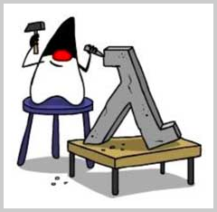

# 函数式编程

本章我们介绍Java的函数式编程。

我们先看看什么是函数。函数是一种最基本的任务，一个大型程序就是一个顶层函数调用若干底层函数，这些被调用的函数又可以调用其他函数，即大任务被一层层拆解并执行。所以函数就是面向过程的程序设计的基本单元。

Java不支持单独定义函数，但可以把静态方法视为独立的函数，把实例方法视为自带`this`参数的函数。

而函数式编程（请注意多了一个“式”字）——Functional Programming，虽然也可以归结到面向过程的程序设计，但其思想更接近数学计算。

我们首先要搞明白计算机（Computer）和计算（Compute）的概念。

在计算机的层次上，CPU执行的是加减乘除的指令代码，以及各种条件判断和跳转指令，所以，汇编语言是最贴近计算机的语言。

而计算则指数学意义上的计算，越是抽象的计算，离计算机硬件越远。

对应到编程语言，就是越低级的语言，越贴近计算机，抽象程度低，执行效率高，比如C语言；越高级的语言，越贴近计算，抽象程度高，执行效率低，比如Lisp语言。

函数式编程就是一种抽象程度很高的编程范式，纯粹的函数式编程语言编写的函数没有变量，因此，任意一个函数，只要输入是确定的，输出就是确定的，这种纯函数我们称之为没有副作用。而允许使用变量的程序设计语言，由于函数内部的变量状态不确定，同样的输入，可能得到不同的输出，因此，这种函数是有副作用的。

函数式编程的一个特点就是，允许把函数本身作为参数传入另一个函数，还允许返回一个函数！

函数式编程最早是数学家[阿隆佐·邱奇](https://zh.wikipedia.org/wiki/%E9%98%BF%E9%9A%86%E4%BD%90%C2%B7%E9%82%B1%E5%A5%87)研究的一套函数变换逻辑，又称Lambda Calculus（λ-Calculus），所以也经常把函数式编程称为Lambda计算。

Java平台从Java 8开始，支持函数式编程。

