# 使用IDE

IDE是集成开发环境：Integrated Development Environment的缩写。

使用IDE的好处在于，可以把编写代码、组织项目、编译、运行、调试等放到一个环境中运行，能极大地提高开发效率。

IDE提升开发效率主要靠以下几点：

- 编辑器的自动提示，可以大大提高敲代码的速度；
- 代码修改后可以自动重新编译，并直接运行；
- 可以方便地进行断点调试。

目前，流行的用于Java开发的IDE有：

### Eclipse

[Eclipse](https://www.eclipse.org/)是由IBM开发并捐赠给开源社区的一个IDE，也是目前应用最广泛的IDE。Eclipse的特点是它本身是Java开发的，并且基于插件结构，即使是对Java开发的支持也是通过插件JDT实现的。

除了用于Java开发，Eclipse配合插件也可以作为C/C++开发环境、PHP开发环境、Rust开发环境等。

### IntelliJ Idea

[IntelliJ Idea](https://www.jetbrains.com/idea/)是由JetBrains公司开发的一个功能强大的IDE，分为免费版和商用付费版。JetBrains公司的IDE平台也是基于IDE平台+语言插件的模式，支持Python开发环境、Ruby开发环境、PHP开发环境等，这些开发环境也分为免费版和付费版。

### NetBeans

[NetBeans](https://netbeans.org/)是最早由SUN开发的开源IDE，由于使用人数较少，目前已不再流行。

### 使用Eclipse

你可以使用任何IDE进行Java学习和开发。我们不讨论任何关于IDE的优劣，本教程使用Eclipse作为开发演示环境，原因在于：

- 完全免费使用；
- 所有功能完全满足Java开发需求。

### 安装Eclipse

Eclipse的发行版提供了预打包的开发环境，包括Java、JavaEE、C++、PHP、Rust等。从[这里](https://www.eclipse.org/downloads/packages/)下载：

我们需要下载的版本是Eclipse IDE for Java Developers： 

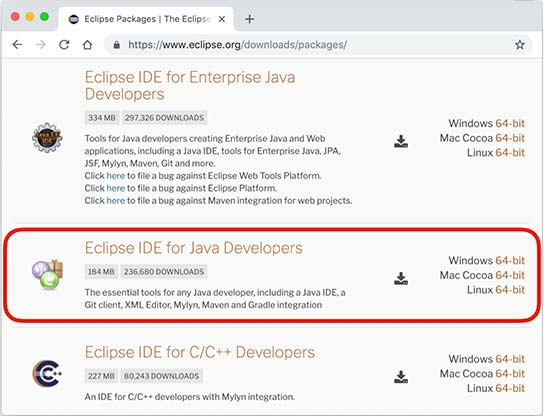

根据操作系统是Windows、Mac还是Linux，从右边选择对应的下载链接。

```alert type=notice title=注意
教程从头到尾并不需要用到Enterprise Java的功能，所以不需要下载Eclipse IDE for Enterprise Java Developers
```

### 设置Eclipse

下载并安装完成后，我们启动Eclipse，对IDE环境做一个基本设置：

选择菜单“Eclipse/Window”-“Preferences”，打开配置对话框：

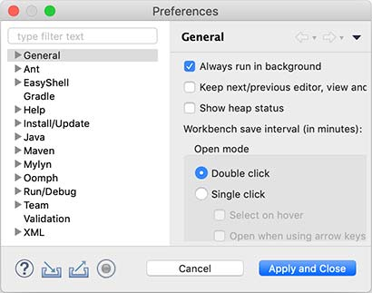

我们需要调整以下设置项：

#### General > Editors > Text Editors

钩上“Show line numbers”，这样编辑器会显示行号；

#### General > Workspace

钩上“Refresh using native hooks or polling”，这样Eclipse会自动刷新文件夹的改动；

对于“Text file encoding”，如果Default不是`UTF-8`，一定要改为“Other：UTF-8”，所有文本文件均使用`UTF-8`编码；

对于“New text file line delimiter”，建议使用Unix，即换行符使用`\n`而不是Windows的`\r\n`。

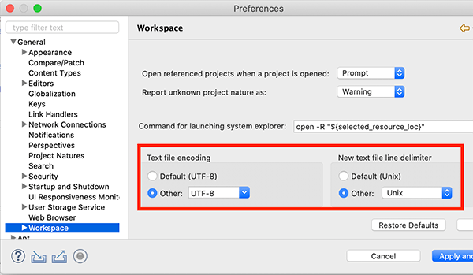

#### Java > Compiler

将“Compiler compliance level”设置为`20`，本教程的所有代码均使用Java 20的语法，并且编译到Java 20的版本。

去掉“Use default compliance settings”并钩上“Enable preview features for Java 20”，这样我们就可以使用Java 20的预览功能。

```alert type=notice title=注意
如果Compiler compliance level没有22这个选项，请更新到最新版Eclipse。如果更新后还是没有22，打开Help - Eclipse Marketplace，搜索Java 22 Support安装后重启即可。
```

#### Java > Installed JREs

在Installed JREs中应该看到Java SE 20，如果还有其他的JRE，可以删除，以确保Java SE 20是默认的JRE。

### Eclipse IDE结构

打开Eclipse后，整个IDE由若干个区域组成：

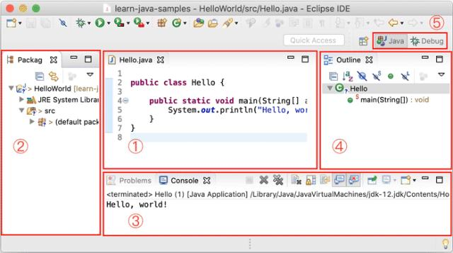

- 中间可编辑的文本区（见1）是编辑器，用于编辑源码；
- 分布在左右和下方的是视图：
    - Package Exploroer（见2）是Java项目的视图
    - Console（见3）是命令行输出视图
    - Outline（见4）是当前正在编辑的Java源码的结构视图
- 视图可以任意组合，然后把一组视图定义成一个Perspective（见5），Eclipse预定义了Java、Debug等几个Perspective，用于快速切换。

### 新建Java项目

在Eclipse菜单选择“File”-“New”-“Java Project”，填入`HelloWorld`，JRE选择`Java SE 22`：

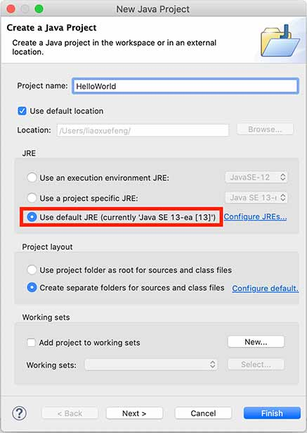

暂时不要勾选“Create module-info.java file”，因为模块化机制我们后面才会讲到：

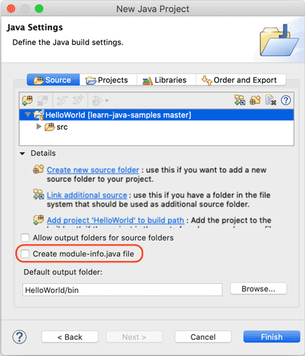

点击“Finish”就成功创建了一个名为`HelloWorld`的Java工程。

### 新建Java文件并运行

展开`HelloWorld`工程，选中源码目录`src`，点击右键，在弹出菜单中选择“New”-“Class”：

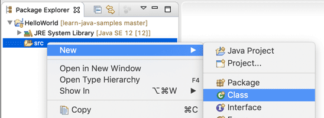

在弹出的对话框中，`Name`一栏填入`Hello`：

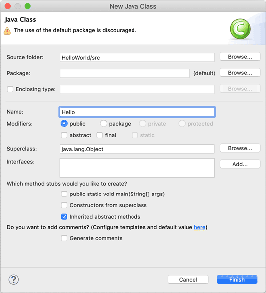

点击”Finish“，就自动在`src`目录下创建了一个名为`Hello.java`的源文件。我们双击打开这个源文件，填上代码：

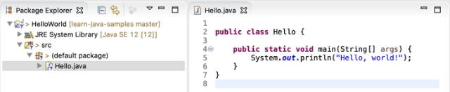

保存，然后选中文件`Hello.java`，点击右键，在弹出的菜单中选中“Run As...”-“Java Application”：

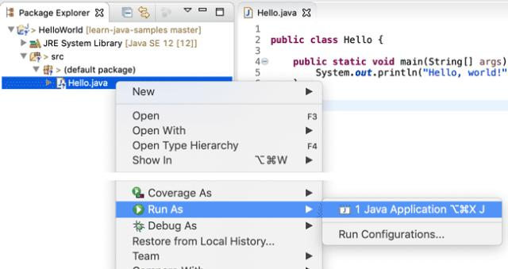

在`Console`窗口中就可以看到运行结果：

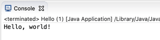

如果没有在主界面中看到`Console`窗口，请选中菜单“Window”-“Show View”-“Console”，即可显示。
