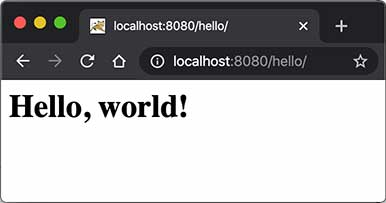

# Servlet入门

在上一节中，我们看到，编写HTTP服务器其实是非常简单的，只需要先编写基于多线程的TCP服务，然后在一个TCP连接中读取HTTP请求，发送HTTP响应即可。

但是，要编写一个完善的HTTP服务器，以HTTP/1.1为例，需要考虑的包括：

- 识别正确和错误的HTTP请求；
- 识别正确和错误的HTTP头；
- 复用TCP连接；
- 复用线程；
- IO异常处理；
- ...

这些基础工作需要耗费大量的时间，并且经过长期测试才能稳定运行。如果我们只需要输出一个简单的HTML页面，就不得不编写上千行底层代码，那就根本无法做到高效而可靠地开发。

因此，在JavaEE平台上，处理TCP连接，解析HTTP协议这些底层工作统统扔给现成的Web服务器去做，我们只需要把自己的应用程序跑在Web服务器上。为了实现这一目的，JavaEE提供了Servlet API，我们使用Servlet API编写自己的Servlet来处理HTTP请求，Web服务器实现Servlet API接口，实现底层功能：

```ascii
                 ┌───────────┐
                 │My Servlet │
                 ├───────────┤
                 │Servlet API│
┌───────┐  HTTP  ├───────────┤
│Browser│◀──────▶│Web Server │
└───────┘        └───────────┘
```

我们来实现一个最简单的Servlet：

```java
// WebServlet注解表示这是一个Servlet，并映射到地址/:
@WebServlet(urlPatterns = "/")
public class HelloServlet extends HttpServlet {
    protected void doGet(HttpServletRequest req, HttpServletResponse resp)
            throws ServletException, IOException {
        // 设置响应类型:
        resp.setContentType("text/html");
        // 获取输出流:
        PrintWriter pw = resp.getWriter();
        // 写入响应:
        pw.write("<h1>Hello, world!</h1>");
        // 最后不要忘记flush强制输出:
        pw.flush();
    }
}
```

一个Servlet总是继承自`HttpServlet`，然后覆写`doGet()`或`doPost()`方法。注意到`doGet()`方法传入了`HttpServletRequest`和`HttpServletResponse`两个对象，分别代表HTTP请求和响应。我们使用Servlet API时，并不直接与底层TCP交互，也不需要解析HTTP协议，因为`HttpServletRequest`和`HttpServletResponse`就已经封装好了请求和响应。以发送响应为例，我们只需要设置正确的响应类型，然后获取`PrintWriter`，写入响应即可。

现在问题来了：Servlet API是谁提供？

Servlet API是一个jar包，我们需要通过Maven来引入它，才能正常编译。编写`pom.xml`文件如下：

```xml
<project xmlns="http://maven.apache.org/POM/4.0.0"
    xmlns:xsi="http://www.w3.org/2001/XMLSchema-instance"
    xsi:schemaLocation="http://maven.apache.org/POM/4.0.0 http://maven.apache.org/maven-v4_0_0.xsd">
    <modelVersion>4.0.0</modelVersion>
    <groupId>com.itranswarp.learnjava</groupId>
    <artifactId>web-servlet-hello</artifactId>
    <packaging>war</packaging>
    <version>1.0-SNAPSHOT</version>

    <properties>
        <project.build.sourceEncoding>UTF-8</project.build.sourceEncoding>
        <project.reporting.outputEncoding>UTF-8</project.reporting.outputEncoding>
        <maven.compiler.source>17</maven.compiler.source>
        <maven.compiler.target>17</maven.compiler.target>
        <java.version>17</java.version>
    </properties>

    <dependencies>
        <dependency>
            <groupId>jakarta.servlet</groupId>
            <artifactId>jakarta.servlet-api</artifactId>
            <version>5.0.0</version>
            <scope>provided</scope>
        </dependency>
    </dependencies>

    <build>
        <finalName>hello</finalName>
    </build>
</project>
```

注意到这个`pom.xml`与前面我们讲到的普通Java程序有个区别，打包类型不是`jar`，而是`war`，表示Java Web Application Archive：

```xml
<packaging>war</packaging>
```

引入的Servlet API如下：

```xml
<dependency>
    <groupId>jakarta.servlet</groupId>
    <artifactId>jakarta.servlet-api</artifactId>
    <version>5.0.0</version>
    <scope>provided</scope>
</dependency>
```

注意到`<scope>`指定为`provided`，表示编译时使用，但不会打包到`.war`文件中，因为运行期Web服务器本身已经提供了Servlet API相关的jar包。

### Servlet版本

要务必注意`servlet-api`的版本。4.0及之前的`servlet-api`由Oracle官方维护，引入的依赖项是`javax.servlet:javax.servlet-api`，编写代码时引入的包名为：

```java
import javax.servlet.*;
```

而5.0及以后的`servlet-api`由Eclipse开源社区维护，引入的依赖项是`jakarta.servlet:jakarta.servlet-api`，编写代码时引入的包名为：

```java
import jakarta.servlet.*;
```

教程采用最新的`jakarta.servlet:5.0.0`版本，但对于很多仅支持Servlet 4.0版本的框架来说，例如Spring 5，我们就只能使用`javax.servlet:4.0.0`版本，这一点针对不同项目要特别注意。

```alert type=warning title=注意
引入不同的Servlet API版本，编写代码时导入的相关API的包名是不同的。
```

整个工程结构如下：

```ascii
web-servlet-hello/
├── pom.xml
└── src/
    └── main/
        ├── java/
        │   └── com/
        │       └── itranswarp/
        │           └── learnjava/
        │               └── servlet/
        │                   └── HelloServlet.java
        ├── resources/
        └── webapp/
```

目录`webapp`目前为空，如果我们需要存放一些资源文件，则需要放入该目录。有的同学可能会问，`webapp`目录下是否需要一个`/WEB-INF/web.xml`配置文件？这个配置文件是低版本Servlet必须的，但是高版本Servlet已不再需要，所以无需该配置文件。

运行Maven命令`mvn clean package`，在`target`目录下得到一个`hello.war`文件，这个文件就是我们编译打包后的Web应用程序。

```alert type=warning title=注意
如果执行package命令遇到Execution default-war of goal org.apache.maven.plugins:maven-war-plugin:2.2:war failed错误时，可手动指定maven-war-plugin最新版本3.3.2，参考练习工程的pom.xml。
```

现在问题又来了：我们应该如何运行这个`war`文件？

普通的Java程序是通过启动JVM，然后执行`main()`方法开始运行。但是Web应用程序有所不同，我们无法直接运行`war`文件，必须先启动Web服务器，再由Web服务器加载我们编写的`HelloServlet`，这样就可以让`HelloServlet`处理浏览器发送的请求。

因此，我们首先要找一个支持Servlet API的Web服务器。常用的服务器有：

- [Tomcat](https://tomcat.apache.org/)：由Apache开发的开源免费服务器；
- [Jetty](https://www.eclipse.org/jetty/)：由Eclipse开发的开源免费服务器；
- [GlassFish](https://javaee.github.io/glassfish/)：一个开源的全功能JavaEE服务器。

还有一些收费的商用服务器，如Oracle的[WebLogic](https://www.oracle.com/middleware/weblogic/)，IBM的[WebSphere](https://www.ibm.com/cloud/websphere-application-platform/)。

无论使用哪个服务器，只要它支持Servlet API 5.0（因为我们引入的Servlet版本是5.0），我们的war包都可以在上面运行。这里我们选择使用最广泛的开源免费的Tomcat服务器。

要运行我们的`hello.war`，首先要[下载Tomcat服务器](https://tomcat.apache.org/download-10.cgi)，解压后，把`hello.war`复制到Tomcat的`webapps`目录下，然后切换到`bin`目录，执行`startup.sh`或`startup.bat`启动Tomcat服务器：

```plain
$ ./startup.sh 
Using CATALINA_BASE:   .../apache-tomcat-10.1.x
Using CATALINA_HOME:   .../apache-tomcat-10.1.x
Using CATALINA_TMPDIR: .../apache-tomcat-10.1.x/temp
Using JRE_HOME:        .../jdk-17.jdk/Contents/Home
Using CLASSPATH:       .../apache-tomcat-10.1.x/bin/bootstrap.jar:...
Tomcat started.
```

在浏览器输入`http://localhost:8080/hello/`即可看到`HelloServlet`的输出：



细心的童鞋可能会问，为啥路径是`/hello/`而不是`/`？因为一个Web服务器允许同时运行多个Web App，而我们的Web App叫`hello`，因此，第一级目录`/hello`表示Web App的名字，后面的`/`才是我们在`HelloServlet`中映射的路径。

那能不能直接使用`/`而不是`/hello/`？毕竟`/`比较简洁。

答案是肯定的。先关闭Tomcat（执行`shutdown.sh`或`shutdown.bat`），然后删除Tomcat的webapps目录下的所有文件夹和文件，最后把我们的`hello.war`复制过来，改名为`ROOT.war`，文件名为`ROOT`的应用程序将作为默认应用，启动后直接访问`http://localhost:8080/`即可。

实际上，类似Tomcat这样的服务器也是Java编写的，启动Tomcat服务器实际上是启动Java虚拟机，执行Tomcat的`main()`方法，然后由Tomcat负责加载我们的`.war`文件，并创建一个`HelloServlet`实例，最后以多线程的模式来处理HTTP请求。如果Tomcat服务器收到的请求路径是`/`（假定部署文件为ROOT.war），就转发到`HelloServlet`并传入`HttpServletRequest`和`HttpServletResponse`两个对象。

因为我们编写的Servlet并不是直接运行，而是由Web服务器加载后创建实例运行，所以，类似Tomcat这样的Web服务器也称为Servlet容器。

### Tomcat版本

由于Servlet版本分为<=4.0和>=5.0两种，所以，要根据使用的Servlet版本选择正确的Tomcat版本。从[Tomcat版本页](https://tomcat.apache.org/whichversion.html)可知：

- 使用Servlet<=4.0时，选择Tomcat 9.x或更低版本；
- 使用Servlet>=5.0时，选择Tomcat 10.x或更高版本。

运行本节代码需要使用Tomcat>=10.x版本。

在Servlet容器中运行的Servlet具有如下特点：

- 无法在代码中直接通过new创建Servlet实例，必须由Servlet容器自动创建Servlet实例；
- Servlet容器只会给每个Servlet类创建唯一实例；
- Servlet容器会使用多线程执行`doGet()`或`doPost()`方法。

复习一下Java[多线程](../../threading/index.html)的内容，我们可以得出结论：

- 在Servlet中定义的实例变量会被多个线程同时访问，要注意线程安全；
- `HttpServletRequest`和`HttpServletResponse`实例是由Servlet容器传入的局部变量，它们只能被当前线程访问，不存在多个线程访问的问题；
- 在`doGet()`或`doPost()`方法中，如果使用了`ThreadLocal`，但没有清理，那么它的状态很可能会影响到下次的某个请求，因为Servlet容器很可能用线程池实现线程复用。

因此，正确编写Servlet，要清晰理解Java的多线程模型，需要同步访问的必须同步。

### 练习

给`HelloServlet`增加一个URL参数，例如传入`http://localhost:8080/?name=Bob`，能够输出`Hello, Bob!`。

[下载练习](web-servlet-hello.zip)

提示：根据[ServletRequest文档](https://jakarta.ee/specifications/servlet/5.0/apidocs/jakarta/servlet/servletrequest)，调用合适的方法获取URL参数。

### 小结

编写Web应用程序就是编写Servlet处理HTTP请求；

Servlet API提供了`HttpServletRequest`和`HttpServletResponse`两个高级接口来封装HTTP请求和响应；

Web应用程序必须按固定结构组织并打包为`.war`文件；

需要启动Web服务器来加载我们的war包来运行Servlet。
