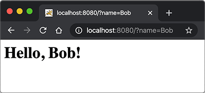

# Servlet开发

在上一节中，我们看到，一个完整的Web应用程序的开发流程如下：

1. 编写Servlet；
2. 打包为war文件；
3. 复制到Tomcat的webapps目录下；
4. 启动Tomcat。

这个过程是不是很繁琐？如果我们想在IDE中断点调试，还需要打开Tomcat的远程调试端口并且连接上去。


许多初学者经常卡在如何在IDE中启动Tomcat并加载webapp，更不要说断点调试了。

我们需要一种简单可靠，能直接在IDE中启动并调试webapp的方法。

因为Tomcat实际上也是一个Java程序，我们看看Tomcat的启动流程：

1. 启动JVM并执行Tomcat的`main()`方法；
2. 加载war并初始化Servlet；
3. 正常服务。

启动Tomcat无非就是设置好classpath并执行Tomcat某个jar包的`main()`方法，我们完全可以把Tomcat的jar包全部引入进来，然后自己编写一个`main()`方法，先启动Tomcat，然后让它加载我们的webapp就行。

我们新建一个`web-servlet-embedded`工程，编写`pom.xml`如下：

```xml
<project xmlns="http://maven.apache.org/POM/4.0.0"
    xmlns:xsi="http://www.w3.org/2001/XMLSchema-instance"
    xsi:schemaLocation="http://maven.apache.org/POM/4.0.0 http://maven.apache.org/xsd/maven-4.0.0.xsd">
    <modelVersion>4.0.0</modelVersion>

    <groupId>com.itranswarp.learnjava</groupId>
    <artifactId>web-servlet-embedded</artifactId>
    <version>1.0-SNAPSHOT</version>
    <packaging>war</packaging>

    <properties>
        <project.build.sourceEncoding>UTF-8</project.build.sourceEncoding>
        <project.reporting.outputEncoding>UTF-8</project.reporting.outputEncoding>
        <maven.compiler.source>17</maven.compiler.source>
        <maven.compiler.target>17</maven.compiler.target>
        <java.version>17</java.version>
        <tomcat.version>10.1.1</tomcat.version>
    </properties>

    <dependencies>
        <dependency>
            <groupId>org.apache.tomcat.embed</groupId>
            <artifactId>tomcat-embed-core</artifactId>
            <version>${tomcat.version}</version>
            <scope>provided</scope>
        </dependency>
        <dependency>
            <groupId>org.apache.tomcat.embed</groupId>
            <artifactId>tomcat-embed-jasper</artifactId>
            <version>${tomcat.version}</version>
            <scope>provided</scope>
        </dependency>
    </dependencies>
</project>
```

其中，`<packaging>`类型仍然为`war`，引入依赖`tomcat-embed-core`和`tomcat-embed-jasper`，引入的Tomcat版本`<tomcat.version>`为`10.1.1`。

不必引入Servlet API，因为引入Tomcat依赖后自动引入了Servlet API。因此，我们可以正常编写Servlet如下：

```java
@WebServlet(urlPatterns = "/")
public class HelloServlet extends HttpServlet {
    protected void doGet(HttpServletRequest req, HttpServletResponse resp) throws ServletException, IOException {
        resp.setContentType("text/html");
        String name = req.getParameter("name");
        if (name == null) {
            name = "world";
        }
        PrintWriter pw = resp.getWriter();
        pw.write("<h1>Hello, " + name + "!</h1>");
        pw.flush();
    }
}
```

然后，我们编写一个`main()`方法，启动Tomcat服务器：

```java
public class Main {
    public static void main(String[] args) throws Exception {
        // 启动Tomcat:
        Tomcat tomcat = new Tomcat();
        tomcat.setPort(Integer.getInteger("port", 8080));
        tomcat.getConnector();
        // 创建webapp:
        Context ctx = tomcat.addWebapp("", new File("src/main/webapp").getAbsolutePath());
        WebResourceRoot resources = new StandardRoot(ctx);
        resources.addPreResources(
                new DirResourceSet(resources, "/WEB-INF/classes", new File("target/classes").getAbsolutePath(), "/"));
        ctx.setResources(resources);
        tomcat.start();
        tomcat.getServer().await();
    }
}
```

这样，我们直接运行`main()`方法，即可启动嵌入式Tomcat服务器，然后，通过预设的`tomcat.addWebapp("", new File("src/main/webapp")`，Tomcat会自动加载当前工程作为根webapp，可直接在浏览器访问`http://localhost:8080/`：



通过`main()`方法启动Tomcat服务器并加载我们自己的webapp有如下好处：

1. 启动简单，无需下载Tomcat或安装任何IDE插件；
2. 调试方便，可在IDE中使用断点调试；
3. 使用Maven创建war包后，也可以正常部署到独立的Tomcat服务器中。

### 生成可执行war包

如果要生成可执行的war包，用`java -jar xxx.war`启动，则需要把Tomcat的依赖项的`<scope>`去掉，然后配置`maven-war-plugin`如下：

```xml
<project ...>
    ...
	<build>
		<finalName>hello</finalName>
		<plugins>
			<plugin>
				<groupId>org.apache.maven.plugins</groupId>
				<artifactId>maven-war-plugin</artifactId>
				<version>3.3.2</version>
				<configuration>
					<!-- 复制classes到war包根目录 -->
					<webResources>
						<resource>
							<directory>${project.build.directory}/classes</directory>
						</resource>
					</webResources>
					<archiveClasses>true</archiveClasses>
					<archive>
						<manifest>
							<!-- 添加Class-Path -->
							<addClasspath>true</addClasspath>
							<!-- Classpath前缀 -->
							<classpathPrefix>tmp-webapp/WEB-INF/lib/</classpathPrefix>
							<!-- main启动类 -->
							<mainClass>com.itranswarp.learnjava.Main</mainClass>
						</manifest>
					</archive>
				</configuration>
			</plugin>
		</plugins>
	</build>
</project>
```

生成的war包结构如下：

```ascii
hello.war
├── META-INF
│   ├── MANIFEST.MF
│   └── maven
│       └── ...
├── WEB-INF
│   ├── classes
│   ├── lib
│   │   ├── ecj-3.18.0.jar
│   │   ├── tomcat-annotations-api-10.1.1.jar
│   │   ├── tomcat-embed-core-10.1.1.jar
│   │   ├── tomcat-embed-el-10.1.1.jar
│   │   ├── tomcat-embed-jasper-10.1.1.jar
│   │   └── web-servlet-embedded-1.0-SNAPSHOT.jar
│   └── web.xml
└── com
    └── itranswarp
        └── learnjava
            ├── Main.class
            ├── TomcatRunner.class
            └── servlet
                └── HelloServlet.class
```

之所以要把编译后的classes复制到war包根目录，是因为用`java -jar hello.war`启动时，JVM的Class Loader不会查找`WEB-INF/lib`的jar包，而是直接从`hello.war`的根目录查找。`MANIFEST.MF`生成的内容如下：

```plain
Main-Class: com.itranswarp.learnjava.Main
Class-Path: tmp-webapp/WEB-INF/lib/tomcat-embed-core-10.1.1.jar tmp-weba
 pp/WEB-INF/lib/tomcat-annotations-api-10.1.1.jar tmp-webapp/WEB-INF/lib
 /tomcat-embed-jasper-10.1.1.jar tmp-webapp/WEB-INF/lib/tomcat-embed-el-
 10.1.1.jar tmp-webapp/WEB-INF/lib/ecj-3.18.0.jar
```

注意到`Class-Path`的路径，这里定义的`Class-Path`相当于`java -cp`指定的Classpath，JVM不会在一个jar包中查找jar包内的jar包，它只会在文件系统中搜索，因此，我们要修改`main()`方法，在执行`main()`方法时，先自解压`war`包，再启动Tomcat：

```java
public class Main {
    public static void main(String[] args) throws Exception {
        // 判定是否从jar/war启动:
        String jarFile = Main.class.getProtectionDomain().getCodeSource().getLocation().getFile();
        boolean isJarFile = jarFile.endsWith(".war") || jarFile.endsWith(".jar");
        // 定位webapp根目录:
        String webDir = isJarFile ? "tmp-webapp" : "src/main/webapp";
        if (isJarFile) {
            // 解压到tmp-webapp:
            Path baseDir = Paths.get(webDir).normalize().toAbsolutePath();
            if (Files.isDirectory(baseDir)) {
                Files.delete(baseDir);
            }
            Files.createDirectories(baseDir);
            System.out.println("extract to: " + baseDir);
            try (JarFile jar = new JarFile(jarFile)) {
                List<JarEntry> entries = jar.stream().sorted(Comparator.comparing(JarEntry::getName))
                        .collect(Collectors.toList());
                for (JarEntry entry : entries) {
                    Path res = baseDir.resolve(entry.getName());
                    if (!entry.isDirectory()) {
                        System.out.println(res);
                        Files.createDirectories(res.getParent());
                        Files.copy(jar.getInputStream(entry), res);
                    }
                }
            }
            // JVM退出时自动删除tmp-webapp:
            Runtime.getRuntime().addShutdownHook(new Thread(() -> {
                try {
                    Files.walk(baseDir).sorted(Comparator.reverseOrder()).map(Path::toFile).forEach(File::delete);
                } catch (IOException e) {
                    e.printStackTrace();
                }
            }));
        }
        // 启动Tomcat:
        TomcatRunner.run(webDir, isJarFile ? "tmp-webapp" : "target/classes");
    }
}

// Tomcat启动类:
class TomcatRunner {
    public static void run(String webDir, String baseDir) throws Exception {
        Tomcat tomcat = new Tomcat();
        tomcat.setPort(Integer.getInteger("port", 8080));
        tomcat.getConnector();
        Context ctx = tomcat.addWebapp("", new File(webDir).getAbsolutePath());
        WebResourceRoot resources = new StandardRoot(ctx);
        resources.addPreResources(new DirResourceSet(resources, "/WEB-INF/classes", new File(baseDir).getAbsolutePath(), "/"));
        ctx.setResources(resources);
        tomcat.start();
        tomcat.getServer().await();
    }
}
```

现在，执行`java -jar hello.war`时，JVM先定位`hello.war`的`Main`类，运行`main()`，自动解压后，文件系统目录如下：

```ascii
<work>
├── hello.war
└── tmp-webapp
    └── WEB-INF
        ├── lib
        │   ├── ecj-3.18.0.jar
        │   ├── tomcat-annotations-api-10.1.1.jar
        │   ├── tomcat-embed-core-10.1.1.jar
        │   ├── tomcat-embed-el-10.1.1.jar
        │   ├── tomcat-embed-jasper-10.1.1.jar
        │   └── web-servlet-embedded-1.0-SNAPSHOT.jar
        └── web.xml
```

解压后的目录结构和我们在`MANIFEST.MF`中设定的`Class-Path`一致，因此，JVM能顺利加载Tomcat的jar包，然后运行Tomcat，启动Web App。

编写可执行的jar或者war需要注意的几点：

- 必须在`MANIFEST.MF`中指定`Main-Class`和`Class-Path`；
- `Main`必须能在jar/war包的根目录下被JVM的Class Loader加载；
- `Main`负责解压jar/war，解压后的目录结构与`MANIFEST.MF`中设定的`Class-Path`一致；
- `Main`不能引用任何解压后才能被加载的类，例如`org.apache.catalina.startup.Tomcat`。

对SpringBoot有所了解的童鞋可能知道，SpringBoot也支持在`main()`方法中一行代码直接启动Tomcat，并且还能方便地更换成Jetty等其他服务器。它的启动方式和我们介绍的是基本一样的，后续涉及到SpringBoot的部分我们还会详细讲解。

### 练习

使用嵌入式Tomcat运行Servlet。

[下载练习](web-servlet-embedded.zip)

注意：引入的Tomcat的scope为`provided`，在Idea下运行时，需要设置`Run/Debug Configurations`，选择`Application - Main`，钩上`Include dependencies with "Provided" scope`，这样才能让Idea在运行时把Tomcat相关依赖包自动添加到classpath中。

### 小结

开发Servlet时，推荐使用`main()`方法启动嵌入式Tomcat服务器并加载当前工程的webapp，便于开发调试，且不影响打包部署，能极大地提升开发效率。
