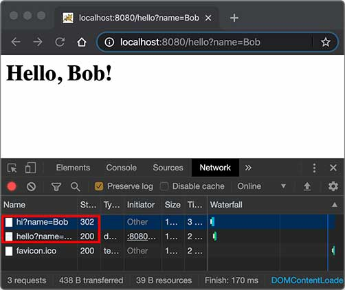
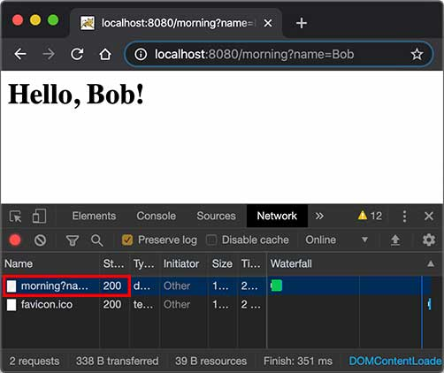

# 重定向与转发

### Redirect

重定向是指当浏览器请求一个URL时，服务器返回一个重定向指令，告诉浏览器地址已经变了，麻烦使用新的URL再重新发送新请求。

例如，我们已经编写了一个能处理`/hello`的`HelloServlet`，如果收到的路径为`/hi`，希望能重定向到`/hello`，可以再编写一个`RedirectServlet`：

```java
@WebServlet(urlPatterns = "/hi")
public class RedirectServlet extends HttpServlet {
    protected void doGet(HttpServletRequest req, HttpServletResponse resp) throws ServletException, IOException {
        // 构造重定向的路径:
        String name = req.getParameter("name");
        String redirectToUrl = "/hello" + (name == null ? "" : "?name=" + name);
        // 发送重定向响应:
        resp.sendRedirect(redirectToUrl);
    }
}
```

如果浏览器发送`GET /hi`请求，`RedirectServlet`将处理此请求。由于`RedirectServlet`在内部又发送了重定向响应，因此，浏览器会收到如下响应：

```plain
HTTP/1.1 302 Found
Location: /hello
```

当浏览器收到302响应后，它会立刻根据`Location`的指示发送一个新的`GET /hello`请求，这个过程就是重定向：

```ascii
┌───────┐   GET /hi     ┌───────────────┐
│Browser│ ────────────▶ │RedirectServlet│
│       │ ◀──────────── │               │
└───────┘   302         └───────────────┘


┌───────┐  GET /hello   ┌───────────────┐
│Browser│ ────────────▶ │ HelloServlet  │
│       │ ◀──────────── │               │
└───────┘   200 <html>  └───────────────┘
```

观察Chrome浏览器的网络请求，可以看到两次HTTP请求：



并且浏览器的地址栏路径自动更新为`/hello`。

重定向有两种：一种是302响应，称为临时重定向，一种是301响应，称为永久重定向。两者的区别是，如果服务器发送301永久重定向响应，浏览器会缓存`/hi`到`/hello`这个重定向的关联，下次请求`/hi`的时候，浏览器就直接发送`/hello`请求了。

重定向有什么作用？重定向的目的是当Web应用升级后，如果请求路径发生了变化，可以将原来的路径重定向到新路径，从而避免浏览器请求原路径找不到资源。

`HttpServletResponse`提供了快捷的`redirect()`方法实现302重定向。如果要实现301永久重定向，可以这么写：

```java
resp.setStatus(HttpServletResponse.SC_MOVED_PERMANENTLY); // 301
resp.setHeader("Location", "/hello");
```

### Forward

Forward是指内部转发。当一个Servlet处理请求的时候，它可以决定自己不继续处理，而是转发给另一个Servlet处理。

例如，我们已经编写了一个能处理`/hello`的`HelloServlet`，继续编写一个能处理`/morning`的`ForwardServlet`：

```java
@WebServlet(urlPatterns = "/morning")
public class ForwardServlet extends HttpServlet {
    protected void doGet(HttpServletRequest req, HttpServletResponse resp) throws ServletException, IOException {
        req.getRequestDispatcher("/hello").forward(req, resp);
    }
}
```

`ForwardServlet`在收到请求后，它并不自己发送响应，而是把请求和响应都转发给路径为`/hello`的Servlet，即下面的代码：

```java
req.getRequestDispatcher("/hello").forward(req, resp);
```

后续请求的处理实际上是由`HelloServlet`完成的。这种处理方式称为转发（Forward），我们用流程图画出来如下：

```ascii
                          ┌────────────────────────┐
                          │      ┌───────────────┐ │
                          │ ────▶│ForwardServlet │ │
┌───────┐  GET /morning   │      └───────────────┘ │
│Browser│ ──────────────▶ │              │         │
│       │ ◀────────────── │              ▼         │
└───────┘    200 <html>   │      ┌───────────────┐ │
                          │ ◀────│ HelloServlet  │ │
                          │      └───────────────┘ │
                          │       Web Server       │
                          └────────────────────────┘
```

转发和重定向的区别在于，转发是在Web服务器内部完成的，对浏览器来说，它只发出了一个HTTP请求：



注意到使用转发的时候，浏览器的地址栏路径仍然是`/morning`，浏览器并不知道该请求在Web服务器内部实际上做了一次转发。

### 练习

在Servlet中使用重定向和转发。

[下载练习](web-servlet-redirect-forward.zip)

### 小结

使用重定向时，浏览器知道重定向规则，并且会自动发起新的HTTP请求；

使用转发时，浏览器并不知道服务器内部的转发逻辑。
