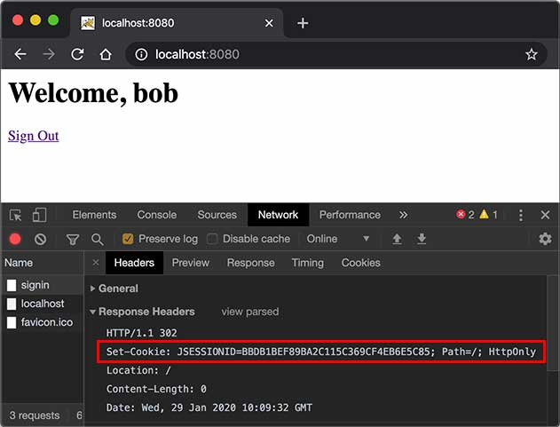
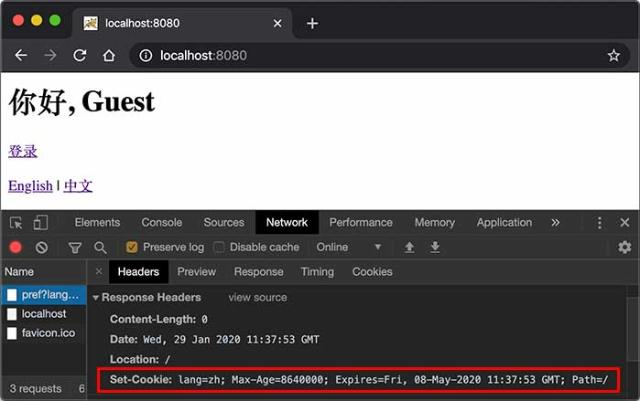

# 使用Session和Cookie

在Web应用程序中，我们经常要跟踪用户身份。当一个用户登录成功后，如果他继续访问其他页面，Web程序如何才能识别出该用户身份？

因为HTTP协议是一个无状态协议，即Web应用程序无法区分收到的两个HTTP请求是否是同一个浏览器发出的。为了跟踪用户状态，服务器可以向浏览器分配一个唯一ID，并以Cookie的形式发送到浏览器，浏览器在后续访问时总是附带此Cookie，这样，服务器就可以识别用户身份。

### Session

我们把这种基于唯一ID识别用户身份的机制称为Session。每个用户第一次访问服务器后，会自动获得一个Session ID。如果用户在一段时间内没有访问服务器，那么Session会自动失效，下次即使带着上次分配的Session ID访问，服务器也认为这是一个新用户，会分配新的Session ID。

JavaEE的Servlet机制内建了对Session的支持。我们以登录为例，当一个用户登录成功后，我们就可以把这个用户的名字放入一个`HttpSession`对象，以便后续访问其他页面的时候，能直接从`HttpSession`取出用户名：

```java
@WebServlet(urlPatterns = "/signin")
public class SignInServlet extends HttpServlet {
    // 模拟一个数据库:
    private Map<String, String> users = Map.of("bob", "bob123", "alice", "alice123", "tom", "tomcat");

    // GET请求时显示登录页:
    protected void doGet(HttpServletRequest req, HttpServletResponse resp) throws ServletException, IOException {
        resp.setContentType("text/html");
        PrintWriter pw = resp.getWriter();
        pw.write("<h1>Sign In</h1>");
        pw.write("<form action=\"/signin\" method=\"post\">");
        pw.write("<p>Username: <input name=\"username\"></p>");
        pw.write("<p>Password: <input name=\"password\" type=\"password\"></p>");
        pw.write("<p><button type=\"submit\">Sign In</button> <a href=\"/\">Cancel</a></p>");
        pw.write("</form>");
        pw.flush();
    }

    // POST请求时处理用户登录:
    protected void doPost(HttpServletRequest req, HttpServletResponse resp) throws ServletException, IOException {
        String name = req.getParameter("username");
        String password = req.getParameter("password");
        String expectedPassword = users.get(name.toLowerCase());
        if (expectedPassword != null && expectedPassword.equals(password)) {
            // 登录成功:
            req.getSession().setAttribute("user", name);
            resp.sendRedirect("/");
        } else {
            resp.sendError(HttpServletResponse.SC_FORBIDDEN);
        }
    }
}
```

上述`SignInServlet`在判断用户登录成功后，立刻将用户名放入当前`HttpSession`中：

```java
HttpSession session = req.getSession();
session.setAttribute("user", name);
```

在`IndexServlet`中，可以从`HttpSession`取出用户名：

```java
@WebServlet(urlPatterns = "/")
public class IndexServlet extends HttpServlet {
    protected void doGet(HttpServletRequest req, HttpServletResponse resp) throws ServletException, IOException {
        // 从HttpSession获取当前用户名:
        String user = (String) req.getSession().getAttribute("user");
        resp.setContentType("text/html");
        resp.setCharacterEncoding("UTF-8");
        resp.setHeader("X-Powered-By", "JavaEE Servlet");
        PrintWriter pw = resp.getWriter();
        pw.write("<h1>Welcome, " + (user != null ? user : "Guest") + "</h1>");
        if (user == null) {
            // 未登录，显示登录链接:
            pw.write("<p><a href=\"/signin\">Sign In</a></p>");
        } else {
            // 已登录，显示登出链接:
            pw.write("<p><a href=\"/signout\">Sign Out</a></p>");
        }
        pw.flush();
    }
}
```

如果用户已登录，可以通过访问`/signout`登出。登出逻辑就是从`HttpSession`中移除用户相关信息：

```java
@WebServlet(urlPatterns = "/signout")
public class SignOutServlet extends HttpServlet {
    protected void doGet(HttpServletRequest req, HttpServletResponse resp) throws ServletException, IOException {
        // 从HttpSession移除用户名:
        req.getSession().removeAttribute("user");
        resp.sendRedirect("/");
    }
}
```

对于Web应用程序来说，我们总是通过`HttpSession`这个高级接口访问当前Session。如果要深入理解Session原理，可以认为Web服务器在内存中自动维护了一个ID到`HttpSession`的映射表，我们可以用下图表示：

```ascii
           ┌ ─ ─ ─ ─ ─ ─ ─ ─ ─ ─ ─ ─ ─ ─ ─ ─ ─ ─ ─ ┐

           │      ┌───────────────┐                │
             ┌───▶│ IndexServlet  │◀──────────┐
           │ │    └───────────────┘           ▼    │
┌───────┐    │    ┌───────────────┐      ┌────────┐
│Browser│──┼─┼───▶│ SignInServlet │◀────▶│Sessions││
└───────┘    │    └───────────────┘      └────────┘
           │ │    ┌───────────────┐           ▲    │
             └───▶│SignOutServlet │◀──────────┘
           │      └───────────────┘                │

           └ ─ ─ ─ ─ ─ ─ ─ ─ ─ ─ ─ ─ ─ ─ ─ ─ ─ ─ ─ ┘
```

而服务器识别Session的关键就是依靠一个名为`JSESSIONID`的Cookie。在Servlet中第一次调用`req.getSession()`时，Servlet容器自动创建一个Session ID，然后通过一个名为`JSESSIONID`的Cookie发送给浏览器：



这里要注意的几点是：

- `JSESSIONID`是由Servlet容器自动创建的，目的是维护一个浏览器会话，它和我们的登录逻辑没有关系；
- 登录和登出的业务逻辑是我们自己根据`HttpSession`是否存在一个`"user"`的Key判断的，登出后，Session ID并不会改变；
- 即使没有登录功能，仍然可以使用`HttpSession`追踪用户，例如，放入一些用户配置信息等。

除了使用Cookie机制可以实现Session外，还可以通过隐藏表单、URL末尾附加ID来追踪Session。这些机制很少使用，最常用的Session机制仍然是Cookie。

使用Session时，由于服务器把所有用户的Session都存储在内存中，如果遇到内存不足的情况，就需要把部分不活动的Session序列化到磁盘上，这会大大降低服务器的运行效率，因此，放入Session的对象要小，通常我们放入一个简单的`User`对象就足够了：

```java
public class User {
    public long id; // 唯一标识
    public String email;
    public String name;
}
```

在使用多台服务器构成集群时，使用Session会遇到一些额外的问题。通常，多台服务器集群使用反向代理作为网站入口：

```ascii
                                     ┌────────────┐
                                ┌───▶│Web Server 1│
                                │    └────────────┘
┌───────┐     ┌─────────────┐   │    ┌────────────┐
│Browser│────▶│Reverse Proxy│───┼───▶│Web Server 2│
└───────┘     └─────────────┘   │    └────────────┘
                                │    ┌────────────┐
                                └───▶│Web Server 3│
                                     └────────────┘
```

如果多台Web Server采用无状态集群，那么反向代理总是以轮询方式将请求依次转发给每台Web Server，这会造成一个用户在Web Server 1存储的Session信息，在Web Server 2和3上并不存在，即从Web Server 1登录后，如果后续请求被转发到Web Server 2或3，那么用户看到的仍然是未登录状态。

要解决这个问题，方案一是在所有Web Server之间进行Session复制，但这样会严重消耗网络带宽，并且，每个Web Server的内存均存储所有用户的Session，内存使用率很低。

另一个方案是采用粘滞会话（Sticky Session）机制，即反向代理在转发请求的时候，总是根据JSESSIONID的值判断，相同的JSESSIONID总是转发到固定的Web Server，但这需要反向代理的支持。

无论采用何种方案，使用Session机制，会使得Web Server的集群很难扩展，因此，Session适用于中小型Web应用程序。对于大型Web应用程序来说，通常需要避免使用Session机制。

### Cookie

实际上，Servlet提供的`HttpSession`本质上就是通过一个名为`JSESSIONID`的Cookie来跟踪用户会话的。除了这个名称外，其他名称的Cookie我们可以任意使用。

如果我们想要设置一个Cookie，例如，记录用户选择的语言，可以编写一个`LanguageServlet`：

```java
@WebServlet(urlPatterns = "/pref")
public class LanguageServlet extends HttpServlet {

    private static final Set<String> LANGUAGES = Set.of("en", "zh");

    protected void doGet(HttpServletRequest req, HttpServletResponse resp) throws ServletException, IOException {
        String lang = req.getParameter("lang");
        if (LANGUAGES.contains(lang)) {
            // 创建一个新的Cookie:
            Cookie cookie = new Cookie("lang", lang);
            // 该Cookie生效的路径范围:
            cookie.setPath("/");
            // 该Cookie有效期:
            cookie.setMaxAge(8640000); // 8640000秒=100天
            // 将该Cookie添加到响应:
            resp.addCookie(cookie);
        }
        resp.sendRedirect("/");
    }
}
```

创建一个新Cookie时，除了指定名称和值以外，通常需要设置`setPath("/")`，浏览器根据此前缀决定是否发送Cookie。如果一个Cookie调用了`setPath("/user/")`，那么浏览器只有在请求以`/user/`开头的路径时才会附加此Cookie。通过`setMaxAge()`设置Cookie的有效期，单位为秒，最后通过`resp.addCookie()`把它添加到响应。

如果访问的是https网页，还需要调用`setSecure(true)`，否则浏览器不会发送该Cookie。

因此，务必注意：浏览器在请求某个URL时，是否携带指定的Cookie，取决于Cookie是否满足以下所有要求：

- URL前缀是设置Cookie时的Path；
- Cookie在有效期内；
- Cookie设置了secure时必须以https访问。

我们可以在浏览器看到服务器发送的Cookie：



如果我们要读取Cookie，例如，在`IndexServlet`中，读取名为`lang`的Cookie以获取用户设置的语言，可以写一个方法如下：

```java
private String parseLanguageFromCookie(HttpServletRequest req) {
    // 获取请求附带的所有Cookie:
    Cookie[] cookies = req.getCookies();
    // 如果获取到Cookie:
    if (cookies != null) {
        // 循环每个Cookie:
        for (Cookie cookie : cookies) {
            // 如果Cookie名称为lang:
            if (cookie.getName().equals("lang")) {
                // 返回Cookie的值:
                return cookie.getValue();
            }
        }
    }
    // 返回默认值:
    return "en";
}
```

可见，读取Cookie主要依靠遍历`HttpServletRequest`附带的所有Cookie。

### 练习

在Servlet中使用Session和Cookie。

[下载练习](web-servlet-session-cookie.zip)

### 小结

Servlet容器提供了Session机制以跟踪用户；

默认的Session机制是以Cookie形式实现的，Cookie名称为`JSESSIONID`；

通过读写Cookie可以在客户端设置用户偏好等。
