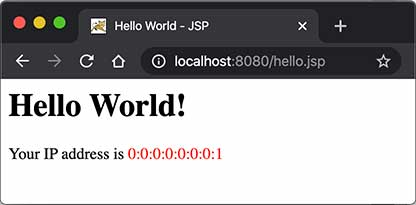

# JSP开发

我们从前面的章节可以看到，Servlet就是一个能处理HTTP请求，发送HTTP响应的小程序，而发送响应无非就是获取`PrintWriter`，然后输出HTML：

```java
PrintWriter pw = resp.getWriter();
pw.write("<html>");
pw.write("<body>");
pw.write("<h1>Welcome, " + name + "!</h1>");
pw.write("</body>");
pw.write("</html>");
pw.flush();
```

只不过，用PrintWriter输出HTML比较痛苦，因为不但要正确编写HTML，还需要插入各种变量。如果想在Servlet中输出一个类似新浪首页的HTML，写对HTML基本上不太可能。

那有没有更简单的输出HTML的办法？

### 有！

我们可以使用JSP。

JSP是Java Server Pages的缩写，它的文件必须放到`/src/main/webapp`下，文件名必须以`.jsp`结尾，整个文件与HTML并无太大区别，但需要插入变量，或者动态输出的地方，使用特殊指令`<% ... %>`。

我们来编写一个`hello.jsp`，内容如下：

```jsp
<html>
<head>
    <title>Hello World - JSP</title>
</head>
<body>
    <%-- JSP Comment --%>
    <h1>Hello World!</h1>
    <p>
    <%
         out.println("Your IP address is ");
    %>
    <span style="color:red">
        <%= request.getRemoteAddr() %>
    </span>
    </p>
</body>
</html>
```

整个JSP的内容实际上是一个HTML，但是稍有不同：

- 包含在`<%--`和`--%>`之间的是JSP的注释，它们会被完全忽略；
- 包含在`<%`和`%>`之间的是Java代码，可以编写任意Java代码；
- 如果使用`<%= xxx %>`则可以快捷输出一个变量的值。

JSP页面内置了几个变量：

- out：表示HttpServletResponse的PrintWriter；
- session：表示当前HttpSession对象；
- request：表示HttpServletRequest对象。

这几个变量可以直接使用。

访问JSP页面时，直接指定完整路径。例如，`http://localhost:8080/hello.jsp`，浏览器显示如下：



JSP和Servlet有什么区别？其实它们没有任何区别，因为JSP在执行前首先被编译成一个Servlet。在Tomcat的临时目录下，可以找到一个`hello_jsp.java`的源文件，这个文件就是Tomcat把JSP自动转换成的Servlet源码：

```java
package org.apache.jsp;
import ...

public final class hello_jsp extends org.apache.jasper.runtime.HttpJspBase
    implements org.apache.jasper.runtime.JspSourceDependent,
               org.apache.jasper.runtime.JspSourceImports {

    ...

    public void _jspService(final javax.servlet.http.HttpServletRequest request, final javax.servlet.http.HttpServletResponse response)
        throws java.io.IOException, javax.servlet.ServletException {
        ...
        out.write("<html>\n");
        out.write("<head>\n");
        out.write("    <title>Hello World - JSP</title>\n");
        out.write("</head>\n");
        out.write("<body>\n");
        ...
    }
    ...
}
```

可见JSP本质上就是一个Servlet，只不过无需配置映射路径，Web Server会根据路径查找对应的`.jsp`文件，如果找到了，就自动编译成Servlet再执行。在服务器运行过程中，如果修改了JSP的内容，那么服务器会自动重新编译。

### JSP高级功能

JSP的指令非常复杂，除了`<% ... %>`外，JSP页面本身可以通过`page`指令引入Java类：

```jsp
<%@ page import="java.io.*" %>
<%@ page import="java.util.*" %>
```

这样后续的Java代码才能引用简单类名而不是完整类名。

使用`include`指令可以引入另一个JSP文件：

```jsp
<html>
<body>
    <%@ include file="header.jsp"%>
    <h1>Index Page</h1>
    <%@ include file="footer.jsp"%>
</body>
```

### JSP Tag

JSP还允许自定义输出的tag，例如：

```jsp
<c:out value = "${sessionScope.user.name}"/>
```

JSP Tag需要正确引入taglib的jar包，并且还需要正确声明，使用起来非常复杂，对于页面开发来说，*不推荐*使用JSP Tag，因为我们后续会介绍更简单的模板引擎，这里我们不再介绍如何使用taglib。

### 练习

编写一个简单的JSP文件，输出当前日期和时间。

[下载练习](web-jsp-hello.zip)

### 小结

JSP是一种在HTML中嵌入动态输出的文件，它和Servlet正好相反，Servlet是在Java代码中嵌入输出HTML；

JSP可以引入并使用JSP Tag，但由于其语法复杂，不推荐使用；

JSP本身目前已经很少使用，我们只需要了解其基本用法即可。
