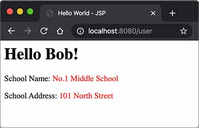

# MVC开发

我们通过前面的章节可以看到：

- Servlet适合编写Java代码，实现各种复杂的业务逻辑，但不适合输出复杂的HTML；
- JSP适合编写HTML，并在其中插入动态内容，但不适合编写复杂的Java代码。

能否将两者结合起来，发挥各自的优点，避免各自的缺点？

答案是肯定的。我们来看一个具体的例子。

假设我们已经编写了几个JavaBean：

```java
public class User {
    public long id;
    public String name;
    public School school;
}

public class School {
    public String name;
    public String address;
}
```

在`UserServlet`中，我们可以从数据库读取`User`、`School`等信息，然后，把读取到的JavaBean先放到HttpServletRequest中，再通过`forward()`传给`user.jsp`处理：

```java
@WebServlet(urlPatterns = "/user")
public class UserServlet extends HttpServlet {
    protected void doGet(HttpServletRequest req, HttpServletResponse resp) throws ServletException, IOException {
        // 假装从数据库读取:
        School school = new School("No.1 Middle School", "101 South Street");
        User user = new User(123, "Bob", school);
        // 放入Request中:
        req.setAttribute("user", user);
        // forward给user.jsp:
        req.getRequestDispatcher("/WEB-INF/user.jsp").forward(req, resp);
    }
}
```

在`user.jsp`中，我们只负责展示相关JavaBean的信息，不需要编写访问数据库等复杂逻辑：

```jsp
<%@ page import="com.itranswarp.learnjava.bean.*"%>
<%
    User user = (User) request.getAttribute("user");
%>
<html>
<head>
    <title>Hello World - JSP</title>
</head>
<body>
    <h1>Hello <%= user.name %>!</h1>
    <p>School Name:
    <span style="color:red">
        <%= user.school.name %>
    </span>
    </p>
    <p>School Address:
    <span style="color:red">
        <%= user.school.address %>
    </span>
    </p>
</body>
</html>
```

请注意几点：

- 需要展示的`User`被放入`HttpServletRequest`中以便传递给JSP，因为一个请求对应一个`HttpServletRequest`，我们也无需清理它，处理完该请求后`HttpServletRequest`实例将被丢弃；
- 把`user.jsp`放到`/WEB-INF/`目录下，是因为`WEB-INF`是一个特殊目录，Web Server会阻止浏览器对`WEB-INF`目录下任何资源的访问，这样就防止用户通过`/user.jsp`路径直接访问到JSP页面；
- JSP页面首先从`request`变量获取`User`实例，然后在页面中直接输出，此处未考虑HTML的转义问题，有潜在安全风险。

我们在浏览器访问`http://localhost:8080/user`，请求首先由`UserServlet`处理，然后交给`user.jsp`渲染：



我们把`UserServlet`看作业务逻辑处理，把`User`看作模型，把`user.jsp`看作渲染，这种设计模式通常被称为MVC：Model-View-Controller，即`UserServlet`作为控制器（Controller），`User`作为模型（Model），`user.jsp`作为视图（View），整个MVC架构如下：

```ascii
                   ┌───────────────────────┐
             ┌────▶│Controller: UserServlet│
             │     └───────────────────────┘
             │                 │
┌───────┐    │           ┌─────┴─────┐
│Browser│────┘           │Model: User│
│       │◀───┐           └─────┬─────┘
└───────┘    │                 │
             │                 ▼
             │     ┌───────────────────────┐
             └─────│    View: user.jsp     │
                   └───────────────────────┘
```

使用MVC模式的好处是，Controller专注于业务处理，它的处理结果就是Model。Model可以是一个JavaBean，也可以是一个包含多个对象的Map，Controller只负责把Model传递给View，View只负责把Model给“渲染”出来，这样，三者职责明确，且开发更简单，因为开发Controller时无需关注页面，开发View时无需关心如何创建Model。

MVC模式广泛地应用在Web页面和传统的桌面程序中，我们在这里通过Servlet和JSP实现了一个简单的MVC模型，但它还不够简洁和灵活，后续我们会介绍更简单的Spring MVC开发。

### 练习

使用MVC开发。

[下载练习](web-servlet-jsp.zip)

### 小结

MVC模式是一种分离业务逻辑和显示逻辑的设计模式，广泛应用在Web和桌面应用程序。
