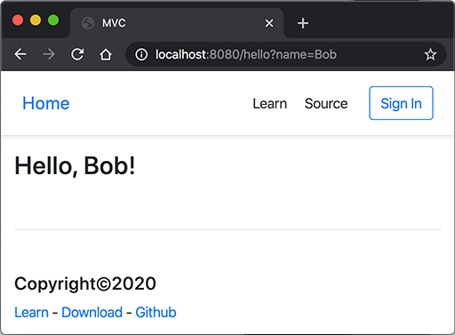

# MVC高级开发

通过结合Servlet和JSP的MVC模式，我们可以发挥二者各自的优点：

- Servlet实现业务逻辑；
- JSP实现展示逻辑。

但是，直接把MVC搭在Servlet和JSP之上还是不太好，原因如下：

- Servlet提供的接口仍然偏底层，需要实现Servlet调用相关接口；
- JSP对页面开发不友好，更好的替代品是模板引擎；
- 业务逻辑最好由纯粹的Java类实现，而不是强迫继承自Servlet。

能不能通过普通的Java类实现MVC的Controller？类似下面的代码：

```java
public class UserController {
    @GetMapping("/signin")
    public ModelAndView signin() {
        ...
    }

    @PostMapping("/signin")
    public ModelAndView doSignin(SignInBean bean) {
        ...
    }

    @GetMapping("/signout")
    public ModelAndView signout(HttpSession session) {
        ...
    }
}
```

上面的这个Java类每个方法都对应一个GET或POST请求，方法返回值是`ModelAndView`，它包含一个View的路径以及一个Model，这样，再由MVC框架处理后返回给浏览器。

如果是GET请求，我们希望MVC框架能直接把URL参数按方法参数对应起来然后传入：

```java
@GetMapping("/hello")
public ModelAndView hello(String name) {
    ...
}
```

如果是POST请求，我们希望MVC框架能直接把Post参数变成一个JavaBean后通过方法参数传入：

```java
@PostMapping("/signin")
public ModelAndView doSignin(SignInBean bean) {
    ...
}
```

为了增加灵活性，如果Controller的方法在处理请求时需要访问`HttpServletRequest`、`HttpServletResponse`、`HttpSession`这些实例时，只要方法参数有定义，就可以自动传入：

```java
@GetMapping("/signout")
public ModelAndView signout(HttpSession session) {
    ...
}
```

以上就是我们在设计MVC框架时，上层代码所需要的一切信息。

### 设计MVC框架

如何设计一个MVC框架？在上文中，我们已经定义了上层代码编写Controller的一切接口信息，并且并不要求实现特定接口，只需返回`ModelAndView`对象，该对象包含一个`View`和一个`Model`。实际上`View`就是模板的路径，而`Model`可以用一个`Map<String, Object>`表示，因此，`ModelAndView`定义非常简单：

```java
public class ModelAndView {
    Map<String, Object> model;
    String view;
}
```

比较复杂的是我们需要在MVC框架中创建一个接收所有请求的`Servlet`，通常我们把它命名为`DispatcherServlet`，它总是映射到`/`，然后，根据不同的Controller的方法定义的`@Get`或`@Post`的Path决定调用哪个方法，最后，获得方法返回的`ModelAndView`后，渲染模板，写入`HttpServletResponse`，即完成了整个MVC的处理。

这个MVC的架构如下：

```ascii
   HTTP Request    ┌─────────────────┐
──────────────────▶│DispatcherServlet│
                   └─────────────────┘
                            │
               ┌────────────┼────────────┐
               ▼            ▼            ▼
         ┌───────────┐┌───────────┐┌───────────┐
         │Controller1││Controller2││Controller3│
         └───────────┘└───────────┘└───────────┘
               │            │            │
               └────────────┼────────────┘
                            ▼
   HTTP Response ┌────────────────────┐
◀────────────────│render(ModelAndView)│
                 └────────────────────┘
```

其中，`DispatcherServlet`以及如何渲染均由MVC框架实现，在MVC框架之上只需要编写每一个Controller。

我们来看看如何编写最复杂的`DispatcherServlet`。首先，我们需要存储请求路径到某个具体方法的映射：

```java
@WebServlet(urlPatterns = "/")
public class DispatcherServlet extends HttpServlet {
    private Map<String, GetDispatcher> getMappings = new HashMap<>();
    private Map<String, PostDispatcher> postMappings = new HashMap<>();
}
```

处理一个GET请求是通过`GetDispatcher`对象完成的，它需要如下信息：

```java
class GetDispatcher {
    Object instance; // Controller实例
    Method method; // Controller方法
    String[] parameterNames; // 方法参数名称
    Class<?>[] parameterClasses; // 方法参数类型
}
```

有了以上信息，就可以定义`invoke()`来处理真正的请求：

```java
class GetDispatcher {
    ...
    public ModelAndView invoke(HttpServletRequest request, HttpServletResponse response) {
        Object[] arguments = new Object[parameterClasses.length];
        for (int i = 0; i < parameterClasses.length; i++) {
            String parameterName = parameterNames[i];
            Class<?> parameterClass = parameterClasses[i];
            if (parameterClass == HttpServletRequest.class) {
                arguments[i] = request;
            } else if (parameterClass == HttpServletResponse.class) {
                arguments[i] = response;
            } else if (parameterClass == HttpSession.class) {
                arguments[i] = request.getSession();
            } else if (parameterClass == int.class) {
                arguments[i] = Integer.valueOf(getOrDefault(request, parameterName, "0"));
            } else if (parameterClass == long.class) {
                arguments[i] = Long.valueOf(getOrDefault(request, parameterName, "0"));
            } else if (parameterClass == boolean.class) {
                arguments[i] = Boolean.valueOf(getOrDefault(request, parameterName, "false"));
            } else if (parameterClass == String.class) {
                arguments[i] = getOrDefault(request, parameterName, "");
            } else {
                throw new RuntimeException("Missing handler for type: " + parameterClass);
            }
        }
        return (ModelAndView) this.method.invoke(this.instance, arguments);
    }

    private String getOrDefault(HttpServletRequest request, String name, String defaultValue) {
        String s = request.getParameter(name);
        return s == null ? defaultValue : s;
    }
}
```

上述代码比较繁琐，但逻辑非常简单，即通过构造某个方法需要的所有参数列表，使用反射调用该方法后返回结果。

类似的，`PostDispatcher`需要如下信息：

```java
class PostDispatcher {
    Object instance; // Controller实例
    Method method; // Controller方法
    Class<?>[] parameterClasses; // 方法参数类型
    ObjectMapper objectMapper; // JSON映射
}
```

和GET请求不同，POST请求严格地来说不能有URL参数，所有数据都应当从Post Body中读取。这里我们为了简化处理，*只支持*JSON格式的POST请求，这样，把Post数据转化为JavaBean就非常容易。

```java
class PostDispatcher {
    ...
    public ModelAndView invoke(HttpServletRequest request, HttpServletResponse response) {
        Object[] arguments = new Object[parameterClasses.length];
        for (int i = 0; i < parameterClasses.length; i++) {
            Class<?> parameterClass = parameterClasses[i];
            if (parameterClass == HttpServletRequest.class) {
                arguments[i] = request;
            } else if (parameterClass == HttpServletResponse.class) {
                arguments[i] = response;
            } else if (parameterClass == HttpSession.class) {
                arguments[i] = request.getSession();
            } else {
                // 读取JSON并解析为JavaBean:
                BufferedReader reader = request.getReader();
                arguments[i] = this.objectMapper.readValue(reader, parameterClass);
            }
        }
        return (ModelAndView) this.method.invoke(instance, arguments);
    }
}
```

最后，我们来实现整个`DispatcherServlet`的处理流程，以`doGet()`为例：

```java
public class DispatcherServlet extends HttpServlet {
    ...
    @Override
    protected void doGet(HttpServletRequest req, HttpServletResponse resp) throws ServletException, IOException {
        resp.setContentType("text/html");
        resp.setCharacterEncoding("UTF-8");
        String path = req.getRequestURI().substring(req.getContextPath().length());
        // 根据路径查找GetDispatcher:
        GetDispatcher dispatcher = this.getMappings.get(path);
        if (dispatcher == null) {
            // 未找到返回404:
            resp.sendError(404);
            return;
        }
        // 调用Controller方法获得返回值:
        ModelAndView mv = dispatcher.invoke(req, resp);
        // 允许返回null:
        if (mv == null) {
            return;
        }
        // 允许返回`redirect:`开头的view表示重定向:
        if (mv.view.startsWith("redirect:")) {
            resp.sendRedirect(mv.view.substring(9));
            return;
        }
        // 将模板引擎渲染的内容写入响应:
        PrintWriter pw = resp.getWriter();
        this.viewEngine.render(mv, pw);
        pw.flush();
    }
}
```

这里有几个小改进：

- 允许Controller方法返回`null`，表示内部已自行处理完毕；
- 允许Controller方法返回以`redirect:`开头的view名称，表示一个重定向。

这样使得上层代码编写更灵活。例如，一个显示用户资料的请求可以这样写：

```java
@GetMapping("/user/profile")
public ModelAndView profile(HttpServletResponse response, HttpSession session) {
    User user = (User) session.getAttribute("user");
    if (user == null) {
        // 未登录，跳转到登录页:
        return new ModelAndView("redirect:/signin");
    }
    if (!user.isManager()) {
        // 权限不够，返回403:
        response.sendError(403);
        return null;
    }
    return new ModelAndView("/profile.html", Map.of("user", user));
}
```

最后一步是在`DispatcherServlet`的`init()`方法中初始化所有Get和Post的映射，以及用于渲染的模板引擎：

```java
public class DispatcherServlet extends HttpServlet {
    private Map<String, GetDispatcher> getMappings = new HashMap<>();
    private Map<String, PostDispatcher> postMappings = new HashMap<>();
    private ViewEngine viewEngine;

    @Override
    public void init() throws ServletException {
        this.getMappings = scanGetInControllers();
        this.postMappings = scanPostInControllers();
        this.viewEngine = new ViewEngine(getServletContext());
    }
    ...
}
```

如何扫描所有Controller以获取所有标记有`@GetMapping`和`@PostMapping`的方法？当然是使用反射了。虽然代码比较繁琐，但我们相信各位童鞋可以轻松实现。

这样，整个MVC框架就搭建完毕。

### 实现渲染

有的童鞋对如何使用模板引擎进行渲染有疑问，即如何实现上述的`ViewEngine`？其实`ViewEngine`非常简单，只需要实现一个简单的`render()`方法：

```java
public class ViewEngine {
    public void render(ModelAndView mv, Writer writer) throws IOException {
        String view = mv.view;
        Map<String, Object> model = mv.model;
        // 根据view找到模板文件:
        Template template = getTemplateByPath(view);
        // 渲染并写入Writer:
        template.write(writer, model);
    }
}
```

Java有很多开源的模板引擎，常用的有：

- [Thymeleaf](https://www.thymeleaf.org/)
- [FreeMarker](https://freemarker.apache.org/)
- [Velocity](https://velocity.apache.org/)

他们的用法都大同小异。这里我们推荐一个使用[Jinja](https://palletsprojects.com/p/jinja/)语法的模板引擎[Pebble](https://pebbletemplates.io/)，它的特点是语法简单，支持模板继承，编写出来的模板类似：

```html
<html>
<body>
  <ul>
  
    <li><a href="{{ user.url }}">{{ user.username }}</a></li>
  
  </ul>
</body>
</html>
```

即变量用`{{ xxx }}`表示，控制语句用``表示。

使用Pebble渲染只需要如下几行代码：

```java
public class ViewEngine {
    private final PebbleEngine engine;

    public ViewEngine(ServletContext servletContext) {
        // 定义一个ServletLoader用于加载模板:
        ServletLoader loader = new ServletLoader(servletContext);
        // 模板编码:
        loader.setCharset("UTF-8");
        // 模板前缀，这里默认模板必须放在`/WEB-INF/templates`目录:
        loader.setPrefix("/WEB-INF/templates");
        // 模板后缀:
        loader.setSuffix("");
        // 创建Pebble实例:
        this.engine = new PebbleEngine.Builder()
            .autoEscaping(true) // 默认打开HTML字符转义，防止XSS攻击
            .cacheActive(false) // 禁用缓存使得每次修改模板可以立刻看到效果
            .loader(loader).build();
    }

    public void render(ModelAndView mv, Writer writer) throws IOException {
        // 查找模板:
        PebbleTemplate template = this.engine.getTemplate(mv.view);
        // 渲染:
        template.evaluate(writer, mv.model);
    }
}
```

最后我们来看看整个工程的结构：

```ascii
web-mvc
├── pom.xml
└── src
    └── main
        ├── java
        │   └── com
        │       └── itranswarp
        │           └── learnjava
        │               ├── Main.java
        │               ├── bean
        │               │   ├── SignInBean.java
        │               │   └── User.java
        │               ├── controller
        │               │   ├── IndexController.java
        │               │   └── UserController.java
        │               └── framework
        │                   ├── DispatcherServlet.java
        │                   ├── FileServlet.java
        │                   ├── GetMapping.java
        │                   ├── ModelAndView.java
        │                   ├── PostMapping.java
        │                   └── ViewEngine.java
        └── webapp
            ├── WEB-INF
            │   ├── templates
            │   │   ├── _base.html
            │   │   ├── hello.html
            │   │   ├── index.html
            │   │   ├── profile.html
            │   │   └── signin.html
            │   └── web.xml
            └── static
                ├── css
                │   └── bootstrap.css
                └── js
                    ├── bootstrap.js
                    └── jquery.js
```

其中，`framework`包是MVC的框架，完全可以单独编译后作为一个Maven依赖引入，`controller`包才是我们需要编写的业务逻辑。

我们还硬性规定模板必须放在`webapp/WEB-INF/templates`目录下，静态文件必须放在`webapp/static`目录下，因此，为了便于开发，我们还顺带实现一个`FileServlet`来处理静态文件：

```java
@WebServlet(urlPatterns = { "/favicon.ico", "/static/*" })
public class FileServlet extends HttpServlet {
    protected void doGet(HttpServletRequest req, HttpServletResponse resp) throws ServletException, IOException {
        // 读取当前请求路径:
        ServletContext ctx = req.getServletContext();
        // RequestURI包含ContextPath,需要去掉:
        String urlPath = req.getRequestURI().substring(ctx.getContextPath().length());
        // 获取真实文件路径:
        String filepath = ctx.getRealPath(urlPath);
        if (filepath == null) {
            // 无法获取到路径:
            resp.sendError(HttpServletResponse.SC_NOT_FOUND);
            return;
        }
        Path path = Paths.get(filepath);
        if (!path.toFile().isFile()) {
            // 文件不存在:
            resp.sendError(HttpServletResponse.SC_NOT_FOUND);
            return;
        }
        // 根据文件名猜测Content-Type:
        String mime = Files.probeContentType(path);
        if (mime == null) {
            mime = "application/octet-stream";
        }
        resp.setContentType(mime);
        // 读取文件并写入Response:
        OutputStream output = resp.getOutputStream();
        try (InputStream input = new BufferedInputStream(new FileInputStream(filepath))) {
            input.transferTo(output);
        }
        output.flush();
    }
}
```

运行代码，在浏览器中输入URL`http://localhost:8080/hello?name=Bob`可以看到如下页面：



为了把方法参数的名称编译到class文件中，以便处理`@GetMapping`时使用，我们需要打开编译器的一个参数，在Eclipse中勾选`Preferences`-`Java`-`Compiler`-`Store information about method parameters (usable via reflection)`；在Idea中选择`Preferences`-`Build, Execution, Deployment`-`Compiler`-`Java Compiler`-`Additional command line parameters`，填入`-parameters`；在Maven的`pom.xml`添加一段配置如下：

```xml
<project ...>
    <modelVersion>4.0.0</modelVersion>
    ...
    <build>
        <plugins>
            <plugin>
                <groupId>org.apache.maven.plugins</groupId>
                <artifactId>maven-compiler-plugin</artifactId>
                <configuration>
                    <compilerArgs>
                        <arg>-parameters</arg>
                    </compilerArgs>
                </configuration>
            </plugin>
        </plugins>
    </build>
</project>
```

有些用过Spring MVC的童鞋会发现，本节实现的这个MVC框架，上层代码使用的公共类如`GetMapping`、`PostMapping`和`ModelAndView`都和Spring MVC非常类似。实际上，我们这个MVC框架主要参考就是Spring MVC，通过实现一个“简化版”MVC，可以掌握Java Web MVC开发的核心思想与原理，对将来直接使用Spring MVC是非常有帮助的。

### 练习

实现一个MVC框架。

[下载练习](web-mvc.zip)

### 小结

一个MVC框架是基于Servlet基础抽象出更高级的接口，使得上层基于MVC框架的开发可以不涉及Servlet相关的`HttpServletRequest`等接口，处理多个请求更加灵活，并且可以使用任意模板引擎，不必使用JSP。
