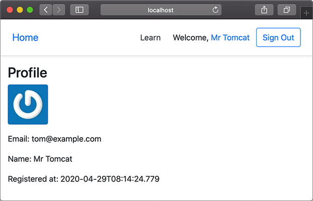

# 使用Spring MVC

我们已经介绍了Java Web的基础：Servlet容器，以及标准的Servlet组件：

- Servlet：能处理HTTP请求并将HTTP响应返回；
- JSP：一种嵌套Java代码的HTML，将被编译为Servlet；
- Filter：能过滤指定的URL以实现拦截功能；
- Listener：监听指定的事件，如ServletContext、HttpSession的创建和销毁。

此外，Servlet容器为每个Web应用程序自动创建一个唯一的`ServletContext`实例，这个实例就代表了Web应用程序本身。

在[MVC高级开发](../../../web/mvc-adv/index.html)中，我们手撸了一个MVC框架，接口和Spring MVC类似。如果直接使用Spring MVC，我们写出来的代码类似：

```java
@Controller
public class UserController {
    @GetMapping("/register")
    public ModelAndView register() {
        ...
    }

    @PostMapping("/signin")
    public ModelAndView signin(@RequestParam("email") String email, @RequestParam("password") String password) {
        ...
    }
    ...
}
```

但是，Spring提供的是一个IoC容器，所有的Bean，包括Controller，都在Spring IoC容器中被初始化，而Servlet容器由JavaEE服务器提供（如Tomcat），Servlet容器对Spring一无所知，他们之间到底依靠什么进行联系，又是以何种顺序初始化的？

在理解上述问题之前，我们先把基于Spring MVC开发的项目结构搭建起来。首先创建基于Web的Maven工程，引入如下依赖：

- org.springframework:spring-context:6.0.0
- org.springframework:spring-webmvc:6.0.0
- org.springframework:spring-jdbc:6.0.0
- jakarta.annotation:jakarta.annotation-api:2.1.1
- io.pebbletemplates:pebble-spring6:3.2.0
- ch.qos.logback:logback-core:1.4.4
- ch.qos.logback:logback-classic:1.4.4
- com.zaxxer:HikariCP:5.0.1
- org.hsqldb:hsqldb:2.7.0

以及`provided`依赖：

- org.apache.tomcat.embed:tomcat-embed-core:10.1.1
- org.apache.tomcat.embed:tomcat-embed-jasper:10.1.1

这个标准的Maven Web工程目录结构如下：

```ascii
spring-web-mvc
├── pom.xml
└── src
    └── main
        ├── java
        │   └── com
        │       └── itranswarp
        │           └── learnjava
        │               ├── AppConfig.java
        │               ├── DatabaseInitializer.java
        │               ├── entity
        │               │   └── User.java
        │               ├── service
        │               │   └── UserService.java
        │               └── web
        │                   └── UserController.java
        ├── resources
        │   ├── jdbc.properties
        │   └── logback.xml
        └── webapp
            ├── WEB-INF
            │   ├── templates
            │   │   ├── _base.html
            │   │   ├── index.html
            │   │   ├── profile.html
            │   │   ├── register.html
            │   │   └── signin.html
            │   └── web.xml
            └── static
                ├── css
                │   └── bootstrap.css
                └── js
                    └── jquery.js
```

其中，`src/main/webapp`是标准web目录，`WEB-INF`存放`web.xml`，编译的class，第三方jar，以及不允许浏览器直接访问的View模版，`static`目录存放所有静态文件。

在`src/main/resources`目录中存放的是Java程序读取的classpath资源文件，除了JDBC的配置文件`jdbc.properties`外，我们又新增了一个`logback.xml`，这是Logback的默认查找的配置文件：

```xml
<?xml version="1.0" encoding="UTF-8"?>
<configuration>
	<appender name="STDOUT"
		class="ch.qos.logback.core.ConsoleAppender">
		<layout class="ch.qos.logback.classic.PatternLayout">
			<Pattern>%d{yyyy-MM-dd HH:mm:ss} %-5level %logger{36} - %msg%n</Pattern>
		</layout>
	</appender>

	<logger name="com.itranswarp.learnjava" level="info" additivity="false">
		<appender-ref ref="STDOUT" />
	</logger>

	<root level="info">
		<appender-ref ref="STDOUT" />
	</root>
</configuration>
```

上面给出了一个写入到标准输出的Logback配置，可以基于上述配置添加写入到文件的配置。

在`src/main/java`中就是我们编写的Java代码了。

### 配置Spring MVC

和普通Spring配置一样，我们编写正常的`AppConfig`后，只需加上`@EnableWebMvc`注解，就“激活”了Spring MVC：

```java
@Configuration
@ComponentScan
@EnableWebMvc // 启用Spring MVC
@EnableTransactionManagement
@PropertySource("classpath:/jdbc.properties")
public class AppConfig {
    ...
}
```

除了创建`DataSource`、`JdbcTemplate`、`PlatformTransactionManager`外，`AppConfig`需要额外创建几个用于Spring MVC的Bean：

```java
@Bean
WebMvcConfigurer createWebMvcConfigurer() {
    return new WebMvcConfigurer() {
        @Override
        public void addResourceHandlers(ResourceHandlerRegistry registry) {
            registry.addResourceHandler("/static/**").addResourceLocations("/static/");
        }
    };
}
```

`WebMvcConfigurer`并不是必须的，但我们在这里创建一个默认的`WebMvcConfigurer`，只覆写`addResourceHandlers()`，目的是让Spring MVC自动处理静态文件，并且映射路径为`/static/**`。

另一个必须要创建的Bean是`ViewResolver`，因为Spring MVC允许集成任何模板引擎，使用哪个模板引擎，就实例化一个对应的`ViewResolver`：

```java
@Bean
ViewResolver createViewResolver(@Autowired ServletContext servletContext) {
    var engine = new PebbleEngine.Builder().autoEscaping(true)
            // cache:
            .cacheActive(false)
            // loader:
            .loader(new Servlet5Loader(servletContext))
            .build();
    var viewResolver = new PebbleViewResolver(engine);
    viewResolver.setPrefix("/WEB-INF/templates/");
    viewResolver.setSuffix("");
    return viewResolver;
}
```

`ViewResolver`通过指定`prefix`和`suffix`来确定如何查找View。上述配置使用Pebble引擎，指定模板文件存放在`/WEB-INF/templates/`目录下。

剩下的Bean都是普通的`@Component`，但Controller必须标记为`@Controller`，例如：

```java
// Controller使用@Controller标记而不是@Component:
@Controller
public class UserController {
    // 正常使用@Autowired注入:
    @Autowired
    UserService userService;

    // 处理一个URL映射:
    @GetMapping("/")
    public ModelAndView index() {
        ...
    }
    ...
}
```

如果是普通的Java应用程序，我们通过`main()`方法可以很简单地创建一个Spring容器的实例：

```java
public static void main(String[] args) {
    var context = new AnnotationConfigApplicationContext(AppConfig.class);
}
```

但是问题来了，现在是Web应用程序，而Web应用程序总是由Servlet容器创建，那么，Spring容器应该由谁创建？在什么时候创建？Spring容器中的Controller又是如何通过Servlet调用的？

在Web应用中启动Spring容器有很多种方法，可以通过Listener启动，也可以通过Servlet启动，可以使用XML配置，也可以使用注解配置。这里，我们只介绍一种*最简单*的启动Spring容器的方式。

第一步，我们在`web.xml`中配置Spring MVC提供的`DispatcherServlet`：

```xml
<?xml version="1.0"?>
<web-app>
    <servlet>
        <servlet-name>dispatcher</servlet-name>
        <servlet-class>org.springframework.web.servlet.DispatcherServlet</servlet-class>
        <init-param>
            <param-name>contextClass</param-name>
            <param-value>org.springframework.web.context.support.AnnotationConfigWebApplicationContext</param-value>
        </init-param>
        <init-param>
            <param-name>contextConfigLocation</param-name>
            <param-value>com.itranswarp.learnjava.AppConfig</param-value>
        </init-param>
        <load-on-startup>0</load-on-startup>
    </servlet>

    <servlet-mapping>
        <servlet-name>dispatcher</servlet-name>
        <url-pattern>/*</url-pattern>
    </servlet-mapping>
</web-app>
```

初始化参数`contextClass`指定使用注解配置的`AnnotationConfigWebApplicationContext`，配置文件的位置参数`contextConfigLocation`指向`AppConfig`的完整类名，最后，把这个Servlet映射到`/*`，即处理所有URL。

上述配置可以看作一个样板配置，有了这个配置，Servlet容器会首先初始化Spring MVC的`DispatcherServlet`，在`DispatcherServlet`启动时，它根据配置`AppConfig`创建了一个类型是`WebApplicationContext`的IoC容器，完成所有Bean的初始化，并将容器绑到`ServletContext`上。

因为`DispatcherServlet`持有IoC容器，能从IoC容器中获取所有`@Controller`的Bean，因此，`DispatcherServlet`接收到所有HTTP请求后，根据Controller方法配置的路径，就可以正确地把请求转发到指定方法，并根据返回的`ModelAndView`决定如何渲染页面。

最后，我们在`AppConfig`中通过`main()`方法启动嵌入式Tomcat：

```java
public static void main(String[] args) throws Exception {
    Tomcat tomcat = new Tomcat();
    tomcat.setPort(Integer.getInteger("port", 8080));
    tomcat.getConnector();
    Context ctx = tomcat.addWebapp("", new File("src/main/webapp").getAbsolutePath());
    WebResourceRoot resources = new StandardRoot(ctx);
    resources.addPreResources(
            new DirResourceSet(resources, "/WEB-INF/classes", new File("target/classes").getAbsolutePath(), "/"));
    ctx.setResources(resources);
    tomcat.start();
    tomcat.getServer().await();
}
```

上述Web应用程序就是我们使用Spring MVC时的一个最小启动功能集。由于使用了JDBC和数据库，用户的注册、登录信息会被持久化：



### 编写Controller

有了Web应用程序的最基本的结构，我们的重点就可以放在如何编写Controller上。Spring MVC对Controller没有固定的要求，也不需要实现特定的接口。以`UserController`为例，编写Controller只需要遵循以下要点：

总是标记`@Controller`而不是`@Component`：

```java
@Controller
public class UserController {
    ...
}
```

一个方法对应一个HTTP请求路径，用`@GetMapping`或`@PostMapping`表示GET或POST请求：

```java
@PostMapping("/signin")
public ModelAndView doSignin(
        @RequestParam("email") String email,
        @RequestParam("password") String password,
        HttpSession session) {
    ...
}
```

需要接收的HTTP参数以`@RequestParam()`标注，可以设置默认值。如果方法参数需要传入`HttpServletRequest`、`HttpServletResponse`或者`HttpSession`，直接添加这个类型的参数即可，Spring MVC会自动按类型传入。

返回的ModelAndView通常包含View的路径和一个Map作为Model，但也可以没有Model，例如：

```java
return new ModelAndView("signin.html"); // 仅View，没有Model
```

返回重定向时既可以写`new ModelAndView("redirect:/signin")`，也可以直接返回String：

```java
public String index() {
    if (...) {
        return "redirect:/signin";
    } else {
        return "redirect:/profile";
    }
}
```

如果在方法内部直接操作`HttpServletResponse`发送响应，返回`null`表示无需进一步处理：

```java
public ModelAndView download(HttpServletResponse response) {
    byte[] data = ...
    response.setContentType("application/octet-stream");
    OutputStream output = response.getOutputStream();
    output.write(data);
    output.flush();
    return null;
}
```

对URL进行分组，每组对应一个Controller是一种很好的组织形式，并可以在Controller的class定义出添加URL前缀，例如：

```java
@Controller
@RequestMapping("/user")
public class UserController {
    // 注意实际URL映射是/user/profile
    @GetMapping("/profile")
    public ModelAndView profile() {
        ...
    }

    // 注意实际URL映射是/user/changePassword
    @GetMapping("/changePassword")
    public ModelAndView changePassword() {
        ...
    }
}
```

实际方法的URL映射总是前缀+路径，这种形式还可以有效避免不小心导致的重复的URL映射。

可见，Spring MVC允许我们编写既简单又灵活的Controller实现。

### 练习

使用Spring MVC，在注册、登录等功能的基础上增加一个修改口令的页面。

[下载练习](spring-web-mvc.zip)

### 小结

使用Spring MVC时，整个Web应用程序按如下顺序启动：

1. 启动Tomcat服务器；
2. Tomcat读取`web.xml`并初始化`DispatcherServlet`；
3. `DispatcherServlet`创建IoC容器并自动注册到`ServletContext`中。

启动后，浏览器发出的HTTP请求全部由`DispatcherServlet`接收，并根据配置转发到指定Controller的指定方法处理。
