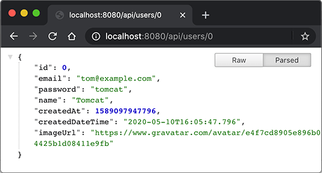

# 使用REST

使用Spring MVC开发Web应用程序的主要工作就是编写Controller逻辑。在Web应用中，除了需要使用MVC给用户显示页面外，还有一类API接口，我们称之为REST，通常输入输出都是JSON，便于第三方调用或者使用页面JavaScript与之交互。

直接在Controller中处理JSON是可以的，因为Spring MVC的`@GetMapping`和`@PostMapping`都支持指定输入和输出的格式。如果我们想接收JSON，输出JSON，那么可以这样写：

```java
@PostMapping(value = "/rest",
             consumes = "application/json;charset=UTF-8",
             produces = "application/json;charset=UTF-8")
@ResponseBody
public String rest(@RequestBody User user) {
    return "{\"restSupport\":true}";
}
```

对应的Maven工程需要加入Jackson这个依赖：`com.fasterxml.jackson.core:jackson-databind:2.14.0`

注意到`@PostMapping`使用`consumes`声明能接收的类型，使用`produces`声明输出的类型，并且额外加了`@ResponseBody`表示返回的`String`无需额外处理，直接作为输出内容写入`HttpServletResponse`。输入的JSON则根据注解`@RequestBody`直接被Spring反序列化为`User`这个JavaBean。

使用curl命令测试一下：

```plain
$ curl -v -H "Content-Type: application/json" -d '{"email":"bob@example.com"}' http://localhost:8080/rest      
> POST /rest HTTP/1.1
> Host: localhost:8080
> User-Agent: curl/7.64.1
> Accept: */*
> Content-Type: application/json
> Content-Length: 27
> 
< HTTP/1.1 200 
< Content-Type: application/json;charset=utf-8
< Content-Length: 20
< Date: Sun, 10 May 2020 09:56:01 GMT
< 
{"restSupport":true}
```

输出正是我们写入的字符串。

直接用Spring的Controller配合一大堆注解写REST太麻烦了，因此，Spring还额外提供了一个`@RestController`注解，使用`@RestController`替代`@Controller`后，每个方法自动变成API接口方法。我们还是以实际代码举例，编写`ApiController`如下：

```java
@RestController
@RequestMapping("/api")
public class ApiController {
    @Autowired
    UserService userService;

    @GetMapping("/users")
    public List<User> users() {
        return userService.getUsers();
    }

    @GetMapping("/users/{id}")
    public User user(@PathVariable("id") long id) {
        return userService.getUserById(id);
    }

    @PostMapping("/signin")
    public Map<String, Object> signin(@RequestBody SignInRequest signinRequest) {
        try {
            User user = userService.signin(signinRequest.email, signinRequest.password);
            return Map.of("user", user);
        } catch (Exception e) {
            return Map.of("error", "SIGNIN_FAILED", "message", e.getMessage());
        }
    }

    public static class SignInRequest {
        public String email;
        public String password;
    }
}
```

编写REST接口只需要定义`@RestController`，然后，每个方法都是一个API接口，输入和输出只要能被Jackson序列化或反序列化为JSON就没有问题。我们用浏览器测试GET请求，可直接显示JSON响应：



要测试POST请求，可以用curl命令：

```plain
$ curl -v -H "Content-Type: application/json" -d '{"email":"bob@example.com","password":"bob123"}' http://localhost:8080/api/signin
> POST /api/signin HTTP/1.1
> Host: localhost:8080
> User-Agent: curl/7.64.1
> Accept: */*
> Content-Type: application/json
> Content-Length: 47
> 
< HTTP/1.1 200 
< Content-Type: application/json
< Transfer-Encoding: chunked
< Date: Sun, 10 May 2020 08:14:13 GMT
< 
{"user":{"id":1,"email":"bob@example.com","password":"bob123","name":"Bob",...
```

注意观察上述JSON的输出，`User`能被正确地序列化为JSON，但暴露了`password`属性，这是我们不期望的。要避免输出`password`属性，可以把`User`复制到另一个`UserBean`对象，该对象只持有必要的属性，但这样做比较繁琐。另一种简单的方法是直接在`User`的`password`属性定义处加上`@JsonIgnore`表示完全忽略该属性：

```java
public class User {
    ...

    @JsonIgnore
    public String getPassword() {
        return password;
    }

    ...
}
```

但是这样一来，如果写一个`register(User user)`方法，那么该方法的User对象也拿不到注册时用户传入的密码了。如果要允许输入`password`，但不允许输出`password`，即在JSON序列化和反序列化时，允许写属性，禁用读属性，可以更精细地控制如下：

```java
public class User {
    ...

    @JsonProperty(access = Access.WRITE_ONLY)
    public String getPassword() {
        return password;
    }

    ...
}
```

同样的，可以使用`@JsonProperty(access = Access.READ_ONLY)`允许输出，不允许输入。

### 练习

使用REST实现API。

[下载练习](spring-web-mvc-rest.zip)

### 小结

使用`@RestController`可以方便地编写REST服务，Spring默认使用JSON作为输入和输出。

要控制序列化和反序列化，可以使用Jackson提供的`@JsonIgnore`和`@JsonProperty`注解。
