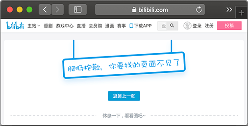

# 使用Interceptor

在Web程序中，注意到使用Filter的时候，Filter由Servlet容器管理，它在Spring MVC的Web应用程序中作用范围如下：

```ascii
         │   ▲
         ▼   │
       ┌───────┐
       │Filter1│
       └───────┘
         │   ▲
         ▼   │
       ┌───────┐
┌ ─ ─ ─│Filter2│─ ─ ─ ─ ─ ─ ─ ─ ┐
       └───────┘
│        │   ▲                  │
         ▼   │
│ ┌─────────────────┐           │
  │DispatcherServlet│◀───┐
│ └─────────────────┘    │      │
   │              ┌────────────┐
│  │              │ModelAndView││
   │              └────────────┘
│  │                     ▲      │
   │    ┌───────────┐    │
│  ├───▶│Controller1│────┤      │
   │    └───────────┘    │
│  │                     │      │
   │    ┌───────────┐    │
│  └───▶│Controller2│────┘      │
        └───────────┘
└ ─ ─ ─ ─ ─ ─ ─ ─ ─ ─ ─ ─ ─ ─ ─ ┘
```

上图虚线框就是Filter2的拦截范围，Filter组件实际上并不知道后续内部处理是通过Spring MVC提供的`DispatcherServlet`还是其他Servlet组件，因为Filter是Servlet规范定义的标准组件，它可以应用在任何基于Servlet的程序中。

如果只基于Spring MVC开发应用程序，还可以使用Spring MVC提供的一种功能类似Filter的拦截器：Interceptor。和Filter相比，Interceptor拦截范围不是后续整个处理流程，而是仅针对Controller拦截：

```ascii
       │   ▲
       ▼   │
     ┌───────┐
     │Filter1│
     └───────┘
       │   ▲
       ▼   │
     ┌───────┐
     │Filter2│
     └───────┘
       │   ▲
       ▼   │
┌─────────────────┐
│DispatcherServlet│◀───┐
└─────────────────┘    │
 │ ┌ ─ ─ ─ ─ ─ ─ ─ ─ ─ ┼ ─ ─ ─ ┐
 │                     │
 │ │            ┌────────────┐ │
 │              │   Render   │
 │ │            └────────────┘ │
 │                     ▲
 │ │                   │       │
 │              ┌────────────┐
 │ │            │ModelAndView│ │
 │              └────────────┘
 │ │                   ▲       │
 │    ┌───────────┐    │
 ├─┼─▶│Controller1│────┤       │
 │    └───────────┘    │
 │ │                   │       │
 │    ┌───────────┐    │
 └─┼─▶│Controller2│────┘       │
      └───────────┘
   └ ─ ─ ─ ─ ─ ─ ─ ─ ─ ─ ─ ─ ─ ┘
```

上图虚线框就是Interceptor的拦截范围，注意到Controller的处理方法一般都类似这样：

```java
@Controller
public class Controller1 {
    @GetMapping("/path/to/hello")
    ModelAndView hello() {
        ...
    }
}
```

所以，Interceptor的拦截范围其实就是Controller方法，它实际上就相当于基于AOP的方法拦截。因为Interceptor只拦截Controller方法，所以要注意，返回`ModelAndView`并渲染后，后续处理就脱离了Interceptor的拦截范围。

使用Interceptor的好处是Interceptor本身是Spring管理的Bean，因此注入任意Bean都非常简单。此外，可以应用多个Interceptor，并通过简单的`@Order`指定顺序。我们先写一个`LoggerInterceptor`：

```java
@Order(1)
@Component
public class LoggerInterceptor implements HandlerInterceptor {

    final Logger logger = LoggerFactory.getLogger(getClass());

    @Override
    public boolean preHandle(HttpServletRequest request, HttpServletResponse response, Object handler) throws Exception {
        logger.info("preHandle {}...", request.getRequestURI());
        if (request.getParameter("debug") != null) {
            PrintWriter pw = response.getWriter();
            pw.write("<p>DEBUG MODE</p>");
            pw.flush();
            return false;
        }
        return true;
    }

    @Override
    public void postHandle(HttpServletRequest request, HttpServletResponse response, Object handler, ModelAndView modelAndView) throws Exception {
        logger.info("postHandle {}.", request.getRequestURI());
        if (modelAndView != null) {
            modelAndView.addObject("__time__", LocalDateTime.now());
        }
    }

    @Override
    public void afterCompletion(HttpServletRequest request, HttpServletResponse response, Object handler, Exception ex) throws Exception {
        logger.info("afterCompletion {}: exception = {}", request.getRequestURI(), ex);
    }
}
```

一个Interceptor必须实现`HandlerInterceptor`接口，可以选择实现`preHandle()`、`postHandle()`和`afterCompletion()`方法。`preHandle()`是Controller方法调用前执行，`postHandle()`是Controller方法正常返回后执行，而`afterCompletion()`无论Controller方法是否抛异常都会执行，参数`ex`就是Controller方法抛出的异常（未抛出异常是`null`）。

在`preHandle()`中，也可以直接处理响应，然后返回`false`表示无需调用Controller方法继续处理了，通常在认证或者安全检查失败时直接返回错误响应。在`postHandle()`中，因为捕获了Controller方法返回的`ModelAndView`，所以可以继续往`ModelAndView`里添加一些通用数据，很多页面需要的全局数据如Copyright信息等都可以放到这里，无需在每个Controller方法中重复添加。

我们再继续添加一个`AuthInterceptor`，用于替代上一节使用`AuthFilter`进行Basic认证的功能：

```java
@Order(2)
@Component
public class AuthInterceptor implements HandlerInterceptor {

    final Logger logger = LoggerFactory.getLogger(getClass());

    @Autowired
    UserService userService;

    @Override
    public boolean preHandle(HttpServletRequest request, HttpServletResponse response, Object handler)
            throws Exception {
        logger.info("pre authenticate {}...", request.getRequestURI());
        try {
            authenticateByHeader(request);
        } catch (RuntimeException e) {
            logger.warn("login by authorization header failed.", e);
        }
        return true;
    }

    private void authenticateByHeader(HttpServletRequest req) {
        String authHeader = req.getHeader("Authorization");
        if (authHeader != null && authHeader.startsWith("Basic ")) {
            logger.info("try authenticate by authorization header...");
            String up = new String(Base64.getDecoder().decode(authHeader.substring(6)), StandardCharsets.UTF_8);
            int pos = up.indexOf(':');
            if (pos > 0) {
                String email = URLDecoder.decode(up.substring(0, pos), StandardCharsets.UTF_8);
                String password = URLDecoder.decode(up.substring(pos + 1), StandardCharsets.UTF_8);
                User user = userService.signin(email, password);
                req.getSession().setAttribute(UserController.KEY_USER, user);
                logger.info("user {} login by authorization header ok.", email);
            }
        }
    }
}
```

这个`AuthInterceptor`是由Spring容器直接管理的，因此注入`UserService`非常方便。

最后，要让拦截器生效，我们在`WebMvcConfigurer`中注册所有的Interceptor：

```java
@Bean
WebMvcConfigurer createWebMvcConfigurer(@Autowired HandlerInterceptor[] interceptors) {
    return new WebMvcConfigurer() {
        public void addInterceptors(InterceptorRegistry registry) {
            for (var interceptor : interceptors) {
                registry.addInterceptor(interceptor);
            }
        }
        ...
    };
}
```

```alert type=notice title=注意
如果拦截器没有生效，请检查是否忘了在WebMvcConfigurer中注册。
```

### 处理异常

在Controller中，Spring MVC还允许定义基于`@ExceptionHandler`注解的异常处理方法。我们来看具体的示例代码：

```java
@Controller
public class UserController {
    @ExceptionHandler(RuntimeException.class)
    public ModelAndView handleUnknowException(Exception ex) {
        return new ModelAndView("500.html", Map.of("error", ex.getClass().getSimpleName(), "message", ex.getMessage()));
    }
    ...
}
```

异常处理方法没有固定的方法签名，可以传入`Exception`、`HttpServletRequest`等，返回值可以是`void`，也可以是`ModelAndView`，上述代码通过`@ExceptionHandler(RuntimeException.class)`表示当发生`RuntimeException`的时候，就自动调用此方法处理。

注意到我们返回了一个新的`ModelAndView`，这样在应用程序内部如果发生了预料之外的异常，可以给用户显示一个出错页面，而不是简单的500 Internal Server Error或404 Not Found。例如B站的错误页：



可以编写多个错误处理方法，每个方法针对特定的异常。例如，处理`LoginException`使得页面可以自动跳转到登录页。

使用`ExceptionHandler`时，要注意它仅作用于当前的Controller，即ControllerA中定义的一个`ExceptionHandler`方法对ControllerB不起作用。如果我们有很多Controller，每个Controller都需要处理一些通用的异常，例如`LoginException`，思考一下应该怎么避免重复代码？

### 练习

使用Interceptor。

[下载练习](spring-web-mvc-interceptor.zip)

### 小结

Spring MVC提供了Interceptor组件来拦截Controller方法，使用时要注意Interceptor的作用范围。
