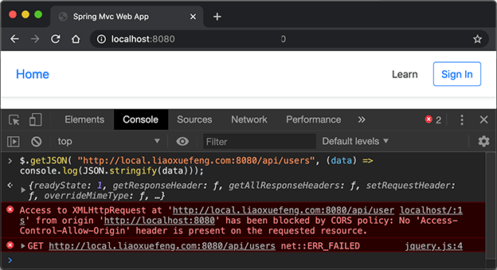
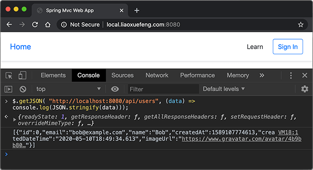

# 处理CORS

在开发REST应用时，很多时候，是通过页面的JavaScript和后端的REST API交互。

在JavaScript与REST交互的时候，有很多安全限制。默认情况下，浏览器按同源策略放行JavaScript调用API，即：

- 如果A站在域名`a.com`页面的JavaScript调用A站自己的API时，没有问题；
- 如果A站在域名`a.com`页面的JavaScript调用B站`b.com`的API时，将被浏览器拒绝访问，因为不满足同源策略。

同源要求域名要完全相同（`a.com`和`www.a.com`不同），协议要相同（`http`和`https`不同），端口要相同 。

那么，在域名`a.com`页面的JavaScript要调用B站`b.com`的API时，还有没有办法？

办法是有的，那就是CORS，全称Cross-Origin Resource Sharing，是HTML5规范定义的如何跨域访问资源。如果A站的JavaScript访问B站API的时候，B站能够返回响应头`Access-Control-Allow-Origin: http://a.com`，那么，浏览器就允许A站的JavaScript访问B站的API。

注意到跨域访问能否成功，取决于B站是否愿意给A站返回一个正确的`Access-Control-Allow-Origin`响应头，所以决定权永远在提供API的服务方手中。

关于CORS的详细信息可以参考[MDN文档](https://developer.mozilla.org/zh-CN/docs/Web/HTTP/Access_control_CORS)，这里不再详述。

使用Spring的`@RestController`开发REST应用时，同样会面对跨域问题。如果我们允许指定的网站通过页面JavaScript访问这些REST API，就必须正确地设置CORS。

有好几种方法设置CORS，我们来一一介绍。

### 使用@CrossOrigin

第一种方法是使用`@CrossOrigin`注解，可以在`@RestController`的class级别或方法级别定义一个`@CrossOrigin`，例如：

```java
@CrossOrigin(origins = "http://local.liaoxuefeng.com:8080")
@RestController
@RequestMapping("/api")
public class ApiController {
    ...
}
```

上述定义在`ApiController`处的`@CrossOrigin`指定了只允许来自`local.liaoxuefeng.com`跨域访问，允许多个域访问需要写成数组形式，例如`origins = {"http://a.com", "https://www.b.com"})`。如果要允许任何域访问，写成`origins = "*"`即可。

如果有多个REST Controller都需要使用CORS，那么，每个Controller都必须标注`@CrossOrigin`注解。

### 使用CorsRegistry

第二种方法是在`WebMvcConfigurer`中定义一个全局CORS配置，下面是一个示例：

```java
@Bean
WebMvcConfigurer createWebMvcConfigurer() {
    return new WebMvcConfigurer() {
        @Override
        public void addCorsMappings(CorsRegistry registry) {
            registry.addMapping("/api/**")
                    .allowedOrigins("http://local.liaoxuefeng.com:8080")
                    .allowedMethods("GET", "POST")
                    .maxAge(3600);
            // 可以继续添加其他URL规则:
            // registry.addMapping("/rest/v2/**")...
        }
    };
}
```

这种方式可以创建一个全局CORS配置，如果仔细地设计URL结构，那么可以一目了然地看到各个URL的CORS规则，推荐使用这种方式配置CORS。

### 使用CorsFilter

第三种方法是使用Spring提供的`CorsFilter`，我们在[集成Filter](../filter/index.html)中详细介绍了将Spring容器内置的Bean暴露为Servlet容器的Filter的方法，由于这种配置方式需要修改`web.xml`，也比较繁琐，所以推荐使用第二种方式。

### 测试

当我们配置好CORS后，可以在浏览器中测试一下规则是否生效。

我们先用`http://localhost:8080`在Chrome浏览器中打开首页，然后打开Chrome的开发者工具，切换到Console，输入一个JavaScript语句来跨域访问API：

```javascript
$.getJSON("http://local.liaoxuefeng.com:8080/api/users", (data) => console.log(JSON.stringify(data)));
```

上述源站的域是`http://localhost:8080`，跨域访问的是`http://local.liaoxuefeng.com:8080`，因为配置的CORS不允许`localhost`访问，所以不出意外地得到一个错误：



浏览题打印了错误原因就是`been blocked by CORS policy`。

我们再用`http://local.liaoxuefeng.com:8080`在Chrome浏览器中打开首页，在Console中执行JavaScript访问`localhost`：

```javascript
$.getJSON("http://localhost:8080/api/users", (data) => console.log(JSON.stringify(data)));
```

因为CORS规则允许来自`http://local.liaoxuefeng.com:8080`的访问，因此访问成功，打印出API的返回值：



### 练习

使用CORS控制跨域。

[下载练习](spring-web-mvc-cors.zip)

### 小结

CORS可以控制指定域的页面JavaScript能否访问API。
