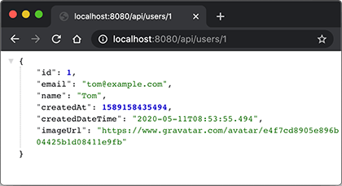
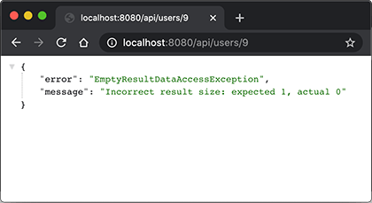

# 异步处理

在Servlet模型中，每个请求都是由某个线程处理，然后，将响应写入IO流，发送给客户端。从开始处理请求，到写入响应完成，都是在同一个线程中处理的。

实现Servlet容器的时候，只要每处理一个请求，就创建一个新线程处理它，就能保证正确实现了Servlet线程模型。在实际产品中，例如Tomcat，总是通过线程池来处理请求，它仍然符合一个请求从头到尾都由某一个线程处理。

这种线程模型非常重要，因为Spring的JDBC事务是基于`ThreadLocal`实现的，如果在处理过程中，一会由线程A处理，一会又由线程B处理，那事务就全乱套了。此外，很多安全认证，也是基于`ThreadLocal`实现的，可以保证在处理请求的过程中，各个线程互不影响。

但是，如果一个请求处理的时间较长，例如几秒钟甚至更长，那么，这种基于线程池的同步模型很快就会把所有线程耗尽，导致服务器无法响应新的请求。如果把长时间处理的请求改为异步处理，那么线程池的利用率就会大大提高。Servlet从3.0规范开始添加了异步支持，允许对一个请求进行异步处理。

我们先来看看在Spring MVC中如何实现对请求进行异步处理的逻辑。首先建立一个Web工程，然后编辑`web.xml`文件如下：

```xml
<web-app>
    <display-name>Archetype Created Web Application</display-name>

    <servlet>
        <servlet-name>dispatcher</servlet-name>
        <servlet-class>org.springframework.web.servlet.DispatcherServlet</servlet-class>
        <init-param>
            <param-name>contextClass</param-name>
            <param-value>org.springframework.web.context.support.AnnotationConfigWebApplicationContext</param-value>
        </init-param>
        <init-param>
            <param-name>contextConfigLocation</param-name>
            <param-value>com.itranswarp.learnjava.AppConfig</param-value>
        </init-param>
        <load-on-startup>0</load-on-startup>
        <async-supported>true</async-supported>
    </servlet>

    <servlet-mapping>
        <servlet-name>dispatcher</servlet-name>
        <url-pattern>/*</url-pattern>
    </servlet-mapping>
</web-app>
```

和前面普通的MVC程序相比，这个`web.xml`主要对`DispatcherServlet`的配置多了一个`<async-supported>`，默认值是`false`，必须明确写成`true`，这样Servlet容器才会支持async处理。

下一步就是在Controller中编写async处理逻辑。我们以`ApiController`为例，演示如何异步处理请求。

第一种async处理方式是返回一个`Callable`，Spring MVC自动把返回的`Callable`放入线程池执行，等待结果返回后再写入响应：

```java
@GetMapping("/users")
public Callable<List<User>> users() {
    return () -> {
        // 模拟3秒耗时:
        try {
            Thread.sleep(3000);
        } catch (InterruptedException e) {
        }
        return userService.getUsers();
    };
}
```

第二种async处理方式是返回一个`DeferredResult`对象，然后在另一个线程中，设置此对象的值并写入响应：

```java
@GetMapping("/users/{id}")
public DeferredResult<User> user(@PathVariable("id") long id) {
    DeferredResult<User> result = new DeferredResult<>(3000L); // 3秒超时
    new Thread(() -> {
        // 等待1秒:
        try {
            Thread.sleep(1000);
        } catch (InterruptedException e) {
        }
        try {
            User user = userService.getUserById(id);
            // 设置正常结果并由Spring MVC写入Response:
            result.setResult(user);
        } catch (Exception e) {
            // 设置错误结果并由Spring MVC写入Response:
            result.setErrorResult(Map.of("error", e.getClass().getSimpleName(), "message", e.getMessage()));
        }
    }).start();
    return result;
}
```

使用`DeferredResult`时，可以设置超时，超时会自动返回超时错误响应。在另一个线程中，可以调用`setResult()`写入结果，也可以调用`setErrorResult()`写入一个错误结果。

运行程序，当我们访问`http://localhost:8080/api/users/1`时，假定用户存在，则浏览器在1秒后返回结果：



访问一个不存在的User ID，则等待1秒后返回错误结果：



### 使用Filter

当我们使用async模式处理请求时，原有的Filter也可以工作，但我们必须在`web.xml`中添加`<async-supported>`并设置为`true`。我们用两个Filter：SyncFilter和AsyncFilter分别测试：

```xml
<web-app ...>
    ...
    <filter>
        <filter-name>sync-filter</filter-name>
        <filter-class>com.itranswarp.learnjava.web.SyncFilter</filter-class>
    </filter>

    <filter>
        <filter-name>async-filter</filter-name>
        <filter-class>com.itranswarp.learnjava.web.AsyncFilter</filter-class>
        <async-supported>true</async-supported>
    </filter>

    <filter-mapping>
        <filter-name>sync-filter</filter-name>
        <url-pattern>/api/version</url-pattern>
    </filter-mapping>

    <filter-mapping>
        <filter-name>async-filter</filter-name>
        <url-pattern>/api/*</url-pattern>
    </filter-mapping>
    ...
</web-app>
```

一个声明为支持`<async-supported>`的Filter既可以过滤async处理请求，也可以过滤正常的同步处理请求，而未声明`<async-supported>`的Filter无法支持async请求，如果一个普通的Filter遇到async请求时，会直接报错，因此，务必注意普通Filter的`<url-pattern>`不要匹配async请求路径。

在`logback.xml`配置文件中，我们把输出格式加上`[%thread]`，可以输出当前线程的名称：

```xml
<?xml version="1.0" encoding="UTF-8"?>
<configuration>
    <appender name="STDOUT" class="ch.qos.logback.core.ConsoleAppender">
        <layout class="ch.qos.logback.classic.PatternLayout">
            <Pattern>%d{yyyy-MM-dd HH:mm:ss} [%thread] %-5level %logger{36} - %msg%n</Pattern>
        </layout>
    </appender>
    ...
</configuration>
```

对于同步请求，例如`/api/version`，我们可以看到如下输出：

```plain
2020-05-16 11:22:40 [http-nio-8080-exec-1] INFO  c.i.learnjava.web.SyncFilter - start SyncFilter...
2020-05-16 11:22:40 [http-nio-8080-exec-1] INFO  c.i.learnjava.web.AsyncFilter - start AsyncFilter...
2020-05-16 11:22:40 [http-nio-8080-exec-1] INFO  c.i.learnjava.web.ApiController - get version...
2020-05-16 11:22:40 [http-nio-8080-exec-1] INFO  c.i.learnjava.web.AsyncFilter - end AsyncFilter.
2020-05-16 11:22:40 [http-nio-8080-exec-1] INFO  c.i.learnjava.web.SyncFilter - end SyncFilter.
```

可见，每个Filter和`ApiController`都是由同一个线程执行。

对于异步请求，例如`/api/users`，我们可以看到如下输出：

```plain
2020-05-16 11:23:49 [http-nio-8080-exec-4] INFO  c.i.learnjava.web.AsyncFilter - start AsyncFilter...
2020-05-16 11:23:49 [http-nio-8080-exec-4] INFO  c.i.learnjava.web.ApiController - get users...
2020-05-16 11:23:49 [http-nio-8080-exec-4] INFO  c.i.learnjava.web.AsyncFilter - end AsyncFilter.
2020-05-16 11:23:52 [MvcAsync1] INFO  c.i.learnjava.web.ApiController - return users...
```

可见，`AsyncFilter`和`ApiController`是由同一个线程执行的，但是，返回响应的是另一个线程。

对`DeferredResult`测试，可以看到如下输出：

```plain
2020-05-16 11:25:24 [http-nio-8080-exec-8] INFO  c.i.learnjava.web.AsyncFilter - start AsyncFilter...
2020-05-16 11:25:24 [http-nio-8080-exec-8] INFO  c.i.learnjava.web.AsyncFilter - end AsyncFilter.
2020-05-16 11:25:25 [Thread-2] INFO  c.i.learnjava.web.ApiController - deferred result is set.
```

同样，返回响应的是另一个线程。

在实际使用时，经常用到的就是`DeferredResult`，因为返回`DeferredResult`时，可以设置超时、正常结果和错误结果，易于编写比较灵活的逻辑。

使用async异步处理响应时，要时刻牢记，在另一个异步线程中的事务和Controller方法中执行的事务不是同一个事务，在Controller中绑定的`ThreadLocal`信息也无法在异步线程中获取。

此外，Servlet 3.0规范添加的异步支持是针对同步模型打了一个“补丁”，虽然可以异步处理请求，但高并发异步请求时，它的处理效率并不高，因为这种异步模型并没有用到真正的“原生”异步。Java标准库提供了封装操作系统的异步IO包`java.nio`，是真正的多路复用IO模型，可以用少量线程支持大量并发。使用NIO编程复杂度比同步IO高很多，因此我们很少直接使用NIO。相反，大部分需要高性能异步IO的应用程序会选择[Netty](https://netty.io/)这样的框架，它基于NIO提供了更易于使用的API，方便开发异步应用程序。

### 练习

使用Spring MVC实现异步处理请求。

[下载练习](spring-web-mvc-async.zip)

### 小结

在Spring MVC中异步处理请求需要正确配置`web.xml`，并返回`Callable`或`DeferredResult`对象。
