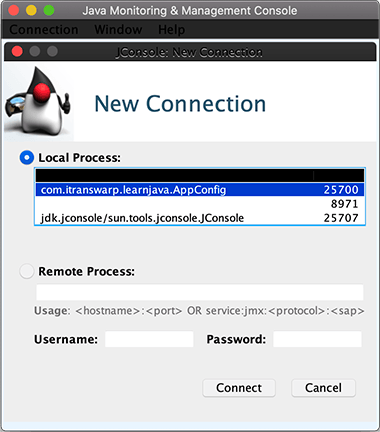
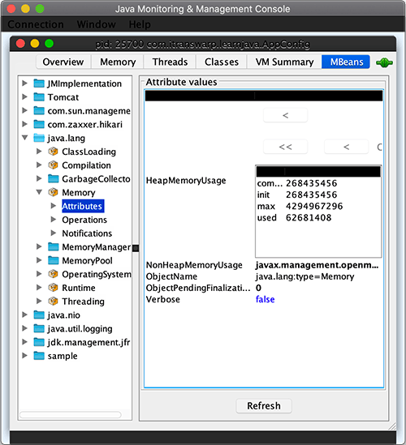
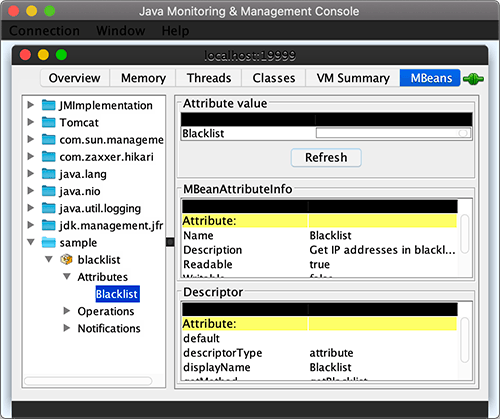
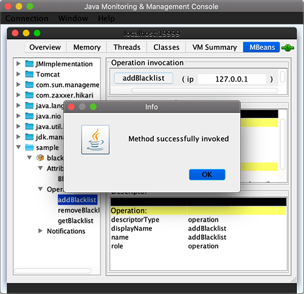
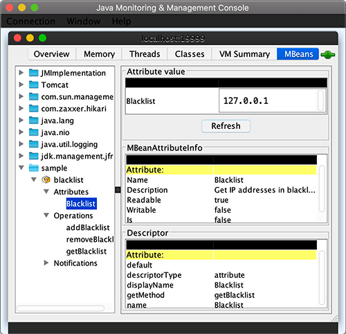
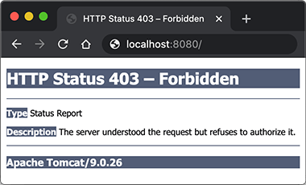

# 集成JMX

在Spring中，可以方便地集成JMX。

那么第一个问题来了：什么是JMX？

JMX是Java Management Extensions，它是一个Java平台的管理和监控接口。为什么要搞JMX呢？因为在所有的应用程序中，对运行中的程序进行监控都是非常重要的，Java应用程序也不例外。我们肯定希望知道Java应用程序当前的状态，例如，占用了多少内存，分配了多少内存，当前有多少活动线程，有多少休眠线程等等。如何获取这些信息呢？

为了标准化管理和监控，Java平台使用JMX作为管理和监控的标准接口，任何程序，只要按JMX规范访问这个接口，就可以获取所有管理与监控信息。

实际上，常用的运维监控如Zabbix、Nagios等工具对JVM本身的监控都是通过JMX获取的信息。

因为JMX是一个标准接口，不但可以用于管理JVM，还可以管理应用程序自身。下图是JMX的架构：

```ascii
    ┌─────────┐  ┌─────────┐
    │jconsole │  │   Web   │
    └─────────┘  └─────────┘
         │            │
┌ ─ ─ ─ ─│─ ─ ─ ─ ─ ─ ┼ ─ ─ ─ ─
 JVM     ▼            ▼        │
│   ┌─────────┐  ┌─────────┐
  ┌─┤Connector├──┤ Adaptor ├─┐ │
│ │ └─────────┘  └─────────┘ │
  │       MBeanServer        │ │
│ │ ┌──────┐┌──────┐┌──────┐ │
  └─┤MBean1├┤MBean2├┤MBean3├─┘ │
│   └──────┘└──────┘└──────┘
 ─ ─ ─ ─ ─ ─ ─ ─ ─ ─ ─ ─ ─ ─ ─ ┘
```

JMX把所有被管理的资源都称为MBean（Managed Bean），这些MBean全部由MBeanServer管理，如果要访问MBean，可以通过MBeanServer对外提供的访问接口，例如通过RMI或HTTP访问。

注意到使用JMX不需要安装任何额外组件，也不需要第三方库，因为MBeanServer已经内置在JavaSE标准库中了。JavaSE还提供了一个`jconsole`程序，用于通过RMI连接到MBeanServer，这样就可以管理整个Java进程。

除了JVM会把自身的各种资源以MBean注册到JMX中，我们自己的配置、监控信息也可以作为MBean注册到JMX，这样，管理程序就可以直接控制我们暴露的MBean。因此，应用程序使用JMX，只需要两步：

1. 编写MBean提供管理接口和监控数据；
2. 注册MBean。

在Spring应用程序中，使用JMX只需要一步：

1. 编写MBean提供管理接口和监控数据。

第二步注册的过程由Spring自动完成。我们以实际工程为例，首先在`AppConfig`中加上`@EnableMBeanExport`注解，告诉Spring自动注册MBean：

```java
@Configuration
@ComponentScan
@EnableWebMvc
@EnableMBeanExport // 自动注册MBean
@EnableTransactionManagement
@PropertySource({ "classpath:/jdbc.properties" })
public class AppConfig {
    ...
}
```

剩下的全部工作就是编写MBean。我们以实际问题为例，假设我们希望给应用程序添加一个IP黑名单功能，凡是在黑名单中的IP禁止访问，传统的做法是定义一个配置文件，启动的时候读取：

```plain
# blacklist.txt
1.2.3.4
5.6.7.8
2.2.3.4
...
```

如果要修改黑名单怎么办？修改配置文件，然后重启应用程序。

但是每次都重启应用程序实在是太麻烦了，能不能不重启应用程序？可以自己写一个定时读取配置文件的功能，检测到文件改动时自动重新读取。

上述需求本质上是在应用程序运行期间对参数、配置等进行热更新并要求尽快生效。如果以JMX的方式实现，我们不必自己编写自动重新读取等任何代码，只需要提供一个符合JMX标准的MBean来存储配置即可。

还是以IP黑名单为例，JMX的MBean通常以MBean结尾，因此我们遵循标准命名规范，首先编写一个`BlacklistMBean`：

```java
public class BlacklistMBean {
    private Set<String> ips = new HashSet<>();

    public String[] getBlacklist() {
        return ips.toArray(String[]::new);
    }

    public void addBlacklist(String ip) {
        ips.add(ip);
    }

    public void removeBlacklist(String ip) {
        ips.remove(ip);
    }

    public boolean shouldBlock(String ip) {
        return ips.contains(ip);
    }
}
```

这个MBean没什么特殊的，它的逻辑和普通Java类没有任何区别。

下一步，我们要使用JMX的客户端来实时热更新这个MBean，所以要给它加上一些注解，让Spring能根据注解自动把相关方法注册到MBeanServer中：

```java
@Component
@ManagedResource(objectName = "sample:name=blacklist", description = "Blacklist of IP addresses")
public class BlacklistMBean {
    private Set<String> ips = new HashSet<>();

    @ManagedAttribute(description = "Get IP addresses in blacklist")
    public String[] getBlacklist() {
        return ips.toArray(String[]::new);
    }

    @ManagedOperation
    @ManagedOperationParameter(name = "ip", description = "Target IP address that will be added to blacklist")
    public void addBlacklist(String ip) {
        ips.add(ip);
    }

    @ManagedOperation
    @ManagedOperationParameter(name = "ip", description = "Target IP address that will be removed from blacklist")
    public void removeBlacklist(String ip) {
        ips.remove(ip);
    }

    public boolean shouldBlock(String ip) {
        return ips.contains(ip);
    }
}
```

观察上述代码，`BlacklistMBean`首先是一个标准的Spring管理的Bean，其次，添加了`@ManagedResource`表示这是一个MBean，将要被注册到JMX。objectName指定了这个MBean的名字，通常以`company:name=Xxx`来分类MBean。

对于属性，使用`@ManagedAttribute`注解标注。上述MBean只有get属性，没有set属性，说明这是一个只读属性。

对于操作，使用`@ManagedOperation`注解标准。上述MBean定义了两个操作：`addBlacklist()`和`removeBlacklist()`，其他方法如`shouldBlock()`不会被暴露给JMX。

使用MBean和普通Bean是完全一样的。例如，我们在`BlacklistInterceptor`对IP进行黑名单拦截：

```java
@Order(1)
@Component
public class BlacklistInterceptor implements HandlerInterceptor {
    final Logger logger = LoggerFactory.getLogger(getClass());

    @Autowired
    BlacklistMBean blacklistMBean;

    @Override
    public boolean preHandle(HttpServletRequest request, HttpServletResponse response, Object handler)
            throws Exception {
        String ip = request.getRemoteAddr();
        logger.info("check ip address {}...", ip);
        // 是否在黑名单中:
        if (blacklistMBean.shouldBlock(ip)) {
            logger.warn("will block ip {} for it is in blacklist.", ip);
            // 发送403错误响应:
            response.sendError(403);
            return false;
        }
        return true;
    }
}
```

下一步就是正常启动Web应用程序，不要关闭它，我们打开另一个命令行窗口，输入`jconsole`启动JavaSE自带的一个JMX客户端程序：



通过jconsole连接到一个Java进程最简单的方法是直接在Local Process中找到正在运行的`AppConfig`，点击Connect即可连接到我们当前正在运行的Web应用，在jconsole中可直接看到内存、CPU等资源的监控。

我们点击MBean，左侧按分类列出所有MBean，可以在`java.lang`查看内存等信息：



细心的童鞋可以看到HikariCP连接池也是通过JMX监控的。

在`sample`中可以看到我们自己的MBean，点击可查看属性`blacklist`：



点击`Operations`-`addBlacklist`，可以填入`127.0.0.1`并点击`addBlacklist`按钮，相当于jconsole通过JMX接口，调用了我们自己的`BlacklistMBean`的`addBlacklist()`方法，传入的参数就是填入的`127.0.0.1`：



再次查看属性`blacklist`，可以看到结果已经更新了：



我们可以在浏览器中测试一下黑名单功能是否已生效：



可见，`127.0.0.1`确实被添加到了黑名单，后台日志打印如下：

```plain
2020-06-06 20:22:12 INFO  c.i.l.web.BlacklistInterceptor - check ip address 127.0.0.1...
2020-06-06 20:22:12 WARN  c.i.l.web.BlacklistInterceptor - will block ip 127.0.0.1 for it is in blacklist.
```

注意：如果使用IPv6，那么需要把`0:0:0:0:0:0:0:1`这个本机地址加到黑名单。

如果从jconsole中调用`removeBlacklist`移除`127.0.0.1`，刷新浏览器可以看到又允许访问了。

使用jconsole直接通过Local Process连接JVM有个限制，就是jconsole和正在运行的JVM必须在同一台机器。如果要远程连接，首先要打开JMX端口。我们在启动`AppConfig`时，需要传入以下JVM启动参数：

- -Dcom.sun.management.jmxremote.port=19999
- -Dcom.sun.management.jmxremote.authenticate=false
- -Dcom.sun.management.jmxremote.ssl=false

第一个参数表示在19999端口监听JMX连接，第二个和第三个参数表示无需验证，不使用SSL连接，在开发测试阶段比较方便，生产环境必须指定验证方式并启用SSL。详细参数可参考Oracle[官方文档](https://docs.oracle.com/javase/8/docs/technotes/guides/management/agent.html#gdeum)。这样jconsole可以用`ip:19999`的远程方式连接JMX。连接后的操作是完全一样的。

许多JavaEE服务器如JBoss的管理后台都是通过JMX提供管理接口，并由Web方式访问，对用户更加友好。

在实际项目中，通过JMX实现配置的实时更新其实并不常用，JMX更多地用于收集JVM的运行状态和应用程序的性能数据，然后通过监控服务器汇总数据后实现监控与报警。一个典型的监控系统架构如下：

```ascii
┌───────────────┐   ┌───────────────┐
│  Web Console  │◀──│Metrics Server │
└───────────────┘   └───────────────┘
                            │
                            │
   ┌ ─ ─ ─ ─ ─ ─ ─ ─ ─ ─ ─ ─│─ ─ ┐
     ┌───────────────┐      │
   │ │      App      │      │    │
     ├─────────┬─────┤   ┌─────┐
   │ │         │ JMX │──▶│Agent│ │
     │         └─────┤   └─────┘
   │ │      JVM      │           │
     └───────────────┘
   └ ─ ─ ─ ─ ─ ─ ─ ─ ─ ─ ─ ─ ─ ─ ┘
```

其中，App自身和JVM的的统计数据都通过JMX收集并发送给本机的一个Agent，Agent再将数据发送至监控服务器，最后以可视化的形式将监控数据通过Web等形式展示给用户。常用的监控系统有开源的[Prometheus](https://prometheus.io/)和以云服务方式提供的[DataDog](https://www.datadoghq.com/)等。

### 练习

编写一个MBean统计当前注册用户数量，并在jconsole中查看：

[下载练习](spring-integration-jmx.zip)

### 小结

在Spring中使用JMX需要：

- 通过`@EnableMBeanExport`启用自动注册MBean；
- 编写MBean并实现管理属性和管理操作。
