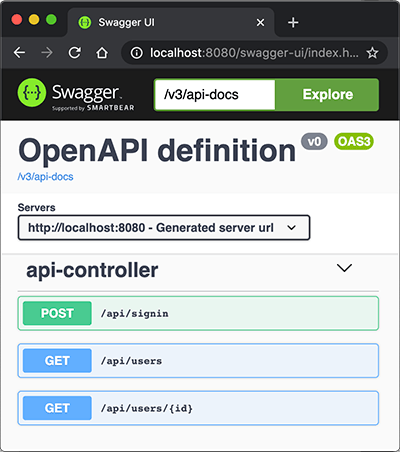
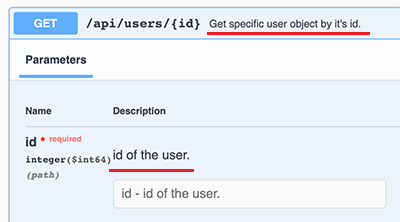

# 集成Open API

[Open API](https://www.openapis.org/)是一个标准，它的主要作用是描述REST API，既可以作为文档给开发者阅读，又可以让机器根据这个文档自动生成客户端代码等。

在Spring Boot应用中，假设我们编写了一堆REST API，如何添加Open API的支持？

我们只需要在`pom.xml`中加入以下依赖：

- org.springdoc:springdoc-openapi-starter-webmvc-ui:2.0.0

然后呢？没有然后了，直接启动应用，打开浏览器输入`http://localhost:8080/swagger-ui.html`：



立刻可以看到自动生成的API文档，这里列出了3个API，来自`api-controller`（因为定义在`ApiController`这个类中），点击某个API还可以交互，即输入API参数，点“Try it out”按钮，获得运行结果。

## 是不是太方便了！

因为我们引入`springdoc-openapi-ui`这个依赖后，它自动引入Swagger UI用来创建API文档。可以给API加入一些描述信息，例如：

```java
@RestController
@RequestMapping("/api")
public class ApiController {
    ...
    @Operation(summary = "Get specific user object by it's id.")
	@GetMapping("/users/{id}")
	public User user(@Parameter(description = "id of the user.") @PathVariable("id") long id) {
		return userService.getUserById(id);
	}
    ...
}
```

`@Operation`可以对API进行描述，`@Parameter`可以对参数进行描述，它们的目的是用于生成API文档的描述信息。添加了描述的API文档如下：



大多数情况下，不需要任何配置，我们就直接得到了一个运行时动态生成的可交互的API文档，该API文档总是和代码保持同步，大大简化了文档的编写工作。

要自定义文档的样式、控制某些API显示等，请参考[springdoc文档](https://springdoc.org/)。

### 配置反向代理

如果在服务器上，用户访问的域名是`https://example.com`，但内部是通过类似Nginx这样的反向代理访问实际的Spring Boot应用，比如`http://localhost:8080`，这个时候，在页面`https://example.com/swagger-ui.html`上，显示的URL仍然是`http://localhost:8080`，这样一来，就无法直接在页面执行API，非常不方便。

这是因为Spring Boot内置的Tomcat默认获取的服务器名称是`localhost`，端口是实际监听端口，而不是对外暴露的域名和`80`或`443`端口。要让Tomcat获取到对外暴露的域名等信息，必须在Nginx配置中传入必要的HTTP Header，常用的配置如下：

```plain
# Nginx配置
server {
    ...
    location / {
        proxy_pass http://localhost:8080;
        proxy_set_header Host $host;
        proxy_set_header X-Real-IP $remote_addr;
        proxy_set_header X-Forwarded-Proto $scheme;
        proxy_set_header X-Forwarded-For $proxy_add_x_forwarded_for;
    }
    ...
}
```

然后，在Spring Boot的`application.yml`中，加入如下配置：

```yaml
server:
  # 实际监听端口:
  port: 8080
  # 从反向代理读取相关的HTTP Header:
  forward-headers-strategy: native
```

重启Spring Boot应用，即可在Swagger中显示正确的URL。

### 练习

利用springdoc实现API文档。

[下载练习](springboot-openapi.zip)

### 小结

使用springdoc让其自动创建API文档非常容易，引入依赖后无需任何配置即可访问交互式API文档。

可以对API添加注解以便生成更详细的描述。
