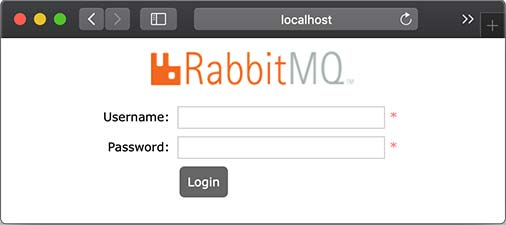
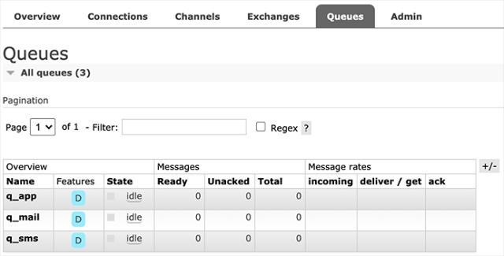
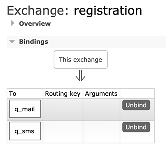
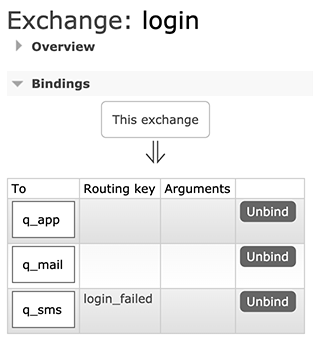

# 集成RabbitMQ

前面我们讲了ActiveMQ Artemis，它实现了JMS的消息服务协议。JMS是JavaEE的消息服务标准接口，但是，如果Java程序要和另一种语言编写的程序通过消息服务器进行通信，那么JMS就不太适合了。

AMQP是一种使用广泛的独立于语言的消息协议，它的全称是Advanced Message Queuing Protocol，即高级消息队列协议，它定义了一种二进制格式的消息流，任何编程语言都可以实现该协议。实际上，Artemis也支持AMQP，但实际应用最广泛的AMQP服务器是使用[Erlang](https://www.erlang.org/)编写的[RabbitMQ](https://www.rabbitmq.com/)。

### 安装RabbitMQ

我们先从RabbitMQ的官网[下载](https://www.rabbitmq.com/download.html)并安装RabbitMQ，安装和启动RabbitMQ请参考官方文档。要验证启动是否成功，可以访问RabbitMQ的管理后台[http://localhost:15672](http://localhost:15672)，如能看到登录界面表示RabbitMQ启动成功：



RabbitMQ后台管理的默认用户名和口令均为`guest`。

### AMQP协议

AMQP协议和前面我们介绍的JMS协议有所不同。在JMS中，有两种类型的消息通道：

1. 点对点的Queue，即Producer发送消息到指定的Queue，接收方从Queue收取消息；
2. 一对多的Topic，即Producer发送消息到指定的Topic，任意多个在线的接收方均可从Topic获得一份完整的消息副本。

但是AMQP协议比JMS要复杂一点，它只有Queue，没有Topic，并且引入了Exchange的概念。当Producer想要发送消息的时候，它将消息发送给Exchange，由Exchange将消息根据各种规则投递到一个或多个Queue：

```ascii
                                    ┌───────┐
                                ┌──▶│Queue-1│
                  ┌──────────┐  │   └───────┘
              ┌──▶│Exchange-1│──┤
┌──────────┐  │   └──────────┘  │   ┌───────┐
│Producer-1│──┤                 ├──▶│Queue-2│
└──────────┘  │   ┌──────────┐  │   └───────┘
              └──▶│Exchange-2│──┤
                  └──────────┘  │   ┌───────┐
                                └──▶│Queue-3│
                                    └───────┘
```

如果某个Exchange总是把消息发送到固定的Queue，那么这个消息通道就相当于JMS的Queue。如果某个Exchange把消息发送到多个Queue，那么这个消息通道就相当于JMS的Topic。和JMS的Topic相比，Exchange的投递规则更灵活，比如一个“登录成功”的消息被投递到Queue-1和Queue-2，而“登录失败”的消息则被投递到Queue-3。这些路由规则称之为Binding，通常都在RabbitMQ的管理后台设置。

我们以具体的业务为例子，在RabbitMQ中，首先创建3个Queue，分别用于发送邮件、短信和App通知：



创建Queue时注意到可配置为持久化（Durable）和非持久化（Transient），当Consumer不在线时，持久化的Queue会暂存消息，非持久化的Queue会丢弃消息。

紧接着，我们在Exchanges中创建一个Direct类型的Exchange，命名为`registration`，并添加如下两个Binding：



上述Binding的规则就是：凡是发送到`registration`这个Exchange的消息，均被发送到`q_mail`和`q_sms`这两个Queue。

我们再创建一个Direct类型的Exchange，命名为`login`，并添加如下Binding：



上述Binding的规则稍微复杂一点，当发送消息给`login`这个Exchange时，如果消息没有指定Routing Key，则被投递到`q_app`和`q_mail`，如果消息指定了Routing Key="login_failed"，那么消息被投递到`q_sms`。

配置好RabbitMQ后，我们就可以基于Spring Boot开发AMQP程序。

### 使用RabbitMQ

我们首先创建Spring Boot工程`springboot-rabbitmq`，并添加如下依赖引入RabbitMQ：

```xml
<dependency>
    <groupId>org.springframework.boot</groupId>
    <artifactId>spring-boot-starter-amqp</artifactId>
</dependency>
```

然后在`application.yml`中添加RabbitMQ相关配置：

```yaml
spring:
  rabbitmq:
    host: localhost
    port: 5672
    username: guest
    password: guest
```

我们还需要在`Application`中添加一个`MessageConverter`：

```java
import org.springframework.amqp.support.converter.MessageConverter;

@SpringBootApplication
public class Application {
    ...

    @Bean
    MessageConverter createMessageConverter() {
        return new Jackson2JsonMessageConverter();
    }
}
```

`MessageConverter`用于将Java对象转换为RabbitMQ的消息。默认情况下，Spring Boot使用`SimpleMessageConverter`，只能发送`String`和`byte[]`类型的消息，不太方便。使用`Jackson2JsonMessageConverter`，我们就可以发送JavaBean对象，由Spring Boot自动序列化为JSON并以文本消息传递。

因为引入了starter，所有RabbitMQ相关的Bean均自动装配，我们需要在Producer注入的是`RabbitTemplate`：

```java
@Component
public class MessagingService {
    @Autowired
    RabbitTemplate rabbitTemplate;

    public void sendRegistrationMessage(RegistrationMessage msg) {
        rabbitTemplate.convertAndSend("registration", "", msg);
    }

    public void sendLoginMessage(LoginMessage msg) {
        String routingKey = msg.success ? "" : "login_failed";
        rabbitTemplate.convertAndSend("login", routingKey, msg);
    }
}
```

发送消息时，使用`convertAndSend(exchange, routingKey, message)`可以指定Exchange、Routing Key以及消息本身。这里传入JavaBean后会自动序列化为JSON文本。上述代码将`RegistrationMessage`发送到`registration`，将`LoginMessage`发送到`login`，并根据登录是否成功来指定Routing Key。

接收消息时，需要在消息处理的方法上标注`@RabbitListener`：

```java
@Component
public class QueueMessageListener {
    final Logger logger = LoggerFactory.getLogger(getClass());

    static final String QUEUE_MAIL = "q_mail";
    static final String QUEUE_SMS = "q_sms";
    static final String QUEUE_APP = "q_app";

    @RabbitListener(queues = QUEUE_MAIL)
    public void onRegistrationMessageFromMailQueue(RegistrationMessage message) throws Exception {
        logger.info("queue {} received registration message: {}", QUEUE_MAIL, message);
    }

    @RabbitListener(queues = QUEUE_SMS)
    public void onRegistrationMessageFromSmsQueue(RegistrationMessage message) throws Exception {
        logger.info("queue {} received registration message: {}", QUEUE_SMS, message);
    }

    @RabbitListener(queues = QUEUE_MAIL)
    public void onLoginMessageFromMailQueue(LoginMessage message) throws Exception {
        logger.info("queue {} received message: {}", QUEUE_MAIL, message);
    }

    @RabbitListener(queues = QUEUE_SMS)
    public void onLoginMessageFromSmsQueue(LoginMessage message) throws Exception {
        logger.info("queue {} received message: {}", QUEUE_SMS, message);
    }

    @RabbitListener(queues = QUEUE_APP)
    public void onLoginMessageFromAppQueue(LoginMessage message) throws Exception {
        logger.info("queue {} received message: {}", QUEUE_APP, message);
    }
}
```

上述代码一共定义了5个Consumer，监听3个Queue。

启动应用程序，我们注册一个新用户，然后发送一条`RegistrationMessage`消息。此时，根据`registration`这个Exchange的设定，我们会在两个Queue收到消息：

```plain
... c.i.learnjava.service.UserService        : try register by bob@example.com...
... c.i.learnjava.web.UserController         : user registered: bob@example.com
... c.i.l.service.QueueMessageListener       : queue q_mail received registration message: [RegistrationMessage: email=bob@example.com, name=Bob, timestamp=1594559871495]
... c.i.l.service.QueueMessageListener       : queue q_sms received registration message: [RegistrationMessage: email=bob@example.com, name=Bob, timestamp=1594559871495]
```

当我们登录失败时，发送`LoginMessage`并设定Routing Key为`login_failed`，此时，只有`q_sms`会收到消息：

```plain
... c.i.learnjava.service.UserService        : try login by bob@example.com...
... c.i.l.service.QueueMessageListener       : queue q_sms received message: [LoginMessage: email=bob@example.com, name=(unknown), success=false, timestamp=1594559886722]
```

登录成功后，发送`LoginMessage`，此时，`q_mail`和`q_app`将收到消息：

```plain
... c.i.learnjava.service.UserService        : try login by bob@example.com...
... c.i.l.service.QueueMessageListener       : queue q_mail received message: [LoginMessage: email=bob@example.com, name=Bob, success=true, timestamp=1594559895251]
... c.i.l.service.QueueMessageListener       : queue q_app received message: [LoginMessage: email=bob@example.com, name=Bob, success=true, timestamp=1594559895251]
```

RabbitMQ还提供了使用Topic的Exchange（此Topic指消息的标签，并非JMS的Topic概念），可以使用`*`进行匹配并路由。可见，掌握RabbitMQ的核心是理解其消息的路由规则。

直接指定一个Queue并投递消息也是可以的，此时指定Routing Key为Queue的名称即可，因为RabbitMQ提供了一个`default exchange`用于根据Routing Key查找Queue并直接投递消息到指定的Queue。但是要实现一对多的投递就必须自己配置Exchange。

### 练习

在Spring Boot中使用RabbitMQ。

[下载练习](springboot-rabbitmq.zip)

### 小结

Spring Boot提供了AMQP的集成，默认使用RabbitMQ作为AMQP消息服务器。

使用RabbitMQ发送消息时，理解Exchange如何路由至一个或多个Queue至关重要。
