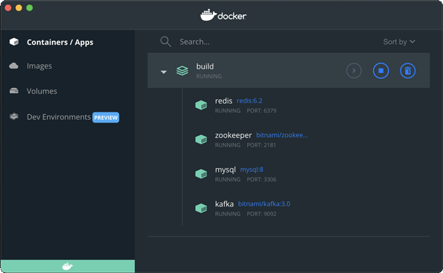

# 搭建项目框架

对于Warp Exchange项目，我们以Maven为构建工具，把每个模块作为一个Maven的项目管理，并抽取出公共逻辑放入`common`模块，结构如下：

- common：公共代码；
- config：配置服务器；
- push：推送服务；
- quotation：行情服务；
- trading-api：交易API服务；
- trading-engine：交易引擎；
- trading-sequencer：定序服务；
- ui：用户Web界面。

为了简化版本和依赖管理，我们用`parent`模块管理最基础的`pom.xml`，其他模块直接从`parent`继承，能大大简化各自的`pom.xml`。`parent`模块`pom.xml`内容如下：

```xml
<project xmlns="http://maven.apache.org/POM/4.0.0"
    xmlns:xsi="http://www.w3.org/2001/XMLSchema-instance"
    xsi:schemaLocation="http://maven.apache.org/POM/4.0.0
    http://maven.apache.org/xsd/maven-4.0.0.xsd"
>
    <modelVersion>4.0.0</modelVersion>
    <groupId>com.itranswarp.exchange</groupId>
    <artifactId>parent</artifactId>
    <version>1.0</version>
    <packaging>pom</packaging>

    <!-- 继承自SpringBoot Starter Parent -->
    <parent>
        <groupId>org.springframework.boot</groupId>
        <artifactId>spring-boot-starter-parent</artifactId>
        <!-- SpringBoot版本 -->
        <version>3.0.0</version>
    </parent>

    <properties>
        <!-- 项目版本 -->
        <project.version>1.0</project.version>
        <project.build.sourceEncoding>UTF-8</project.build.sourceEncoding>
        <project.reporting.outputEncoding>UTF-8</project.reporting.outputEncoding>

        <!-- Java编译和运行版本 -->
        <maven.compiler.source>17</maven.compiler.source>
        <maven.compiler.target>17</maven.compiler.target>
        <java.version>17</java.version>

        <!-- 定义第三方组件的版本 -->
        <pebble.version>3.2.0</pebble.version>
        <springcloud.version>2022.0.0</springcloud.version>
        <springdoc.version>2.0.0</springdoc.version>
        <vertx.version>4.3.1</vertx.version>
    </properties>

    <!-- 引入SpringCloud依赖 -->
    <dependencyManagement>
        <dependencies>
            <dependency>
                <groupId>org.springframework.cloud</groupId>
                <artifactId>spring-cloud-dependencies</artifactId>
                <version>${springcloud.version}</version>
                <type>pom</type>
                <scope>import</scope>
            </dependency>
        </dependencies>
    </dependencyManagement>

    <!-- 共享的依赖管理 -->
    <dependencies>
        <!-- 依赖JUnit5 -->
        <dependency>
            <groupId>org.junit.jupiter</groupId>
            <artifactId>junit-jupiter-api</artifactId>
            <scope>test</scope>
        </dependency>
        <dependency>
            <groupId>org.junit.jupiter</groupId>
            <artifactId>junit-jupiter-params</artifactId>
            <scope>test</scope>
        </dependency>
        <dependency>
            <groupId>org.junit.jupiter</groupId>
            <artifactId>junit-jupiter-engine</artifactId>
            <scope>test</scope>
        </dependency>
        <!-- 依赖SpringTest -->
        <dependency>
            <groupId>org.springframework</groupId>
            <artifactId>spring-test</artifactId>
            <scope>test</scope>
        </dependency>
    </dependencies>

    <build>
        <pluginManagement>
            <plugins>
                <!-- 引入创建可执行Jar的插件 -->
                <plugin>
                    <groupId>org.springframework.boot</groupId>
                    <artifactId>spring-boot-maven-plugin</artifactId>
                </plugin>
            </plugins>
        </pluginManagement>
    </build>
</project>
```

上述`pom.xml`中，除了写死的Spring Boot版本、Java运行版本、项目版本外，其他引入的版本均以`<xxx.version>1.23</xxx.version>`的形式定义，以便后续可以用`${xxx.version}`引用版本号，避免了同一个组件出现多个写死的版本定义。

对其他业务模块，引入`parent`的`pom.xml`可大大简化配置。以`ui`模块为例，其`pom.xml`如下：

```xml
<project xmlns="http://maven.apache.org/POM/4.0.0"
    xmlns:xsi="http://www.w3.org/2001/XMLSchema-instance"
    xsi:schemaLocation="http://maven.apache.org/POM/4.0.0
    http://maven.apache.org/xsd/maven-4.0.0.xsd"
>
    <modelVersion>4.0.0</modelVersion>

    <!-- 指定Parent -->
    <parent>
        <groupId>com.itranswarp.exchange</groupId>
        <artifactId>parent</artifactId>
        <version>1.0</version>
        <!-- Parent POM的相对路径 -->
        <relativePath>../parent/pom.xml</relativePath>
    </parent>

    <!-- 当前模块名称 -->
    <artifactId>ui</artifactId>

    <dependencies>
        <!-- 依赖SpringCloud Config客户端 -->
        <dependency>
            <groupId>org.springframework.cloud</groupId>
            <artifactId>spring-cloud-starter-config</artifactId>
        </dependency>

        <!-- 依赖SpringBoot Actuator -->
        <dependency>
            <groupId>org.springframework.boot</groupId>
            <artifactId>spring-boot-starter-actuator</artifactId>
        </dependency>

        <!-- 依赖Common模块 -->
        <dependency>
            <groupId>com.itranswarp.exchange</groupId>
            <artifactId>common</artifactId>
            <version>${project.version}</version>
        </dependency>

        <!-- 依赖第三方模块 -->
        <dependency>
            <groupId>io.pebbletemplates</groupId>
            <artifactId>pebble-spring-boot-starter</artifactId>
            <version>${pebble.version}</version>
        </dependency>
    </dependencies>

    <build>
        <!-- 指定输出文件名 -->
        <finalName>${project.artifactId}</finalName>
        <!-- 创建SpringBoot可执行jar -->
        <plugins>
            <plugin>
                <groupId>org.springframework.boot</groupId>
                <artifactId>spring-boot-maven-plugin</artifactId>
            </plugin>
        </plugins>
    </build>
</project>
```

因为我们在`parent`的`pom.xml`中引入了Spring Cloud的依赖管理，因此，无需指定相关组件的版本。只有我们自己编写的组件和未在Spring Boot和Spring Cloud中引入的组件，才需要指定版本。

最后，我们还需要一个`build`模块，把所有模块放到一起编译。建立`build`文件夹并创建`pom.xml`如下：

```xml
<project xmlns="http://maven.apache.org/POM/4.0.0"
    xmlns:xsi="http://www.w3.org/2001/XMLSchema-instance"
    xsi:schemaLocation="http://maven.apache.org/POM/4.0.0
    http://maven.apache.org/maven-v4_0_0.xsd"
>
    <modelVersion>4.0.0</modelVersion>
    <groupId>com.itranswarp.exchange</groupId>
    <artifactId>build</artifactId>
    <version>1.0</version>
    <packaging>pom</packaging>
    <name>Warp Exchange</name>

    <!-- 按相对路径列出所有模块 -->
    <modules>
        <module>../common</module>
        <module>../config</module>
        <module>../parent</module>
        <module>../push</module>
        <module>../quotation</module>
        <module>../trading-api</module>
        <module>../trading-engine</module>
        <module>../trading-sequencer</module>
        <module>../ui</module>
    </modules>
</project>
```

我们还需要创建目录`config-repo`来存储Spring Cloud Config服务器端的配置文件。

最后，将所有模块导入IDE，可正常开发、编译、运行。如果要在命令行模式下运行，进入`build`文件夹使用Maven编译即可：

```plain
warpexchange $ cd build && mvn clean package
```

### 本地开发环境

在本地开发时，我们需要经常调试代码。除了安装JDK，选择一个IDE外，我们还需要在本地运行MySQL、Redis、Kafka，以及Kafka依赖的ZooKeeper服务。

考虑到手动安装各个服务在不同操作系统下的差异，以及初始化数据非常麻烦，我们使用[Docker Desktop](https://www.docker.com/products/docker-desktop/)来运行这些基础服务，需要在`build`目录下编写一个`docker-compose.yml`文件定义我们要运行的所有服务：

```yaml
version: "3"
services:
  zookeeper:
    image: bitnami/zookeeper:3.5
    container_name: zookeeper
    ports:
      - "2181:2181"
    environment:
      - ALLOW_ANONYMOUS_LOGIN=yes
    volumes:
      - "./docker/zookeeper-data:/bitnami"

  kafka:
    image: bitnami/kafka:3.0
    container_name: kafka
    ports:
      - "9092:9092"
    depends_on:
      - zookeeper
    environment:
      - KAFKA_BROKER_ID=1
      - KAFKA_CFG_LISTENERS=PLAINTEXT://:9092
      - KAFKA_CFG_ADVERTISED_LISTENERS=PLAINTEXT://127.0.0.1:9092
      - KAFKA_CFG_ZOOKEEPER_CONNECT=zookeeper:2181
      - KAFKA_CFG_AUTO_CREATE_TOPICS_ENABLE=true
      - ALLOW_PLAINTEXT_LISTENER=yes
    volumes:
      - "./docker/kafka-data:/bitnami"

  redis:
    image: redis:6.2
    container_name: redis
    ports:
      - "6379:6379"
    volumes:
      - "./docker/redis-data:/data"

  mysql:
    image: mysql:8.0
    container_name: mysql
    ports:
      - "3306:3306"
    command: --default-authentication-plugin=mysql_native_password
    environment:
      - MYSQL_ROOT_PASSWORD=password
    volumes:
      - "./sql/schema.sql:/docker-entrypoint-initdb.d/1-schema.sql:ro"
      - "./docker/mysql-data:/var/lib/mysql"
```

在上述`docker-compose.yml`文件中，我们定义了MySQL、Redis、Kafka以及Kafka依赖的ZooKeeper服务，各服务均暴露标准端口，且MySQL的`root`口令设置为`password`，第一次启动MySQL时，使用`sql/schema.sql`文件初始化数据库表结构。所有数据盘均挂载到`build`目录下的`docker`目录。

在`build`目录下运行`docker-compose up -d`即可启动容器：

```plain
build $ docker-compose up -d
Creating network "build_default" with the default driver
Creating zookeeper ... done
Creating mysql     ... done
Creating redis     ... done
Creating kafka     ... done
```

在Docker Desktop中可看到运行状态：



如果要删除开发环境的所有数据，首先停止运行Docker容器进程并删除，然后删除`build`目录下的`docker`目录，重新运行`docker-compose`即可。

### Spring Cloud Config

Spring Cloud Config是Spring Cloud的一个子项目，它的主要目的是解决多个Spring Boot应用启动时，应该如何读取配置文件的问题。

对于单体应用，即一个独立的Spring Boot应用，我们会把配置写在`application.yml`文件中。如果配置需要针对多个环境，可以用`---`分隔并标注好环境：

```yaml
# application.yml
# 通用配置:
spring:
  datasource:
    url: jdbc:mysql://localhost/test

---

# test profile:
spring:
  config:
    activate:
      on-profile: test
  datasource:
    url: jdbc:mysql://172.16.0.100/test
```

这种配置方式针对单个Spring Boot应用是可行的，但是，针对分布式应用，有多个Spring Boot应用需要启动时，分散在各个应用中的配置既不便于管理，也不便于复用相同的配置。

Spring Cloud Config提供了一个通用的分布式应用的配置解决方案。它把配置分为两部分：

- Config Server：配置服务器，负责读取所有配置；
- Config Client：嵌入到各个Spring Boot应用中，本地无配置信息，启动时向服务器请求配置。

我们先来看看如何搭建一个Spring Cloud Config Server，即配置服务器。

首先，在`config`模块中引入`spring-cloud-config-server`依赖：

```xml
<dependency>
    <groupId>org.springframework.cloud</groupId>
    <artifactId>spring-cloud-config-server</artifactId>
</dependency>
```

然后，编写一个`ConfigApplication`入口，标注`@EnableConfigServer`：

```java
@EnableConfigServer
@SpringBootApplication
public class ConfigApplication {
    public static void main(String[] args) {
        SpringApplication.run(ConfigApplication.class, args);
    }
}
```

最后，在`application.yml`中设置如何搜索配置。Spring Cloud Config支持多种配置方式，包括从本地文件、Git仓库、数据库等多个地方读取配置。这里我们选择以本地文件的方式读取配置文件，这也是最简单的一种配置方式：

```yaml
# 配置服务器的端口，通常设置为8888:
server:
  port: 8888

spring:
  application:
    name: config-server
  profiles:
    # 从文件读取配置时，Config Server激活的profile必须设定为native:
    active: native
  cloud:
    config:
      server:
        native:
          # 设置配置文件的搜索路径:
          search-locations: file:./config-repo, file:../config-repo, file:../../config-repo
```

在`config-repo`目录下，存放的就是一系列配置文件：

```ascii
config-repo/
├── application-default.yml
├── application-test.yml
├── application.yml
├── push.yml
├── quotation.yml
├── trading-api.yml
├── trading-engine.yml
├── trading-sequencer.yml
├── ui-default.yml
└── ui.yml
```

至此，配置服务器就完成了，直接运行`ConfigApplication`即可启动配置服务器。在开发过程中，保持配置服务器在后台运行即可。

接下来，对于每个负责业务的Spring Boot应用，我们需要从Spring Cloud Config Server读取配置。读取配置并不是说本地零配置，还是需要一点基础配置信息。以`ui`项目为例，编写`application.yml`如下：

```yaml
spring:
  application:
    # 设置app名称:
    name: ui
  config:
    # 导入Config Server地址:
    import: configserver:${CONFIG_SERVER:http://localhost:8888}
```

上述默认的Config Server配置为`http://localhost:8888`，也可以通过环境变量指定Config Server的地址。

下一步是在`ui`模块的`pom.xml`中添加依赖：

```xml
<dependency>
    <groupId>org.springframework.cloud</groupId>
    <artifactId>spring-cloud-starter-config</artifactId>
</dependency>
```

接下来正常启动`UIApplication`，该应用就会自动从Config Server读取配置。由于我们指定了应用的名称是`ui`，且默认的`profile`是`default`，因此，Config Server将返回以下4个配置文件：

- ui-default.yml
- application-default.yml
- ui.yml
- application.yml

前面的配置文件优先级较高，后面的配置文件优先级较低。如果出现相同的配置项，则在优先级高的配置生效。

我们可以在浏览器访问`http://localhost:8888/ui/default`看到Config Server返回的配置，它是一个JSON文件：

```json
{
    "name": "ui",
    "profiles": [
        "default"
    ],
    "label": null,
    "version": null,
    "state": null,
    "propertySources": [
        {
            "name": "file:../config-repo/ui-default.yml",
            "source": {...}
        },
        {
            "name": "file:../config-repo/application-default.yml",
            "source": {...}
        },
        {
            "name": "file:../config-repo/ui.yml",
            "source": {...}
        },
        {
            "name": "file:../config-repo/application.yml",
            "source": {...}
        }
    ]
}
```

如果我们启动`UIApplication`时传入`SPRING_PROFILES_ACTIVE=test`，将profile设置为`test`，则Config Server返回的文件如下：

- ui-test.yml
- application-test.yml
- ui.yml
- application.yml

可以通过`http://localhost:8888/ui/test`查看返回的配置。由于文件`ui-test.yml`不存在，因此，实际配置由3个文件合并而成。

我们可以很容易地看到，一个Spring Boot应用在启动时，首先要设置自己的`name`并导入Config Server的URL，再根据当前活动的`profile`，由Config Server返回多个配置文件：

- {name}-{profile}.yml
- application-{profile}.yml
- {name}.yml
- application.yml

其中，`{name}-{xxx}.yml`是针对某个应用+某个`profile`的特定配置，`{name}.yml`是针对某个应用+所有profile的配置，`application-{profile}.yml`是针对某个`profile`的全局配置，`application.yml`是所有应用的全局配置。搭配各种配置文件就可以灵活组合配置。一般来说，全局默认的配置放在`application.yml`中，例如数据库连接：

```yaml
spring:
  datasource:
    url: jdbc:mysql://localhost/test
```

这样保证了默认连接到本地数据库，在生产环境中会直接报错而不是连接到错误的数据库。

在生产环境，例如`profile`设置为`prod`，则可以将数据库连接写在`application-prod.yml`中，使得所有生产环境的应用读取到的数据库连接是一致的：

```yaml
spring:
  datasource:
    url: jdbc:mysql://172.16.0.100/prod_db
```

某个应用自己特定的配置则应当放到`{name}.yml`和`{name}-{profile}.yml`中。

在设置好各个配置文件后，应当通过浏览器检查Config Server返回的配置是否符合预期。

Spring Cloud Config还支持配置多个profile，以及从加密的配置源读取配置等。如果遇到更复杂的需求，可参考[Spring Cloud Config的文档](https://spring.io/projects/spring-cloud-config#learn)。

### 环境变量

需要特别注意，在`config-repo`的配置文件里，使用的环境变量，不是Config Server的环境变量，而是具体某个Spring Boot应用的环境变量。

我们举个例子：假定`ui.yml`定义如下：

```yaml
server:
  port: ${APP_PORT:8000}
```

当`UIApplication`启动时，它获得的配置为`server.port=${APP_PORT:8000}`。Config Server*不会替换任何环境变量*，而是将它们原封不动地返回给`UIApplication`，由`UIApplication`根据自己的环境变量解析后获得最终配置。如果我们启动`UIApplication`时传入环境变量：

```plain
$ java -DAPP_PORT=7000 -jar ui.jar
```

则`UIApplication`最终读取的配置`server.port`为`7000`。

可见，使用Spring Cloud Config时，读取配置文件步骤如下：

1. 启动XxxApplication时，读取自身的`application.yml`，获得`name`和Config Server地址；
2. 根据`name`、`profile`和Config Server地址，获得一个或多个有优先级的配置文件；
3. 按优先级合并配置项；
4. 如果配置项中存在环境变量，则使用Xxx应用本身的环境变量去替换占位符。

环境变量通常用于配置一些敏感信息，如数据库连接口令，它们不适合明文写在`config-repo`的配置文件里。

### 常见错误

启动一个Spring Boot应用时，如果出现`Unable to load config data`错误：

```plain
java.lang.IllegalStateException: Unable to load config data from 'configserver:http://localhost:8888'
	at org.springframework.boot.context.config.StandardConfigDataLocationResolver.getReferences
    at ...
```

需要检查是否在`pom.xml`中引入了`spring-cloud-starter-config`，因为没有引入该依赖时，应用无法解析本地配置的`import: configserver:xxx`。

如果在启动一个Spring Boot应用时，Config Server没有运行，通常错误信息是因为没有读取到配置导致无法创建某个Bean。

### 参考源码

可以从[GitHub](https://github.com/michaelliao/warpexchange/tree/main/step-by-step/step-1)或[Gitee](https://gitee.com/liaoxuefeng/warpexchange/tree/main/step-by-step/step-1/)下载源码。

<a class="git-explorer" href="https://github.com/michaelliao/warpexchange/tree/main/step-by-step/step-1">GitHub</a>

### 小结

我们以Spring Boot为基础，并通过Maven的模块化配置搭建了项目的基本结构，依赖的基础组件通过Docker Desktop运行并初始化数据。对于多个服务组成的分布式应用来说，使用Spring Cloud Config可满足应用的配置需求。
