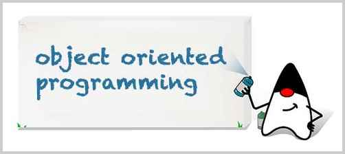

# 面向对象编程

Java是一种面向对象的编程语言。面向对象编程，英文是Object-Oriented Programming，简称OOP。

那什么是面向对象编程？

和面向对象编程不同的，是面向过程编程。面向过程编程，是把模型分解成一步一步的过程。比如，老板告诉你，要编写一个TODO任务，必须按照以下步骤一步一步来：

1. 读取文件；
2. 编写TODO；
3. 保存文件。


而面向对象编程，顾名思义，你得首先有个对象：


有了对象后，就可以和对象进行互动：

```java
GirlFriend gf = new GirlFriend();
gf.name = "Alice";
gf.send("flowers");
```

因此，面向对象编程，是一种通过对象的方式，把现实世界映射到计算机模型的一种编程方法。

在本章中，我们将讨论：

面向对象的基本概念，包括：

- 类
- 实例
- 方法

面向对象的实现方式，包括：

- 继承
- 多态

Java语言本身提供的机制，包括：

- package
- classpath
- jar

以及Java标准库提供的核心类，包括：

- 字符串
- 包装类型
- JavaBean
- 枚举
- 常用工具类

通过本章的学习，完全可以理解并掌握面向对象的基本思想，但不保证能找到对象。


