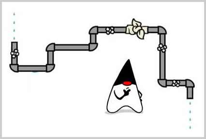

# IO

IO是指Input/Output，即输入和输出。以内存为中心：

- Input指从外部读入数据到内存，例如，把文件从磁盘读取到内存，从网络读取数据到内存等等。
- Output指把数据从内存输出到外部，例如，把数据从内存写入到文件，把数据从内存输出到网络等等。

为什么要把数据读到内存才能处理这些数据？因为代码是在内存中运行的，数据也必须读到内存，最终的表示方式无非是byte数组，字符串等，都必须存放在内存里。

从Java代码来看，输入实际上就是从外部，例如，硬盘上的某个文件，把内容读到内存，并且以Java提供的某种数据类型表示，例如，`byte[]`，`String`，这样，后续代码才能处理这些数据。

因为内存有“易失性”的特点，所以必须把处理后的数据以某种方式输出，例如，写入到文件。Output实际上就是把Java表示的数据格式，例如，`byte[]`，`String`等输出到某个地方。

IO流是一种顺序读写数据的模式，它的特点是单向流动。数据类似自来水一样在水管中流动，所以我们把它称为IO流。



### InputStream / OutputStream

IO流以`byte`（字节）为最小单位，因此也称为*字节流*。例如，我们要从磁盘读入一个文件，包含6个字节，就相当于读入了6个字节的数据：

```ascii
╔═══════════╗
║  Memory   ║
╚═══════════╝
      ▲
      │0x48
      │0x65
      │0x6c
      │0x6c
      │0x6f
      │0x21
╔═══════════╗
║ Hard Disk ║
╚═══════════╝
```

这6个字节是按顺序读入的，所以是输入字节流。

反过来，我们把6个字节从内存写入磁盘文件，就是输出字节流：

```ascii
╔═══════════╗
║  Memory   ║
╚═══════════╝
      │0x21
      │0x6f
      │0x6c
      │0x6c
      │0x65
      │0x48
      ▼
╔═══════════╗
║ Hard Disk ║
╚═══════════╝
```

在Java中，`InputStream`代表输入字节流，`OuputStream`代表输出字节流，这是最基本的两种IO流。

### Reader / Writer

如果我们需要读写的是字符，并且字符不全是单字节表示的ASCII字符，那么，按照`char`来读写显然更方便，这种流称为*字符流*。

Java提供了`Reader`和`Writer`表示字符流，字符流传输的最小数据单位是`char`。

例如，我们把`char[]`数组`Hi你好`这4个字符用`Writer`字符流写入文件，并且使用UTF-8编码，得到的最终文件内容是8个字节，英文字符`H`和`i`各占一个字节，中文字符`你好`各占3个字节：

```plain
0x48
0x69
0xe4bda0
0xe5a5bd
```

反过来，我们用`Reader`读取以UTF-8编码的这8个字节，会从`Reader`中得到`Hi你好`这4个字符。

因此，`Reader`和`Writer`本质上是一个能自动编解码的`InputStream`和`OutputStream`。

使用`Reader`，数据源虽然是字节，但我们读入的数据都是`char`类型的字符，原因是`Reader`内部把读入的`byte`做了解码，转换成了`char`。使用`InputStream`，我们读入的数据和原始二进制数据一模一样，是`byte[]`数组，但是我们可以自己把二进制`byte[]`数组按照某种编码转换为字符串。究竟使用`Reader`还是`InputStream`，要取决于具体的使用场景。如果数据源不是文本，就只能使用`InputStream`，如果数据源是文本，使用Reader更方便一些。`Writer`和`OutputStream`是类似的。

### 同步和异步

同步IO是指，读写IO时代码必须等待数据返回后才继续执行后续代码，它的优点是代码编写简单，缺点是CPU执行效率低。

而异步IO是指，读写IO时仅发出请求，然后立刻执行后续代码，它的优点是CPU执行效率高，缺点是代码编写复杂。

Java标准库的包`java.io`提供了同步IO，而`java.nio`则是异步IO。上面我们讨论的`InputStream`、`OutputStream`、`Reader`和`Writer`都是同步IO的抽象类，对应的具体实现类，以文件为例，有`FileInputStream`、`FileOutputStream`、`FileReader`和`FileWriter`。

本节我们只讨论Java的同步IO，即输入/输出流的IO模型。

### 小结

IO流是一种流式的数据输入/输出模型：

- 二进制数据以`byte`为最小单位在`InputStream`/`OutputStream`中单向流动；
- 字符数据以`char`为最小单位在`Reader`/`Writer`中单向流动。

Java标准库的`java.io`包提供了同步IO功能：

- 字节流接口：`InputStream`/`OutputStream`；
- 字符流接口：`Reader`/`Writer`。
