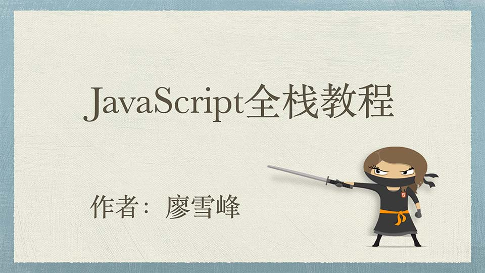

# 简介



这是小白的零基础JavaScript全栈教程。

JavaScript是世界上最流行的脚本语言，因为你在电脑、手机、平板上浏览的所有的网页，以及无数基于HTML5的手机App，交互逻辑都是由JavaScript驱动的。

简单地说，JavaScript是一种运行在浏览器中的解释型的编程语言。

那么问题来了，为什么我们要学JavaScript？尤其是当你已经掌握了某些其他编程语言如Java、C++的情况下。

简单粗暴的回答就是：因为你没有选择。在Web世界里，只有JavaScript能跨平台、跨浏览器驱动网页，与用户交互。

Flash背后的ActionScript曾经流行过一阵子，不过随着移动应用的兴起，没有人用Flash开发手机App，所以它目前已经边缘化了。相反，随着HTML5在PC和移动端越来越流行，JavaScript变得更加重要了。并且，新兴的Node.js把JavaScript引入到了服务器端，JavaScript已经变成了全能型选手。

JavaScript一度被认为是一种玩具编程语言，它有很多缺陷，所以不被大多数后端开发人员所重视。很多人认为，写JavaScript代码很简单，并且JavaScript只是为了在网页上添加一点交互和动画效果。

但这是完全错误的理解。JavaScript确实很容易上手，但其精髓却不为大多数开发人员所熟知。编写高质量的JavaScript代码更是难上加难。

一个合格的开发人员应该精通JavaScript和其他编程语言。如果你已经掌握了其他编程语言，或者你还什么都不会，请立刻开始学习JavaScript，不要被Web时代所淘汰。

等等，你会问道，现在有这么多在线JavaScript教程和各种从入门到精通的JavaScript书籍，为什么我要选择这个教程？

原因是，这个教程：

### 是JavaScript全栈教程！

### 可以在线免费学习！

### 可以在线编写JavaScript代码并直接运行！

```x-javascript
// 直接点击Run运行
alert('我要学JavaScript!');
```

不要再犹豫了，立刻从现在开始，零基础迈向全栈开发工程师！
