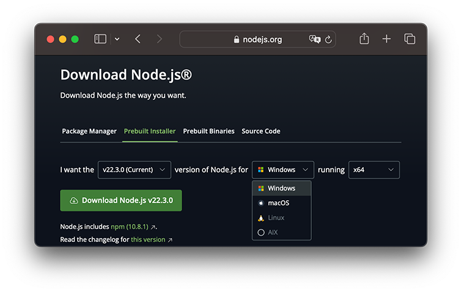

# 安装Node.js

由于Node.js平台是在后端运行JavaScript代码，所以，必须首先在本机安装Node环境。

### 安装Node.js

目前Node.js的最新版本是22.3.0，LTS版本是20.14.0，追求稳定性如服务器上长期运行的Node环境可以选择LTS版本，本地开发和测试可以选择最新版本。

要安装Node.js，首先，从[Node.js官网](https://nodejs.org/)下载对应平台的安装程序，初学者建议选择Prebuilt Installer，选择版本，再选操作系统，最后选CPU类型后点Download下载：



有经验的开发者可以选择Package Manager，它允许本地安装多个不同版本的Node并切换至不同版本。

在Windows上安装时务必选择全部组件，包括勾选`Add to Path`。

安装完成后，在Windows环境下，请打开命令提示符，然后输入`node -v`，如果安装正常，你应该看到`v22.3.0`这样的输出：

```plain
C:\Users\IEUser> node -v
v22.3.0
```

继续在命令提示符输入`node`，此刻你将进入Node.js的交互环境。在交互环境下，你可以输入任意JavaScript语句，例如`100+200`，回车后将得到输出结果。

要退出Node.js环境，连按两次Ctrl+C。

### npm

在正式开始Node.js学习之前，我们先认识一下npm。

npm是什么东东？npm其实是Node.js的包管理工具（package manager）。

为啥我们需要一个包管理工具呢？因为我们在Node.js上开发时，会用到很多别人写的JavaScript代码。如果我们要使用别人写的某个包，每次都根据名称搜索一下官方网站，下载代码，解压，再使用，非常繁琐。于是一个集中管理的工具应运而生：大家都把自己开发的模块打包后放到npm官网上，如果要使用，直接通过npm安装就可以直接用，不用管代码存在哪，应该从哪下载。

更重要的是，如果我们要使用模块A，而模块A又依赖于模块B，模块B又依赖于模块X和模块Y，npm可以根据依赖关系，把所有依赖的包都下载下来并管理起来。否则，靠我们自己手动管理，肯定既麻烦又容易出错。

讲了这么多，npm究竟在哪？

其实npm已经在Node.js安装的时候顺带装好了。我们在命令提示符或者终端输入`npm -v`，应该看到类似的输出：

```
C:\>npm -v
10.8.0
```

如果直接输入`npm`，你会看到类似下面的输出：

```
C:\> npm

Usage: npm <command>

where <command> is one of:
    ...
```

上面的一大堆文字告诉你，`npm`需要跟上命令。现在我们不用关心这些命令，后面会一一讲到。目前，你只需要确保npm正确安装了，能运行就行。

### 小结

请在本机安装Node.js环境，并确保`node`和`npm`能正常运行。
