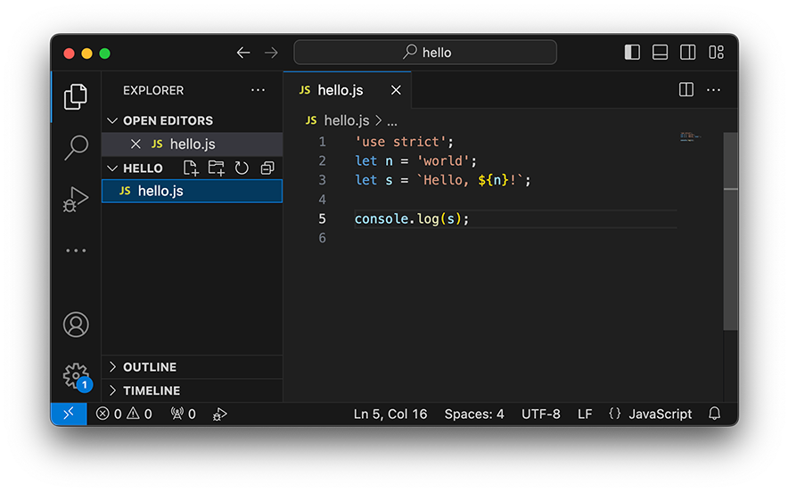
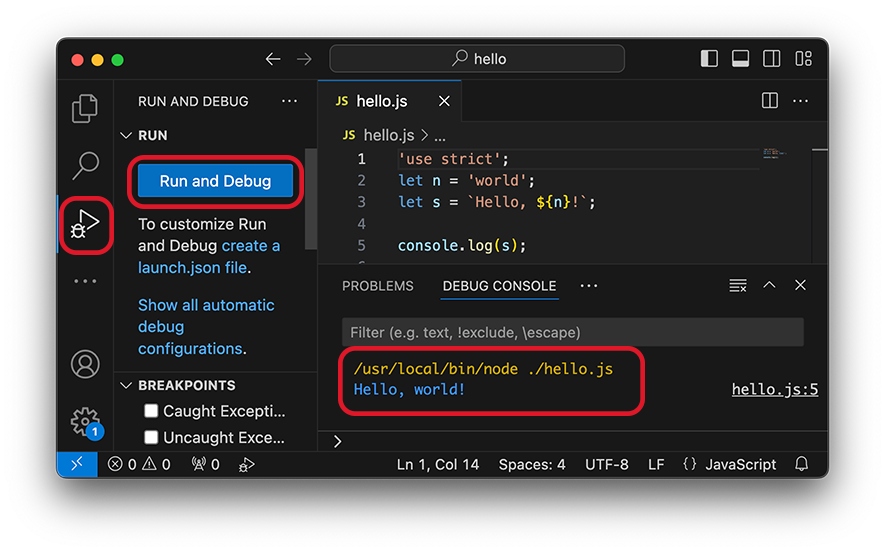
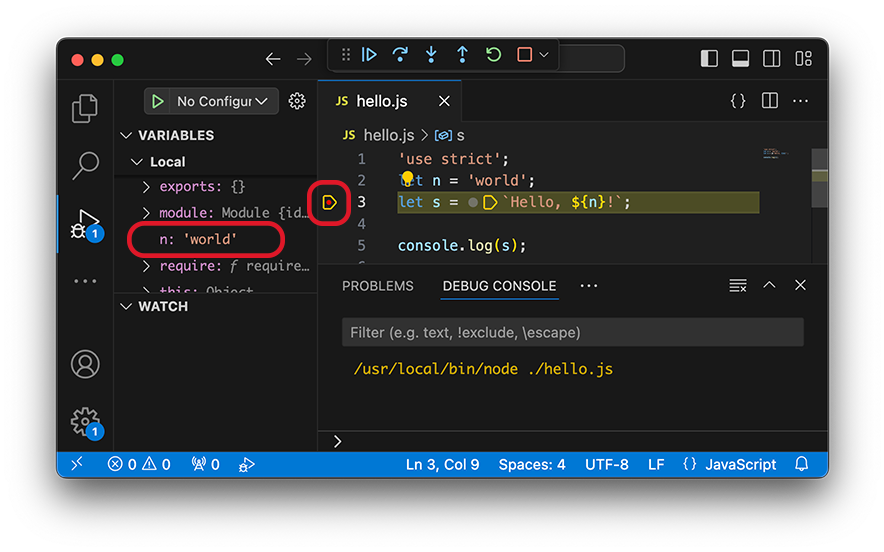

# 搭建Node开发环境

使用文本编辑器来开发Node程序，最大的缺点是效率太低，运行Node程序还需要在命令行单独敲命令。如果还需要调试程序，就更加麻烦了。

所以我们需要一个IDE集成开发环境，让我们能在一个环境里编码、运行、调试，这样就可以大大提升开发效率。

Java的集成开发环境有Eclipse，Intellij idea等，C#的集成开发环境有Visual Studio，那么问题又来了：Node.js的集成开发环境到底哪家强？

考察Node.js的集成开发环境，重点放在启动速度快，执行简单，调试方便这三点上。当然，免费使用是一个加分项。

综合考察后，我们隆重向大家推荐Node.js集成开发环境：

# Visual Studio Code

Visual Studio Code由微软出品，但它不是那个大块头的Visual Studio，它是一个精简版的迷你Visual Studio，并且，Visual Studio Code可以跨！平！台！Windows、Mac和Linux通用。

### 安装Visual Studio Code

可以从Visual Studio Code的[官方网站](http://code.visualstudio.com/)下载并安装最新的版本。

安装过程中，请务必钩上以下选项“将“通过Code打开”操作添加到Windows资源管理器目录上下文菜单”：


这将大大提升将来的操作快捷度。

### 运行和调试JavaScript

在VS Code中，我们可以非常方便地运行JavaScript文件。

VS Code以文件夹作为工程目录（Workspace Dir），所有的JavaScript文件都存放在该目录下。

假设我们在`C:\Work\`目录下创建了一个`hello`目录作为工程目录，并编写了一个`hello.js`文件，则该工程目录的结构如下：

```plain
hello/        <-- workspace dir
└── hello.js  <-- JavaScript file
```

启动VS Code，选择菜单File - Open Folder...，选择`hello`目录，就可以直接编辑`hello.js`文件：



### 运行JS代码

确保当前编辑器正在编辑`hello.js`文件，然后在VS Code中选择左侧调试按钮，直接点击`Run And Debug`按钮，如果弹出环境选项则选择`Node`，在右下侧`DEBUG CONSOLE`可直接看到运行结果。



如果右下侧面板没有显示，左上角有几个按钮可以切换视图。

### 调试JS代码

在VS Code中，可以通过断点调试方便进行JavaScript的开发和测试。我们先在`hello.js`的编辑器中打一个断点（鼠标点击行号左侧出现小红点即为断点），然后点击`Run And Debug`按钮，此时进入调试模式，会自动停在断点处，左侧窗口可查看变量，顶部按钮可选择单步执行或继续执行到下一个断点，也可以随时结束程序：



总的来说，使用VS Code，开发和调试JavaScript代码十分方便。

### 参考源码

[hello.js](hello.js)
