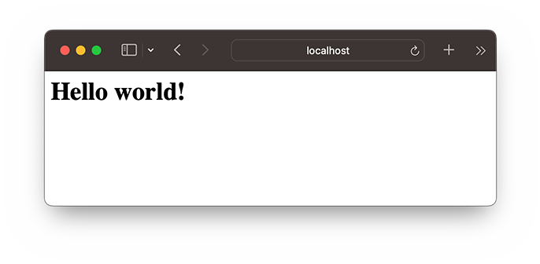
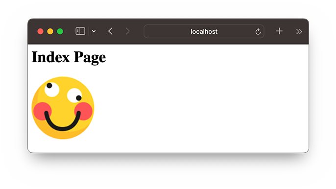

# http

Node.js开发的目的就是为了用JavaScript编写Web服务器程序。因为JavaScript实际上已经统治了浏览器端的脚本，其优势就是有世界上数量最多的前端开发人员。如果已经掌握了JavaScript前端开发，再学习一下如何将JavaScript应用在后端开发，就是名副其实的*全栈*了。

### HTTP协议

要理解Web服务器程序的工作原理，首先，我们要对HTTP协议有基本的了解。如果你对HTTP协议不太熟悉，先看一看[HTTP协议简介](../../../../python/web/http/index.html)。

### HTTP服务器

要开发HTTP服务器程序，从头处理TCP连接，解析HTTP是不现实的。这些工作实际上已经由Node.js自带的`http`模块完成了。应用程序并不直接和HTTP协议打交道，而是操作`http`模块提供的`request`和`response`对象。

`request`对象封装了HTTP请求，我们调用`request`对象的属性和方法就可以拿到所有HTTP请求的信息；

`response`对象封装了HTTP响应，我们操作`response`对象的方法，就可以把HTTP响应返回给浏览器。

用Node.js实现一个HTTP服务器程序非常简单。我们来实现一个最简单的Web程序`hello.js`，它对于所有请求，都返回`Hello world!`：

```javascript
// 导入http模块:
import http from 'node:http';

// 创建http server，并传入回调函数:
const server = http.createServer((request, response) => {
    // 回调函数接收request和response对象,
    // 获得HTTP请求的method和url:
    console.log(request.method + ': ' + request.url);
    // 将HTTP响应200写入response, 同时设置Content-Type: text/html:
    response.writeHead(200, {'Content-Type': 'text/html'});
    // 将HTTP响应的HTML内容写入response:
    response.end('<h1>Hello world!</h1>');
});

// 出错时返回400:
server.on('clientError', (err, socket) => {
  socket.end('HTTP/1.1 400 Bad Request\r\n\r\n');
});

// 让服务器监听8080端口:
server.listen(8080);
console.log('Server is running at http://127.0.0.1:8080/');
```

在命令提示符下运行该程序，可以看到以下输出：

```plain
$ node simple-server.mjs 
Server is running at http://127.0.0.1:8080/
```

不要关闭命令提示符，直接打开浏览器输入`http://localhost:8080`，即可看到服务器响应的内容：



同时，在命令提示符窗口，可以看到程序打印的请求信息：

```plain
GET: /
GET: /favicon.ico
```

这就是我们编写的第一个HTTP服务器程序！

### 文件服务器

让我们继续扩展一下上面的Web程序。我们可以设定一个目录，然后让Web程序变成一个文件服务器。要实现这一点，我们只需要解析`request.url`中的路径，然后在本地找到对应的文件，把文件内容发送出去就可以了。

观察打印的`request.url`，它实际上是浏览器请求的路径和参数，如：

- `/`
- `/index.html`
- `/hello?name=bob`

解析出path部分可以直接用URL对象：

```javascript
let url = new URL('http://localost' + '/index.html?v=1');
let pathname = url.pathname;
console.log(pathname); // index.html
```

处理本地文件目录需要使用Node.js提供的`path`模块，它可以方便地构造目录：

```javascript
import path from 'node:path';

// 解析当前目录:
let workDir = path.resolve('.'); // '/Users/michael'

// 组合完整的文件路径:当前目录+'pub'+'index.html':
let filePath = path.join(workDir, 'pub', 'index.html');
// '/Users/michael/pub/index.html'
```

使用`path`模块可以正确处理操作系统相关的文件路径。在Windows系统下，返回的路径类似于`C:\Users\michael\static\index.html`，这样，我们就不关心怎么拼接路径了。

最后，我们实现一个文件服务器`simple-file-server.js`：

```javascript
// 导入http模块:
import http from 'node:http';
import path from 'node:path';
import { createReadStream } from 'node:fs';
import { stat } from 'node:fs/promises';

// 设定www根目录为当前目录:
const wwwRoot = path.resolve('.');
console.log(`set www root: ${wwwRoot}`);

// 根据扩展名确定MIME类型:
function guessMime(pathname) {
    // FIXME:
    return 'text/html';
}

// 创建http file server，并传入回调函数:
const server = http.createServer((request, response) => {
    // 获得HTTP请求的method和url:
    console.log(request.method + ': ' + request.url);
    if (request.method !== 'GET') {
        response.writeHead(400, { 'Content-Type': 'text/html' });
        response.end('<h1>400 Bad Request</h1>');
    } else {
        // 解析path: 
        let url = new URL(`http://localhost${request.url}`);
        let pathname = url.pathname;
        let filepath = path.join(wwwRoot, pathname);
        // TODO: 必要的安全检查
        // 检查文件状态:
        stat(filepath).then(st => {
            if (st.isFile()) {
                console.log('200 OK');
                // 发送200响应:
                response.writeHead(200, { 'Content-Type': guessMime(pathname) });
                // 将文件流导向response:
                createReadStream(filepath).pipe(response);
            } else {
                console.log('404 Not Found');
                response.writeHead(404, { 'Content-Type': 'text/html' });
                response.end('<h1>404 Not Found</h1>');
            }
        }).catch(err => {
            console.log('404 Not Found');
            response.writeHead(404, { 'Content-Type': 'text/html' });
            response.end('<h1>404 Not Found</h1>');
        });
    }
});

// 出错时返回400:
server.on('clientError', (err, socket) => {
    socket.end('HTTP/1.1 400 Bad Request\r\n\r\n');
});

// 让服务器监听8080端口:
server.listen(8080);
console.log('Server is running at http://127.0.0.1:8080/');
```

没有必要手动读取文件内容。由于`response`对象本身是一个`Writable Stream`，直接用`pipe()`方法就实现了自动读取文件内容并输出到HTTP响应。

在命令行运行`node simple-file-server.mjs`，然后在浏览器中输入`http://localhost:8080/index.html`：



只要当前目录下存在文件`index.html`，服务器就可以把文件内容发送给浏览器。观察控制台输出：

```plain
GET: /index.html
200 OK
GET: /next/hello.png
200 OK
GET: /favicon.ico
200 OK
```

第一个请求是浏览器请求`/`页面，后续请求是浏览器解析HTML后发送的其它资源请求。

### 练习

在浏览器输入`http://localhost:8080/`时，会返回404，原因是程序识别出HTTP请求的不是文件，而是目录。请修改`simple-file-server.mjs`，如果遇到请求的路径是目录，则自动在目录下依次搜索`index.html`、`default.html`，如果找到了，就返回HTML文件的内容。

### 参考源码

- [简单HTTP服务器](simple-server.mjs)
- [HTTP文件服务器](simple-file-server.zip)
