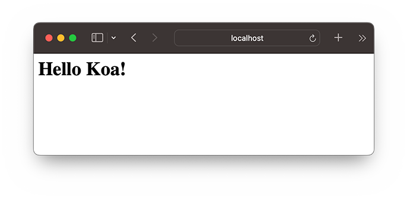

# koa入门

### 创建koa工程

首先，我们创建一个目录`hello-koa`，作为koa工程根目录。

在根目录下执行`npm install koa`，我们就在当前目录下安装好了koa及其依赖项，执行完成后目录结构如下：

```ascii
hello-koa/
├── node_modules/      <-- koa以及所有依赖项
├── package-lock.json
└── package.json       <-- npm描述文件
```

`package.json`包含了npm的依赖信息，以及项目描述等信息，`package-lock.json`是针对当前所有依赖的一个快照，目的是锁定各个依赖项的版本号。

我们打开`package.json`，内容如下：

```json
{
    "dependencies": {
        "koa": "^2.15.3"
    }
}
```

它只有一个koa依赖，是由命令`npm install koa`写入的。

`node_modules`是所有依赖项安装的地方，可以随时删除`node_modules`目录，然后用`npm install`重新安装。

直接运行`npm install`则根据`package.json`的`dependencies`信息下载安装依赖项，运行`npm install xyz`则将`xyz`添加到`dependencies`然后再安装`xyz`及其依赖项。因此，熟练的开发者可以先自己编辑`dependencies`内容，然后删除`node_modules`后重新安装所有依赖项。此外，`package.json`和`package-lock.json`应当添加至版本控制系统中，而`node_modules`则无需添加。

我们手动添加如下信息至`package.json`：

```json
{
    "name": "hello-koa",
    "version": "1.0",
    "description": "Hello koa webapp.",
    "type": "module",
    "dependencies": {
        "koa": "^2.15.3"
    }
}
```

其中，`name`、`version`和`description`均可任意设置，`type`为`module`表示以ESM模块执行。

紧接着，我们用VS Code打开`hello-koa`目录，创建`app.mjs`文件，输入以下代码：

```javascript
// 导入koa，注意导入的是大写开头的class:
import Koa from 'koa';

// 创建一个koa实例表示webapp本身:
const app = new Koa();

// 对于任何请求，app将调用该异步函数处理请求：
app.use(async (ctx, next) => {
    await next();
    // 设置响应类型和文本:
    ctx.response.type = 'text/html';
    ctx.response.body = '<h1>Hello Koa!</h1>';
});

// 在端口3000监听:
app.listen(3000);
console.log('app started at port 3000...');
```

对于每一个http请求，koa将调用我们传入的异步函数来处理：

```javascript
async (ctx, next) => {
    await next();
    // 设置response的Content-Type:
    ctx.response.type = 'text/html';
    // 设置response的内容:
    ctx.response.body = '<h1>Hello Koa!</h1>';
}
```

其中，参数`ctx`是由koa传入的封装了request和response的变量，我们可以通过它访问request和response，`next`是koa传入的将要处理的下一个异步函数。

上面的异步函数中，我们首先用`await next();`处理下一个异步函数，然后，设置response的`Content-Type`和内容。

现在，我们的工程结构如下：

```ascii
hello-koa/
├── node_modules/
├── app.mjs
├── package-lock.json
└── package.json
```

在命令行执行`node app.mjs`就启动了Web服务器。我们打开浏览器，输入`http://localhost:3000`，即可看到效果：



### koa middleware

让我们再仔细看看koa的执行逻辑。核心代码是：

```javascript
app.use(async (ctx, next) => {
    await next();
    ctx.response.type = 'text/html';
    ctx.response.body = '<h1>Hello Koa!</h1>';
});
```

每收到一个http请求，koa就会调用通过`app.use()`注册的async函数，并传入`ctx`和`next`参数。

我们可以对`ctx`操作，并设置返回内容。但是为什么要调用`await next()`？

原因是koa把很多async函数组成一个处理链，每个async函数都可以做一些自己的事情，然后用`await next()`来调用下一个async函数。我们把每个async函数称为middleware，这些middleware可以组合起来，完成很多有用的功能。

例如，可以用以下3个middleware组成处理链，依次打印日志，记录处理时间，输出HTML：

```javascript
app.use(async (ctx, next) => {
    console.log(`${ctx.request.method} ${ctx.request.url}`); // 打印URL
    await next(); // 调用下一个middleware
});

app.use(async (ctx, next) => {
    const start = Date.now(); // 当前时间
    await next(); // 调用下一个middleware
    const ms = Date.now() - start; // 耗费时间
    console.log(`Time: ${ms}ms`); // 打印耗费时间
});

app.use(async (ctx, next) => {
    await next();
    ctx.response.type = 'text/html';
    ctx.response.body = '<h1>Hello Koa!</h1>';
});
```

middleware的顺序很重要，也就是调用`app.use()`的顺序决定了middleware的顺序。

此外，如果一个middleware没有调用`await next()`，会怎么办？答案是后续的middleware将不再执行了。这种情况也很常见，例如，一个检测用户权限的middleware可以决定是否继续处理请求，还是直接返回403错误：

```javascript
app.use(async (ctx, next) => {
    if (await checkUserPermission(ctx)) {
        await next();
    } else {
        ctx.response.status = 403;
    }
});
```

理解了middleware，我们就已经会用koa了！

最后注意`ctx`对象有一些简写的方法，例如`ctx.url`相当于`ctx.request.url`，`ctx.type`相当于`ctx.response.type`。

### 参考源码

[hello-koa](hello-koa.zip)
